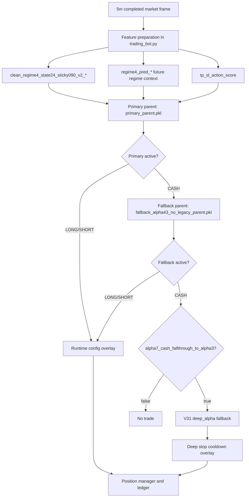

# Previous Alpha7 Live Stack

Last updated: 2026-06-06 KST

## Previous Production Model

Production `trading_bot.py` no longer defaults to Alpha7. The current live main is `omega1_2_1_aggressive_compensated_scale200_cap090`; see `docs/active_live/README.md` and `docs/model_contracts/omega1_2_1_aggressive_current_baseline_20260606_contract.md`.

Previous Alpha7 default:

- model ID: `alpha7_submodel_01965_decontam_deep_stop_cd18_20260528`
- model version: `Alpha7.1-01965-decontam-deep-stop-cd18`
- artifact directory: `data/ensemble/supervised/alpha7_submodel_01965_decontam_v2_tp_20260528/`
- runtime config: `alpha7_decontam_deep_stop_cd18_runtime_config.json`
- live status in runtime config: `production_default`

Funding-family red-team audit classifies this artifact family as deprecated and blocked because its manifest does not name the clean funding remediation run and its `tp_sl_action_score` lineage points to the known stale `alpha7_1_01965_v2only_tp_sl_action_score_20260528` frames.

Do not use this lineage as an active runtime default, candidate baseline, parent block, fallback block, sidecar source, Alpha8 baseline, or promotion evidence. The artifact directories now include explicit `DEPRECATED_DO_NOT_USE.json` markers.

## Architecture

## Artifact Roles

| Artifact | Role | Path |
|---|---|---|
| `primary_parent.pkl` | Main Alpha7 parent decision model. Produces action, side, quality, confidence, notional, leverage, TP, SL, max-hold. | `data/ensemble/supervised/alpha7_submodel_01965_decontam_v2_tp_20260528/primary_parent.pkl` |
| `fallback_alpha43_no_legacy_parent.pkl` | Fallback parent used only when primary is CASH. | `data/ensemble/supervised/alpha7_submodel_01965_decontam_v2_tp_20260528/fallback_alpha43_no_legacy_parent.pkl` |
| `tp_sl_path_edge_predictor.pkl` | Generates `tp_sl_action_score`; rebuilt on v2-only regime features. | `data/ensemble/supervised/alpha7_submodel_01965_decontam_v2_tp_20260528/tp_sl_path_edge_predictor.pkl` |
| `deep_scout_state24_v2.pt` | V31 deep-alpha fallback used when Alpha7 cash fallthrough is enabled. | `data/ensemble/supervised/alpha3_regime4_state24_v2_plus_pred_full_retrain_20260526/deep_scout_state24_v2.pt` |
| `alpha7_decontam_deep_stop_cd18_runtime_config.json` | Active runtime overlay config. | `data/ensemble/supervised/alpha7_submodel_01965_decontam_v2_tp_20260528/alpha7_decontam_deep_stop_cd18_runtime_config.json` |

## Runtime Overlay

The active runtime config must include these keys. Missing keys are a runtime error:

- `entry_quality_min`
- `entry_conf_min`
- `parent_notional_mult`
- `parent_notional_cap`
- `parent_tp_mult`
- `parent_sl_mult`
- `parent_hold_mult`
- `parent_hold_cap`
- `alpha7_cash_fallthrough_to_alpha3`

Current overlay behavior:

- Parent notional is capped by `parent_notional_cap`.
- Parent TP/SL/hold are scaled by runtime multipliers.
- V31 deep-alpha config is tightened after Alpha7 runtime config is loaded.
- Deep-alpha stop exits add an extra cooldown of `18` bars.
- `alpha7_decontam_deep_stop_cd18_bear_long_veto_runtime_config.json` is shadow-only because its validation MDD was materially worse than the pure deep-stop config.

## Feature Contract

Required feature families for historical Alpha7 reproduction:

- `clean_regime4_state24_sticky090_v2_*`
- `regime4_pred_*`
- `tp_sl_action_score`
- AI/M7/teacher features only when provenance is frozen/OOS and already audited.
- funding-family features only with clean funding provenance. This includes `last_funding_rate`, `funding_*`, `mta_funding`, `ou_funding_z`, `squeeze_power`, squeeze/crowding derivatives, and artifacts trained or scored from those inputs.

Forbidden in active/live paths:

- `clean_regime_2024_unsup_v4_*`
- `clean_regime4_2024_unsup_v1_*`
- silent aliasing from legacy regime prefixes to current prefixes
- compatibility fallback that fills missing model features without retraining or explicit contract update

Contract mismatch must fail fast.

## Current Validation References

- decontaminated base note: `docs/alpha7_submodel_01965_decontam_v2_tp_20260528.md`
- deep-stop note: `docs/alpha7_submodel_01965_decontam_deep_stop_cd18_20260528.md`
- runtime retest summary: `tmp/causal_regen_20260516/alpha7_1_01965_decontam_runtime_retest_20260528/summary.json`
- precision retest: `tmp/causal_regen_20260516/alpha7_decontam_deep_stop_cd18_precision_20260528/summary.json`
- funding red-team audit: `docs/audits/funding_feature_redteam_20260529.md`

## Known Risks

- The original `alpha7_1_01965_live_20260527` lineage is deprecated and blocked because it is pre-clean-funding and the old `tp_sl_action_score` depended on legacy/stale inputs.
- The previous production default `alpha7_submodel_01965_decontam_deep_stop_cd18_20260528` is also deprecated and blocked for active/candidate reuse until rebuilt or replaced with a clean funding manifest.
- The decontaminated base used 2026 Jan-Feb in selection history, so untouched OOS is still required for a final full-live verdict.
- The bear-long veto improved one observed shadow behavior but had weaker validation in the documented sweep. Keep it shadow-only unless a new full parity retest beats the pure `deep_stop_cd18` production default.
