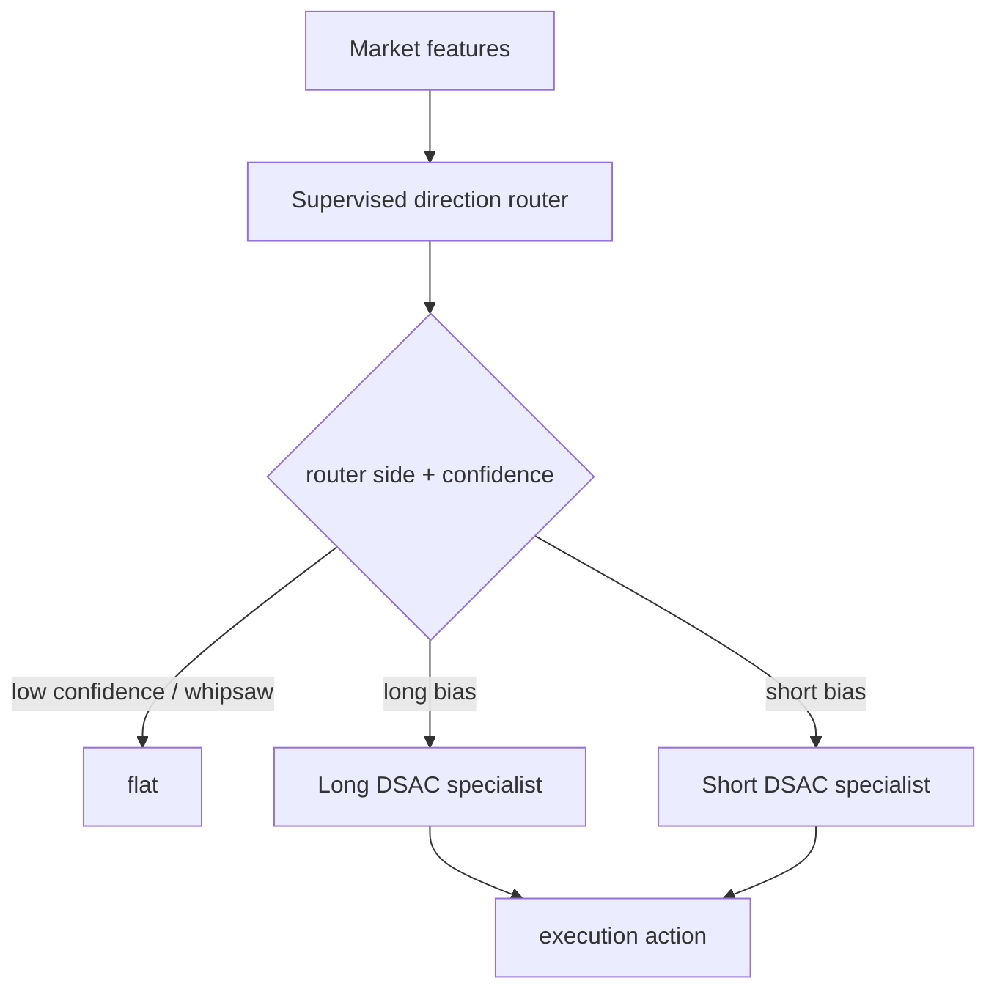

# Alpha5 Direction Router + DSAC Specialists v1

## Scope

This version keeps only the supervised `direction` capability and routes execution to two side-specialized RL agents:

- `Long Specialist DSAC`
- `Short Specialist DSAC`

The current RL core is the existing scalar-action DSAC in `/home/llewyn/crypto-scalping/ensemble/train_rl_dsac_agent.py`.

That means v1 covers:

- side-specific entry filtering
- side-specific entry/hold/close behavior
- side-specific continuous action intensity

It does **not** yet implement a true multi-dimensional DSAC action for:

- explicit TP distance
- explicit SL distance
- explicit target leverage bucket
- explicit target exposure

Those belong to v2, which requires an actor/action-dimension refactor.

## Runtime Architecture

## Router Contract

The supervised direction router produces these causal columns on the RL CSV:

- `a5dir_available`
- `a5dir_none_prob`
- `a5dir_long_prob`
- `a5dir_short_prob`
- `a5dir_prob_max`
- `a5dir_edge`
- `a5dir_margin`
- `a5dir_side`
- `a5dir_whipsaw_prob`

The DSAC environment consumes them through the existing event-entry filter interface:

- `event_prob_prefix=a5dir`
- `event_min_prob`
- `event_min_edge`
- `event_prob_gap`
- debounce / fallback controls

## Specialist Profiles

### Long Specialist

- `side_mode_override=long`
- `specialist_pos_thresh=0.17`
- `specialist_close_thresh=0.055`
- `event_min_prob=0.58`
- `event_min_edge=0.10`
- `event_prob_gap=0.08`

### Short Specialist

- `side_mode_override=short`
- `specialist_pos_thresh=0.19`
- `specialist_close_thresh=0.065`
- `event_min_prob=0.60`
- `event_min_edge=0.12`
- `event_prob_gap=0.10`

## Training Pipeline

1. Build scored RL CSV with the supervised direction router.
2. Train long specialist on scored 2025 RL CSV.
3. Train short specialist on scored 2025 RL CSV.
4. Evaluate routed execution on scored 2026 RL CSV.

## Files

### Router score adapter

`/home/llewyn/crypto-scalping/scripts/alpha5_direction_router_score_rl_csv_20260519.py`

### Specialist launcher

`/home/llewyn/crypto-scalping/scripts/alpha5_dsac_long_short_specialists_20260519.py`

### Output directories

- router-scored RL CSV:
  `/home/llewyn/crypto-scalping/tmp/causal_regen_20260516/alpha5_direction_router_rl_20260519`
- smoke specialists:
  `/home/llewyn/crypto-scalping/tmp/causal_regen_20260516/alpha5_dsac_direction_specialists_20260519`
- full specialists:
  `/home/llewyn/crypto-scalping/tmp/causal_regen_20260516/alpha5_dsac_direction_specialists_full_20260519`

## Next Step for v2

Refactor DSAC action space from scalar to multi-dimensional:

- `target_exposure`
- `target_leverage`
- `tp_distance`
- `sl_distance`
- `exit_pressure`

That change should happen in the actor, critic, replay schema, and runtime execution contract together.
