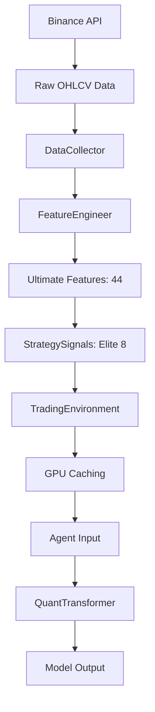

# 데이터 흐름 명세

## 📋 개요

본 문서는 원시 데이터부터 모델 입력까지의 전체 데이터 파이프라인을 상세히 설명합니다.

---

## 🔄 전체 데이터 흐름



---

## 1️⃣ 데이터 수집

### DataCollector

**경로**: `core/data_collector.py`

**입력 소스**:
- **Binance Futures API**
- **저장 파일**: `data/integrated_eth_3m_data.csv`

**데이터 형식**:
```python
Columns: ['timestamp', 'open', 'high', 'low', 'close', 'volume', 
          'taker_buy_base_vol', 'taker_buy_quote_vol', ...]
Index: DatetimeIndex
Frequency: 3분봉
Total Rows: ~175,200 (약 1년치 데이터)
```

**주요 데이터**:
| Column | Type | 설명 |
|--------|------|------|
| `timestamp` | datetime | 캔들 시작 시간 |
| `open`, `high`, `low`, `close` | float | OHLC 가격 |
| `volume` | float | 거래량 (ETH) |
| `quote_volume` | float | 거래량 (USDT) |
| `taker_buy_base_vol` | float | Taker Buy 거래량 |
| `taker_buy_quote_vol` | float | Taker Buy 금액 |
| `trades` | int | 거래 횟수 |

---

## 2️⃣ 피처 엔지니어링

### FeatureEngineer.process()

**경로**: `common/feature_engineering.py`

**입력**:
- `eth_df`: ETH 3분봉 데이터
- `btc_df`: BTC 3분봉 데이터

**출력**:
- DataFrame with 44 Ultimate Features

**처리 단계**:

#### Step 1: 데이터 병합
```python
eth_data = pd.merge_asof(
    eth_df, btc_df, 
    left_on='timestamp', 
    right_on='timestamp',
    suffixes=('', '_btc')
)
```

#### Step 2: Group A - Smart Money & Sentiment
```python
# 고래/리테일 거래량 비율
whale_threshold = volume.rolling(480).quantile(0.9)
whale_mask = volume > whale_threshold
whale_retail_ratio = (
    volume.where(whale_mask).rolling(20).mean() / 
    volume.where(~whale_mask).rolling(20).mean()
)

# 고래 신뢰도 (지속성)
whale_conviction = whale_mask.rolling(20).mean()

# 스마트머니 흐름
smart_money_flow = (
    taker_buy_volume - taker_sell_volume
).ewm(span=20).mean() / volume.rolling(20).mean()

# 펀딩비 압력 (추정)
funding_pressure = (
    (taker_buy_volume / total_volume - 0.5) * 
    volatility_z
)

# 청산 압박 강도
squeeze_power = (
    liquidation_intensity * 
    (1 + abs(funding_rate))
)
```

#### Step 3: Group B - Order Flow
```python
# Net Taker Ratio
net_taker_ratio = (
    (taker_buy_vol - taker_sell_vol) / 
    (taker_buy_vol + taker_sell_vol + 1e-10)
)

# Taker 가속도
taker_acceleration = net_taker_ratio.diff(5)

# 거래 강도
trade_intensity = trades / trades.rolling(20).mean()
```

#### Step 4: Group C - Technical Indicators
```python
# 로그 수익률
log_return = np.log(close / close.shift(1))

# 변동성 Z-Score
volatility = log_return.rolling(20).std()
volatility_z = (volatility - volatility.rolling(480).mean()) / \
               (volatility.rolling(480).std() + 1e-10)

# RSI
rsi = ta.rsi(close, length=14)

# MACD
macd = ta.macd(close, fast=12, slow=26, signal=9)
macd_hist = macd['MACDh_12_26_9']

# Bollinger Bands
bb = ta.bbands(close, length=20, std=2)
bb_width = (bb['BBU_20_2.0'] - bb['BBL_20_2.0']) / bb['BBM_20_2.0']
bb_width_z = (bb_width - bb_width.rolling(480).mean()) / \
             (bb_width.rolling(480).std() + 1e-10)

# VWAP Distance
vwap = (close * volume).rolling(60).sum() / volume.rolling(60).sum()
vwap_dist = (close - vwap) / vwap

# HMA Slope
hma = ta.hma(close, length=9)
hma_slope = hma.diff(3) / hma

# Wick Ratio
wick_ratio = (high - low - abs(close - open)) / (abs(close - open) + 1e-10)
```

#### Step 5: Group D - Market Structure
```python
# BTC 상관계수
btc_corr_60 = (
    log_return.rolling(60).corr(btc_log_return)
)

# ETH/BTC 비율 변화
eth_btc_ratio = close / btc_close
eth_btc_ratio_change = eth_btc_ratio.pct_change(5)

# Fair Value Gap Distance
fvg_dist = calculate_fvg_distance(high, low, close)

# Choppiness Index
chop_index = ta.chop(high, low, close, length=14)
```

#### Step 6: 결측치 처리
```python
df = df.replace([np.inf, -np.inf], np.nan)
df = df.ffill().bfill()
df = df.dropna()
```

**출력 형태**:
```python
Shape: (174,000+, 44)
Columns: ULTIMATE_FEATURE_COLS (44개)
Index: DatetimeIndex
```

---

## 3️⃣ 전략 신호 생성

### Elite 8 Strategies

**경로**: `strategies/`

**실행 시점**:
- **Option 1**: `utils/generate_strategy_signals.py` (사전 계산)
- **Option 2**: `TradingEnvironment.precompute_data()` (온라인 계산)

**각 전략의 출력**:
```python
Strategy.calculate_signal(
    df: DataFrame,
    current_idx: int
) -> float  # -1.0 ~ 1.0
```

**신호 통합**:
```python
strategy_signals = np.array([
    strategy.calculate_signal(df, idx) 
    for strategy in elite_8_strategies
])  # Shape: (8,)
```

**캐싱** (선택 사항):
```python
# data/cached_strategies.csv
Columns: ['strategy_0', 'strategy_1', ..., 'strategy_7']
Shape: (174,000+, 8)
```

---

## 4️⃣ 환경 래퍼

### TradingEnvironment

**경로**: `common/trading_env.py`

**초기화**:
```python
env = TradingEnvironment(
    data_collector: DataCollector,
    strategies: List[Strategy]
)
env.precompute_data()  # GPU 캐싱
```

**precompute_data() 흐름**:
```python
1. 전략 신호 계산 (Elite 8)
   for idx in tqdm(range(len(data))):
       signals[idx] = [s.calculate_signal(data, idx) for s in strategies]
   
2. GPU 캐싱
   cached_features = torch.tensor(
       data[ULTIMATE_FEATURE_COLS].values, 
       dtype=torch.float32,
       device='cuda'
   )  # Shape: (N, 44)
   
   cached_strategies = torch.tensor(
       signals, 
       dtype=torch.float32,
       device='cuda'
   )  # Shape: (N, 8)
```

**get_observation() 출력**:
```python
def get_observation(position_info, current_index):
    # 1. State Sequence (과거 60틱)
    state_seq = cached_features[
        current_index - LOOKBACK : current_index
    ]  # Shape: (60, 44)
    
    # 2. Info Vector
    strategies = cached_strategies[current_index]  # (8,)
    pos_val = position_info[0]  # Current Position (-1, 0, 1)
    pos_meta = position_info[1:]  # [PnL, Hold Duration]
    
    info = torch.cat([
        torch.tensor([pos_val]),      # (1,)
        strategies,                    # (8,)
        torch.tensor(pos_meta)         # (2,)
    ])  # Shape: (11,) for PPO, (12,) for TD3 (with volatility)
    
    return (state_seq, info)
```

**정규화**:
```python
# Z-Score Normalization (GPU)
mean = state_seq.mean(dim=0, keepdim=True)
std = state_seq.std(dim=0, keepdim=True) + 1e-8
state_seq_norm = (state_seq - mean) / std
```

---

## 5️⃣ 모델 입력

### PPO 입력

**select_action() 입력**:
```python
state = (state_seq, info)
  state_seq: (60, 44) - Float32 Tensor
  info: (11,) - Float32 Tensor
      [0]: pos_val (현재 포지션)
      [1:9]: strategies (Elite 8)
      [9:11]: pos_meta (PnL, Hold Duration)
```

**XLSTMNetwork.forward() 내부**:
```python
# 배치 차원 추가 (추론 시)
state_seq = state_seq.unsqueeze(0)  # (1, 60, 44)
info = info.unsqueeze(0)            # (1, 11)

# Backbone
context, seq_encodings, _ = self.backbone(state_seq)
  # context: (1, 256)
  # seq_encodings: (1, 61, 256)  # 60 + CLS Token

# Info Decomposition
pos_val = info[:, 0:1]       # (1, 1)
strategies = info[:, 1:9]    # (1, 8)
pos_meta = info[:, 9:11]     # (1, 2)

# Strategy Processing
strat_features = self.strategy_processor(strategies)  # (1, 64)

# Query Vector
query = torch.cat([strat_features, pos_val, pos_meta], dim=1)  # (1, 67)

# Fusion
fused = self.fusion_attention(seq_encodings, query)  # (1, 256)

# Output
logits = self.actor(fused)  # (1, 3)
```

### TD3 입력

**select_action() 입력**:
```python
state = (state_seq, info_augmented)
  state_seq: (60, 44) - Float32 Tensor
  info_augmented: (12,) - Float32 Tensor
      [0]: pos_val
      [1:9]: strategies
      [9:11]: pos_meta
      [11]: volatility_20tick  # 추가됨!
```

**PositionAwareActor.forward() 내부**:
```python
# Backbone (Strategic Mode)
_, seq_encodings, _ = self.backbone(state_seq)  # (1, 61, 256)

# Info Decomposition
pos_val = info[:, 0:1]          # (1, 1)
strategies = info[:, 1:9]       # (1, 8)
pos_meta = info[:, 9:11]        # (1, 2)
volatility = info[:, 11:12]     # (1, 1)

pos_context = torch.cat([pos_val, pos_meta], dim=1)  # (1, 3)

# Risk Gate
gate = self.position_gate(pos_context, volatility)  # (1, 1)

# Strategy Processing
strat_features = self.strategy_processor(strategies)  # (1, 64)

# Query Vector
query = torch.cat([strat_features, pos_context, volatility], dim=1)  # (1, 68)

# Fusion
fused = self.fusion_attention(seq_encodings, query)  # (1, 256)

# Action
raw_action = torch.tanh(self.head(fused))  # (1, 1)
scaled_action = raw_action * (0.1 + 0.9 * gate)  # (1, 1)
```

---

## 6️⃣ 학습 데이터 흐름

### PPO 학습 루프

```python
for episode in range(1, MAX_EPISODES):
    # 1. Episode 초기화
    start_idx = random_start()
    state = env.get_observation(pos_info, start_idx)
    
    # 2. Episode Rollout
    for step in range(MAX_STEPS):
        # Action Selection
        action, prob, value = agent.select_action(state, mask)
        
        # Environment Step
        next_state, reward, done = env.step(action)
        
        # Store Transition
        agent.put_data((state, action, reward, next_state, prob, done, value, vol, mask))
        
        state = next_state
        if done: break
    
    # 3. 학습 (Episode 종료 후)
    loss = agent.train_net(episode, mode='expert', expert_idx=idx)
```

**Transition 구조**:
```python
transition = (
    state: (state_seq, info),       # ((60,44), (11,))
    action: int,                     # 0, 1, or 2
    reward: float,                   # Sortino 조정 보상
    next_state: (next_seq, next_info),
    prob: float,                     # log_prob(action)
    done: bool,                      # Episode 종료 여부
    value: float,                    # V(state)
    volatility: float,               # 변동성 레이블
    mask: np.array([3], float)       # Action Mask
)
```

**Batch 처리**:
```python
# agent.train_net() 내부
batch_data = list(zip(*self.data))  # Transpose

# Tensors
s_seq = torch.tensor(batch_data[0][0])      # (Batch, 60, 44)
s_info = torch.tensor(batch_data[0][1])     # (Batch, 11)
a = torch.tensor(batch_data[1])             # (Batch,)
r = torch.tensor(batch_data[2])             # (Batch,)
# ... (나머지 동일)

# GAE Calculation
with torch.no_grad():
    deltas = r + gamma * next_val * done_mask - val
    advantage = compute_gae(deltas, gamma, lambda)

# PPO Update
for _ in range(K_EPOCHS):
    with autocast(device_type='cuda'):
        logits, curr_val, _, _, _, _ = network(s_seq, s_info)
        # ... (Loss 계산 및 Backprop)
```

### TD3 학습 루프

```python
for episode in range(1, MAX_EPISODES):
    # Episode Rollout
    for step in range(MAX_STEPS):
        # Exploration
        if timesteps < WARMUP:
            action = np.random.uniform(-1, 1)
        else:
            action, _, risk = agent.select_action(state, noise=EXPLORE_NOISE)
        
        # Step
        next_state, reward, done = env.step(action)
        
        # Store in Replay Buffer
        agent.replay_buffer.add(state, action, reward, next_state, done)
        
        # Train
        if timesteps >= WARMUP:
            metrics = agent.train(batch_size=256)
```

**Replay Buffer**:
```python
class ReplayBuffer:
    def __init__(self, state_dim, info_dim=12, action_dim=1, max_size=100000):
        self.state_seq = np.zeros((max_size, 60, 44))
        self.state_info = np.zeros((max_size, 12))
        self.action = np.zeros((max_size, 1))
        self.reward = np.zeros((max_size, 1))
        self.next_state_seq = np.zeros((max_size, 60, 44))
        self.next_state_info = np.zeros((max_size, 12))
        self.not_done = np.zeros((max_size, 1))
    
    def sample(self, batch_size):
        ind = np.random.randint(0, self.size, batch_size)
        return (
            torch.FloatTensor(self.state_seq[ind]).to(device),
            torch.FloatTensor(self.state_info[ind]).to(device),
            # ...
        )
```

---

## 7️⃣ 데이터 크기 및 메모리

### 원시 데이터
```
ETH 3분봉: 175,200 rows × 19 columns
  - Memory: ~26 MB (Float64)

BTC 3분봉: 175,200 rows × 19 columns
  - Memory: ~26 MB (Float64)
```

### 피처 데이터
```
Ultimate Features: 175,200 rows × 44 columns
  - Memory: ~61 MB (Float32)
  - GPU: ~61 MB
```

### 전략 신호
```
Elite 8 Signals: 175,200 rows × 8 columns
  - Memory: ~11 MB (Float32)
  - GPU: ~11 MB
```

### GPU 캐싱
```
Total GPU Memory:
  - Features: 61 MB
  - Strategies: 11 MB
  - Model: ~30 MB (PPO) or ~15 MB (TD3, FP16)
  - Batch: ~10 MB (Batch=256)
  - Total: ~110 MB

RTX 3070Ti (8GB) 활용률: ~1.4%
```

### Replay Buffer (TD3)
```
Max Size: 100,000 transitions
  - state_seq: 100k × 60 × 44 × 4 bytes = 1,056 MB
  - state_info: 100k × 12 × 4 bytes = 4.8 MB
  - action, reward, etc.: ~10 MB
  - Total: ~1,070 MB (~1 GB)
```

---

## 8️⃣ 데이터 전처리 타임라인

| 단계 | 실행 시점 | 소요 시간 (추정) |
|------|----------|----------------|
| 1. 데이터 로드 | 매 학습 시작 | ~2초 |
| 2. 피처 엔지니어링 | 매 학습 시작 | ~5초 |
| 3. 전략 신호 계산 | `precompute_data()` | ~30초 (8 strategies, tqdm) |
| 4. GPU 캐싱 | `precompute_data()` | ~0.5초 |
| **총 소요 시간** | | **~38초** |

**최적화**:
- ✅ GPU 캐싱으로 매 스텝 CPU→GPU 전송 제거
- ✅ 전략 신호 사전 계산 (`cached_strategies.csv`)
- ✅ 피처 데이터 사전 계산 (`training_features.csv`)

**사전 계산 시**:
```
1. 데이터 로드: ~2초
2. GPU 캐싱: ~0.5초
총: ~2.5초
```

---

## 🔍 데이터 검증

### 범위 체크
```python
# Ultimate Features
assert -10 < log_return < 10
assert 0 <= rsi <= 100
assert -3 < volatility_z < 3
assert -1 <= net_taker_ratio <= 1

# Strategy Signals
assert all(-1 <= signal <= 1 for signal in strategies)

# Info
assert pos_val in [-1, 0, 1]
assert -1 <= pnl <= 1
```

### NaN/Inf 체크
```python
assert not df.isnull().any().any()
assert not np.isinf(df.values).any()
```

---

**작성일**: 2026-02-06  
**최종 업데이트**: GPU 캐싱 및 AMP 적용 후
