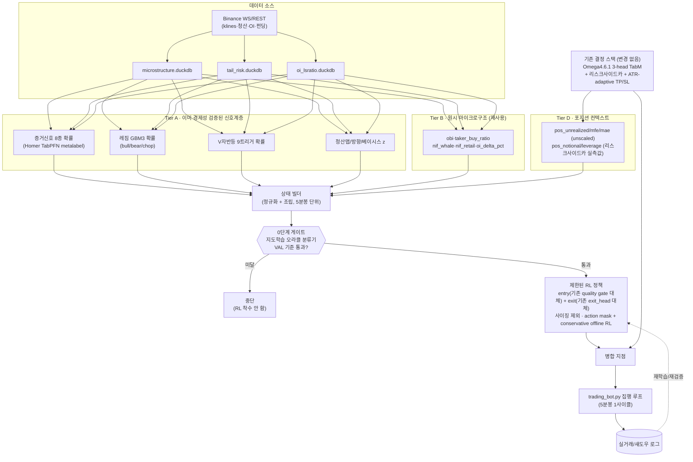
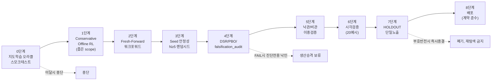

# ETH 자동매매 강화학습(RL) 에이전트 — 설계도면 (2026-08-31)

- 작성일: 2026-08-31
- 목적: 대시보드 지표·증거신호·DuckDB 실시간 데이터를 state로 받아 자동매매하는 RL 에이전트의 아키텍처 설계
- 근거: 저장소 1차 문서 7건(RL 계약/실험 4건, SOL RL 서베이 1건, 멀티코인 설계서 1건, Homer 마스터 문서 1건) + 메모리 18건 직접 확인, 서브에이전트 3건(대시보드/증거신호 코드 인벤토리, DuckDB 스키마+라이브 서빙 구조, 과거 RL 시도+프로모션 파이프라인 선례) 조사
- 성격: **설계 제안 + 선행연구 조사**. 코드 변경 없음, 학습 실행 없음. §5의 entry 메커니즘 가정은 착수 전 확인 필요 (DL 아키텍처는 항상 사전 컨펌 대상).
- **범위 확정(2026-08-31, 후속 확인)**: 진입 + 청산을 RL이 함께 결정, **사이징은 제외**(기존 리스크사이드카 유지). §3/§5/§8이 이 확정 범위로 갱신됨.

> ⚠️ **§1을 건너뛰지 말 것**: 이 저장소는 "RL로 자동매매"와 "증거신호를 자동매매에 연결"을 각각 이미 여러 차례 시도했고 전부 실패로 종결했습니다. 이 설계는 그 실패들을 모른 척하고 새로 그린 게 아니라, 그 실패들이 남긴 진단을 그대로 이어받아 범위를 좁혀 그린 것입니다. 파일:라인 인용은 2026-08-31 조사 시점 스냅샷이며, 코드가 그 뒤 바뀌었을 수 있습니다.

## 요약

1. **RL 자체가 이미 10회 이상 시도되고 종결됨.** 가장 직접적인 시도(`omega4_7_rl_dsac`, discrete SAC로 Omega4.6.1 전체를 대체)는 두 차례(5분봉/1시간봉) 모두 OOS **-87~-99%**로 참패 — 같은 구간 라이브 모델은 +145%. 원인은 아키텍처가 아니라 **보상 희소성**: 이 자산·타임프레임에서 수익나는 행동 패턴은 "6개월에 24번만 행동"인데, RL은 탐색 중 수천 번 행동하며 매번 비용을 냅니다. SOL에서도 discrete SAC가 같은 방식(2,000~5,000회 진입, 자본 전액 소진)으로 참패해 자산 특이적 문제가 아님이 재확인됐습니다.
2. **증거신호를 자동매매 트리거로 쓰는 시도도 이미 5회 실패.** confluence 규칙(K=1~6, 36칸 전부 always_long/short 패배), forced-exit veto, exit_head 피쳐, 사이징 피쳐 — 전부 실패. 증거신호 계산 스크립트 자체의 docstring이 `"NOT A TRADING ALGORITHM. INFORMATIONAL / PROBABILITY-SHIFT CONTEXT ONLY"`라고 명시합니다.
3. **더 근본적인 진단(SOL 9-family 서베이가 발견): 문제는 "약한 신호"가 아니라 "부호가 뒤집히는(anti-stable) 신호"**입니다. train에서 가장 강했던 상위 20개 피쳐가 VAL에서 0/20 부호를 유지하고, train-VAL 피쳐-AUC 상관이 **음수(-0.38)**입니다. 심지어 정식 사전등록 OOS 게이트를 통과한 후보(TabM flat, OOS 4/5시드 양수)조차 그다음 미노출 구간에서 뒤집혔습니다(-8.07%, 1/5 양수) — 이 저장소에서 8번째로 재현된 "선택된 양의 결과가 새 데이터에서 뒤집히는" 패턴입니다.
4. **이 저장소 라이브 스택 자체도 DSR/PBO를 통과한 적이 없습니다** (DSR 0.915 < 0.95 통과선, falsification_audit FAIL). 새 RL 후보에게 이보다 훨씬 높은 기준을 요구하는 건 비현실적이지만, 이 게이트 자체를 생략할 이유도 아닙니다 — 처음부터 넣고 시작합니다.
5. **그럼에도 완전히 같은 시도는 아닙니다.** `omega4_7_rl_dsac`가 실패한 2026-07 시점엔 증거신호 8종(Homer metalabel)·레짐 GBM3·V자반등 9트리거가 존재하지 않았습니다. 이번 설계는 raw 피쳐 대신 **이미 개별적으로 경제성 검증을 통과한 신호들의 확률**을 주 입력으로 씁니다. 다만 핵심 실패 메커니즘(보상 희소성·거래비용·anti-stable 신호)은 입력을 바꾼다고 저절로 없어지지 않습니다.
6. **범위 확정: 진입+청산을 RL이 함께 결정, 사이징은 제외**(margin_fraction/leverage는 기존 리스크사이드카 유지). 이 저장소 2026-06-18 진단 문서가 제시한 3단계 권장순서(exit-only → entry-veto → entry+exit lifecycle)의 **마지막 단계**를 중간 단계 없이 바로 목표로 하는 선택입니다 — 방향(direction) 자체는 여전히 기존 Omega4.6.1 direction head가 내고, RL은 그 후보를 "받을지"(entry)와 "언제 닫을지"(exit)만 결정한다고 가정합니다(§5에 명시, 확인 필요).
7. **가장 먼저 할 일은 RL이 아니라 지도학습 스모크테스트**(§8 0단계)입니다 — entry(기존 quality gate 대체)와 exit(기존 exit_head 대체)를 **따로** 진단하고, 각각 기존 기준선 근처에도 못 가면 그 서브태스크부터 폐기합니다. 이 저장소 자신의 명시적 기존 정책입니다.

---

## 전체 구조 한눈에 보기



---

## 1. 배경 — 이미 시도된 것들

### 1.1 RL 시도 이력 (direction-alpha 축, CLOSED)

이 저장소는 2026-05부터 DSAC(discrete/distributional soft actor-critic)를 중심으로 최소 10회 이상 RL을 시도했습니다: `ensemble/train_rl_dsac_*.py`(5개 변형), Dueling DQN(`ensemble/dueling_dqn_parent.py`, `alpha4_3` 계약), HMM+DQN 라우터(`alpha5_3` 계약), Offline RL(IQL/CQL/CVaR, `docs/experiments/dt_lifecycle_iql_cql_cvar.md`) 등. 가장 최근·가장 직결된 시도는 다음과 같습니다.

**`docs/model_contracts/omega4_7_rl_dsac_20260707_contract.md` — Omega4.6.1 전체를 discrete SAC로 대체**(상태: `rejected_research_not_live_wired`). Feature contract(zig075의 102개 base_cols)만 유지하고 TabM parent·리스크사이드카·TP/SL 배리어·라우터를 전부 제거, {CASH, LONG, SHORT} 3-행동 카테고리컬 정책으로 처음부터 학습:

| 시도 | 결정 주기 | VAL(시드선택) | OOS(단일노출) | 참고 |
|---|---|---|---|---|
| v1 | 5분봉 | -93.39% (n=2424, wr 0.485) | **-99.26%** (n=3628, wr 0.470) | 수천 회 포지션 플립, 비용이 계좌를 소진 |
| v1.1 | 1시간봉(빈도↓) | -35.97% (n=730, wr 0.414) | **-87.73%** (n=1575, wr 0.371) | 빈도를 낮춰도 여전히 심각한 음수 |
| (참고) 라이브 Omega4.6.1 | — | — | **+145.34%**(MDD -10.13%, 거래 24회) | 같은 OOS 구간 |

결론(원문): *"Model-free RL directly on this feature tape cannot overcome the transaction-cost hurdle at any tested frequency... the profitable behavior on this tape is 'act ~24 times in 6 months', which gives an RL agent almost zero positive-reward experiences to learn from, while every exploratory action it takes costs real fees."* 재도전한다면 유효할 만한 두 레버로 (1) RL을 엔드투엔드가 아니라 지도학습 parent가 걸러낸 고품질 후보 중에서 고르는 라우터/사이저로 제한, (2) 비용인지 행동예산(action budget) reward shaping을 제시했으나, "6연속 실패한 업그레이드 후보를 감안하면 둘 다 baseline을 이길 것으로 기대하지 않는다"고 명시.

**`docs/experiments/omega1_2_quality_gate_rl_problem_report_20260618.md` — 더 이른 시점의 신중한 진단**(DSAC 착수 3주 전). 핵심 발견:
- Raw direction head 후보 풀 자체가 손절 쪽으로 기울어짐(TP 31.35% vs SL 55.78%) — "좋은 행동을 조금 더 잘 고르는" 문제가 아니라 "나쁜 후보 대부분을 걸러내는" 문제.
- 기존 quality gate(threshold 0.8)를 제거하면 성능이 붕괴(OOS PnL 72.76→-31.74) — 거칠어 보이는 규칙이 실제로 강한 방어막.
- 지도학습 veto/meta-classifier 대안 5개(Combined EV/Quality-Scaled Notional/Win Probability Meta/Adaptive Threshold/Multi-target gate) **전부** 기존 quality gate를 못 이김.
- Exit head 단독 청산, Exit head 제거 2-head 구조도 둘 다 실패.
- DSAC가 바로 답이 되기 어려운 이유 4가지: ① 3-head 출력만으로는 state가 너무 빈약(레짐/ATR/시간대 컨텍스트 없이는 지도학습 게이트조차 실패했음), ② reward shaping이 매우 민감(단순 PnL reward는 overtrading 유발), ③ offline RL은 후보 데이터의 선택편향에 취약(OOD 행동 과대평가), ④ 지금 문제는 "정책 최적화"가 아니라 "후보 품질" 문제 — RL이 배워야 할 건 "대부분 행동하지 않는 정책"이며 이는 이미 quality gate가 하고 있음.
- **권장 실행 순서(원문 그대로)**: (1) 현재 quality gate 유지 (2) 지도학습 oracle policy classifier로 스모크테스트, validation-only 선택 (3) 통과할 때만 conservative offline RL(action mask + CQL류 conservative penalty + OOD gate + turnover penalty 필수) (4) scope를 처음부터 제한 — **exit-only RL → entry-veto RL → entry+exit 전체 lifecycle RL** 순서로, 절대 전체 lifecycle부터 시작하지 않음.

**`docs/experiments/eth_odyssey_dl_rl_architecture_research_20260816.md`** — 내부 이력(RL 포함 VSN/Diffusion/Mamba/Transformer/TCN 전부 이미 시도, 전부 실패·미승격) + 외부 문헌(2025~2026 RL 논문 전수조사 결과 새 패러다임 없음)이 독립적으로 "아키텍처 교체는 지금 시점에 시간 투자 가치가 낮다"는 결론에 수렴. 특히 인용된 두 문헌이 이번 설계에 직결됩니다: **Nonstationarity-Complexity Tradeoff**(arXiv:2512.23596, 신호가 약하고 비정상적일 때 모델 복잡도를 높이면 OOS가 악화)와 **Spurious Predictability in Financial ML**(arXiv:2604.15531, falsification-audit 없이는 아키텍처 탐색 자체가 순수 무작위 데이터에서도 유의한 "개선"을 만들어냄).

### 1.2 증거신호를 자동매매에 연결하는 시도 이력 (CLOSED)

`docs/experiments/eth_evidence_signal_top6_confluence_standalone_backtest_20260814.md` — 상위 6개 증거신호를 `net_score = 바닥발화수 - 천장발화수 ≥ K`로 조합한 **독립 규칙**(TabM/Omega 없이)을 실제 fresh-forward 백테스트(진입=다음 bar 시가, TP/SL bar-by-bar, 실비용)에 넣은 결과:

| K | 확인 강도 | 거래수(창당) | 결과 | 벤치마크 승 |
|---|---|---|---|---|
| 1~3 | 느슨 | 597~3,370 | -24~-95% | 0/6 |
| 4 | 중간 | 156~228 | -14~-35% | 0/6 |
| 5~6 | 엄격 | 0~24 | ±0~3% (거래부재) | 0/6 |

**36칸 전부 always_long/always_short에 패배.** 진단: 느슨하면 회전율 재앙(비용만으로 -95%), 엄격하면 거래가 너무 적어 증명 불가 — "활발하면서 이기는" 중간지대가 K축 어디에도 없음. 결론(원문): *"이 자산·타임프레임에서 방향성 타이밍이 어떤 정보원(모델이든 손으로 짠 규칙이든)으로도 buy-and-hold를 안정적으로 이기지 못한다"*는 명제가 **다섯 번째 독립 증거**로 강화됨(같은 세션에 forced-exit veto·exit_head 피쳐·사이징 피쳐 3건도 같은 날 실패).

이 결론은 코드 자체에도 새겨져 있습니다 — `scripts/live_evidence_signal_metalabel_20260829.py`의 docstring: **"NOT A TRADING ALGORITHM. INFORMATIONAL / PROBABILITY-SHIFT CONTEXT ONLY"**. 실제로 `trading_bot.py`/`trading_bot_modules/*.py` 전체를 grep해도 `evidence_signal`, `taker_delta_climax`, `liquidity_sweep`, `kalman_deviation`, `demarker`, `v_shape`, `orthogonal_combo` 등 어떤 증거신호 이름도 **0건** — 이 신호들은 대시보드 전용 REST 폴링 경로로만 존재하고, 라이브 매매 루프와는 완전히 분리되어 있습니다.

### 1.3 교차자산 재확인 — SOL 9-family 서베이, 더 근본적인 진단

`docs/sol_dl_rl_architecture_survey_20260807.md`(같은 방법론을 SOL에 처음 적용, N=5 진짜 랜덤시드, VAL-only 선택, 단일 사전등록 OOS)는 LightGBM·TabM·Transformer·**discrete SAC**·post-hoc quality gate·joint-quality 학습·트레일링 exit·regime-MoE·maker 집행·변동성 브라켓 등 **9개 아키텍처군 전부**를 닫았습니다. RL 관련 핵심:

- Discrete SAC(un-shaped mark-to-market reward)는 사용자가 5시드 중 2시드 완료 후 중단 — 둘 다 VAL -73%/-99%, 4개월에 2,000~5,000회 진입. `omega4_7_rl_dsac`와 **동일한 실패 메커니즘**(회전율이 비용에 갈림)이 다른 자산에서도 재현됨.
- **더 중요한 발견**: 이 서베이가 유일하게 "통과"시켰던 후보(TabM flat, VAL+0.65%·OOS 4/5시드 양수·+4.08%)조차, 이후 완전히 미노출이었던 구간(2026-04-01~07-21)에서 **-8.07%(1/5 시드만 양수)로 뒤집혔습니다** — 정식 사전등록 게이트를 통과하고도 다음 구간에서 죽은, 이 프로젝트의 8번째 "선택된 양의 결과가 새 데이터에서 뒤집히는" 사례.
- 원인 규명(`scripts/audit_sol_oracle_feature_analysis_20260808.py`): train에서 가장 강력했던 상위 20개 피쳐 중 **VAL에서 부호를 유지한 것이 0개**, train-VAL 피쳐-AUC 상관은 **-0.38(음수)**. 결론(원문): *"the panel's failure mode is not weak signal but ANTI-STABLE signal — the feature→direction map systematically flips sign between regimes."* 레짐 조건화(bull/bear/chop)는 부호 안정성은 살렸지만(무조건부 0% → bull 85%/bear 60%/chop 35%) 신호 크기 자체는 여전히 비용에 못 미침(within-regime AUC ~0.53~0.55).

**이 설계에 대한 함의**: ETH의 개별 증거신호 홀드아웃 사례(taker_delta_z_climax — VAL/OOS 결합 +4.49bp였으나 HOLDOUT -0.98bp로 부호 반전, [feedback_holdout_survival_not_predictable_from_val_oos_20260830](../../../.claude/projects/-home-kbj20-crypto-scalping/memory/feedback_holdout_survival_not_predictable_from_val_oos_20260830.md) 참고)는 이 SOL 발견의 개별 사례일 가능성이 높습니다. RL의 정책 자체도 결국 "이 상태에서 이 행동이 좋다"는 방향적 관계를 학습하는 것이므로, 같은 anti-stable 메커니즘에 그대로 노출됩니다.

### 1.4 이 저장소 라이브 스택 자체의 기준선

`core/selection_stats.py`(2026-07-26 생성, DSR/PSR/PBO-CSCV/falsification_audit 구현)를 라이브 Omega4.6.1에 처음 적용한 결과(`docs/experiments/eth_live_promotion_seed_dsr_pbo_tradelevel_20260819.md`, trade-level 546일): **DSR=0.915**(통과선 0.95 미달) · **PBO-CSCV=0.444**(노이즈 기준선 0.5에 근접, 사실상 무정보) · **falsification_audit=FAIL**(94.0/89.2백분위, 요구 95 미달). 즉 지금 "이겨야 할 기준선"으로 쓰는 라이브 모델 자체도 이 저장소가 만든 가장 엄격한 통계 검정을 통과한 적이 없습니다.

---

## 2. 그래도 이 설계가 완전히 같은 시도는 아닌 이유

`omega4_7_rl_dsac`가 실패한 2026-07-07 시점에는 **증거신호 8종(Homer TabPFN metalabel)·레짐 GBM3·V자반등 9트리거 통합모델 중 무엇도 존재하지 않았습니다** — 전부 2026-08 한 달 안에 만들어졌습니다. 당시 DSAC의 state는 zig075의 원시/엔지니어링 102-column `base_cols`뿐이었습니다.

이번 설계가 제안하는 state는 그 원시 피쳐가 아니라, **개별적으로 fresh-forward 경제성 게이트를 통과한 신호들의 확률**(§4 Tier A)을 주 입력으로 삼습니다. 이건 실제로 다른 시도입니다. 그러나 냉정하게 구분해야 할 것은:

- omega4_7_rl_dsac를 죽인 메커니즘(보상 희소성 — "6개월에 24번만 행동"하는 게 정답인데 RL은 탐색 중 수천 번 행동)은 **입력 피쳐가 아니라 행동공간·보상구조·시장 자체의 성질**입니다. 더 좋은 피쳐를 넣는다고 저절로 해결되지 않습니다.
- SOL 서베이의 anti-stable 진단도 **피쳐→방향 관계 자체가 국소적으로만 성립**한다는 것이지, "아직 안 써본 좋은 피쳐가 있으면 해결된다"는 뜻이 아닙니다.

따라서 이 설계는 "새 피쳐로 밀어붙이면 다를 것"이라는 낙관이 아니라, **행동공간과 학습방식을 근본적으로 좁혀서(§3) 실패 메커니즘 자체를 우회**하는 쪽에 무게를 둡니다.

---

## 3. 범위 결정

| 옵션 | 내용 | 근거/위험 |
|---|---|---|
| **A. 좁은 오버레이 → 진입+청산 (확정, 2026-08-31)** | 기존 Omega4.6.1+리스크사이드카 결정 스택은 그대로 두고, RL이 **진입(기존 quality gate 대체)과 청산(기존 exit_head 대체)을 함께** 결정. **사이징은 제외** — margin_fraction/leverage는 기존 리스크사이드카가 그대로 담당 | 2026-06-18 문제보고서의 3단계 권장순서(exit-only→entry-veto→entry+exit lifecycle) 중 **마지막 단계**를 곧바로 목표로 삼는 선택 — 중간 단계(exit만 먼저, 또는 entry만 먼저)를 생략하는 만큼, §8 0단계에서 entry/exit 각각의 기여를 **분리해서** 진단하는 것이 특히 중요해짐 |
| B. 전체 lifecycle(+사이징) 재도전 | 사이징까지 포함해 진입/사이징/청산 전체를 RL 정책 하나가 raw+curated 혼합 state로 결정 | `omega4_7_rl_dsac`와 구조적으로 거의 동일 — 이미 2회(5분/1시간봉) 참패, SOL에서도 재현. **배제** |
| **C. RL 이전 단계 — 지도학습 오라클 스모크테스트만** | RL 없이, entry/exit 각각을 지도학습으로 사후 최적 라벨을 얼마나 잘 맞히는지만 확인 | 저장소 자신의 명시적 정책상 실제 **0단계**(§8). **실제 착수는 여기부터** |

**권장 순서(불변)**: 확정된 범위(A, 진입+청산)로 설계하되, 실제 착수는 **C(0단계)부터** — entry/exit를 하나로 묶어 통과/실패를 판정하지 않습니다. 실제로 exit head 단독은 과거 실패, entry veto류는 5회 실패해온 이력이 각각 따로 있으므로(§1.1), 한쪽만 살고 한쪽은 죽는 결과가 충분히 나올 수 있습니다 — 그 경우 범위를 축소해(예: exit-timing만) 재확인합니다. 이하 §4~§7은 이 확정 범위를 기준으로 상세 설계합니다.

---

## 4. 상태공간(State) 설계

### 4.1 Tier A — 이미 경제성 검증된 신호계층 (2026-08-31 기준 실측치)

`scripts/live_evidence_signal_dashboard_20260823.py`의 `SIGNAL_ORDER`(8종, 전부 Homer TabPFN metalabel 확률 보유) + 특화감지기 + 레짐:

| 신호 | VAL/OOS/HOLDOUT AUC | 경제성(트레일링스톱) | 비고 |
|---|---|---|---|
| orthogonal_combo | 0.665/0.680/0.667 | VAL+9.36/OOS+15.13/**HOLDOUT+3.78bp** | 승률91~96%는 exit구조 자체효과(무작위도 83~85%), bp기준 우위만 신뢰 |
| fib_extension_exhaustion | 0.605/0.620/0.621 | VAL+15.15/OOS+3.00/**HOLDOUT+2.54bp** | 변동성레짐 의존 최고(atr_percentile 단독지배) |
| smt_divergence | 0.661/0.625/**0.682**(최고) | VAL+7.00/OOS+6.18/**HOLDOUT+3.24bp** | 승률 안정성 이 프로젝트 최고 |
| liquidity_sweep | 0.659/0.637/0.661 | VAL+10.70/OOS+14.49/**HOLDOUT+1.97bp** | 마진 얇음 |
| short_term_return_z | 0.674/0.649/0.643 | HOLDOUT+3.70bp | VAL/OOS 대비 규모 -70% |
| taker_delta_z_climax | 0.622/0.608/0.650 | VAL+4.64/OOS+5.93bp, **HOLDOUT -0.98bp(부호반전, 폐기)** | §1.3 anti-stable 사례. state에 넣더라도 "믿을 신호"가 아니라 "RL이 스스로 가중치를 배워야 할 신호"로 취급 |
| demarker_extreme | HOLDOUT AUC **0.7464**(프로젝트 최고) | 96/96 통과(최고), OOS+20.20bp(최고), **HOLDOUT+11.53bp** | 최근(08-31) 배포 |
| kalman_deviation_meanrev | HOLDOUT AUC 0.6284 | **HOLDOUT+5.80bp** | 최근(08-31) 배포 |
| V자반등(특화감지기, 9트리거) | HOLDOUT 분류 AUC **0.8465** | HOLDOUT+9.28bp(승률85.7%) | `scripts/live_eth_sweep_v_rebound_signal_20260829.py` |
| 레짐 GBM3 | OOS balanced_accuracy **0.9189** | (분류 자체 게이트, PnL 아님) | bull/bear/chop 3-class 확률 |
| 청산맵 S/R·5분신호·방향압력z·베이시스z | 부분 검증(스플라이스드 하이브리드 배포) | 개별 게이트 상이 | `scripts/live_liquidation_map_20260824.py` 등 |

> ⚠️ **8개 증거신호 전부 반전(fade) 특화입니다** — "추세 지속" 방향은 학습된 모델이든 규칙이든 CLOSED([eth_trend_continuation_at_evidence_signal_fires_20260831](../../../.claude/projects/-home-kbj20-crypto-scalping/memory/eth_trend_continuation_at_evidence_signal_fires_20260831.md)). RL의 행동이 암묵적으로 "지속에 베팅"하는 형태로 수렴하면 이미 닫힌 축을 다시 여는 것과 같습니다.

**대시보드 모델지표(5종, IC-검증·PnL-미검증)**: 수급흐름(whale)·리테일수급(retail_flow)·청산방향압력(liq_direction)·베이시스청산압박(liq_pressure)·청산캐스케이드(liq_cascade) — `/api/state`, `scripts/live_liquidation_direction_signal_20260825.py`, `live_spot_perp_basis_signal_20260827.py`. **주의**: 이 5종은 "대시보드 노출 = IC 기준"([feedback_dashboard_indicators_ic_bar_not_pnl_bar](../../../.claude/projects/-home-kbj20-crypto-scalping/memory/feedback_dashboard_indicators_ic_bar_not_pnl_bar.md))으로만 검증됐고 경제성은 미검증입니다 — state에 넣는 것 자체는 무방하지만(RL이 한계기여도를 스스로 학습), "이미 검증된 신호"인 Tier A와 혼동하지 말 것.

### 4.2 Tier B — 원시 DuckDB 마이크로구조 (재사용, 일부는 이미 실패 경험 있음)

| DuckDB 파일 | 핵심 컬럼 | 비고 |
|---|---|---|
| `data/live/microstructure.duckdb` | `obi, taker_buy_ratio, nif_whale, nif_retail, oi_delta_pct, funding_rate, spoofing_score` | `nif_whale`/`obi`/`oi_delta_pct` 등은 이미 Omega4.6.1의 base_cols에 포함 — `omega4_7_rl_dsac`가 이미 이 계열로 실패했으므로 "새 정보"는 아님 |
| `data/live/tail_risk.duckdb` | `long_usd_1m, short_usd_1m, mu_long/sigma_long, mu_short/sigma_short` | `shadow_aftershock_prob`는 **제외** — 방향·변동성 둘 다 무정보로 이미 확정([eth_liquidation_shadow_aftershock_prob_signal_check_rejected_20260827](../../../.claude/projects/-home-kbj20-crypto-scalping/memory/)) |
| `data/live/oi_lsratio.duckdb` | `global_ls_ratio, top_pos_ls_ratio` | 리테일 vs 상위트레이더 포지셔닝 |
| `data/live/l2_anomaly_snapshots.duckdb` | 이벤트 트리거시에만 스냅샷(상시 아님) | ETH 유일 이력 보유(35건) — 상시 state 피쳐로는 부적합, 별도 이벤트 플래그로만 |

### 4.3 Tier C — 신규/미검증 후보 (조심)

`shadow_toxicity_score/regime`, `shadow_queue_collapse/bias`(raw L2 파생), `spoofing_score` — Homer/Omega 어느 파이프라인도 아직 검증한 적 없음. [feature_engineering_edge_research_20260817](../../../.claude/projects/-home-kbj20-crypto-scalping/memory/feature_engineering_edge_research_20260817.md) 메모리는 외부 문헌상 **OFI/LOB 파생 피쳐가 그나마 가장 강한 증거를 가진 카테고리**라고 기록 — SOL 서베이 결론("새 원시 정보원과 집행 프리미티브가 남은 미탐색 축")과도 일치. 넣는다면 순열중요도로 개별 기여를 확인한 뒤에만, 원시 L2를 그대로 넣지 말고 OFI류 파생형으로.

**명시적 제외**: `decision_feature_frame`(trading_bot.py의 감사 로그 — 과거 결정 결과를 담고 있어 학습 입력으로 쓰면 순환/누수 위험, 감사 전용), `shadow_aftershock_prob`(무정보 확정).

### 4.4 Tier D — 포지션 컨텍스트 (Position-Feature Parity Contract 그대로 적용)

CLAUDE.md의 Position-Feature Train/Inference Parity Contract를 그대로 계승합니다: `pos_unrealized/pos_mfe/pos_mae`는 **비스케일 원시 가격변동률**(`trading_bot.py`의 `move=(current_price-entry)/entry`, 9178행과 동일 스케일), `pos_notional/pos_leverage/pos_exposure`는 **실제 후보별 리스크사이드카 예측값**(고정 상수 대체 금지, 대체할 수밖에 없다면 `risk_sizing_source` 필드로 명시), `pos_tp/pos_sl`은 학습 라벨 배리어가 아니라 라이브 ATR-adaptive 공식(`atr_window=192, tp_mult=12.0, sl_mult=6.0, min_tp=0.075, min_sl=0.040, max_tp=0.22, max_sl=0.12`, `omega4_6_1_live.py:86-104,181-185`)으로 독립 계산.

문제보고서(§1.1)가 제안한 시장/포지션 컨텍스트(ATR%, ret_1/3/6/12/24, ret_vol, range_mean, ema_gap, time-of-day, hold_bars, MFE/MAE, distance-to-TP/SL)도 그대로 계승합니다 — 이미 이 저장소가 "3-head 출력만으로는 state가 빈약하다"고 실측으로 확인한 목록입니다.

### 4.5 시간 해상도

라이브 루프와 동일하게 **5분봉 1스텝**(`trading_bot.py::main()`, `next_cycle_ts`가 5분 경계+`FINAL_GOVERNOR_BAR_FETCH_DELAY_SEC` 지연으로 정확히 한 사이클/봉을 보장). 신호가 확정된 **직전 종가 봉** 기준으로 state를 구성하고, 집행은 다음 봉 시가에서(`FINAL_GOVERNOR_NEXT_OPEN_EXECUTION_ENABLE` 관행과 동일) — Fresh-Forward Rule의 "그 시점까지 확정된 feature/state만" 요구를 그대로 충족.

---

## 5. 행동공간(Action) 설계 — 확정 범위: 진입 + 청산 (사이징 제외)

2026-08-31 후속 확인으로 범위를 **"진입과 청산만 결정하는 RL"**로 확정했습니다. 사이징(`margin_fraction`)은 Futures Risk Sizing Contract대로 기존 리스크사이드카가 그대로 담당하며 이 설계에서 변경하지 않습니다.

> ⚠️ **명시적으로 가정하는 것 — 확인 필요**: "진입을 결정한다"는 두 가지로 읽을 수 있습니다.
> 1. **(이하 채택)** 방향(direction)은 여전히 기존 Omega4.6.1 direction head가 내고, RL은 그 raw 후보를 "받을지 말지"만 결정 — 즉 **기존 quality gate를 RL로 대체**하는 것이지, 방향 자체를 처음부터 예측하는 게 아닙니다. §1.1의 "raw direction 후보 풀 자체가 손절 쪽으로 기움" 문제를 새로 만들지 않기 위한 선택입니다.
> 2. **(배제)** 방향까지 RL이 처음부터 결정 — 이건 사실상 §3 옵션 B(전체 lifecycle)의 direction 축을 되살리는 것과 구조적으로 같아 배제합니다.
>
> 1번 가정이 틀렸다면(방향까지 RL이 정하길 원한다면) state·보상·비교기준선이 달라지므로 알려주십시오.

하나의 정책(policy)이 포지션 상태에 따라 다른 action space를 냅니다(문제보고서가 제안한 action 정의를 계승):

| 포지션 상태 | Action space | 대체 대상 |
|---|---|---|
| **flat**(포지션 없음, 기존 direction head가 후보를 냈을 때만 정책 호출) | {0: 후보 거부(현금 유지), 1: 후보 승인(진입)} | 기존 quality gate(threshold 0.8). **이미 5개 supervised 대안이 이 정확히 같은 기준선을 못 이겼습니다(§1.1)** — RL이 다를 근거는 "방법론 자체"가 아니라 "그때는 없었던 Tier A(증거신호·레짐) state를 더 쓴다"는 것뿐임을 냉정히 인지하고 진행 |
| **in-position**(포지션 보유 중) | {0: 유지, 1: 즉시청산} | 기존 학습된 exit_head(종가/마크가격 기준 `pos_unrealized` 등 사용). 하드 ATR TP/SL 배리어(intrabar 고가/저가 기준, `evaluate_exit`, SL을 TP보다 먼저 체크)는 안전장치로 **그대로 유지** — RL은 그 배리어에 닿기 전에 조기청산할지만 결정하며, 배리어 자체를 없애지 않음 |

공통 원칙(문제보고서 계승): flat에서 direct 반전 금지(거부 후 다음 후보부터만 재평가), unsupported/OOD 상태에서 강제 hold, 완전 자유 연속 action은 지금 단계에서 배제.

---

## 6. 보상(Reward) 설계

naive `reward = realized_pnl`은 금지합니다(overtrading·drawdown을 쉽게 허용 — 문제보고서 명시). 권장 형태를 그대로 계승:

```text
reward = realized_net
         - cost_penalty            # 표준비용, 프로모션 가정 금지
         - stop_loss_penalty
         - drawdown_penalty
         - turnover_penalty
         - unsupported_state_penalty   # OOD 행동/state 억제 (offline RL 맥락)
```

- **비용**: 프로모션·할인 가정 금지(feedback_no_fee_discount_assumptions) — taker 10bp 왕복을 기본으로, maker peg 집행을 가정한다면 ~6.2bp(1차 실측, **9월 중순 재확인 예정, 최종 아님**)를 참고치로만 병기.
- exit-timing 스코프에서 동적/트레일링 성격의 청산을 reward 시뮬레이션에 쓴다면, **고정 TP:SL을 기본 가정으로 두지 말고** ATR 트레일링스톱형 cost-gate 로직을 기본으로 시도(이 저장소 전체 정책, taker_delta_z_climax에서 최초로 표준비용 통과 사례). 다만 폭이 5분봉 고저가 범위보다 좁아질 수 있으면 **낙관/비관 봉내순서 이중검증**(SL 먼저 vs 유리한 극값 먼저 조인 뒤 불리한 극값 체크)이 필수 — 직관과 반대로 갈 수 있음이 실증됨(넓은 트레일이 오히려 더 취약했던 사례 있음).
- 배리어/청산 판정은 **intrabar 고가/저가 기준**(`evaluate_exit`의 `bar_high_move`/`bar_low_move`, SL을 TP보다 먼저 체크), 학습된 정책 자신이 보는 `pos_unrealized` 등 state 피쳐는 **종가/마크가격 기준** — 같은 파이프라인 안에 두 컨벤션이 공존해야 라이브와 일치합니다. 하나로 통일하면 라이브 서빙과 어긋납니다.
- `unsupported_state_penalty`는 conservative offline RL(§7)의 OOD 억제 장치입니다 — 기존 parent가 만든 후보 분포 밖의 행동(예: 낮은 quality 구간에서의 무리한 entry, 훈련 데이터에 거의 없는 aggressive reversal)에 큰 음의 보상을 줘 offline RL의 고질적 과대평가를 억제.

---

## 7. 알고리즘 후보

| 후보 | 채택 여부 | 근거 |
|---|---|---|
| Model-free online RL (vanilla DSAC/PPO 등, 자유 탐색) | **배제** | omega4_7_rl_dsac·SOL discrete SAC 둘 다 이 방식으로 참패. 자유 탐색이 실비용을 그대로 지불하며, 희소한 긍정 보상을 학습할 기회 자체가 거의 없음 |
| **Conservative offline RL (CQL/IQL류) + action mask + OOD gate** | **1순위 후보(0단계 통과시)** | 문제보고서가 명시적으로 권고. 후보 분포 밖 행동에 보수적 페널티를 줘 offline 선택편향을 억제. Action space가 좁을수록(§5) OOD 문제 자체가 작아짐 |
| 지도학습 게이팅 네트워크/contextual bandit (RL 아님) | **대안으로 병행 검토 권장** | entry/exit 둘 다 문제 자체가 "시간축 크레딧 할당"이 아니라 "이 순간에 행동할지 말지"에 가깝다면, RL의 시퀀셜 의사결정 능력이 애초에 불필요할 수 있음. Occam's razor + "이 저장소의 병목은 아키텍처가 아니라 정보량"이라는 반복 확인된 메타결론(§1.1)과 일치. **0단계 스모크테스트 자체가 사실상 이 대안의 최소 버전** |
| 전체 lifecycle RL(raw+curated 혼합, 자유 action) | **배제**(§3 옵션 B) | 구조적으로 omega4_7_rl_dsac와 동일 |

---

## 8. 검증 파이프라인



**0단계 — 지도학습 오라클 정책 분류기 스모크테스트 (RL 이전, 가장 중요한 단계)**

entry와 exit를 **별개 서브태스크로 분리 진단**합니다 — 둘을 하나로 묶으면 어느 쪽이 죽었는지 알 수 없습니다.

| 서브태스크 | 후보 모집단 | 오라클 라벨(hindsight) | 입력 state | 비교 기준선 |
|---|---|---|---|---|
| **Entry** | 기존 direction head가 낸 raw 후보 전체(quality gate 통과 여부 무관 — quality gate 자체를 대체하는 것이 목표, §5) | 그 후보를 실제로 취했을 때 TP 도달/net return>0 여부(이진) | Tier A(증거신호 8종+레짐+V자반등)+Tier B(원시 마이크로구조)+direction head 자신의 출력(`dir_p_cash/long/short`, `dir_confidence`)+시장컨텍스트(ATR%, ret_1~24, time-of-day) | 기존 quality gate 실측(VAL PnL 100.54/OOS 72.76, VAL WR 0.636/OOS WR 0.722) **및** 이미 실패한 5개 supervised 대안 중 최고치(Quality-Scaled Notional, VAL 29.38/OOS 21.68) — 이 5개보다도 못하면 명백히 폐기 |
| **Exit** | entry 서브태스크가 오라클 기준 승인한 포지션의 보유 매 bar | 그 시점 이후 실현 경로(MFE/MAE)를 기준으로 "지금이 국소 최적 청산점에 가까운가" | Tier D(포지션 컨텍스트, pos_unrealized/mfe/mae/hold_bars 등)+Tier A/B | 기존 exit_head 단독 실측(`omega1_2_quality_gate_rl_problem_report_20260618`: Validation PnL 0.46/OOS PnL -6.05, OOS WR 0.266) — 이미 실패한 기준선이므로 **이걸 넘는지 자체가 핵심 질문** |

- 목적: RL의 탐색/크레딧할당 문제를 배제한 채, 이 state 자체에 entry/exit 각각 정보량이 있는지 가장 낙관적인 상한선으로 먼저, 따로 확인.
- 판정: **validation-only 선택**, 두 서브태스크 독립 판정. 근처에도 못 가는 쪽은 그 시점에 폐기 — 예를 들어 exit만 살고 entry가 죽으면 범위를 "exit-timing만"으로 축소해 재확인(사이즈업이 아니라 다운 방향으로만 유연하게 조정).
- 비용: GPU 불필요, TabPFN/GBM 수준으로 수일 내 결론 가능 — 이 파이프라인 전체에서 가장 싸고 가장 정보가치 높은 단계.
- 방법론 위생: SOL 서베이의 **오라클-천장 점검**(harness가 완벽한 사후 정보로는 실제로 큰 수익을 내는지 확인)과 **누수-주입 양성 대조**(고의로 라벨 정보를 하나 흘려 harness가 진짜 신호를 PnL로 전환하는지 확인)를 먼저 통과시켜, "신호가 없다"는 결론이 harness 버그가 아님을 확인.

**1단계 — Conservative Offline RL(좁은 scope)**: §7 1순위 후보, §5의 세 스코프 중 하나만.

**2단계 — Fresh-Forward 워크포워드**: bar-by-bar causal, `trade_ledgers_used_as_input=false / saved_parent_exit_timestamps_used=false / future_rows_used_for_entry=false` 명시. ⚠️ **날짜 스플릿 확인 필요**(§10) — CLAUDE.md 표준(VAL 2025-09-01~12-31/OOS 2026-01-01~03-31)과, 2026-08-20 결정으로 알려진 TRAIN~2026-06-30 확장+신규 single-touch OOS 2026-07-01~09-30(09-30 전 조기조회 금지) 중 이 신규 축에 무엇을 적용할지는 아직 확정하지 않았습니다.

**3단계 — Seed 안정성**: Seed-Diversity Ensemble Promotion Gate의 정신을 그대로 적용(N≥5 진짜 랜덤 추출 시드, 고정간격 증분 금지) — RL 학습은 원래 시드 분산에 민감(이 저장소의 TabM 학습 불안정성 이력과 동일 계열), 단일시드 결과는 노이즈로 취급.

**4단계 — DSR/PBO/falsification_audit**: `core/selection_stats.py`를 **처음부터** 적용(사후 아님) — 이미 존재하는 Homer 신호 파이프라인들도 이 단계를 생략해왔다는 점이 지적됐으므로, 이 신규 축에서는 그 공백을 이어받지 않습니다. 단, 라이브 스택 자체도 DSR 0.915(<0.95)로 미통과인 현실(§1.4)을 감안해 "0.95 미달=즉시폐기"가 아니라 "최소 현재 라이브 수준 이상, 결과를 투명하게 보고"로 눈높이를 현실화.

**5단계 — 낙관/비관 이중검증**: 동적 exit(exit-timing 스코프)을 쓴다면 필수(§6).

**6단계 — 시각검증**: Homer 관행 계승(20예시 차트, 발동/hit 기준을 사용자에게 먼저 설명 후 승인받고 다음 단계 진행 — 자동 진행 금지).

**7단계 — HOLDOUT 단일노출**: 모든 사전검증(다중 독립 구현, 낙관/비관)을 통과해도 실패할 수 있음이 이 저장소에서 실측 확인됨(taker_delta_z_climax, SOL TabM flat) — 통과해도 규모가 크게 줄 수 있다는 것도 기대값에 반영. **실패시 재탐색·재원인규명으로 돌아가지 않고 그 자리에서 종결**(재조정 자체가 새 오염된 노출을 만들어 단일노출 원칙을 무의미하게 만듦).

**8단계 — 배포**: Position-Feature Parity Contract / Futures Risk Sizing Contract 준수 확인. Omega 계열에 편입한다면 Omega Artifact Integrity Gate(정확한 quality threshold의 train/val/oos 예측 CSV, 리스크사이드카 출처 기록)도 적용.

---

## 9. 라이브 서빙 통합 시 유의점

- **증거신호 계산은 현재 대시보드 전용 독립 REST 폴링 경로**(자체적으로 매 캐시 주기마다 새 klines를 fetch)로, `trading_bot.py`의 인프로세스 버퍼/스캐너(`MicrostructureScanner`, `TailRiskInterceptor`, 같은 `microstructure.duckdb`/`tail_risk.duckdb` 사용)와 완전히 분리되어 있습니다. RL을 실제로 라이브에 연결한다면, 대시보드용 wrapper를 그대로 호출하지 말고 **신호 계산 로직 자체를 trading_bot.py가 이미 갖고 있는 버퍼에서 인프로세스로 재사용하도록 리팩터**해야 합니다 — 그렇지 않으면 외부 API 호출 지연·요청제한·타이밍 불일치가 5분봉 결정 경계와 어긋나는 새로운 장애점이 됩니다.
- 병합 지점(§전체구조 다이어그램의 MERGE)은 `Omega461LiveAdapter.decide_entry()`(`trading_bot_modules/omega4_6_1_live.py:321-349`) 이후, `trading_bot.py`가 `dec.margin_fraction`/`leverage`를 사이징에 threading하는 지점(9029-9096행) 부근이 자연스러운 삽입 지점입니다 — 기존 `LEVERAGE_CAP=5.0`/`NOTIONAL_CAP=1.8` 캡은 그대로 유지.
- `FINAL_GOVERNOR_DSAC_OVERLAY_*`(`trading_bot.py:3657-3666`, `runtime_config.py:712`에서 기본 `False`)는 이미 배선은 됐지만 비활성화된 이전 RL 실험의 흔적입니다 — 새 RL 오버레이를 만든다면 이 기존 배선을 재활용할지, 별도로 새로 만들지 먼저 확인 필요(코드 검토 시점 확인 사항, 이번 조사에서 내용까지는 열어보지 않음).

---

## 10. 미결정 사항 — 착수 전 확인 필요

1. **entry 메커니즘 확인**: §5에서 가정한 대로 "방향은 그대로 direction head가 내고, RL은 기존 quality gate를 대체"가 맞는지, 아니면 방향까지 RL이 처음부터 정하길 원하는지.
2. **Fresh-Forward 날짜 스플릿**: CLAUDE.md 표준(VAL 25-09~12/OOS 26-01~03) vs 2026-08-20 결정(TRAIN~26-06-30 확장, 신규 single-touch OOS 26-07-01~09-30, 09-30 이전 조기조회 금지) 중 이 신규 RL 축에 무엇을 적용할지 — 설계·0단계 스모크테스트 자체는 TRAIN 구간 데이터만으로 가능하므로 지금 결정하지 않아도 착수는 가능하나, 실제 VAL/OOS 노출 전에는 확정 필요.
3. **집행 방식/비용모델**: taker(시장가, 10bp 왕복) vs maker(peg, ~6.2bp 잠정) 중 reward의 기준 비용을 어느 쪽으로 잡을지 — 참고로 SOL 서베이는 모멘텀형 신호에서 maker 집행이 역선택으로 오히려 손해였고(대기 체결이 휩쏘를 과다표집), 역방향(청산 윈도우 등)에서는 유리했던 BTC 선례가 따로 있음 — 이 RL의 행동이 반전(fade) 신호와 상관될 가능성이 높다는 점(Tier A 신호 전부 반전 특화)이 참고할 만한 방향성이나, 확정은 아님.
4. **0단계 entry 후보 모집단**: quality gate 통과 이전 raw 후보 전체(§8 표가 가정 — quality gate 자체를 대체)로 할지, 이미 quality gate를 통과한 후보 위에 얹는 추가 veto(더 좁음, 5회 실패 이력과 정확히 같은 형태)로 할지.
5. **0단계 exit 라벨의 세부**: "국소 최적 청산점"을 MFE/MAE 경로에서 정확히 어떤 규칙으로 정의할지 — 문제보고서 원안(20,071건 후보 기반) 재사용 vs 이 저장소 표준 트리플배리어(zigzag/ATR barrier) 기반 재정의.

---

## 11. 0단계 실행 결과 + 후속 외부 문헌 조사 (2026-08-31)

### 11.1 Entry 스모크테스트 실행 결과 — 실패 (6번째)

`scripts/research_eth_rl_entry_gate_oracle_smoketest_20260831.py` 실행 완료(v0: 레짐GBM3+원시시장컨텍스트+direction/quality헤드출력, v1: v0+증거신호 6종 규칙발동flag — demarker_extreme/kalman_deviation_meanrev는 로컬 데이터 부재로 제외). h48qual 번들의 이미 export된 예측 파일(`train/validation_predictions_q050.csv`) 재사용, TP/SL 결과는 직접 시뮬레이션(다음봉 시가 진입, intrabar 고저가 기준 ATR TP/SL, SL 우선체크, `MAX_HOLD_BARS=288`). TRAIN으로만 학습/보정, VALIDATION 단일 노출. OOS/HOLDOUT 미노출.

| 지표(VALIDATION) | 기존 quality gate(≥0.50) | v0 | v1(+증거신호6종) | 오라클 상한 |
|---|---|---|---|---|
| AUC | **0.5229** | 0.5140 | 0.5075 | 1.0 |
| 승인 후보 수 | 475 | 520 | 513 | 9,314 |
| 승률(승인분) | **54.74%** | 49.23% | 47.37% | 100% |
| 중앙값 bp/거래(10bp비용) | **+9.05bp** | -13.33bp | -17.24bp | +157.41bp |
| 평균 bp/거래 | +6.02bp | +26.79bp(왜도, 아래 참고) | +12.74bp | +242.14bp |

**판정: 실패.** AUC·승률·중앙값(안정적 지표 3개) 전부 기존 gate보다 못하거나 대등. 평균bp만 좋아 보이나 중앙값이 음수라 소수 극단값이 평균을 끌어올리는 왜도 아티팩트로 판단(이 저장소가 반복 경고해온 패턴). v1(증거신호 추가)이 v0보다 전 지표에서 더 나쁨 — 순열중요도 상위15개에 증거신호 12개 컬럼 전무, 지배 피쳐는 `atr_pct_192`(단순 변동성). 기존 gate와의 승인후보 겹침(Jaccard) 0.025~0.028로 사실상 다른 집합을 고르는데도 더 못함. 오라클 상한은 살아있어(+242bp) 하네스 자체는 정상(퇴화 아님). **이 저장소에서 quality gate보다 나은 entry 게이트를 만들려는 시도 6번째 실패**(기존 5개 지도학습 대안 + 이번 것). §3의 사전등록 규칙대로 이 state 표현으로는 entry 축을 닫는다.

부수 발견: 기존 gate 자체의 승인율이 시기에 따라 매우 불안정(같은 h48qual 번들 내 TRAIN 후반 홀드아웃 6.17% vs VALIDATION 2.45%, 2.5배 이상 차이) — 단일 구간 비교의 신뢰도 자체에 대한 추가 경계 요인.

산출물: `tmp/causal_regen_20260516/eth_rl_entry_gate_oracle_smoketest_20260831/report.json` 외.

### 11.2 외부 문헌 조사 — 3갈래 (entry 실패 이후, "그럼 또 뭘 시도할까"에 대한 근거 확보)

#### A. 메타라벨링/신호필터링 이론

- **Schapire, "The Strength of Weak Learnability" (1990, DOI:10.1007/BF00116037)** — 부스팅 원조 정리: weak learner는 0에서 떨어진 지속적 edge(γ)가 필요하고, 이게 없으면(γ≈0) 어떤 wrapper도 값을 못 뽑음. AUC≈0.51~0.52는 정확히 γ≈0 상황 — 이론적으로 어떤 2차 필터도 여기서 값을 추출하기 어렵다는 뜻.
- **Mena et al., "ML with a Reject Option: A Survey" (arXiv:2107.11277)** — "dependent rejector"(2차 모델이 신뢰도를 만드는 구조, 이 프로젝트의 quality head/새 분류기와 정확히 같은 구조)의 성능은 **그 신뢰도 지표 자체의 정보량**에 좌우된다. 오늘 실측한 AUC 0.51이 바로 그 신뢰도 지표이고, 정보가 없다는 게 이미 직접 측정됨.
- **⭐Chalkidis & Savani, "Trading via Selective Classification" (arXiv:2110.14914, ICAIF 2021)** — CME 금속선물 5종·30분봉에서, **순위 매기기 대신 "확신 없으면 기권"**(선택적 분류, Geifman & El-Yaniv SGR 알고리즘)이 강제예측보다 전 커버리지 구간에서 이김(정확도 52.2~56.5% vs 51.2~53.7%), 백테스트 Sharpe도 양수(0.02~0.57, LSTM 원 예측은 비용반영시 전 구간 음수). **이 저장소 상황과 구조적으로 가장 비슷한 실증 사례** — 6번 전부 "재순위" 시도였는데, 이건 "기권" 프레이밍이라 다름.
- Conformal Kelly(arXiv:2608.01494)는 경고성 참고: in-sample 좋았던 컨포멀 방법도 2022+ 봉인된 OOS에서 붕괴(연 28.5%→7~8.5%). 부호반전형 드리프트(SOL서베이의 anti-stable) 자체를 다룬 문헌은 못 찾음 — 명시적 공백.

#### B. 진입타이밍 특화 딥러닝

- **Hawkes/point-process/생존분석/optimal-stopping**: 실거래 약신호 상황의 "지금 vs 대기" 결정으로 프레이밍한 문헌 전무 — 전부 미시구조 도착시각 추론이거나(방향과 무관), 지정가 체결시각(반대 문제)이거나, 시뮬레이션 옵션행사(실데이터 아님). **막다른 길.**
- **자기지도/대조학습 시장상태 표현**: 찾은 모든 논문이 결국 방향분류 타겟으로 회귀 — accept/reject 필터 타겟으로 검증한 사례 0건, 최고 결과도 이 프로젝트보다 정보량 많은 세팅(실적발표 이벤트)에서 지도학습 대비 미미한 개선. **막다른 길.**
- **⭐소형/저용량 아키텍처(약신호·비정상성 대응)**: 크립토 LOB에서 단순모델(로지스틱/XGBoost)이 DeepLOB급과 대등하거나 우위(arXiv:2506.05764, 단 1일치 한계). 더 구체적으로 **RG-ResMoE(arXiv:2608.12251)**: 레짐 정보를 피쳐로 그냥 합치면 성능·훈련안정성 둘 다 악화 — 대신 **레짐을 게이트(라우팅) 전용으로만 쓰고 피쳐로 섞지 않으면** 용량매칭 MLP를 이김. 오늘 v0/v1은 레짐확률을 그냥 피쳐로 합쳤던 방식이라, 이 결과는 "합치기 vs 게이팅"이 다른 결과를 낼 수 있음을 시사(단, 반대 결과 문헌도 있어 확정 아님, 레이블도 이 프로젝트보다 매끈함).
- **불확실성 정량화(MC-dropout/딥앙상블) 기반 필터**: 금융 도메인 실증 있음(비전/NLP만이 아님)이나 전부 일봉 주식/시뮬레이션 파생상품이고, 가장 근접한 두 사례 모두 스스로 "임계값에 민감/전이 취약"이라고 밝힘. **"싸게 직접 해볼 가치는 있으나 문헌이 작동을 보장하진 않음."**

#### C. 마이크로구조/오더플로우 기반 진입확인

- **Kyle's lambda/PIN/VPIN을 entry 필터로**: 전부 스프레드 설정·시간~일 단위 크래시 예측용으로 설계된 것이지 분 단위 진입타이밍용이 아님. **Andersen & Bondarenko가 VPIN의 단기 예측력 자체를 volume-clock 아티팩트로 직접 반박**한 논문 존재 — 오히려 반대증거. **미지지.**
- **LOB 불균형으로 외부신호 확인(confirmation)**: 이 프로젝트가 필요한 정확한 패턴("Omega의 방향콜을 오더플로우가 확인/지연")을 다룬 논문을 찾지 못함 — 모든 2022~2026 문헌이 오더플로우를 주신호 또는 밀접결합 오버레이로만 다룸. 2026 크립토 perp 논문 2건도 수수료반영시 자산별로 들쭉날쭉(5개중 3개만 생존, BTC는 전무). **얇은 근거.**
- **ML 기반 체결분류/독성플로우 게이팅**: 가장 강한 실증(Cartea et al. "Detecting Toxic Flow", PULSE)은 **FX 딜러의 리스크웨어하우징 결정**이지 방향성 트레이더의 진입타이밍이 아님. 게다가 크립토 거래소는 실제 taker/aggressor 방향을 그대로 공개해서, 이 문헌계열이 풀려는 문제 자체가 크립토엔 거의 없음.
- **종합 판단(원문)**: *"a young, plausible, fragile research direction, not an established technique. Treat acquisition as an exploratory bet, not a high-confidence investment."* — 이 저장소 내부 리뷰의 "OFI/LOB가 가장 강한 증거 카테고리"는 **방향예측** 맥락이었지, 이번에 필요한 "외부신호 확인" 맥락과는 다른 질문이라는 점도 확인.

### 11.3 종합 판단 및 권고

세 조사가 독립적으로 같은 곳에 수렴: **AUC~0.52(거의 무작위)인 원신호에서는, 이론적으로도(Schapire) 실증적으로도 정교한 아키텍처나 새 피쳐 카테고리가 "재순위"로 값을 뽑아낼 근거가 약하다.** DL 아키텍처(Hawkes/자기지도)는 이 문제 프레이밍 자체에 대한 문헌이 없고, 오더플로우 기반 확인은 근거가 얇으며 크립토에 구조적으로 안 맞을 수 있음.

**유일하게 실증 근거를 갖춘, 지금까지 6번과 구조적으로 다른 다음 후보**: 재순위 분류기를 또 만들지 말고, **선택적 분류(selective classification)/기권(reject-option) 프레이밍**을 기존 quality_for_action(또는 앙상블 불일치 같은 간단한 신뢰도 지표) 위에 시도. Chalkidis & Savani처럼 "어느 커버리지에서 승인집합이 신뢰성 있게 더 나은가"를 찾는 것 — 새 모델 학습 불필요, 싸게 검증 가능. 단, Schapire/reject-option 이론이 시사하듯 **이것도 원신호에 진짜 정보가 없으면 실패할 수 있다** — "문헌이 작동을 보장"이 아니라 "6번과 다른 유일한 근거 있는 다음 시도"로 제시.

부차 후보(근거 약함, 확인 필요): 레짐을 피쳐로 합치지 말고 게이팅 전용으로 쓰는 구조(RG-ResMoE식) — 반대 문헌도 있어 결과 예측 불가. **비권고**: VPIN/PIN류 마이크로구조 진입확인, Hawkes/자기지도 아키텍처.

### 11.4 Selective Classification 실증 검증 결과 — 실패 (같은 날 후속)

`scripts/research_eth_rl_entry_selective_classification_20260831.py` — 새 모델 없이 기존 신뢰도 신호(`quality_for_action`, `dir_trade_prob`, `dir_confidence`) 위에 Geifman & El-Yaniv SGR(Selection with Guaranteed Risk) 방식 적용. TRAIN 내부 홀드아웃(기존 스모크테스트와 동일 경계, 2025-08-10~)에서 Clopper-Pearson 상한으로 임계값 보정 → VALIDATION 1회 적용.

**TRAIN 홀드아웃에서는 진짜로 깔끔한 패턴이 보였다**: `quality_for_action` 하나만으로 커버리지 0.5%(가장 좁게)에서 위험0.400·평균+58.44bp·중앙값+70.01bp, 100%(전부수용)에서 위험0.465·평균+9.28bp — 좁힐수록 위험↓수익↑ 단조 관계.

**⛔ VALIDATION에서 이 관계 자체가 사라짐**: 같은 신호로 VALIDATION 커버리지 0.5%에서 위험0.495·**평균-33.10bp**(TRAIN홀드아웃과 부호 반대), 100%에서 위험0.519·평균-12.52bp. 사전등록된 정식 검증(목표위험0.45로 보정한 임계값, 커버리지63%)의 VALIDATION 결과도 평균+0.79bp/중앙값-12.70bp로 사실상 무의미. `dir_trade_prob`/`dir_confidence`는 VALIDATION 타이트구간이 전부 음수라 더 나쁨. (참고: VALIDATION 커버리지 3~20%대만 보면 평균+12~16bp로 양수인데, 이는 결과를 다 본 뒤 좋아보이는 구간을 짚는 사후선택이라 새 발견으로 주장하지 않음 — 그대로 기록만.)

**판정**: 이 저장소가 반복 발견해온 "TRAIN기간 관계가 VALIDATION에서 재현 안 됨"(SOL TabM-flat, ETH taker_delta_z_climax와 같은 계열) 패턴이 selective classification 프레이밍에서도 동일 재현. **entry 축은 7가지 서로 다른 접근**(지도학습 재순위 5회+오늘 신규분류기 1회+오늘 selective classification 1회) **전부 실패로 소진**. 산출물: `tmp/causal_regen_20260516/eth_rl_entry_selective_classification_20260831/report.json`.

**사용자 결정(같은 날)**: entry 축은 기존 feature 세계에서 소진 확정, 다음은 완전히 새로운 데이터(실제 LOB/오더북, 뉴스/센티먼트) 확보 검토로 전환. §12 참고.

### 참고 (§11 인용)

- Schapire (1990) DOI:10.1007/BF00116037 · Mena et al. arXiv:2107.11277 · Chalkidis & Savani arXiv:2110.14914 (DOI:10.1145/3490354.3494379) · "Conformal Kelly" arXiv:2608.01494
- Bieganowski & Ślepaczuk arXiv:2602.00776 · Jeon arXiv:2607.09230 · Cont/Kukanov/Stoikov arXiv:1011.6402 · Andersen & Bondarenko (2014) VPIN and the Flash Crash, *J. Financial Markets* 17 · Cartea/Durán-Martín/Sánchez-Betancourt arXiv:2312.05827
- RG-ResMoE arXiv:2608.12251 · 크립토LOB 소형모델 arXiv:2506.05764 · "When Valid Signals Fail" arXiv:2604.10996 · "Option-Implied Signals and Crash Risk" arXiv:2608.26115

---

## 12. 새 데이터소스 확보 검토 (2026-08-31, 사용자 선택 — 옵션 3)

Entry 축이 기존 feature 세계에서 7가지 접근 전부 실패로 소진되자(§11), 사용자가 "완전히 새로운
데이터(실제 LOB/오더북, 뉴스/센티먼트)" 확보를 지시. 조사해보니 **이 정확한 질문("quality_head/
entry-gate에 새 원천 데이터가 도움되는가")을 이 저장소가 이미 3주 전(2026-08-11~22)에 8개 후보로
저인망식으로 훑어놓은 상태**였다 — 처음부터 다시 하지 않고 그 결과를 그대로 가져와 오늘 조사(뉴스/
센티먼트, 신규)와 합쳤다. 전체 원장: `docs/experiments/eth_h48qual_quality_new_data_source_research_20260811.md`
(후보1~9), `docs/model_contracts/eth_candidate_lob_microstructure_contract_20260817.md`(LOB 전용).

| 후보 | 상태(2026-08-31 기준) | 다음 액션 |
|---|---|---|
| **원시 L2/오더북(raw LOB)** | **이미 진행 중** — 2026-08-17 프로덕션 배선 완료, ETH/BTC/SOL 축적 중(로컬 동기화 사본 기준 8/17~8/25 2,493행). 파이프라인(OFI피쳐+DeepLOB/TLOB)도 이미 구축·검증됨(53시간 파일럿에서는 예상대로 무신호, 데이터부족 탓) | **09-14 예비신호점검 해금까지 2주 대기**(이미 정해진 게이트, 새로 할 일 없음). 프로모션급은 11-17 |
| **텍스트뉴스/소셜센티먼트** | **오늘 신규조사, CLOSED** — 해상도 자체가 5분봉과 구조적 불일치(시간봉 forward-fill 또는 이벤트형이 최선), 호라이즌이 가장 가까운 문헌(arXiv:2401.00603)도 "식별가능한 영향 없음", 무료소스 소진·유료소스는 비용비대칭($42k+/월 Twitter 등) | 재제안 금지(§상세 후보9) |
| **Deribit 옵션스큐/GEX** | 과거 백필 API 자체가 없어 2026-08-15부터 실시간수집만 진행 중, 아직 신호 주장 없음 | 데이터 축적 대기(기간 미정) |
| **Dune Analytics(온체인 커스텀쿼리)** | 무료지만 **계정가입 필요 — 유일하게 사용자 액션만 있으면 즉시 착수 가능한 문** | 사용자가 가입+API키 공유시 착수 |
| **마이크로구조 toxicity/청산캐스케이드(후보1·2)** | cheap-gate 약신호+단일터치 OOS-Q2(N=8) 판정보류로 소진 | 다음 OOS세대(09-30+) 전까지 재개 불가 |
| CoinGlass/LunarCrush/Santiment/DefiLlama/온체인MVRV/거래소간펀딩스프레드 | 전부 CLOSED(구조적 백필불가 또는 부정결과) | 재제안 금지 |

**종합**: "새 데이터를 사서/구해서 지금 당장 뭔가 해보자"는 실행 가능한 옵션이 사실상 없다 —
LOB은 이미 자동으로 시계가 돌고 있고(2주 대기), 뉴스/센티먼트는 오늘 조사로 닫혔고, 나머지는
전부 이전에 이미 닫혔거나 사용자 액션(Dune 계정) 대기 상태다. 실질적으로 남은 선택지는 (1) LOB
09-14/11-17 게이트를 기다리기, (2) 무료인 Dune 계정을 만들어 그 축을 여는 것, (3) 이 entry 축
자체를 여기서 종결하고 exit(§3, 보류 중)나 완전히 다른 방향으로 넘어가는 것.

## 참고 문서

- `docs/model_contracts/omega4_7_rl_dsac_20260707_contract.md` — 가장 최근 전체 lifecycle RL 시도, REJECTED
- `docs/experiments/omega1_2_quality_gate_rl_problem_report_20260618.md` — RL 신중론 원본, 이 설계의 뼈대
- `docs/experiments/eth_odyssey_dl_rl_architecture_research_20260816.md` — 아키텍처 서베이(RL 포함 전부 CLOSED)
- `docs/experiments/eth_evidence_signal_top6_confluence_standalone_backtest_20260814.md` — 증거신호→자동매매 5회 실패 중 1건
- `docs/sol_dl_rl_architecture_survey_20260807.md` — 교차자산 재확인, anti-stable signal 진단
- `docs/homer/README.md` — 증거신호 8종 상세, 재사용 방법론 템플릿
- `docs/eth_dashboard_multicoin_expansion_design_20260831.md` — 이 문서와 같은 "설계 제안" 포맷/성격
- `docs/experiments/eth_live_promotion_seed_dsr_pbo_tradelevel_20260819.md` — 라이브 스택 DSR/PBO 미통과 실측
