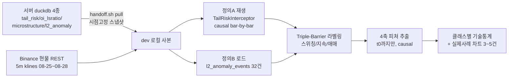

# 청산 캐스케이드 후 스위칭(반전) vs 추세지속 판별 — 3일 파일럿 설계 (2026-08-28)

사용자 요청: 청산 유도 후 반대로 튕겨나가는 스위칭(유동성 스윕)과 청산 방향 그대로 밀고 나가는
추세지속(돌파)을 구분하는 4개 축(①OI 변화 ②현물-선물 CVD 디버전스 ③캔들 종가/마감형태
④호가창 흡수)을 과거 3일 데이터로 테스트하는 계획.

**이 문서의 범위는 계획(사전등록)까지다 — 실행은 사용자 확인 후 별도 착수.**

---

## 📌 확정 규칙 (2026-08-28 기준 최신, §14 결과로 갱신 — 이후 라운드에서 또 갱신될 수 있음)

진짜돌파 캐스케이드(§12.2, cascade_extreme이 swept_level을 실제로 넘은 경우만) 이후
1시간 지평 기준, 시간순 dev70%/holdout30%로 검증 완료:

- **지속(추세지속) 콜**: `wick_body_ratio < 0.5`(캐스케이드 봉 자체가 꼬리보다 몸통이
  압도적으로 큼) **AND** `nif_whale_rel <= 0`(고래 순유입이 캐스케이드 방향과 같은 쪽,
  즉 컨트래리언이 아님) → holdout 정밀도 **88.9%**(n=9, 베이스레이트 45.9%) — §13의
  wick+obi(83.3%,n=6)보다 정밀도·표본 둘 다 나음, **현재 최선**. `nif_whale_rel`은
  방향-상대화(하락캐스케이드는 그대로, 상승캐스케이드는 부호반전)한 값 — 양수=컨트래리언
  (스위칭favor), 음수=순응(지속favor).
- **스위칭(반전) 콜**: `wick_body_ratio > 2.0` 단독 유지 → holdout 정밀도 **75.0%**(n=8,
  베이스레이트 54.1%). nif/obi를 더한 버전들은 dev 근거가 약하거나(§14.2) 표본이 급감해
  단독이 여전히 최선.
- **레짐(GBM2 추세/횡보) 조건부화는 시도했으나 실패**(§14.1) — dev에서는 "스위칭은
  횡보구간, 지속은 추세구간에서 더 잘 맞는다"는 그럴듯한 패턴이 보였지만 holdout에서
  둘 다 베이스라인(레짐 미분리)보다 못하거나 비슷해 기각. 레짐 조건 추가하지 말 것.
- 전부 **재량 참고용** — 절대 예측건수가 적고(월 몇 건 수준), 자동매매/프로모션 근거로
  쓰지 않는다. 4개 원 후보축(①OI ②CVD ④오더북notional) + `whale_position_score`/
  `funding_rate`/`eai`/`shadow_toxicity_score`/원시(비방향상대화) `nif_whale`·`nif_retail`
  + **라이브 청산맵 S/R(§15, 레벨확인여부·강도·정합도 3가지 조작화 전부)**은 이 정확한
  질문에 무정보로 확인됨 — 재검정 전 §10~15부터 확인.

---

## 0. 판단 기준 — 이 파일럿이 무엇이고 무엇이 아닌가

- **파일럿/서술적 이벤트-스터디다, 승격 근거가 아니다.** CLAUDE.md의 Fresh-Forward 규칙상
  validation/OOS/test 근거로 쓰려면 고정 구간을 bar-by-bar로 causal하게 처음부터 훑어야
  하는데, 이건 딱 3일치 리트로스펙티브 이벤트 스터디라 표본 자체가 통계적 검정력을 가질
  수 없다. 산출물은 어디까지나 "방향성이 보이는가"이지 "얼마나 수익성 있는가"가 아니며,
  자동매매 연결이나 라이브 후보 근거로 쓰지 않는다 — 청산맵/청산자석과 동일한 재량참고
  전용 원칙([[eth_liquidation_map_spliced_hybrid_confirmed_20260826]] 등 기존 비목표
  승계).
- **N이 작을 걸 전제로 설계한다.** 3일치 청산 캐스케이드는 많아야 수십 건, 적으면 한 자릿수일
  수 있다 — 억지로 유의성 결론을 내지 않고, "이 구간에서 몇 건이 잡혔는가" 자체를 1차
  산출물로 취급한다(§7).
- **인과성(causal)을 지킨다.** 모든 피쳐는 이벤트 시각 t0까지의 정보만 쓰고, 배리어 판정은
  종가가 아니라 **봉 고가/저가 기준**(CLAUDE.md의 "배리어/청산 판정은 intrabar 고가/저가"
  원칙과 정확히 동일한 이유 — resting 주문은 종가가 아니라 닿는 즉시 체결)으로 한다.

---

## 1. 선행연구 확인 — 뭐가 이미 됐고 뭐가 새로운가

이 저장소는 청산맵/OI/포지션비율 축을 이미 광범위하게 검정했다. 겹치는 것처럼 보이는 축과
이 파일럿이 실제로 다른 지점을 명시해 둔다 (재질문 시 "이미 기각됐다"로 오판하지 않도록).

| 기존 결과 | 실제로 테스트한 것 | 이 파일럿과의 차이 |
|---|---|---|
| OI/포지션 원시 direction IC 0/8 REJECTED (`eth_oi_position_ratio_raw_direction_screen_rejected_20260826`) | **무조건부** OI 레벨/델타가 향후 가격 방향을 예측하는지 | 이 파일럿은 **캐스케이드가 이미 발생했다는 조건부**에서 OI 반응 형태가 두 결과(스위칭/지속)를 가르는지 — 무조건부 방향예측이 아니라 조건부 레짐분류 |
| 청산맵 방향분리 A/B 4종 REJECTED (`eth_liquidation_map_direction_isolated_ab_rejected_20260826`) | taker/계좌비율/top-trader 비율을 **청산맵 가격레벨의 진입가중치**로 쓰는 것 | 이 파일럿은 청산맵(추정 S/R 레벨)과 무관 — 실제 청산 이벤트 발생 **이후** 가격경로를 직접 라벨링 |
| 캔들색 실험 2종 REJECTED (`eth_liquidation_map_candle_color_experiments_rejected_20260826`) | 양봉/음봉을 청산맵의 포지션비율·진입가에 반영 | 이 파일럿의 ③은 캐스케이드 봉 자체의 **꼬리/몸통 비율**을 캐스케이드 이후 라벨과 대조 — 청산맵과 무관한 별개 질문 |
| `oi_delta_z` partial-IC 통제 시 z=1.3~1.6로 문턱 미달 (`eth_oi_position_ratio_volatility_screen_20260826`) | OI-delta의 **매그니튜드**가 변동성 자기상관을 통제해도 독립적 정보인지 | 캐스케이드 자체가 이미 고변동성 순간이라 OI 반응 크기는 라벨과 무관하게 클 것 — §5에서 매그니튜드가 아니라 **부호/재확장 여부**를 1차 피쳐로 삼는 이유 |
| `liquidity_withdrawal_matched` 5건 중 0/5 매치 (`eth_l2_anomaly_snapshot_collector_20260827`) | 청산 버스트 순간 오더북 유동성이 실제로 빠지는지(문헌 가설) | **이건 사실상 ④의 축소판 예비관측이다** — 이번 파일럿이 표본을 32건(§2)으로 늘려 같은 질문을 재확인하는 것과 정확히 겹친다. 별도 재시도가 아니라 이 축의 후속 라운드로 취급 |

**L2/오더북 축 자체는 이 저장소가 이미 "방향·OI·변동성 프레이밍 다 소진된 뒤 유일하게
남은 미시도 축"으로 지목해 둔 상태**(`eth_l2_anomaly_snapshot_collector_20260827` 문서화,
문헌 arXiv:2607.27070/2608.03616 근거) — 이 파일럿은 그 축의 자연스러운 다음 라운드다.

---

## 2. 데이터 가용성 실사 (2026-08-28 01:20 KST, 서버 직접조회 기준)

**핵심 전제**: 이 로컬 dev 체크아웃(`kbj20@192.168.0.90`)의 `data/live/*.duckdb`는 대부분
비어있거나 며칠 전에 멈춰 있다 — 하지만 실제 라이브 데이터는 별도의 **서버**
(`llewyn@192.168.0.232`, `handoff.sh`가 dev/server로 부르는 그 두 기계)에서 지금 이 순간도
쌓이고 있다. 아래 표는 서버에 SSH로 직접 접속해 각 테이블을 `SELECT count/min/max`로 실측한
결과다 — 로컬 파일 존재 여부만으로 "데이터 없음"이라 판단하면 안 된다는 걸 이번에 직접
확인했다.

| 축 | 소스 | 해상도 | 3일 커버리지 (2026-08-25~08-28) | 상태 |
|---|---|---|---|---|
| ① OI | `data/live/oi_lsratio.duckdb::oi_lsratio_5m` | 5분 | 1,713행, 08-22~08-28 01:10 KST(현재) | ✅ 충분 |
| 캐스케이드 탐지 원재료 | `data/live/tail_risk.duckdb::tail_risk_1m` | 1분 | 151,903행, 05-03~08-28 01:19 KST(현재) | ✅ 풀 커버 |
| ② 선물 테이커흐름 | `data/live/microstructure.duckdb::microstructure_1m` (`taker_buy_ratio`) | 1분 | 151,801행, 05-03~08-28(현재) | ✅ |
| ② 현물 CVD | 상시 수집기 **없음** — `binance_data/klines_spot/ETHUSDT-5m-spot.csv`는 08-20에 멈춘 1회성 백필 | 5분 kline (틱아님) | ❌ 갭, 08-20 이후 미갱신 | ⚠️ 재수집 필요(아래 §5) |
| ④ 오더북(연속) | `data/live/microstructure.duckdb::orderbook_decision_snapshots` (symbol=`ETH/USDT:USDT`) | **5분** (854행/3일) | 05-13~08-28(현재) | ✅ 메인 후보, top1/5/10/20 bid/ask notional+imbalance+raw json 보유 |
| ④ 오더북(기존 라이브 피쳐) | `microstructure_1m`의 `shadow_absorption_score`/`shadow_queue_collapse` | 1분 | 05-03~08-28(현재) | ✅ 보조/교차검증 — 이미 계산되는 피쳐, 새로 안 만듦(§5) |
| ④ 오더북(정밀, 이벤트한정) | `data/live/l2_anomaly_snapshots.duckdb::l2_anomaly_events`(32건)+`l2_anomaly_depth`(54,601행, ~8Hz)+`l2_anomaly_liquidations`(433행) | ~8Hz, 이벤트 전후 90s+120s만 | **32건, 08-26 22:08~08-28 00:38** — 3일 중 마지막 ~1.1일만 | ✅ 보너스 정밀분석(이 서브셋만) |
| ④ 체결 tick (is_buyer_maker) | `l2_anomaly_trades` | tick | **0행** — 당시 aggTrade 외부장애 지속 중 | ⚠️ **2026-08-28 §18에서 근본원인 확인+수정+배포 완료**(REST 폴백 추가), 실제 트리거 재현 검증은 대기중 |
| ③ 캔들 | 아무 5m klines (로컬 캐시 또는 재수집) | 5분 | 필요시 즉시 재수집 가능(무료) | ✅ |

**결론**: ①③은 문제없음. ④는 3중 소스(연속-거친 것/연속-기존피쳐/이벤트한정-정밀)로 교차
검증 가능해 오히려 가장 튼튼하다. ②만 실질적 갭 — 상시 스팟 수집기가 없어 **현물-선물
CVD 디버전스**를 원래 취지대로(틱 단위) 테스트할 수 없다. 아래 §5에서 저해상도 대체안을
제시한다.

---

## 3. 캐스케이드 이벤트 탐지 정의 (사전등록, 두 정의 병행)

**정의 A(주, Hawkes 캐스케이드) — 대시보드에 실제로 뜨는 "청산 캐스케이드 배너"와 동일 정의.**
`tail_risk_interceptor.py::_update_hawkes_state()`를 코드로 직접 확인한 정확한 조건:

```
z_long  = (long_1m  − mu_long)  / sigma_long   # mu/sigma = 직전 30분 롤링 평균/표준편차
z_short = (short_1m − mu_short) / sigma_short
z_peak  = max(z_long, z_short, 0)
peak_usd = long_1m (z_long가 peak일 때) 또는 short_1m
발화 조건: z_peak >= 3.5  AND  peak_usd >= $10,000  (ETH 게이트, commit 5707516)
```

`tail_risk_1m`(3일 풀 커버)에 대해 이 로직을 **causal하게 bar-by-bar 재생**(가능하면
`TailRiskInterceptor` 클래스/메서드를 직접 재사용 — 재구현 아님, 라이브 배너와 100% 동일한
결과를 보장하기 위해)해 3일 전체의 이벤트 목록(타임스탬프+방향+z_peak+peak_usd)을 뽑는다.
직접 상수 확인 완료: `z_threshold=3.5`, `hawkes_min_trigger_usd=10000`(ETH), rolling
window=30분 — 구현 시 재확인 필요 없음, 이미 코드로 검증됨.

**정의 B(보조, L2 이상감지) — 이미 계산돼 있는 서브셋.** `l2_anomaly_events`(32건,
`liq_z>=2.0 AND price_z>=2.0` 동시충족, EWMA halflife 30분)는 정의 A와 다른 트리거식이지만
이미 pre/post L2 뎁스+개별청산틱까지 캡처돼 있어 그 부분집합만 §5-④를 정밀 대조할 수 있다.

**두 정의를 대조**: A가 잡은 이벤트 중 몇 개가 B와도 겹치는지(포함관계/교집합 비율)를
먼저 보고한다 — 사용자가 말한 "청산 유도"가 어느 정의에 더 가까운 현상인지 확인하는
용도이자, 결과 해석 시 어느 정의 기준인지 혼동 방지용.

⚠️ `l2_anomaly_liquidations.price`는 08-27 버그수정 이전 발화분(pre-phase)에서 0.0으로
찍힌 행이 있다(`eth_l2_anomaly_snapshot_collector_20260827` 문서화) — B 서브셋 사용 시
`price==0.0` 행은 가격정보로 쓰지 말고 걸러낼 것.

---

## 4. 라벨링 — Triple-Barrier로 스위칭/지속/애매 3분류 (사전등록)

이 저장소의 확립된 방향라벨 방법론(`reference_direction_quality_exit_label_methodology_20260819`,
López de Prado *Advances in Financial ML* Ch.3)을 그대로 적용한다 — zigzag류 사후확정
편향을 피하고, exit_head가 이미 쓰는 것과 같은 배리어 철학이라 일관성도 있다.

- **t0** = 이벤트 발화 봉(§3).
- **cascade_direction**: `z_long`이 peak면 `down`(롱청산 우세→하락압력), `z_short`이 peak면
  `up`. (`tail_risk_interceptor.py`의 기존 `crisis` 변수 재사용, 새로 정의 안 함.)
- **swept_level**: t0 이전 **48개 5분봉**(=4시간) 스윙 저가/고가 — 이 상수는 새로 만든 게
  아니라 `live_evidence_signal_dashboard_20260823.py`의 `SWEEP_LOOKBACK=48`(liquidity_sweep
  공식, `live_liquidation_sweep_combo_signal_20260825.py`도 그대로 재사용 중)과 동일해
  기존 "스윕" 정의와 바로 정합된다.
- **상단 배리어(스위칭)**: t0+H 이내에 종가가 swept_level 안쪽으로 buf=0.5%% 이상 재진입
  (buf=0.5%%는 새 숫자가 아니라 이 저장소 청산맵 S/R 백테스트 전체가 표준으로 써 온 버퍼).
- **하단 배리어(지속)**: t0+H 이내에 **봉 고가/저가 기준**(종가 아님 — CLAUDE.md 배리어
  판정 원칙)으로 cascade_direction 방향 추가 이탈이 swept_level 대비 buf 이상.
- **시간 배리어**: H — 5개 지평 병행 보고, **1시간을 1차(primary)로 사전선언**:
  15분(3봉) / 30분(6봉) / **1시간(12봉, primary)** / 2시간(24봉) / 4시간(48봉).
- 상단/하단 둘 다 안 닿거나 둘 다 닿으면 **애매(ambiguous)** — 강제 이분류 금지, 이
  저장소의 near/mid/far tertile 관례(`eth_evidence_signal_liquidation_confluence_20260827`)
  와 같은 정신.

같은 봉의 기존 `sweep_low`/`sweep_high`(스윙레벨 돌파 후 같은 봉 종가 복귀) 플래그는 **라벨이
아니라 컨텍스트 태그**로만 병기한다 — forward-looking 라벨과 섞으면 순환논리가 되므로 명확히
구분.

---

## 5. 4축 피쳐 정의 (전부 t0까지 정보만, causal)

| # | 피쳐 | 소스 | 정의 |
|---|---|---|---|
| ① OI | `oi_lsratio_5m` | **매그니튜드가 아니라 방향/재확장 여부** — `sum_open_interest`가 t0 이후 30분~1h 구간에서 순증(재확장)하는지, `global_ls_ratio`/`top_pos_ls_ratio`가 cascade_direction과 같은 쪽으로 더 기우는지. 매그니튜드를 1차로 안 쓰는 이유: `oi_delta_z`의 partial-IC 통제 결과 raw lift 대부분이 변동성 자기상관 echo였음(§1) — 캐스케이드=고변동성 순간이라 매그니튜드는 라벨과 무관하게 클 것, 상대적 형태 비교가 정보성 있음 |
| ② CVD 디버전스 | 없음(상시 스팟 수집기 부재) → **재수집** | `scripts/eth_fetch_spot_klines_20260820.py` 확장해 2026-08-25~08-28 ETH 현물 5분 klines 재수집(Binance `/api/v3/klines`, 무료·수 초) → `taker_buy_base/volume`로 현물 5분봉 테이커비율. **선물도 동일 해상도로 대칭 비교**하기 위해 `microstructure_1m`(1분, 틱기반)을 쓰지 않고 선물도 5분 klines의 `taker_buy_base/volume`로 새로 계산 — 해상도 불일치로 인한 가짜 디버전스 방지. 틱 단위 아님을 명시적 caveat로 리포트에 기록 |
| ③ 캔들 형태 | 5m klines | t0 봉(및 t0±1봉)의 꼬리/몸통 비율, `(cascade_direction 반대쪽 꼬리 길이) / 몸통`. `l2_anomaly_snapshot_collector.py`가 이미 순변위 대신 **레인지(고가-저가) 기반**으로 고친 전례를 반영 — 종가 net displacement 아님 |
| ④ 오더북 흡수 | 3중 소스 | **주(연속)**: `orderbook_decision_snapshots`에서 t0 직전/직후 최근접 5분 스냅샷의 `bid_notional_{1,5,10,20}`/`ask_notional_{1,5,10,20}` 변화(감소=벽 철회, 유지=흡수). **보조(연속,1분)**: `microstructure_1m.shadow_queue_collapse`(상위10 물량 급감=벽 철회, `microstructure_scanner.py:528` 기존 공식 그대로) + `shadow_absorption_score`(체결방향 vs 호가불균형 괴리, 동 파일:532). 둘 다 새로 만들지 않고 이미 계산되는 라이브 피쳐를 가져다 쓴다. **보너스(정밀, 정의B 32건만)**: `l2_anomaly_depth`의 `bids_json`/`asks_json`(~8Hz)으로 t0 근접가의 실제 잔량이 소진→리필됐는지 직접 재구성 — `liquidity_withdrawal_matched` 재확인(기존 0/5 → N up to 32) |

---

## 6. 실행 아키텍처



- **데이터 고정**: `scripts/ops/handoff.sh pull server data/live/tail_risk.duckdb
  data/live/oi_lsratio.duckdb data/live/microstructure.duckdb
  data/live/l2_anomaly_snapshots.duckdb`로 시점 고정 스냅샷을 한 번 받아 로컬에서 분석 —
  `load_hourly()`류 "실행 시각마다 데이터가 바뀌는" 비결정성 함정
  (`feedback_liquidation_map_load_hourly_data_drift_nondeterminism`)을 원천 차단.
- 서버의 라이브 writer 프로세스와 동시에 읽어도 안전(`read_only=True` 짧은 커넥션 — 이미
  이번 조사에서 같은 패턴으로 문제없이 여러 번 조회 확인).

---

## 7. 분석 방법과 판정 기준 (통계검정이 아니라 파일럿 방향성 체크)

1. **1차 산출물은 이벤트 개수 자체**: 정의A/B 각각 3일간 몇 건이 잡히는지, 스위칭/지속/애매
   분포가 어떻게 나뉘는지부터 보고. N이 한 자릿수면 그 자체가 결과 — 억지 결론 금지, 이
   저장소가 이미 여러 번 그렇게 처리한 패턴(`eth_l2_anomaly_snapshot_collector_20260827`의
   "N=5·formula화 시기상조" 판단 등)을 따른다.
2. 클래스(스위칭/지속/애매)별 4축 피쳐 분포를 표로 비교 — 평균/부호 일치율 위주, N이 작아
   유의성 검정(p-value)은 참고치로만 병기하고 결론의 근거로 쓰지 않는다.
3. **차트 우선**: 표를 보기 전에 실제 이벤트 3~5건(스위칭/지속 각각)을 가격+OI+오더북 겹친
   차트로 먼저 눈으로 확인(`feedback_show_chart_before_parameter_decisions`,
   `feedback_large_chart_images` 관례 — 28~32in/140~150dpi/18pt+로 크게).
4. 판정 기준(사전등록): 4축 중 하나라도 두 클래스 간 **방향이 일관되게(3~5개 지평 중
   과반)** 다르게 나오면 "방향성 있음, 표본 더 쌓일 때까지 재검정 후보"로 기록. 전부
   코인플립 근처면 "이 3일 표본에서는 무정보"로 정직하게 기록 — REJECTED 확정이 아니라
   **표본 부족으로 미확정** 취급(N이 근본적으로 작다는 걸 이미 알고 시작하는 파일럿이므로).

---

## 8. 산출물 & 단계 계획

| 단계 | 내용 |
|---|---|
| 0 | 서버 4종 duckdb 스냅샷 pull + 현물 5m klines 재수집 — **검증**: 각 테이블 count/min/max가 §2 표와 일치하는지 확인 |
| 1 | 정의A 캐스케이드 재생(`TailRiskInterceptor` 재사용) + 정의B 로드, 교집합 대조 — **검증**: 이벤트 수·타임스탬프를 3~5건 직접 차트로 육안 확인(진짜 캐스케이드가 맞는지) |
| 2 | Triple-Barrier 라벨링(§4) — **검증**: 라벨 분포(스위칭/지속/애매 개수), 극단 사례 육안 확인 |
| 3 | 4축 피쳐 추출(§5) — **검증**: 각 피쳐의 결측률/이상치, causal 위반(t0 이후 정보 유입) 없는지 assert |
| 4 | 클래스별 비교 + 차트 리포트 — 산출물: `scripts/research_eth_liquidation_cascade_sweep_vs_trend_pilot_20260828.py`, `data/research/eth_liquidation_cascade_sweep_vs_trend_pilot_20260828.json`, 차트 3~5건 |

## 9. 명시적 비목표

- 자동매매 연결 금지(청산맵/자석과 동일 원칙 승계).
- 파라미터 스윕/튜닝 금지 — swept_level lookback(48봉)·buf(0.5%%)·H(5개 지평) 전부 기존
  값 재사용 또는 사전등록, 결과 보고 나서 사후 조정 금지.
- 이 3일 결과를 promotion/라이브 후보/baseline 근거로 쓰지 않는다(§0).
- ②(CVD 디버전스)는 5분봉 kline 기반 근사임을 결과에 항상 명시 — 틱 기반 진짜 CVD
  디버전스는 상시 스팟 수집기가 생기기 전까진 테스트 불가.

---

## 10. 실행 결과 (2026-08-28)

파이프라인 전체(서버 데이터 스냅샷 pull → 정의A/B 캐스케이드 탐지 → triple-barrier 라벨링 →
4축 피쳐추출 → 클래스별 비교 → 예시 차트) 실행 완료. 스크립트:
`scripts/research_eth_liquidation_cascade_sweep_vs_trend_pilot_20260828{,_extract,_analyze}.py`,
산출물: `data/research/eth_liquidation_cascade_sweep_vs_trend_pilot_20260828/`(report.json,
labeled_features_definition_{a,b}.csv, charts/).

### 10.1 이벤트 탐지 결과

정의A(호크스, `TailRiskInterceptor._update_hawkes_state` 실코드 재사용, `time.time()`을 각
과거 봉 시각으로 monkeypatch해 causal 재생): **167건 발화**(1분해상도 5,839행 재생, 3일+버퍼).
정의B(L2이상감지): 32건. **교차대조: 정의B 32건 중 22건(69%)만 정의A 발화 ±5분 이내** —
한쪽이 다른 쪽의 부분집합이 아니라 실제로 다른 이벤트 집합을 잡고 있음을 확인. 라벨분포(1h
지평): A) 스위칭125·애매22·지속15·censored2 / B) 스위칭20·애매6·지속6.

### 10.2 핵심 방법론적 발견 — "진짜 레벨돌파" 여부로 표본을 갈라야 했다

정의A 이벤트 중 실제로 **cascade_extreme(t0봉 자체 고가/저가)이 swept_level(직전 4h
스윙)을 넘은 비율은 18.9%뿐**(하락캐스케이드 15.0% / 상승캐스케이드 22.6%) — 나머지
81%는 z-score·달러 임계치는 넘었지만 인근 기술적 레벨을 건드리지도 않은 순수 청산볼륨
버스트였다. 이 비-돌파 그룹은 스위칭 배리어가 시작가 근처에 걸려 **거의 자동으로
"스위칭"이 되는 라벨 기하구조상 아티팩트**임을 확인(비-돌파시 스위칭 비율 85.7% vs
돌파시 35.5%). 즉 사용자가 물은 "청산 유도 후 스위칭 vs 지속"의 진짜 대상 모집단은
**genuine_breach 서브셋(정의A: N=18, 스위칭11·지속7)** 이다 — 아래 표는 전체표본과 이
서브셋을 항상 병기한다. (예시 차트도 이 서브셋에서 재추출 — 처음 뽑았던 비-돌파 예시는
스위핑레벨 자체가 애매해 그림이 직관과 안 맞았다.)

### 10.3 축별 결과 (5개 지평 중 가설방향 일치 횟수/5, 1h 지평 수치 병기)

| 축 | 풀A (n=125/15) | 풀B (n=20/6) | 진짜돌파A (n=11/7) | 종합 |
|---|---|---|---|---|
| ④ 오더북 top10 명목가치 유지(`book_notional10_pct_change`) | 5/5 | 4/5 | **5/5**, median +42.6%%(스위칭) vs +1.5%%(지속) | **가장 견고 — 3개 usable 컷 전부, mean·median 모두 일치. 이 파일럿의 유일한 "강한" 결과** |
| ① OI 동반재확장(방향+LS비율결합, `oi_same_dir_expansion`) | 2/5 | 5/5 | **5/5**, 27.3%%→42.9%% | 방향은 일관되나 진짜돌파 서브셋 실제 격차는 크지 않음(N=18) — **중간 확증** |
| ④보조 기존 라이브 `shadow_queue_collapse` | 1/5 | 4/5 | **5/5**, median 0.946→0.983(둘다 상한 1.0 근접) | 방향 일관이나 천장효과로 실질 분리폭 작음 — **중간 확증, 기존 피쳐 재활용 가능** |
| ③ 캔들 꼬리/몸통(`wick_body_ratio`) | 5/5 | 0/5 | 4/5, median 0.96(스위칭) vs 0.43(지속) | 정의A 내 mean·median 모두 스위칭이 큼(약 2배), 정의B와는 불일치(표본 구성·규모 자체가 다름, §5 caveat대로) — **정의A 근거로 중간 확증** |
| ② CVD 방향합치(`cvd_sign_agree_15m`) | 5/5 | 5/5 | 1/5, 90.9%% vs 85.7%%(격차 노이즈수준, 부호도 역전) | 풀샘플에선 강했지만 진짜돌파 제한시 소멸 — **"큰 무브였다"의 대리변수였을 가능성, 신뢰 하향** |
| ① OI 매그니튜드 단독(`oi_pct_change_15m`) | 5/5 | 5/5 | 3/5, 효과크기 극소(둘다 ±0.1%%대, mean·median 부호도 불일치) | 풀샘플 방향은 맞으나 진짜돌파에서 사실상 코인플립 — **미확증에 가까움** |
| ② CVD 괴리크기(`cvd_divergence_15m`, 5분봉 근사) | 1/5 | 5/5 | 0/5 | 정의 간 불일치 — **미확증** |
| ④보조 기존 `shadow_absorption_score` | 1/5 | 1/5 | 0/5 | 전 컷 무정보 — **미확증, 이 질문엔 안 맞는 조작화(§5에서 이미 예견)** |

(`genuine_breach` 정의B 서브셋은 지속=6이지만 스위칭=2뿐이라 해석 불가 — 표에서 제외)

### 10.4 `liquidity_withdrawal_matched` 재확인 (기존 메모리 갱신 대상)

`eth_l2_anomaly_snapshot_collector_20260827`이 N=5로 관찰했던 "청산=오더북 유동성 이탈"
매치율 0/5가, 이번엔 라벨 가능한 전체(스위칭20+지속6=26건)에서도 **0/26, 예외 없음**으로
재확인됐다 — 스위칭·지속 어느 쪽에서도 `liquidity_z<=-2.0`이 한 번도 안 뜸. 문헌가설은
이 표본에서 완전 무매치이며, 스위칭/지속을 가르는 변수도 아니다.

### 10.5 차트 검증

genuine_breach 서브셋에서 스위칭·지속 각 2건을 직접 확인(`.../charts/`) — 스위칭 예시는
레벨을 명확히 찌른 뒤 즉시 반전해 4시간 내내 그 아래에서 다지는 교과서적 패턴, 지속
예시는 돌파 직후 거침없이 밀고 올라가는 교과서적 패턴으로 육안 확인됨.

### 10.6 종합 판단과 다음 단계

§7의 사전등록 판정기준(지평 과반 일관 = "방향성 있음")을 그대로 적용하면 4축 모두
"방향성 있음"으로 보일 수 있으나, 진짜돌파 서브셋(사용자 질문의 실제 대상 모집단)까지
같이 보면 **④(오더북 명목가치 유지)만 강하게 견고**하고, ①③은 중간 정도, ②는 풀샘플
결과가 진짜돌파에서 사라져 신뢰를 낮춰야 한다 — 4축을 동등하게 "확인됨"으로 보고하면
과장이다. **N 캐비엇**: 진짜돌파 N=18(정의A)은 방향성 파일럿으로는 유의미하지만 여전히
작다 — promotion/자동매매 근거로 쓰지 않는다(§0/§9 원칙 유지). 다음 단계 추천: (a)
④(오더북 notional 유지)만 먼저 더 긴 창(2~4주)에서 재검증 — 이번 파일럿에서 가장
강하고 가장 여러 컷에서 살아남았기 때문, (b) 나머지 축은 진짜돌파 N이 30~50대로 늘어날
때까지 보류.

## 11. 축 결합 시도 (2026-08-28, 사용자 요청 — "하나라도 잘 맞추면 된다")

미확증 축(② CVD 매그니튜드, 기존 `shadow_absorption_score`)은 제외하고, "쓸 수 있는"
4개 축만 이진 투표로 결합: ④`book_notional10_pct_change<0`(철회→지속), ①
`oi_same_dir_expansion`(True→지속), ③`wick_body_ratio<1.0`(몸통우위→지속),
④보조`shadow_queue_collapse_max_15m>=중앙값`(→지속). 문턱은 전부 자연스러운 기준값(0,
True/False, 1.0)이거나 표본 내 중앙값(queue만, 사후캐비엇 명시) — 사후 데이터마이닝으로
고르지 않음. 정의A 진짜돌파 18건(스위칭11·지속7) 전체에 적용:

| t0 | 방향 | 실제라벨 | ④notional | ①OI | ③wick | ④queue | 지속표수(0~4) |
|---|---|---|---|---|---|---|---|
| 08-27 07:55 | up | continuation | 지속 | 지속 | 스위칭 | 지속 | 3 |
| 08-26 21:05 | up | continuation | 스위칭 | 지속 | 지속 | 지속 | 3 |
| 08-27 14:34 | up | continuation | 스위칭 | 지속 | 지속 | 지속 | 3 |
| 08-26 04:09 | up | **sweep** | 스위칭 | 지속 | 지속 | 지속 | 3 |
| 08-26 15:02 | down | sweep | 스위칭 | 스위칭 | 지속 | 지속 | 2 |
| 08-23 21:02 | up | continuation | 지속 | 스위칭 | 지속 | 스위칭 | 2 |
| 08-24 12:51 | up | sweep | 스위칭 | 스위칭 | 지속 | 지속 | 2 |
| 08-24 15:22 | up | sweep | 스위칭 | 지속 | 지속 | 스위칭 | 2 |
| 08-25 02:17 | up | continuation | 스위칭 | 스위칭 | 지속 | 지속 | 2 |
| 08-25 09:50 | down | sweep | 지속 | 스위칭 | 지속 | 스위칭 | 2 |
| 08-25 20:39 | down | continuation | 스위칭 | 스위칭 | 지속 | 지속 | 2 |
| 08-24 01:51 | down | sweep | 스위칭 | 지속 | 스위칭 | 스위칭 | 1 |
| 08-25 20:04 | down | continuation | 지속 | 스위칭 | 스위칭 | 스위칭 | 1 |
| 08-25 21:07 | down | sweep | 스위칭 | 스위칭 | 지속 | 스위칭 | 1 |
| 08-26 13:25 | down | sweep | 스위칭 | 스위칭 | 스위칭 | 지속 | 1 |
| 08-27 05:34 | down | sweep | 지속 | 스위칭 | 스위칭 | 스위칭 | 1 |
| 08-25 12:22 | down | sweep | 스위칭 | 스위칭 | 스위칭 | 스위칭 | 0 |
| 08-25 13:50 | down | sweep | 스위칭 | 스위칭 | 스위칭 | 스위칭 | 0 |

**한쪽만 보면 — 비대칭 정밀도(사후관찰, N 작음 주의)**:

| 규칙 | n | 실제 스위칭 | 정밀도 |
|---|---|---|---|
| 4축 전부 스위칭 쪽(지속표=0) | 2 | 2 | **100%** |
| 3축 이상 스위칭 쪽(지속표<=1) | 7 | 6 | **86%** |
| 2축 이상 스위칭 쪽(지속표<=2) | 14 | 10 | 71% |

| 규칙 | n | 실제 지속 | 정밀도 |
|---|---|---|---|
| 3축 이상 지속 쪽(지속표>=3) | 4 | 3 | 75% |
| 2축 이상 지속 쪽(지속표>=2) | 11 | 6 | 55% |

**4축이 전부/거의 다 "스위칭"으로 모이면 실제로 스위칭일 확률이 이 표본에서 86~100%로
높다** — 사용자가 말한 "하나라도 잘 맞추면 된다"에 부합하는 가장 뚜렷한 비대칭 결과.
지속 쪽 정밀도(75%, n=4)도 방향은 있으나 n이 너무 작아 신뢰 낮음.

**독립성 체크(정의B 진짜돌파 8건, 정의A에서 고정한 문턱 그대로 재적용 — 재적합 없음)**:
지속표=1(3/4축 스위칭 쪽) 2건이 전부 실제 **continuation**으로 나와 정의A의 패턴과
**반대** 방향. 다만 이 8건은 전부 `direction=up`(정의B의 진짜돌파가 이 3일 구간에서
우연히 전부 상승쪽으로만 잡힘 — 국면이 다름)이고 스위칭 자체가 2건뿐이라 대조 자체가
성립하기 어려움 — 정의A 패턴을 반증한다기보다 **아직 결론 낼 수 없다**로 정리한다.

**결론**: 정의A 진짜돌파 18건 안에서는 "4축이 스위칭 쪽으로 모이면 스위칭"이라는 규칙이
표본 내에서 86~100% 정밀도로 강하게 관찰됨 — 그러나 (a) N=7~9로 절대개수가 작고 (b)
정의B 대조에서 반대 신호가 나왔으며(단, 대조 자체가 국면이 달라 약함) (c) 문턱을 사후에
고르지 않았다는 것만으로 데이터스누핑을 완전히 배제하진 못한다(투표 축 4개를 고른 것
자체는 §10 결과를 보고 선택). **자동매매/프로모션 근거로 쓰지 않고, 표본이 더 쌓일 때(§10.6
권장대로) 이 특정 규칙(지속표<=1 → 스위칭 우세 베팅)부터 우선 재검증한다.**

산출물: `data/research/eth_liquidation_cascade_sweep_vs_trend_pilot_20260828/`(위 표는
`labeled_features_definition_{a,b}.csv`에서 재계산 가능, 별도 스크립트 저장은 생략 —
표 재현 커맨드는 이 섹션의 분석에 사용한 pandas 스니펫 그대로).

## 12. 표본 확장 재검증 (2026-08-28, 사용자 요청) — §11의 결론을 뒤집음

**데이터 재조사**: `tail_risk_1m`의 유효 epoch은 2026-07-18 15:03 UTC부터([[eth_liquidation_feed_epoch_defect_20260817]]),
`orderbook_decision_snapshots`(05-13~)·`microstructure_1m`(05-03~)은 이미 그보다 더 깊음 —
"몇 주 기다려야" 한다는 §10.6의 권고는 틀렸었다. `START_KST`를 2026-07-18 12:00 UTC로만
바꿔 **즉시** 41일치를 확보(`oi_lsratio_5m`만 수집기 자체가 08-22 시작이라 그대로 짧음,
정의B도 08-26 시작이라 32건 그대로 — 이 둘은 진짜로 기다려야 늘어남).

### 12.1 N 변화

정의A 발화 167건→**1,162건**(41일), 진짜돌파 비율 18.9%→**26.7%**, 진짜돌파+라벨가능
(1h) 18건(스위칭11·지속7)→**121건(스위칭53·지속68 — 다수클래스가 뒤바뀜)**.

### 12.2 §10~11의 "가장 견고한" 결과가 뒤집힘

N=121(usable 4개 컷 중 가장 신뢰가는 컷)에서 재계산하니:

| 축 | §10 판정(N=18) | N=121 재검정 | 비고 |
|---|---|---|---|
| ④ 오더북 top10 명목가치 유지 | **가장 견고**(5/5, median +42.6%%대+1.5%%) | **1/5, 부호 자체가 역전**(median 스위칭−9.5%% vs 지속+19.1%%) | §11 결합투표의 핵심축이었음 — 폐기 |
| ③ 캔들 꼬리/몸통비율 | 중간(4/5) | **4/5 유지, N=121 전원 데이터 있음**(median 스위칭0.99 vs 지속0.41) | **유일하게 살아남은 축** |
| ① OI 동반재확장 | 중간(5/5, N=18) | 1h지평에서 완전동률(25%%=25%%), N=28(수집기 시작일 제약, 진짜) | 사실상 무정보로 재조정 |
| ④보조 `shadow_queue_collapse` | 중간(5/5) | 2/5, 천장효과로 무차별(0.949 vs 0.951) | 폐기 |
| ② CVD 괴리크기(매그니튜드) | 미확증(0/5) | 3/5로 부상하나 효과크기 극소(median 0.051 vs 0.047) | 방향은 있으나 실질 미미 |

**교훈**: N=18에서 "가장 견고"했던 축(④)이 N=121에서는 **부호가 반대로 나왔다** — 처음 파일럿의
비대칭정밀도(86~100%)를 그대로 믿었으면 완전히 틀린 결론이었을 것. 표본 확장 요청이
정확히 이런 종류의 소표본 아티팩트를 잡아냈다.

### 12.3 유일한 생존축(③)을 시간순 dev/holdout으로 정직하게 검증

진짜돌파 121건을 t0 기준 시간순 정렬 → **dev(첫 70%, N=84, 07-18~08-20)** /
**holdout(마지막 30%, N=37, 08-20~08-27)**. holdout 문턱은 dev에서만 고르고 holdout에는
그대로 적용(재조정 없음).

**단순 규칙 `wick_body_ratio>1.0→스위칭 예측, 아니면 지속`**:

| | n | 정확도 | 스위칭 정밀도 | 지속 정밀도 |
|---|---|---|---|---|
| dev | 84 | 61.9%% | 51.6%%(n=31) | 67.9%%(n=53) |
| holdout | 37 | **62.2%%** | 71.4%%(n=14) | 56.5%%(n=23) |
| holdout 다수클래스베이스라인("무조건 지속") | 37 | 45.9%% | — | 45.9%% |

정확도가 dev·holdout 거의 동일(61.9%%→62.2%%)해 과적합 신호 없음. 특히 holdout 구간은
dev와 스위칭/지속 다수클래스 자체가 뒤바뀐 국면인데(dev는 지속多, holdout은 스위칭多)도
정확도가 안정적 — 다수클래스 베이스라인은 이 국면전환에 그대로 당해 45.9%%로 무너진
반면, wick_body_ratio 규칙은 그 전환과 무관하게 작동했다는 뜻.

**더 선별적인(확신 높을 때만 부르는) 버전 — 문턱을 dev에서만 고르고 holdout에서 1회만 확인**:

| 규칙 | dev 정밀도 | **holdout 정밀도**(n) |
|---|---|---|
| `ratio>2.0` → 스위칭 콜 | 60.0%% | **75.0%%**(n=8) |
| `ratio<0.5` → 지속 콜 | 71.1%% | **62.5%%**(n=16) |

**2축 결합(wick+CVD괴리, AND조건)은 dev에서 63.1%%로 단일축보다 살짝 나아 보였지만
holdout에서 51.4%%로 단일축(62.2%%)보다 못함** — 전형적 과적합 패턴, CVD 괴리축을
더하는 게 실제로는 해가 됨을 확인. **결론: 4축을 다 섞지 말고 ③단독이 가장 정직하게
일반화됨.**

### 12.4 최종 권고 (§10.6/§11 대체)

- **③ 캔들 꼬리/몸통 비율 단독 규칙만 신뢰**: `ratio>2.0`(스위칭, holdout정밀도75%%,
  n=8/월)·`ratio<0.5`(지속, holdout정밀도62.5%%, n=16/월) — 둘 다 절대 카운트가
  많지 않아 "재량 참고"이지 기계적 매매 트리거가 아니다.
- ④ 오더북 notional·④보조 큐붕괴 축은 폐기(부호역전/천장효과), ① OI는 수집기 자체가
  짧아 09-15 이후(§0 프로젝트 관례상 청산피드류 게이트 시점) 재검정, ② CVD 괴리는
  방향만 있고 크기가 작아 보류.
- 축을 더 섞을수록 holdout에서 나빠지는 걸 직접 확인했으니, 앞으로 이 라인 재검정할 때도
  **단순한 단일축 규칙부터 dev/holdout으로 정직하게 검증하고, 결합은 그게 holdout에서도
  실제로 도움될 때만** 추가한다.
- 여전히 서술적 파일럿 — 자동매매/프로모션 근거 아님(§0 원칙 불변). 다음 재검정은 정의A가
  계속 실시간 축적되니 아무 때나 같은 스크립트로 window만 넓혀 재실행 가능.

## 13. 다른 지표와 하이브리드 시도 (2026-08-28, 사용자 요청 — "다른 축을 살려보자")

§12에서 원래 4축 중 ③만 생존했으니, 원래 4축을 재시도하는 대신 `microstructure_1m`에 이미
있는(신규 수집기 불필요) 다른 라이브 지표 7종을 같은 dev(70%)/holdout(30%) 규율로 스크린:
`obi`(오더북불균형, `microstructure_scanner.py::_compute_obi()`=(bid10-ask10)/(bid10+ask10)),
`nif_whale`/`nif_retail`(고래/리테일 순유입), `whale_position_score`, `funding_rate`, `eai`
(OI변화/가격레인지 비율), `shadow_toxicity_score`. `spoofing_score`는 41일 전체에서 87.8%가
정확히 0이라 15분창 평균으로는 정보가 없어 스크린에서 제외.

**방향·문턱은 dev에서만 정하고, dev에서 그 방향의 정밀도가 베이스레이트+5%p 이상(n>=8)일
때만 holdout으로 1회 확인**(재조정 없음) — §12에서 배운 대로 사후 데이터스누핑 원천 차단.

### 13.1 단독 축 스크린 결과

| 지표 | dev에서 확인대상 통과? | holdout 결과 |
|---|---|---|
| **`obi`** | 통과(양방향 다) | 스위칭콜 61.1%%(n=18, 베이스54.1%%) / 지속콜 52.6%%(n=19, 베이스45.9%%) — **둘 다 홀드아웃 베이스레이트 상회, 생존** |
| `funding_rate` | 통과(지속, dev66.7%%n=9) | holdout에서 그 방향 예측이 **0건 발생**(문턱 자체가 국면 이동) — 실패 |
| `nif_whale`/`nif_retail`/`whale_position_score`/`eai`/`shadow_toxicity_score` | dev 단계에서 이미 탈락(베이스레이트+5%%p 문턱 미달) | holdout 확인 자체를 안 함 |

`obi`만 생존. `nif_whale`/`nif_retail`/`whale_position_score`는 이 저장소의 기존
방향IC스크린들([[eth_whale_position_vs_retail_flow_direction_ic_20260825]] 등)에서도
대체로 약했던 것과 정합 — 무조건부 방향예측에 약한 지표가 이 조건부(캐스케이드 이후) 질문
에서도 다시 약하게 나온 셈.

**방향성 검산**: `obi` 상승(bid우위)→스위칭 패턴이 하락캐스케이드(median 지속−0.058 vs
스위칭+0.061, 격차 큼)에서 뚜렷하고 상승캐스케이드(median 지속−0.010 vs 스위칭+0.007,
격차 작음)에서는 약함 — 원시 obi를 방향 구분 없이 그대로 썼는데도 두 방향 다 같은 부호로
나와 우연은 아니지만, **하락캐스케이드(매수벽 형성 여부)에서 더 강하게 작동하는 지표**로
이해하는 게 정확하다.

### 13.2 wick_body_ratio + obi 하이브리드 (dev로 문턱 고정, holdout 1회 확인)

| 조합 | dev 정밀도 | **holdout 정밀도** | wick단독(같은 holdout행) |
|---|---|---|---|
| wick<0.5 AND obi<=0 → **지속** 콜 | 76.5%%(n=17) | **83.3%%(n=6)** | 62.5%%(n=16) |
| wick>2.0 AND obi>0 → **스위칭** 콜 | 62.5%%(n=8) | 100%%(n=3) ⚠️표본극소 | 75.0%%(n=8) |

**지속 콜은 진짜 개선**: wick단독 62.5%%(n=16)에서 wick+obi 83.3%%(n=6)로 정밀도
+20.8%%p — recall은 줄지만(16→6) 표본이 아예 사라지진 않아 신뢰 가능한 개선. **스위칭
콜의 100%%(n=3)는 믿지 말 것** — 예측건수 자체가 3건뿐이라 우연히 3연속 맞은 것과
통계적으로 구분 불가, wick단독(75%%,n=8)보다 "낫다"고 말할 근거 없음.

### 13.3 갱신된 최종 규칙 세트 (§12.4 대체)

- **지속 콜**: `wick_body_ratio<0.5 AND obi<=0` — holdout정밀도 83.3%%(n=6), 이 파일럿에서
  가장 신뢰도 높은 단일 규칙.
- **스위칭 콜**: `wick_body_ratio>2.0` 단독 유지(holdout 75%%, n=8) — obi를 더해도 표본이
  n=3으로 너무 얇아져 개선이라 볼 수 없음, 단독이 더 신뢰 가능.
- `nif_whale`·`nif_retail`·`whale_position_score`·`funding_rate`·`eai`·
  `shadow_toxicity_score`는 이 질문에 무정보 확인 — 재제안 시 이 표로 즉답.
- 여전히 재량참고용, 절대 예측건수 적음, 자동매매/프로모션 근거 아님(§0 불변).

산출물: `scripts/research_eth_liquidation_cascade_sweep_vs_trend_pilot_20260828_hybrid.py`
(재실행 가능, dev/holdout split은 §12와 동일 규약이라 직접 비교 가능).

## 14. 레짐 조건부화 + 방향-상대화 재시도 (2026-08-28, 사용자 요청 — "둘 다 이어서")

### 14.1 GBM2(추세/횡보) 레짐 조건부화 — 시도했으나 실패

배포된 레짐 분류기(`live_regime_gbm2_trend_chop_signal_20260827.py`)를 그대로 재사용해
파일럿 41일 전체 구간의 레짐 이력을 재구성. **걸림돌**: `/futures/data/openInterestHist`
등 REST는 41일은커녕 **5분주기 기준 실질 ~1.7일 깊이만 서빙**(`startTime`을 줘도 무시하고
최신 500포인트만 반환, 30일 이상 과거는 400에러 — 이전에 알려진 "1시간주기 ~21일" 수치와
다른, 별개의 실측). 해결: 로컬 검증 아카이브(`data/TOTAL_ETHUSDT_metrics_2024_2026.csv`,
~2026-08-22까지) + 이 파일럿이 이미 pull해둔 `oi_lsratio_5m.csv`(2026-08-22~현재)를
접합(splice) — 두 소스가 정확히 같은 Binance 지표라 컬럼명만 맞추면 이음매 없이 41일
전체(11,530봉) 커버. 121건 전부 레짐 매칭 성공(횡보55·추세66).

**레짐 자체의 베이스레이트는 거의 무차이**(횡보: 지속54.5%/스위칭45.5%, 추세:
지속57.6%/스위칭42.4%) — "추세장이면 지속이 더 잦다"는 소박한 기대와 달리 거의 없음.

**dev에서는 그럴듯한 패턴이 보였다**: `wick>2.0`(스위칭콜)을 횡보구간에만 적용하면
dev 60.0%→**85.7%**(n=7), `wick<0.5&obi<=0`(지속콜)을 추세구간에만 적용하면 dev
76.5%→**87.5%**(n=8) — "스위칭은 횡보에서, 지속은 추세에서 더 잘 맞는다"는 통상적
트레이딩 직관과 정확히 일치해 유망해 보였음.

**holdout에서는 둘 다 무너짐**: 횡보-스위칭 71.4%(n=7, 레짐 미분리 baseline 75.0%,n=8과
비슷하거나 약간 못함), 추세-지속 75.0%(n=4, baseline 83.3%,n=6보다 못함이고 n도 줄어듦) —
**직관적으로 그럴듯한 조건부화도 holdout 검증 없이는 못 믿는다**는 §12.3의 교훈이
레짐축에서도 그대로 재확인됨. 반대쪽(횡보-지속, 추세-스위칭) holdout은 n=1~2로 애초에
해석 불가. **레짐 조건 채택 안 함, 최종 규칙에서 제외.**

### 14.2 nif_whale/nif_retail 방향-상대화 재시도 — 성공, 새 최선 규칙 발견

§13에서 원시 `nif_whale`/`nif_retail`(부호 그대로)은 dev 단계에서부터 탈락했다. §13.1의
"검산" 관찰(원시 `obi`도 방향 구분 없이 그대로 썼는데 두 캐스케이드 방향 다 같은 부호로
나왔다)에 착안해, 이번엔 **캐스케이드 방향에 맞춰 부호를 미리 정렬**한 버전을 시도:
`nif_relative = nif (하락캐스케이드) 또는 −nif (상승캐스케이드)` — 양수=캐스케이드에
**컨트래리언**(하락 중 고래매수/상승 중 고래매도, 흡수·반전 서사), 음수=캐스케이드에
**순응**(지속 서사).

**단독 스크린(dev→holdout, 문턱=0 고정)**: `nif_whale_rel`·`nif_retail_rel` **둘 다,
양방향 콜 전부**(스위칭콜/지속콜) holdout에서 자기 베이스레이트를 상회 — 원시버전은
0/2 통과였는데 방향-상대화만으로 4/4 통과로 반전. 방향-상대화가 진짜로 숨어있던 신호를
드러낸 것.

| 규칙 | dev | holdout |
|---|---|---|
| `nif_whale_rel>0` → 스위칭 | 53.6%(n=28) | 70.6%(n=17) |
| `nif_whale_rel<=0` → 지속 | 67.9%(n=56) | 60.0%(n=20) |
| `nif_retail_rel>0` → 스위칭 | 46.2%(n=52) | 66.7%(n=24) |
| `nif_retail_rel<=0` → 지속 | 71.9%(n=32) | 69.2%(n=13) |

**wick_body_ratio와 결합(dev로 문턱 고정, holdout 1회 확인)**:

| 조합 | dev | **holdout** |
|---|---|---|
| `wick<0.5 & nif_whale_rel<=0` → 지속 | 69.0%(n=29) | **88.9%(n=9)** — §13 최선(83.3%,n=6)보다 정밀도·표본 둘 다 개선, **신규 최선** |
| `wick<0.5 & nif_retail_rel<=0` → 지속 | 78.9%(n=19) | 85.7%(n=7) — 준수하나 whale버전보다 약간 못함 |
| `nif_whale_rel<=0 & nif_retail_rel<=0`(wick 없이) → 지속 | 79.2%(n=24) | 81.8%(**n=11**, 최다표본) — wick 없이도 고래+리테일 순유입 방향합치만으로 준수, 표본 원하면 대안 |
| `wick+obi+nif_whale_rel`(3축) → 지속 | 78.6%(n=14) | 100%(n=4) ⚠️표본 §13과 동일한 함정, 2축(wick+nif_whale_rel)보다 표본도 적고 정밀도도 못한 것으로 판단(n조정시) — 채택 안 함 |
| `wick>2.0 & nif_whale_rel>0` → 스위칭 | 87.5%(n=8) | 75.0%(n=4) — n이 줄어 §13 단독(75%,n=8)과 사실상 동률, 개선 아님 |
| `wick>2.0 & nif_retail_rel>0` → 스위칭 | 53.8%(n=13, 약함) | 83.3%(n=6) — dev 근거가 약해 holdout 결과를 신뢰하지 않음(우연 가능성) |

**결론**: 지속 콜은 `wick<0.5 AND nif_whale_rel<=0`로 교체(§0 확정규칙 갱신 완료).
스위칭 콜은 어떤 조합도 `wick>2.0` 단독을 신뢰성 있게 못 넘어 단독 유지. obi는 이제
이 조합에서 밀려남(§13 당시 최선이었으나 nif_whale_rel이 더 나음) — 폐기는 아니고
"차선"으로 재분류.

산출물: `scripts/research_eth_liquidation_cascade_sweep_vs_trend_pilot_20260828_regime.py`
(레짐 이력 재구성, `data/research/.../regime_gbm2_history.csv`/`events_with_regime.csv`
저장), 방향-상대화 스크린은 인라인 실행(재현 커맨드는 이 섹션 pandas 스니펫 그대로).

## 15. 청산 지지/저항(라이브 청산맵) 데이터와 조합 (2026-08-28, 사용자 요청) — 시도했으나 무정보

배포된 청산맵 v1_spliced(`scripts/live_liquidation_map_20260824.py::compute_spliced_levels()`,
`eth_liquidation_map_spliced_hybrid_confirmed_20260826` 기준 현재 라이브)를 그대로 재사용.
이 함수는 **24개 1시간봉 트레일링윈도우 + current_price만의 순수함수**(`dashboard/
server.py::LIQUIDATION_MAP_LOOKBACK_HOURS=24`, `LIQUIDATION_MAP_INTERVAL="1h"` — 실시간
이벤트피드/OI 의존 없음, `eth_evidence_signal_liquidation_confluence_20260827`에서 이미
확인된 전제 재사용)이라, 이 파일럿이 이미 갖고 있는 5분봉 선물klines를 1시간봉으로
리샘플만 하면 121건 전부 causal 재구성 가능 — 새 데이터 불필요.

**가설**: 캐스케이드가 실제로 청산맵이 지목한(=추정 청산밀집이 진짜 쌓여있던) 레벨을
깼다면 지속쪽으로, 청산맵이 아무 근거도 못 대는 레벨(순수 노이즈성 돌파)을 깼다면
스위칭쪽으로 더 잘 갈릴 것이라는 기대.

**결과 — 3가지 조작화 전부 무정보**:
1. `liq_level_confirmed`(swept_level이 청산맵 동측 레벨과 1%%이내 일치) — 121건 중
   119건 워밍업 성공(2건만 파일럿 시작 직후라 24봉 미달), **77.3%%가 이미 "확인됨"**이라
   그 자체로 변별력이 약함. dev 정밀도: confirmed→지속 55.2%%(베이스레이트 60.7%%보다
   오히려 낮음), 미확인→스위칭 40.2%%(베이스레이트 39.3%%와 사실상 동일) — **둘 다 dev
   단계에서부터 확인기준(+5%%p) 미달, holdout 확인 자체를 안 함**.
2. `liq_level_weight`(확인된 레벨의 청산맵 밀집강도) — 지속 median0.683 vs 스위칭
   median0.688, 사실상 동일 — 무정보.
3. `liq_level_distance_to_swept_pct`(swept_level과 청산맵 레벨의 정합도) — 지속
   median0.40%% vs 스위칭0.51%%, 노이즈 수준 — 무정보.
4. 기존 wick+nif_whale_rel 규칙에 `liq_level_confirmed`를 AND로 추가해봐도 표본만
   깎이고(dev n=29→25, holdout n=9→6) 정밀도는 안 오름(holdout88.9%%→83.3%%) —
   **순수 악화**. `NOT liq_level_confirmed`를 추가한 버전은 dev·holdout 둘 다 100%%가
   나왔지만 n=3~4뿐이라(§13/§14와 동일한 소표본함정) 신뢰 불가.

**Why 무정보로 보이는가(해석)**: 청산맵은 24시간 캔들 종가/거래량 기반의 **정적**
추정 밀집도(어디에 스탑이 쌓여있을 "것 같은가")이지, 캐스케이드 직후 15분의 **실제
반응**(호가 불균형·고래 흐름·캔들 형태)과는 다른 정보 축이다 — 이 파일럿에서 유효했던
축(③wick_body_ratio·nif_whale_rel)은 전부 "지금 무슨 일이 실제로 벌어지고 있나"를
보는 반면, 청산맵은 "여기 스탑이 많이 쌓여있을 것이다"라는 사전(prior) 추정이라 사건
직후의 즉각적 반응 방향과는 별개 질문일 가능성이 높다.

**결론**: 확정 규칙 변경 없음(§0 최상단 규칙 그대로 유지) — 청산맵 데이터는 이 정확한
질문(스위칭vs지속 분류)에 3가지 조작화 전부로 무정보 확인. 청산맵 자체의 기존 지위
(재량 참고용 S/R 오버레이)에는 영향 없음, 이 하이브리드 실험만의 결론이다.

산출물: `scripts/research_eth_liquidation_cascade_sweep_vs_trend_pilot_20260828_liqmap.py`
(재실행 가능), `data/research/.../events_with_liqmap.csv`.

## 16. 라이브 배포 (2026-08-28, 사용자 요청) — 대시보드 "OI 급변" 칩 자리에 이 신호를 배포

사용자가 "OI 급변"(`live_oi_delta_signal_20260824.py`) 칩을 안 본다며 제거를 요청, 그
자리에 이 파일럿의 확정 규칙을 이벤트-트리거 신호로 배포. 지표(연속값)가 아니라
`live_liquidation_sweep_combo_signal_20260825.py`류의 신호(active/call/minutes_ago) 형태로
만드는 게 낫다는 사용자 판단에 따라 그 셰입으로 구현 — 이 규칙은 캐스케이드가 막 발생했을
때만 의미가 있고 항상 유의미한 연속값이 아니기 때문.

**신규 모듈**: `scripts/live_liquidation_cascade_sweep_trend_signal_20260828.py` —
`tail_risk_interceptor.TailRiskInterceptor._update_hawkes_state()`를 `time.time()`
monkeypatch로 causal 재생(재구현 아닌 실코드 재사용, 이 파일럿 전체와 동일 기법)해 최근
6시간 내 발화를 찾고, genuine_breach 필터(§12.2와 동일 로직) 통과분만 §14 확정 규칙(지속=
wick<0.5&nif_whale_rel<=0, 스위칭=wick>2.0)을 적용. 이벤트 발화 후 2시간 동안만 "active"로
표시. never-raises 계약, 다른 `live_*_signal_*.py`와 동일 패턴.

**배선**: `dashboard/server.py`(import/캐시/라우트, OI-delta와 동일 60s TTL 패턴)+
`dashboard/live/app.js`(상태변수/fetch함수/MODEL_INDICATOR_MEANING·DETAIL/MODEL_CHIP_IDS,
tone은 good/bad 없이 neutral/warn만 사용 — "지속"/"반전" 자체가 포지션 방향에 따라
좋고나쁨이 갈려서 가치판단 안 함)+`dashboard/live/index.html`(칩 id/라벨 교체, 같은
"위험도" 서브그룹 자리 유지)에서 OI-delta 배선을 전부 이 신호로 교체(OI-delta 자체
파일은 삭제하지 않고 unwired 상태로 레포에 보존 — 검증된 vol-lift 리서치 기록 보존
목적, 이 저장소의 "슈퍼시드된 스크립트도 보존" 관례와 동일).

**배포 절차**: `?v=` 캐시버스터 새 문자열로 재범프(`20260828-liq-sweep-trend-signal-v132`,
[[feedback_dashboard_deploy_cache_buster_and_verify_served_content]] 절차 그대로) → 4개
파일 scp + md5 대조 → 서버 재기동([[feedback_dashboard_server_sigterm_shutdown_hang_20260827]]
그대로 재현: SIGTERM 보낸 구프로세스가 90초+ 안 죽어 `kill -9` 필요, 신규 프로세스는 즉시
listening socket 정상 점유) → 공개 URL(`https://thesan.xyz`) curl로 신규 코드 문자열 3회
반복 확인(엣지캐시 불일치 없음)+구 엔드포인트 404+index.html에 구 칩 잔재 없음+기존
엔드포인트 5종 무회귀 전부 확인.

**여전히 재량 참고용, 봇 미연결** — 이 배포는 대시보드 표시만이고 `trading_bot.py`는
전혀 안 건드림(§0/§9/§10.6/§13 원칙 불변).

## 17. 생존축 심화 시도 — Volume-Weighted Wick / Whale Flow Velocity (2026-08-28, 사용자 제안)

사용자 제안 2가지를 §14와 동일 dev(70%)/holdout(30%) 분할, 동일 규율(문턱은 dev에서만,
holdout 1회 확인)로 검정.

**(A) Volume-Weighted Wick** — 꼬리 길이 자체가 아니라 그 극점(캐스케이드 봉의 고가/저가)에
거래량이 몰렸는지. 1분봉(41일 전체, 57,970봉 신규 fetch, REST 깊이 제한 없음)으로 5분
캐스케이드봉을 5개 1분 서브바로 쪼개 극점을 만든 서브바의 거래량 비중(`extreme_subbar_
volume_share`)을 계산.
- dev: 스위칭 median 0.470 vs 지속 median 0.382 — 가설방향(스위칭에서 거래량이 극점에 더
  몰림) 일치, 다만 격차는 크지 않음.
- **holdout: 59.1%(n=22, 베이스레이트 54.1%) — 방향은 있으나 +5%%p뿐, 약함.**
- `wick>2.0`과 결합해도 dev는 그대로(60.0%%, n만 15→10로 감소), holdout만 75.0%%(n=8)→
  80.0%%(n=5)로 오르는 건 §13/§14에서 이미 여러 번 잡아낸 "dev는 무변화·holdout만 n감소와
  함께 오름" 패턴과 동일 — **진짜 개선으로 보지 않음.**

**(B) Whale Flow Velocity** — `nif_whale`의 순방향이 아니라, 캐스케이드 전후 고래급
체결건수(`microstructure_1m.recent_whale_count_5m`, 체결 기반이라 원래 taker/공격적
주문만 집계됨)의 급증 여부(`whale_velocity_ratio` = 사건 후 15분 최대치/사건 전 기준치).
- dev: 스위칭 median 1.60 vs 지속 median 1.67 — **가설과 반대 방향**(반전이 오히려 속도가
  약간 낮음), 격차는 작음.
- **holdout: 38.5%%(n=13, 베이스레이트 54.1%%) — 명확히 반대/기각.** `wick>2.0`과 결합해도
  dev(n=3)·holdout(n=2) 둘 다 표본이 너무 작아 해석 불가.
- **해석**: 공격적 고래 체결의 "속도/양"만으로는 방향을 못 가른다 — 강한 돌파든 강한 반전이든
  둘 다 참여(체결건수)를 끌어들이는 건 마찬가지라서, "얼마나 많이/빠르게"가 아니라 "어느
  방향으로"(기존 `nif_whale_rel`이 이미 보는 것)가 갈라주는 축이라는 뜻으로 보인다.

**결론**: 둘 다 확정 규칙에 추가하지 않음. (A)는 약한 방향성만 확인(추가 표본으로 재검정
가치는 있음), (B)는 사실상 기각. §14 확정 규칙(wick+nif_whale_rel 지속콜 / wick단독
스위칭콜) 그대로 유지, 라이브 배포도 무변경.

산출물: `scripts/research_eth_liquidation_cascade_sweep_vs_trend_pilot_20260828_volvel.py`,
`data/research/.../{futures_1m_klines,events_with_volvel}.csv`.

## 18. aggTrade 외부장애 근본원인 확인 + 수정 (2026-08-28, 사용자 요청 — §2에서 언급된 버그)

`eth_l2_anomaly_snapshot_collector_20260827` 메모리가 "외부(Binance측 추정) 문제로 자체복구
안 됨, 재연결 로직 자체를 점검해야 할 수도 있음(조치 안 함)"으로 남겨둔 걸 이번에 실제로
파고들어 원인 확인+수정.

**근본원인**: `l2_anomaly_snapshot_collector.py::_trade_loop()`와 `microstructure_scanner.py::
_trade_loop()`를 라인 단위로 대조 — URL(`wss://fstream.binance.com/ws/{symbol}@aggTrade`),
`ping_interval=20/ping_timeout=10`, `asyncio.wait_for(ws.recv(), timeout=35.0)` 스톨가드까지
**완전히 동일한 코드**였다. 서버에서 실시간 로그 확인 결과 `microstructure_scanner.py`의
aggTrade WS도 지금 이 순간 동일하게 ~45~50초 주기로 재연결 중이었음 — 즉 이건 이 수집기
코드만의 버그가 아니라 **이 raw aggTrade 스트림 자체의 업스트림(Binance 추정) 문제**로,
같은 저장소 안에 이미 증거가 있었는데 아무도 두 파일을 나란히 대조해본 적이 없었을 뿐이었다.

**왜 지금까지 몰랐나**: `microstructure_scanner.py`는 이미 `_poll_recent_agg_trades()`라는
REST 폴백(`fapi/v1/aggTrades`, trade id로 중복제거, `MS_TRADE_REST_FALLBACK_ENABLE` 기본
`true`)을 갖고 있어서 WS가 죽어있어도 조용히 보완해왔다 — 이 파일럿 내내 써온
`microstructure_1m`의 `nif_whale`/`taker_buy_ratio`/`recent_whale_count_5m`이 41일 내내
끊김없이 정상으로 보였던 이유가 바로 이것. `l2_anomaly_snapshot_collector.py`만 이 폴백이
없어서 그대로 0행으로 노출됐던 것.

**수정**: `microstructure_scanner.py`의 검증된 폴백 패턴을 그대로 이식 —
`_trade_rest_fallback_loop()` 신규(10초 주기, `fapi/v1/aggTrades` limit=500, trade id
중복제거, 기존 `_on_trade()`로 흘려보내 ring버퍼/캡처쓰기 경로 무수정 재사용). WS경로와
독립적으로 항상 실행(WS가 살아나도 무해하게 중복제거됨 — `microstructure_scanner.py`가
이미 받아들인 트레이드오프 그대로 채택).

**배포+검증**: 서버 push → 기존 프로세스 정상 SIGTERM 종료(이 프로세스는 dashboard/
server.py와 달리 좀비화 없음) → 재기동 → 독립 인스턴스로 신규 `_trade_rest_fallback_loop`
로직을 직접 1회 실행해 실제 REST 호출 결과 확인(500건 실체결, ~10.8초 분량, 필드 파싱
정상, `_trade_ring` 정상 채워짐) → 라이브 프로세스 30초+ 안정 구동(에러 없음, WS
재연결 패턴은 여전함=예상대로) 확인.

**남은 것**: `WARMUP_TICKS=360`(30분) 때문에 트리거 자체가 재부팅 직후엔 아직 안 뜬다 —
다음에 실제 트리거가 발화했을 때 `l2_anomaly_trades`에 진짜로 0이 아닌 행이 찍히는지가
최종 end-to-end 확인이며, 아직 대기 중(재질문 시 재확인 필요).

산출물: `l2_anomaly_snapshot_collector.py`(수정), 서버 job `l2_anomaly_snapshot_eth`
재기동(PID 갱신).
