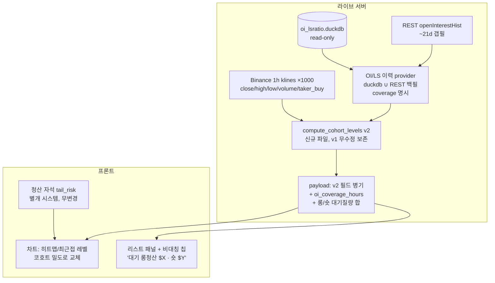

# 청산맵 v2 설계 — OI 코호트 + 방향 분리 + 롱/숏비 틸트 (2026-08-25)

사용자 요청: "여기에 OI, 거래량, 롱/숏 비율 등을 좀 더 넣어서 고급화해야해."
대상: `scripts/live_liquidation_map_20260824.py`(추정 모듈) → `dashboard/server.py::load_liquidation_map()` → `dashboard/live/app.js`(차트 오버레이 + 리스트 패널).

## 0. 배경과 판단 기준

- 현행 v1(이벤트드리븐)은 오늘(08-25) 4연속 검정(dwell-filter / MIN_FLOOR_HOURS 스윕 / Osler 돌파가속 / 거래량·실청산 집중)에서 전부 placebo 대비 우위 입증 실패. 단, 이 패널의 지위는 원래부터 "재량 참고용 추정"이고, 대시보드 노출 기준은 경제성(PnL)이 아니라 **통계적 정보성**이다(08-25 확정 원칙).
- 따라서 v2의 목표는 두 겹이다:
  1. **추정의 물리적 원리 개선** — 지금은 "거래량 = 포지션"이라는 가장 약한 가정 위에 서 있다. OI(실측 포지션 총량)가 공개돼 있는데 안 쓰는 상태.
  2. **v1 대비 정보성 비교 검증** — 기존 하네스(placebo 대조)로 v1 vs v2를 같은 지표에서 A/B. v2가 OOS에서 v1보다 못하면 배포하지 않는다(원리가 좋아도 결과가 나쁘면 v1 유지).

## 1. v1의 약점 진단 (무엇을 왜 바꾸나)

| # | v1 가정 | 문제 | v2 대체 |
|---|---|---|---|
| W1 | 모든 캔들 종가 = 가상 진입, **거래량**만큼 | 거래량은 포지션 개설과 청산·단타 왕복을 구분 못함. 거래량 많은 봉 ≠ 포지션 많이 쌓인 봉 | **ΔOI⁺** = 그 봉에 실제로 순증한 포지션량(ETH)만 진입 질량으로 |
| W2 | 240h 반감기 **시간감쇠**로 "아직 열려있음" 근사 | 임의 상수. 포지션은 시간이 아니라 청산/이익실현으로 닫힘 | **ΔOI⁻ pro-rata 생존감쇠** = OI가 실제로 줄어든 만큼만 기존 코호트 축소 |
| W3 | 롱/숏 **대칭** 배분 (양쪽 동일 가중) | 실제 포지셔닝은 비대칭 (롱/숏 계정비 존재, taker 쏠림 존재) | **taker 불균형 + 글로벌 롱/숏 계정비**로 봉별 롱/숏 분할 |
| W4 | **하드 윈도우** [24h,168h] + 리셋 상태머신 | 윈도우 경계는 임의값 — 오늘 MIN_FLOOR_HOURS 스윕도 OOS 기각. 창 밖 생존 포지션은 구조적으로 누락 | 코호트 생존이 자연 lookback을 만듦 — **윈도우/리셋 상태머신 자체를 제거** (가용 이력 전체에서 OI 감쇠가 알아서 오래된 질량을 지움) |
| — | 레버리지 6티어 균등, flat MMR | 실제 티어 분포 데이터 없음 | **변경 안 함** (근거 없는 자유도 추가 금지 — 명시적 비목표) |

거래량이 사라지는 게 아니라 역할이 바뀐다: (a) taker 분할의 분모, (b) `|ΔOI| ≤ volume` 정합성 클램프(계약 수 기준으로 위반 불가능한 항등식 — 위반 = 데이터 결함 → 클램프+플래그), (c) OI 결측 구간 폴백 가중.

## 2. v2 수식 (사다리 3단, 사전등록)

1h 봉 기준 (5m metrics를 시간 종료 라벨로 리샘플, i번째 봉):

**v2a — OI 코호트 (핵심)**
```
ΔOI_i = OI_i − OI_{i−1}                    # ETH 계약 단위 (sum_open_interest)
ΔOI_i > 0 → 신규 코호트: 진입가 close_i, 질량 ΔOI_i (표시가중 = ΔOI_i × close_i USD)
ΔOI_i < 0 → 전 코호트 일괄 생존감쇠: survival ×= OI_i / OI_{i−1}
청산가 공식/티어/bin은 v1 그대로 (compute_raw_bins의 long_liq/short_liq 식, levels_from_bins 재사용)
이미 뚫린 레벨 제거(future high/low 교차)도 v1 그대로 유지
```
근사의 한계(문서화): 교차제거와 pro-rata 감쇠는 부분적으로 같은 청산을 이중 반영할 수 있다 — 교차제거 우선 적용 후 잔여에 pro-rata. 추정치의 정직한 근사로 명기.

**v2b — 방향 분리 (+taker)**
```
long_share_i = clip(taker_buy_base_i / volume_i, 0.1, 0.9)   # 자유 파라미터 없음
ΔOI_i⁺ 를 long_share/1−long_share로 롱/숏 코호트에 분배
```
근거: OI 증가분의 공격측(시장가) 개설 주체가 taker — 4분면 해석(가격↑+OI↑=신규롱 등)이 이 식에 자동 내포. taker_buy_base는 서버가 이미 받는 klines 컬럼(현재 버려짐) — 추가 페치 0.

**v2c — 롱/숏 계정비 틸트 (+L/S ratio)**
```
long_share_i = 0.5 × taker_share_i + 0.5 × long_account_frac_i   # 고정 50:50 블렌드, 스윕 없음
long_account_frac = global_ls_long_account (계정의 몇 %가 롱인지, 직접 관측값)
```
근거: 글로벌 계정비 3:1이면 소액 리테일 롱이 다수 → 가까운 롱청산 밀도↑. 계정 수 기반이라 노셔널과 다르다는 한계 명기(그래서 계수 없는 50:50 고정 블렌드만).

**하이브리드(조건부 예비안)**: v2a가 v1에 지고 원인이 "윈도우리스라서"로 진단될 때만, v1 이벤트드리븐 리셋 골격에 가중만 코호트로 바꾼 변형을 1회 추가 검토. 기본 사다리엔 없음.

## 3. 데이터 소스 지도

| 용도 | 소스 | 커버리지 | 비고 |
|---|---|---|---|
| 백테스트 OI+L/S | `data/TOTAL_ETHUSDT_metrics_2024_2026.csv` | 2024-01~전일, 5m | 08-23 무결성 감사 완료본(+5분 종료라벨 보정 완료). 컬럼: sum_open_interest(_value), count_long_short_ratio(=글로벌 계정비), sum_toptrader_long_short_ratio, sum_taker_long_short_vol_ratio |
| 백테스트 가격 | 오늘 concentration 스크립트의 4.7y 조립 레시피 재사용 | 2021~2026 | metrics와 교집합 → 실효 백테스트 창 **2024-01~2026-08 (~2.6y)** |
| 라이브 OI+L/S | `data/live/oi_lsratio.duckdb::oi_lsratio_5m` (read-only) | 2026-08-22~, 5m, 성장 중 | writer=oi_lsratio_collector.py 단독(단일 writer 원칙). 서버가 read-only로 읽는 전례 이미 있음(`live_oi_delta_signal_20260824.py`, 락 경합 재시도 포함) |
| 라이브 OI 백필 | Binance REST `/futures/data/openInterestHist` period=1h | **~500포인트 ≈ 21일**(실측, collector docstring) | duckdb 커버리지가 얇은 초기에 갭 메움 |
| 라이브 taker | 서버가 이미 받는 1h klines의 taker_buy_base | 41.6일 | 캐스트만 추가하면 됨 |
| 실청산(보조 검증) | `tail_risk.duckdb::tail_risk_1m` | 2026-07-18~ (~37일) | 비교지표 전용, 코어 주입 안 함 |

라이브 OI 이력 = **duckdb ∪ REST 백필** 통합 provider, payload에 `oi_coverage_hours` 명시(조용한 대체 금지 원칙). ~~백테스트에서 실효 깊이를 측정해 조건부 결정~~ → **Phase 0에서 확정: 아카이브 시드 필수.** 생존 질량 중 21일(REST 한계)보다 오래된 비중이 중앙값 34.7%/최대 55.7% — REST만으론 맵의 1/3~1/2이 누락된다. Provider 깊이 목표 **90일**(질량 age p95 중앙값 59일, 최대 85일), klines도 1000→3000봉(3회 페치)으로 확장, 90일 절단분은 `truncated_mass_pct`로 payload에 명시.

## 4. 아키텍처



- **v1 파일 무수정**: v2는 새 파일 `scripts/live_liquidation_map_v2_20260825.py` (compute_raw_bins의 청산가 공식·levels_from_bins는 import 재사용). v1은 A/B 대조군 + 롤백 경로로 보존.
- **서버**: `load_liquidation_map()`에 provider 추가, v2 결과를 별도 키로 병기 → 검증 후 프론트 교체 → 안정되면 v1 계산 제거. `server.py` import 변경이므로 재시작 필요.
- **청산 자석(마젠타선)은 완전 별개** — 이번 작업에서 건드리지 않음.

## 5. 검증 계획 (사전등록)

- **하네스**: `research_eth_liquidation_map_event_driven_reset_20260824.py`의 `simulate()/evaluate()` 골격 재사용, compute 함수만 주입식으로 교체. placebo = 기존 거리매칭 방식 그대로.
- **비교군**: {v1(현행), v2a, v2b, v2c} + 각각의 placebo. 사다리 3단 외 파라미터 스윕 금지 (전례: 오늘 MIN_FLOOR_HOURS 스윕이 TRAIN 유망 → OOS 기각으로 끝남 — 같은 함정 반복 안 함).
- **split**: 스냅샷 t0 기준 TRAIN 첫 80% / OOS 마지막 20% (오늘 min_floor 스윕과 동일 규약, ~2.6y → OOS ~6개월).
- **1차 지표**: 터치 후 반응 win-rate(vs placebo), hold rate, 터치 후 magnitude. **채택 게이트: OOS에서 v2 ≥ v1 이고 placebo 초과**. 사다리에서 OOS 열화 없는 최고 단까지 채택. 전부 v1 이하면 REJECTED 기록하고 v1 유지.
- **2차 지표(서술적, 37일 한정)**: 실청산 밀도와의 가중 겹침(오늘 real_density_profile 재사용) v1 vs v2; v2b/c의 롱/숏 질량비 vs 이후 실현 롱/숏 청산$ 비율 상관.
- **인과성 체크리스트**: metrics 조인 오프셋은 `sum_open_interest_value ≈ sum_open_interest × close` 잔차 검사로 확증(live_oi_delta 검증법 재사용 — 08-23 "1버킷 미래참조" 사고 재발 방지), 5m→1h 리샘플은 시간 종료 라벨, duckdb/CSV/klines 타임존 3원 대조.

## 6. UX 변경안 (Phase 3)

- 배지: `고정 7일` → `OI코호트 · 커버리지 N일` (소스와 깊이를 정직하게).
- 신규 칩 1개만: **"추정 대기 롱청산 $X · 숏청산 $Y"** (한눈에 원칙 — 비대칭이 v2의 새 정보).
- 히트맵/레벨 강도 = 코호트 USD 노셔널 기반으로 자연 교체. 렌더 함수 시그니처 불변.
- 자세히 텍스트: 방법론 문단 교체 + 백테스트 결과를 결과 그대로(개선이든 v1 잔류든) 기재.
- 유의: v2는 윈도우리스라 "리셋까지 레벨 프리징" UX가 사라지고 매시 부드럽게 진화 — 5분 캐시라 체감 변화는 작을 것. `fixed7d_*` 병기 필드의 존폐는 배포 시점에 사용자 결정.

## 7. 명시적 비목표

- 자동매매 연결 금지(v1 docstring 원칙 승계 — 재량 참고용 지위 불변).
- 레버리지 티어 분포 추정 금지(데이터 없음), MMR 브래킷 정밀화 금지(서명 API 필요).
- 실청산(tail_risk) 코어 주입 금지 — 37일은 캘리브레이션에 너무 얇음. 수주 뒤 liq_magnet 검증과 함께 Phase 4로.
- 계수 튜닝/스윕 금지 — 모든 식은 파라미터리스 또는 고정 상수 사전등록.

## 8. 단계 계획

| Phase | 내용 | 규모 |
|---|---|---|
| 0 ✅ | **완료(08-25)** — `research_eth_liquidation_map_v2_phase0_data_audit_20260825.py`, 리포트 `data/research/…phase0_data_audit….json`. 조인 오프셋 확증(잔차 0.0056% at E−5min vs 0.096% at 0 — live_oi_delta 검증치 재현), 1h 조인 23,135봉/결측 0.07%, 아카이브↔REST 이음새 정확일치(0.0%), 서버 duckdb↔REST 정확일치(KST는 표시 tz일 뿐), taker 소스 동치(중앙값 차 0.035%p → klines taker_buy_base로 통일). **발견 2건**: ①아카이브에 OI=0 결측행 75개(정제규칙: OI≤0→ffill, 정제 후 ratio 이상치 0개 — v2 컴퓨트에 동일 가드 필수) ②실효 깊이가 REST 21일을 크게 초과(위 §3 표 아래 확정사항) | 반나절 |
| 1 ✅ | **완료(08-25) — 게이트 판정: REJECTED, v1 유지.** 아래 §9 | 1일 |
| 2 | 서버 provider + payload 병기 (v1 유지) | 반나절 |
| 3 | 프론트 교체 + 칩 + 캐비엇 + 배포검증(캐시버스터/served-byte) | 반나절 |
| 4 | (수주 후) 실청산 캘리브레이션 + 자석 데이터 합류 | 별도 |

Phase 1 게이트에서 전패 시 Phase 2~3은 진행하지 않고 결과만 기록 — "원리 개선이니 그냥 배포"는 하지 않는다(정보성 기준 원칙과 오늘 4연속 REJECTED의 교훈).

## 9. Phase 1 결과 (2026-08-25) — REJECTED, v1 유지

구현: `scripts/live_liquidation_map_v2_20260825.py`(순수 모듈, v1의 청산가공식/binning/levels_from_bins import 재사용) + `scripts/research_eth_liquidation_map_v2_cohort_ab_backtest_20260825.py`(A/B 러너). 동일 eval 그리드(72h 간격 290 스냅샷, 90일 워밍업), 동일 하네스(`ed.evaluate` 무수정), TRAIN 228/OOS 62 스냅샷(분할 2026-02-10). 전체 수치: `data/research/eth_liquidation_map_v2_cohort_ab_backtest_20260825.json`.

**OOS 요약 (버퍼 0.5%)**:

| 지표 | v1 | v2a | v2b | v2c |
|---|---|---|---|---|
| 지지 pairWR | 0.500 (7:7) | 0.533 (8:7) | 0.421 (8:11) | 0.688 (11:5) |
| 지지 hold 실제−placebo | −0.159 | **+0.054** | −0.063 | +0.046 |
| 지지 mag24/72 diff | −0.47/−0.46 | −0.04/−0.53 | −0.38/−0.20 | −0.21/−0.76 |
| 저항 pairWR | **0.556 (10:8)** | 0.286 (2:5) | 0.167 (1:5) | 0.286 (2:5) |
| 저항 hold 실제−placebo | +0.052 | +0.077 | −0.048 | −0.056 |
| 저항 mag24/72 diff | +0.23/+0.32 | +0.53/+0.02 | +0.24/−0.20 | +0.18/−0.39 |

**판정 근거**: 어떤 사다리 단도 OOS에서 v1을 일관되게 넘지 못함. 가장 근접한 v2a는 지지측이 개선됐지만(이 세션 최초로 지지가 placebo hold를 이김), v1의 유일한 검증된 강점이었던 저항 paired winrate가 10:8→2:5로 무너짐. v2c 지지 pairWR 0.688은 단일 최고 셀이나 magnitude가 음수(−0.76)이고 저항측이 placebo에 짐 — 셀 골라내기는 금지. **v2b/c는 TRAIN에서조차 저항 magnitude가 음수**(−0.67/−0.91)로 방향분리·계정비 틸트가 정보를 더한다는 증거 없음.

**검정력 캐비엇**: OOS 페어 카운트가 한자릿수(최대 10:8) — 이 차이들은 어느 방향으로도 유의하지 않다. 정확한 결론은 "v2가 낫다는 증거 없음 + 일부 셀 악화"이며, 사전등록 게이트대로 현직(v1) 유지. `ed` docstring이 인용한 infotime 교훈("리샘플/재가중만으로는 없는 정보가 생기지 않는다")의 5번째 재확인.

**부산물(유효)**: Phase 0의 데이터 정합 확증(조인 오프셋/이음새/taker 동치)과 OI=0 결측 75행 발견·정제규칙, 코호트 실효깊이 실측(21일 초과 질량 35~56%)은 이후 OI 관련 어떤 작업에도 재사용 가능. v2 모듈은 순수 함수로 레포에 남김(미배포).
