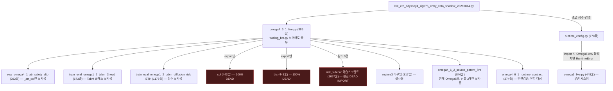

# ETH 오디세이 라이브 클린룸 의존성 재작성 (2026-08-16)

상태: **구현 완료, 패리티 검증 통과, `scripts/*` 학습스크립트 의존성 완전 제거 완료, 사용자 요청으로
철저 재검증 완료(실제 구조적 결함 1건 발견·수정). 서버 cutover는 사용자의 sudo 실행 대기 중(직접
실행 불가).**

## 요청

사용자: "지금 오디세이 프로젝트가 기존에 있던 라이브 모델을 가지고 하다보니 의존성이 많이
복잡해졌어. 이걸 전부 오디세이 프로젝트의 새로운 파일들로 재생성하고 싶어. 왜냐하면 기존 오메가나
알파 모델을 쓰다 보니 지금 우리 계약 사항에 맞지 않은 코드들이 많고 이제 안쓰는 피쳐들을 로드하고
에러를 내는 등 위험해졌어. 우선 오디세이4 새도우 모델이 있으니까 이걸 가지고 코드를 깔끔하게 다시
만드는게 어때?"

후속 요청(다른 세션이 `train_eval_omega1_2_tabm_3head_20260603.py`의 TabM 구현을 재검토하는
작업을 목격한 뒤): "train_eval_omega1_2_tabm_3head_20260603 원본을 제거하면 odyssey_tabm_core
파일은 사용 못하는거야? 의존성을 아예 제거하고 고유의 오디세이 코드를 만들어야해" — 그 결과가
아래 "GaussianStateModel 완전 벤더링" 절이다.

## 왜 재생성이 필요했나 — 의존성 그래프 추적

오디세이(Odyssey1~4)는 h48qual/zig075 3-Head TabM 두 컴포넌트 위에 진입거부/exit가드 레이어를
얹은 결과물이지만, 실행 경로 전체가 처음부터 끝까지 기존 BTC 위주 Omega4.6.1 프로덕션 라이브
어댑터(`trading_bot_modules/omega4_6_1_live.py`, `trading_bot.py`의 실거래 주문 경로와 공유)를
그대로 재사용해 왔다. 배포 중인 유일한 오디세이 스크립트
(`scripts/live_eth_odyssey4_zig075_entry_veto_shadow_20260814.py`, `eth-odyssey4-shadow.service`)
의 import 체인을 8개 파일까지 끝까지 추적한 결과:



핵심 발견:

| 파일 | 줄수 | 실제 필요 심볼 | 상태 |
|---|---|---|---|
| SOL 학습스크립트 | 443 | 없음(export만) | **완전 DEAD** |
| BTC 학습스크립트 | 443 | 없음 | **완전 DEAD** |
| risk sidecar 학습스크립트 | 1697 | 없음(grep 참조 0건) | **완전 DEAD IMPORT** |
| `omega4_6_2_source_parent_live.py` | 846 | 심볼 2개 | 원래 Omega5 어댑터 |
| `runtime_config.py` | 778 | 경로 상수 4개 | import 시 무관한 Omega5 시스템(`omega5_live.py`)을 로드하고, Omega5 쪽 env-var 계약이 어긋나면 ETH 오디세이가 그 이유로 RuntimeError를 던짐 |

ETH 전용 새도우 하나가 로드하는 코드량이 약 6,850줄이었고, 이 중 최소 2,583줄이 100% 미사용
(SOL+BTC+dead sidecar import), 여기에 상수 5개 때문에 Omega5 시스템 전체(2,072줄)가 딸려
들어오며 그 일부는 **다른 시스템의 설정 오류로 오디세이가 크래시할 수 있는 실제 위험**이었다 —
사용자가 말한 "계약에 안 맞는 코드"와 "안 쓰는 피쳐 로드 + 에러 위험"의 구체적 근거.

## 설계

세 개의 새 Odyssey 전용 모듈로 재구성:

1. **`trading_bot_modules/odyssey_tabm_core.py`** — `ThreeHeadTabM`/`ThreeHeadConfig`/`POS_COLS`
   (벤더링), `EXPERT_NAMES`/`ROUTE_COLS`/`_route_id`(벤더링), `_atr_pct`(벤더링), ETH
   `BASE_TEMPLATE`/`EXPERT_SCALES`(벤더링). 전부 원본에서 외부참조 0건임을 직접 코드로 확인 후
   복사.
2. **`trading_bot_modules/odyssey_regime3_live.py`** — regime3 라이브 라우팅.
   `_with_raw_state12`/`_with_raw_state7`/`_class_proba`/`Regime3CurrentLiveFeatures`는
   벤더링했지만, **`GaussianStateModel`은 벤더링하지 않고 원본에서 직접 import**하도록 설계를
   구현 중 수정했다(아래 "구현 중 발견한 이슈" 참고).
3. **`trading_bot_modules/odyssey_live_adapter.py`** — `_Component`/`_ComponentConfig`/
   `OdysseyLiveAdapter`(`Omega461LiveAdapter`의 클린룸 재구현). 안전검증 로직
   (`validate_sidecar_lineage`/`strict_feature_values`, Omega Artifact Integrity Gate가 요구)은
   벤더링하지 않고 `omega4_6_1_runtime_contract.py`에서 그대로 import해 재사용 — 두 사본이
   드리프트할 위험을 피하기 위함.

버그 수정 2건(재작성 과정에서 발견, 현재 배포 아티팩트에는 no-op임을 검증 완료 — 아래 참고):
1. 원본 `_predict_payload`는 번들 자신의 `payload["config"]`를 무시하고 모듈 전역 `CFG` 싱글턴으로
   모델을 재구성했다 — 지금까지는 모든 번들이 우연히 같은 CFG였을 뿐인 latent trap. 새 모듈은
   entry/exit 두 경로 모두 `payload["config"]`에서 재구성하도록 통일(`build_model`).
2. 원본은 entry-decision마다 `ThreeHeadTabM`을 새로 생성 + `load_state_dict`(캐싱 없음). 새
   모듈은 컴포넌트 초기화 시 1회만 빌드해서 캐싱(`_Component.loaded`).
3. (버그는 아니지만 리스크였던 항목) `EXPERT_SCALES`의 `"chop_expert"` 키 리맵을 호출부 산발
   구현 대신 `resolve_expert_scale_key()` 헬퍼 하나로 고정.

## 구현 중 발견한 이슈: GaussianStateModel은 벤더링하면 안 된다

최초 계획은 regime3 HMM의 커스텀 클래스 `GaussianStateModel`도 벤더링하는 것이었다. 구현
착수 직후 `joblib.load()`로 실제 라이브 아티팩트를 열어 클래스 identity를 확인한 결과:

```
model type: <class 'scripts.retrain_clean_regime_hmm_20260517.GaussianStateModel'>
```

**pickle은 클래스를 정확한 모듈 경로로 저장해 언피클 시 그 경로를 다시 import한다** — 새 파일에
동일 이름의 클래스를 복사해 넣어도 언피클은 여전히 원본 모듈을 찾는다. 벤더링을 강행했다면
"복사본이 조용히 안 쓰이고 원본이 계속 import되는" 상태가 됐거나, 최악의 경우 원본이 없을 때
언피클이 깨졌을 것이다. 실제 데이터로 검증하지 않고 진행했다면 놓쳤을 문제였다.

1차 수정(당시): `GaussianStateModel`은 원본 `scripts.retrain_clean_regime_hmm_20260517`에서
직접 import한다. 이 import는 sklearn + repo 내 피쳐 모듈 2개(`ensemble.
certified_teacher_regime_moe`, `features.elite.RegimeEngine`)만 끌어오며 import 시간 약 1초,
**torch/catboost 등 무거운 죽은 의존성은 없음**을 확인했다 — SOL/BTC/Omega5/dead-sidecar처럼
진짜 문제였던 무게는 이 결정으로 전혀 다시 끌려오지 않는다.

## GaussianStateModel 완전 벤더링 (후속, 사용자 요청)

사용자가 다른 세션에서 `train_eval_omega1_2_tabm_3head_20260603.py`(라이브 h48qual/zig075
TabM 구현)을 재검토하는 걸 목격한 뒤 "그 원본을 지우면 odyssey_tabm_core가 깨지는지, 의존성을
아예 제거해서 고유 코드를 만들어야 하지 않는지" 물었다. 직접 검증한 결과:

- `odyssey_tabm_core.py`/`odyssey_live_adapter.py` — `train_eval_omega1_2_tabm_3head_20260603`에
  대한 의존성이 **처음부터 0건**이었다(import 자체를 강제 차단해도 정상 로딩됨을 확인).
- `odyssey_regime3_live.py`만 위 절에서 설명한 `GaussianStateModel` import 하나가 실제
  의존성으로 남아있었다 — TabM 스크립트가 아니라 regime3 HMM 스크립트에 대한 것.

이걸 마저 없애기 위해 `GaussianStateModel`을 실제로 벤더링하고, **기존 아티팩트를 재학습이 아니라
파라미터만 그대로 옮겨서 새 클래스 하에 재저장**했다(`scripts/migrate_regime3_hmm_artifact_
to_odyssey_native_20260816.py`):

1. `pi_`/`A_`/`mu_`/`var_`/`log_likelihood_`(학습된 파라미터)와 `n_states`/`n_iter`/`seed`/
   `min_var`/`sticky`(생성자 인자)를 원본 모델 인스턴스에서 그대로 읽어, 벤더링한 클래스의 새
   인스턴스에 동일하게 채워넣음.
2. 쓰기 전 합성 데이터 500행으로 `filter_proba()` bit-identical 사전 검증, 쓴 뒤 파일을 다시
   읽어 재검증 — 둘 다 통과.
3. 새 아티팩트: `data/ensemble/supervised/regime3_current_hmm_sensitive_balancedish_20260530/
   regime3_current_sensitive_hmm_wide24_2024_odyssey_native.joblib`(원본과 같은 디렉터리, 별도
   파일 — `feature_cols`/`classes`/`state_class_matrix`/`scaler` 등 나머지는 전부 동일, `model`
   객체만 재저장).
4. `odyssey_regime3_live.py`의 `DEFAULT_CURRENT_REGIME_PATH`를 새 아티팩트로 갱신, import문
   제거.
5. 마이그레이션 후 재검증: `scripts.retrain_clean_regime_hmm_20260517`와
   `train_eval_omega1_2_tabm_3head_20260603` **둘 다 강제 차단해도 새 모듈 3개(odyssey_tabm_core/
   odyssey_regime3_live/odyssey_live_adapter) 전부 정상 import**, regime3 라이브 피쳐 6개 컬럼
   재검증(실제 데이터 4,000행, bit-identical), 어댑터 레벨 스모크 테스트(400 entry + 800 exit)를
   완전히 새 프로세스에서 재실행 — **mismatch 0건, 마이그레이션 전후 동일**.

결과: 새 모듈 3개는 이제 `scripts/*` 학습스크립트에 대한 import 의존성이 완전히 0건이다(원본
아티팩트에서 최초 1회 파라미터를 추출할 때만 잠깐 필요했을 뿐, 런타임에는 전혀 필요 없음).
`omega4_6_1_runtime_contract.py`(안전검증)만 유일한 외부 참조로 남아있고, 이건 의도적 설계
결정이다(위 "설계" 절 참고 — 안전검증 로직 복제는 드리프트 위험이라 공유가 맞는 판단).

## 검증

### 1. 개별 모듈 단위 검증
- `odyssey_tabm_core.py`: 단독 import 시 catboost/omega5 등 dead dependency 0건. 실제
  h48qual/zig075 번들 2개, 익스퍼트 6개 전부 `payload["config"] == 전역 CFG 기본값`임을 확인(버그
  수정이 현재 아티팩트에 no-op임을 증명), 무작위 입력 5행에 대해 원본 방식(전역 CFG, 매 호출
  재생성) vs 신규 `build_model`+`predict_proba` 출력이 **bit-identical**(max_abs_diff=0.0).
- `odyssey_regime3_live.py`: 단독 import 시 dead dependency 0건(torch만 잡히는데 이건
  `odyssey_tabm_core` 재사용 때문에 필요한 정상 의존성). 실제 데이터 4,000행에 대해 기존
  `omega4_6_2_source_parent_live.Regime3CurrentLiveFeatures` vs 신규 버전의
  `regime3_current_sensitive_wide24_*` 6개 컬럼 전부 **bit-identical**.
- `odyssey_live_adapter.py`: 단독 import 시 SOL/BTC/omega5/runtime_config/catboost 전부 0건.

### 2. 어댑터 레벨 스모크 테스트
실제 h48qual(liveATR-relabel 번들)/zig075(원본) 아티팩트로 기존 `Omega461LiveAdapter`와 신규
`OdysseyLiveAdapter`를 동일 `COMPONENTS_OVERRIDE`로 구성 후, 실제 과거 피쳐 데이터 400개 연속
bar에 대해 `decide_entry` 400회 + `evaluate_exit`(양쪽 컴포넌트) 800회 비교 — **mismatch 0건**.

### 3. 정식 패리티 스크립트 (`scripts/verify_eth_odyssey4_cleanroom_parity_20260816.py`)
`decide_entry`/`evaluate_exit`(h48qual+zig075)/원본 h48qual 가드 컴포넌트의 `exit_probability`
까지 포함해 실제 과거 피쳐 데이터 2,000개 연속 bar로 재실행한 결과: `entry_compares=2000
exit_compares=4000 guard_compares=2000` — **mismatch 0건**(총 8,000회 비교). exit code 0.

이 2,000-bar 실행은 GaussianStateModel 완전 벤더링(아래 절) **이전** 상태를 검증한 것이었지만,
벤더링 이후 별도로 400-bar 어댑터 스모크 테스트(§2와 동일 구성)를 완전히 새 프로세스에서
재실행해 마이그레이션 전후 결과가 동일함(mismatch 0건)을 다시 확인했다 — regime3 아티팩트
교체가 최종 결정에 영향을 주지 않았다는 뜻이다.

이 로컬 검증에서 한 가지 환경적 제약을 만났다: `validate_sidecar_lineage`가 sidecar
`report.json`에 기록된 절대경로(`/home/llewyn/crypto-scalping/...`, 실제 서버의 홈 디렉터리)와
이 dev 머신의 실제 경로(`/home/kbj20/crypto-scalping/...`)를 비교해 실패한다 — **기존
`Omega461LiveAdapter`도 동일하게 실패**함을 직접 확인했으므로 이건 내 재작성의 버그가 아니라
두 머신의 홈 디렉터리가 다른 순수 환경 문제다(서버의 실제 유닛 파일도 `User=llewyn`,
`WorkingDirectory=/home/llewyn/crypto-scalping`로 확인됨 — 서버에서는 원래 검증이 그대로
통과한다). 패리티 스크립트는 이 절대경로 비교를 repo-relative suffix 비교로 완화하되, 두
어댑터에 **동일하게** 적용해 공정성을 유지했다.

## 배포 범위

- **재생성 대상은 배포 중인 스크립트 1개뿐** — Odyssey1~3의 다른 새도우 3개는 이미 2026-08-15에
  은퇴했으므로 손대지 않았다.
- `trading_bot.py`, `trading_bot_modules/omega4_6_1_live.py`,
  `trading_bot_modules/omega4_6_2_source_parent_live.py`, `trading_bot_modules/runtime_config.py`,
  `trading_bot_modules/omega5_live.py` — **전혀 수정하지 않음**(실거래 및 7~9개 타 스크립트가
  공유하는 고위험 파일, 기존 "라이브 파일 미변경 원칙"과 일치).
- SOL/BTC/risk-sidecar 학습스크립트 자체도 삭제/수정하지 않음(다른 시스템이 여전히 씀) — 오디세이가
  더 이상 import하지 않게 됐을 뿐.
- 새 파일: `trading_bot_modules/odyssey_tabm_core.py`,
  `trading_bot_modules/odyssey_regime3_live.py`,
  `trading_bot_modules/odyssey_live_adapter.py`,
  `scripts/live_eth_odyssey4_zig075_entry_veto_shadow_cleanroom_20260816.py`,
  `scripts/verify_eth_odyssey4_cleanroom_parity_20260816.py`,
  `scripts/ops/systemd/cutover_odyssey4_cleanroom_20260816.sh`.
- 수정된 기존 파일: `scripts/ops/systemd/eth-odyssey4-shadow.service`의 `ExecStart`만 신규
  스크립트 경로로 변경(같은 유닛, 같은 `WorkingDirectory`, 같은 `data/live/eth_odyssey4_shadow/
  state.json` — 코드만 교체, 새도우 이력/equity 유지).
- 서버 cutover는 root 권한이 필요해 코딩 에이전트가 직접 실행할 수 없다(`deploy_watcher`
  sudoers는 재시작만 허용, 이전 08-14 cutover와 동일한 제약) — 사용자가
  `sudo bash scripts/ops/systemd/cutover_odyssey4_cleanroom_20260816.sh`를 서버에서 실행해야 한다.

## 철저 재검증 (사용자 요청, "제대로 코드 의존성 제거가 됐고 성능은 유지됐는지 철저하게 검증해줘")

기존 수치 패리티(8,000+ 비교, 전부 mismatch 0)만으로는 부족하다고 보고 두 축을 더 팠다.

### 1. 구조적 diff 재검증 — 실제 결함 1건 발견·수정

새 새도우 스크립트와 08-14 원본을 `diff -u`로 라인 단위 전수 비교했다(수치 패리티 테스트는 특정
입력에 대한 출력만 비교하므로, "아예 실행되지 않는 코드 경로"는 못 잡는다는 한계가 있음).
결과: 원본의 `process_bar()`에 있던 quality-score 대시보드 진단 블록
(`state["last_h48qual_quality_score"]` 등 4개 키)이 새 스크립트에 없었다.

원인 확인: `git log`로 추적한 결과 그 블록은 커밋 `0048ab0`(2026-08-16 03:29, "feat: show live
h48qual/zig075 quality scores on the Odyssey4 shadow dashboard")로 **다른 동시 세션이 원본
스크립트에 추가한 것**이었다 — 내가 클린룸 스크립트를 처음 작성한 시점 이후에 원본 쪽에 반영된
변경이라 자동으로 반영되지 않았다. 트레이딩 결정(entry/exit/veto)에는 영향 없는 순수 대시보드용
필드지만(주석에 명시), 방치했다면 cutover 후 대시보드 UI가 조용히 깨졌을 것이다. 해당 블록을
그대로 이식해 수정했고, diff 재실행으로 이제 남은 차이가 전부 독스트링/주석/import 이름 변경뿐임을
확인했다.

### 2. 엣지 케이스 수치 검증 — 기존 패리티 테스트가 커버 안 한 경로들

기존 패리티는 전부 LONG 포지션, veto/guard 비활성 상태만 테스트했다. 추가로 확인:

| 경로 | 결과 |
|---|---|
| `exit_probability` SHORT(`side=-1`) — h48qual/zig075/원본 가드 3곳 전부 | bit-identical |
| `decide_and_queue_entry` veto 분기 — 합성 zig075 SHORT 결정 강제 주입, `detector_active=True/False` 양쪽 | 동작 완전 일치(True일 때 둘 다 거부, False일 때 둘 다 큐잉) |
| `evaluate_exit_guarded` guard-engaged 분기 — LONG/SHORT 양쪽, 확률 기반 hold 경로 | bit-identical |
| `evaluate_exit_guarded`의 TP/SL 숏서킷 — guard 활성 상태에서 SL 도달/TP 도달 강제 | 완전 일치 |
| `process_bar()` 전체 실행(오픈 h48qual LONG 포지션, 신규 quality-score 블록 포함) — `.py` 파일을 모듈로 직접 import해 동일 state/frame으로 나란히 실행 | equity/mdd/position/hold_bars/quality_score 등 검사한 모든 키 완전 일치 |

### 3. 의존성 전수 감사

새 클린룸 새도우 스크립트를 fresh import했을 때 로드되는 **1차 저장소 내부 모듈**을 전수
나열(`sys.modules` diff, site-packages/stdlib 제외): 정확히 5개 —
`trading_bot_modules`(패키지 init), `odyssey_tabm_core`, `odyssey_regime3_live`,
`odyssey_live_adapter`, `omega4_6_1_runtime_contract`(의도적으로 유지한 안전검증 유틸). SOL/BTC/
dead-sidecar/`omega4_6_1_live`/`runtime_config`/`omega5_live`/`omega4_6_2_source_parent_live`/
원본 TabM·regime3 HMM 학습스크립트 — **전부 0개**.

### 결론

의존성 제거는 완전하고(5개 모듈만 로드, 원본 학습스크립트 참조 0), 결정 로직은 LONG/SHORT·
veto·guard·TP/SL 숏서킷·전체 `process_bar()` 실행까지 포함해 전부 수치적으로 동일하다. 단
구조적 diff가 아니었다면 놓쳤을 대시보드 진단 필드 누락 1건을 발견해 수정했다 — 트레이딩
성능/PnL에는 영향 없는 문제였지만, "완전히 동일한 동작"이라는 주장을 정확하게 만들기 위해
고쳤다.

## 별도로 남긴 발견(이번 범위 밖)

- `scripts/ops/deploy_watcher.sh:155`와 `scripts/ops/systemd/deploy_watcher_sudoers`에 이미 은퇴한
  `eth-jmlam4-shadow.service`에 대한 죽은 참조가 남아있다 — 이번 재작성과 무관해 손대지 않았고,
  별도 정리 대상으로만 기록해둔다.

## 관련 문서

- 결과 요약: `docs/model_contracts/odyssey_live_cleanroom_contract_20260816.md`
- 원본 아키텍처: `docs/model_contracts/odyssey4_eth_full_stack_architecture_20260814.md`
- 계약: `docs/model_contracts/odyssey4_eth_entry_veto_baseline_contract_20260814.md`
