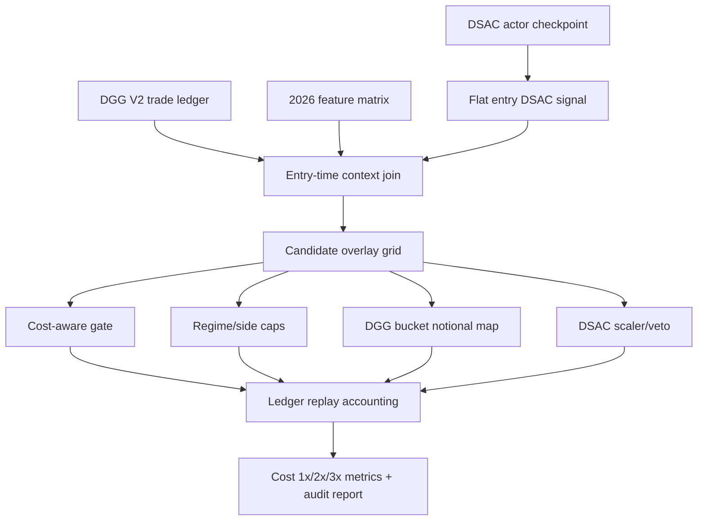

# Lifecycle Cost/Caps + DSAC Experiment 2026

## Purpose

Recent live audit ledger showed the current bot losing money mostly from over-gross sizing, cost drag, and one large long-side hard stop. This experiment replays the existing Deep Gated Gross V2 ledger with safer entry-time overlays:

- cost-aware entry gate
- regime/side asymmetric notional caps
- DGG bucket notional recalibration
- DSAC actor signal as an optional exposure scaler/veto

This run does not overwrite the existing DGG V2 artifacts and does not create new entries or exits. It compares risk/gate overlays on the same DGG V2 trade ledger.

## Architecture

## Files

- Script: `scripts/experiment_lifecycle_cost_caps_dsac_2026.py`
- Report: `data/ensemble/reports/lifecycle_cost_caps_dsac_experiment_2026.json`
- Grid: `data/ensemble/reports/lifecycle_cost_caps_dsac_experiment_2026_grid.csv`
- Selected replay ledger: `data/ensemble/reports/lifecycle_cost_caps_dsac_experiment_2026_selected_ledger.csv`
- Best PnL replay ledger: `data/ensemble/reports/lifecycle_cost_caps_dsac_experiment_2026_best_pnl_ledger.csv`
- Best DSAC alpha replay ledger: `data/ensemble/reports/lifecycle_cost_caps_dsac_experiment_2026_best_dsac_alpha_ledger.csv`

## Audit

Status: pass

Blocking issues: none

Important limits:

- This is a ledger replay, not a full retrain or new entry generator.
- 1x slippage is already embedded in `core_pnl_pct`; 2x/3x stress adds extra slippage drag and multiplies fees.
- Gates use entry-time predictions/features and DSAC actor signal aligned by `entry_idx`.

## Results

Baseline DGG V2 replay:

- Full cost 1x: PnL 796.06%, MDD -16.61%, trades 363, avg notional 3.54x
- Full cost 2x: PnL 48.73%, MDD -63.15%
- Full cost 3x: PnL -75.39%, MDD -90.52%
- Holdout cost 1x: PnL 99.09%, MDD -3.69%

Risk-first selected candidate: `cost_0.0020__caps_conservative`

- Full cost 1x: PnL 165.93%, MDD -3.99%, trades 275, avg notional 1.39x
- Full cost 2x: PnL 56.08%, MDD -11.00%
- Full cost 3x: PnL -8.44%, MDD -34.68%
- Holdout cost 1x: PnL 26.54%, MDD -1.26%

High-return DSAC candidate: `dsac_half_if_opposite_0.30`

- Full cost 1x: PnL 573.36%, MDD -14.56%, trades 363, avg notional 2.91x
- Full cost 2x: PnL 53.91%
- Full cost 3x: PnL -64.90%
- Holdout cost 1x: PnL 78.27%, MDD -3.69%

High-return cost+DSAC candidate: `cost_0.0035__dsac_half_if_opposite_0.50`

- Full cost 1x: PnL 661.28%, MDD -13.55%, trades 323, avg notional 3.09x
- Full cost 2x: PnL 88.03%
- Full cost 3x: PnL -53.66%
- Holdout cost 1x: PnL 90.63%, MDD -3.69%

MDD-focused cost+DSAC candidate: `cost_0.0035__dsac_half_if_opposite_0.30`

- Full cost 1x: PnL 618.29%, MDD -12.77%, trades 323, avg notional 2.90x
- Full cost 2x: PnL 93.45%
- Full cost 3x: PnL -48.00%
- Holdout cost 1x: PnL 78.27%, MDD -3.69%

## Model/Data Architect Conclusion

Do not promote the risk-first selected candidate as the only live alpha model if the objective is maximum PnL. It is useful as a live drawdown safety preset because it cuts MDD sharply and survives cost 2x.

For alpha recovery with DSAC included, promote only as a candidate branch:

- `cost_0.0035__dsac_half_if_opposite_0.50` is the alpha-first DSAC branch: lower PnL than baseline but better MDD and cost stress.
- `cost_0.0035__dsac_half_if_opposite_0.30` is the safer DSAC branch: still above 500% PnL with better MDD and 2x/3x stress than the 0.50 branch.
- It should remain behind a feature flag because 3x cost stress still fails.
- The next improvement should combine DSAC half-opposite scaling with a mild drawdown throttle, not the conservative cost gate, because the conservative gate removes too much alpha.
