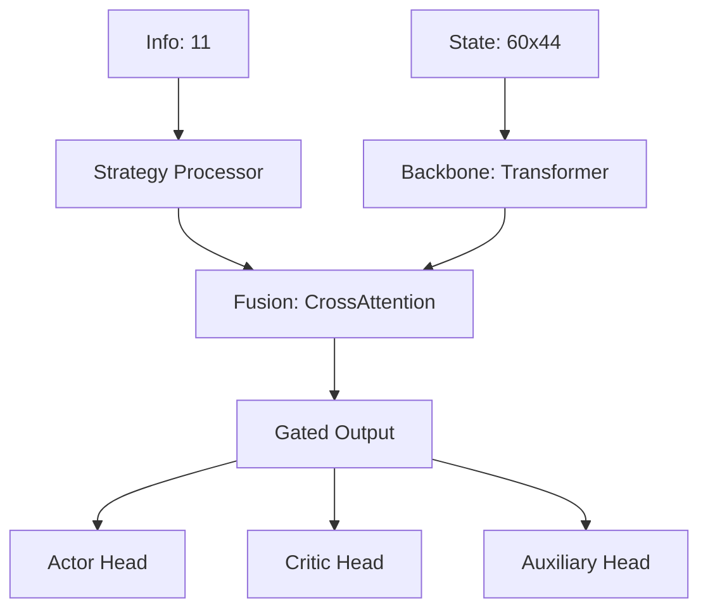
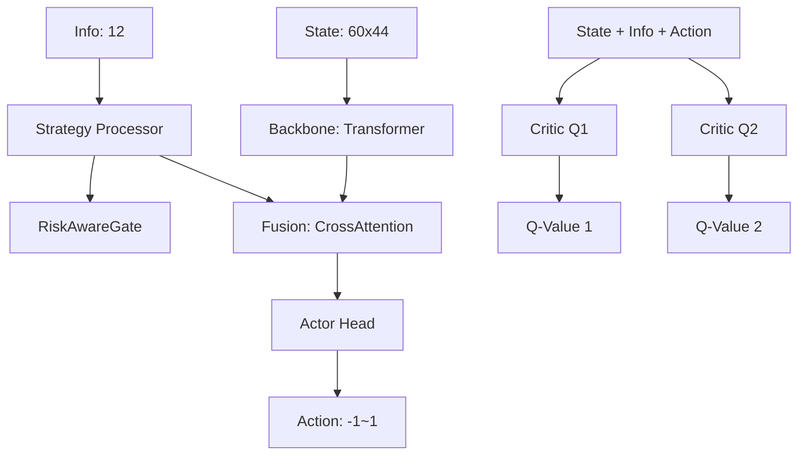

# 모델 아키텍처 명세

## 📋 개요

본 프로젝트는 **PPO (Proximal Policy Optimization)**와 **TD3 (Twin Delayed DDPG)** 두 가지 강화학습 알고리즘을 사용하여 암호화폐 트레이딩 에이전트를 학습합니다.

- **PPO**: 3-Action 이산 공간 (Hold, Buy, Sell)
- **TD3**: 연속 행동 공간 (-1 ~ 1, 포지션 크기)

---

## 🏗️ 공통 아키텍처 컴포넌트

### 1. QuantTransformerBackbone

**경로**: `macroHFT/xlstm_network.py`

**역할**: 시계열 데이터를 Transformer로 처리하여 고차원 표현을 추출

**구조**:
```python
Input: (Batch, SeqLen=60, StateDim=44)
  ↓
Embedding Layer (44 → HiddenDim=256)
  ↓
Positional Encoding (Sinusoidal for Tactical, Learnable for Strategic)
  ↓
CLS Token 추가
  ↓
Transformer Encoder (4 Heads, 2~3 Layers, Pre-LN)
  ↓
Output: 
  - context: (Batch, HiddenDim) - CLS Token
  - seq_encodings: (Batch, SeqLen+1, HiddenDim) - 전체 시퀀스
```

**모드 차이**:
- **Tactical (PPO)**: Sinusoidal PE + Decay Mask (미래 정보 차단)
- **Strategic (TD3)**: Learnable PE + No Decay

**핵심 파라미터**:
- `hidden_dim`: 256
- `n_heads`: 4
- `n_layers`: 2 (PPO), 3 (TD3)
- `dropout`: 0.1

---

### 2. StrategyInteractionLayer

**경로**: `macroHFT/xlstm_network.py`

**역할**: Elite 8 전략 간 상호작용 모델링

**구조**:
```python
Input: (Batch, 8)  # Elite 8 전략 신호
  ↓
Self-Attention (1 Head)
  ↓
Correlation Matrix (8x8)
  ↓
MLP (8 → 32 → 64)
  ↓
Output: (Batch, 64)  # 전략 임베딩
```

**핵심 아이디어**:
- 8개 전략 신호를 단순 concat이 아닌 self-attention으로 융합
- 전략 간 상관관계를 학습하여 더 robust한 표현 생성

---

### 3. CrossAttentionFusion

**경로**: `macroHFT/xlstm_network.py`

**역할**: Transformer 시퀀스 출력과 전략/포지션 정보를 융합

**구조**:
```python
Query: (Batch, QueryDim=67 or 68)
  - PPO: Strategy(64) + PosInfo(3) = 67
  - TD3: Strategy(64) + PosContext(3) + Volatility(1) = 68
  
Key/Value: Sequence Encodings (Batch, SeqLen+1, HiddenDim)
  ↓
Multi-Head Attention (4 Heads)
  ↓
Output: (Batch, HiddenDim=256)
```

**핵심 아이디어**:
- 가격/피처 시퀀스(Key)와 전략/포지션 상태(Query)를 Cross Attention으로 융합
- 현재 시장 상황에 맞는 과거 패턴을 동적으로 선택

---

## 🤖 PPO 모델 아키텍처

### 전체 구조



### XLSTMNetwork 상세

**경로**: `macroHFT/xlstm_network.py`

**입력**:
- `x`: (Batch, 60, 44) - 과거 60틱 가격/피처 데이터
- `info`: (Batch, 11) - 전략 신호 + 포지션 정보
  - `pos_val` (1): 현재 포지션 방향 (-1, 0, 1)
  - `strategies` (8): Elite 8 전략 신호
  - `pos_meta` (2): 포지션 메타데이터

**출력**:
- `logits`: (Batch, 3) - 행동 확률 (Hold, Buy, Sell)
- `val_mean`: (Batch, 1) - 상태 가치 (평균)
- `val_cvar`: (Batch, 1) - CVaR 가치 (리스크 조정)
- `aux_val`: (Batch, 1) - 보조 가치 (regularization)
- `next_states`: Hidden states for LSTM
- `gate_mean`: float - Gate 활성화 평균

**Forward 흐름**:
```python
1. Backbone (Transformer)
   x → context, seq_encodings
   
2. Info Processing
   info → pos_val, strategies, pos_meta
   strategies → strat_features (64-dim)
   
3. Query Vector 생성
   query = [strat_features(64), pos_info(3)] = 67-dim
   
4. Cross Attention Fusion
   fused_context = CrossAttention(seq_encodings, query)
   
5. Gated Output
   gate = Sigmoid(Linear(fused_context))
   final_repr = fused_context * gate
   
6. Multi-Head Outputs
   logits = Actor(final_repr)      # (B, 3)
   val_mean = Critic(final_repr)   # (B, 1)
   val_cvar = CVaR(final_repr)     # (B, 1)
   aux_val = Aux(final_repr)       # (B, 1)
```

### PPOAgent (MoE 구조)

**경로**: `macroHFT/ppo_agent.py`

**Mixture of Experts (MoE) 설계**:
```python
3개 Expert Networks (Trend, Volatility, Sideways)
  ↓
Router Network (전략 신호 기반 라우팅)
  ↓
Weighted Ensemble
```

**구조**:
1. **Experts** (3개 XLSTMNetwork)
   - Trend Expert: 추세 시장 특화
   - Volatility Expert: 변동성 시장 특화
   - Sideways Expert: 횡보 시장 특화

2. **Router**:
   ```python
   Input: (Batch, 44) - State Sequence 마지막 타임스텝
     ↓
   MLP (44 → 128 → 64 → 3)
     ↓
   Softmax
     ↓
   Output: (Batch, 3) - Expert Weights
   ```

3. **학습 프로세스**:
   - **Expert 학습**: 각 Expert를 개별 학습 (Curriculum Learning)
   - **Router 학습**: Expert 출력 고정, Router만 학습

**최적화**:
- **AMP (Mixed Precision)**: FP16 연산으로 메모리 50% 절감
- **Torch Compile**: PyTorch 2.0 그래프 최적화
- **GradScaler**: Mixed Precision 안정화

---

## 🎯 TD3 모델 아키텍처

### 전체 구조



### PositionAwareActor

**경로**: `TD3/td3_network.py`

**입력**:
- `x`: (Batch, 60, 44) - 피처 시퀀스
- `info`: (Batch, 12) - 전략 + 포지션 + 변동성
  - `pos_val` (1): 현재 포지션
  - `strategies` (8): Elite 8
  - `pos_meta` (2): PnL, Hold Duration
  - `volatility` (1): 시장 변동성

**출력**:
- `scaled_action`: (Batch, 1) - 연속 행동 (-1 ~ 1)
- `next_states`: Hidden states
- `gate_mean`: Risk Gate 활성도

**Forward 흐름**:
```python
1. Backbone (Strategic Mode)
   x → seq_encodings
   
2. Info Decomposition
   info → pos_val, strategies, pos_meta, volatility
   pos_context = [pos_val, pos_meta] (3-dim)
   
3. Risk Gate
   gate_input = [pos_context, volatility] (4-dim)
   gate = RiskAwareGate(gate_input)
   # 손실 구간 페널티: PnL < -2% → gate ≈ 0
   
4. Strategy Processing
   strat_features = StrategyProcessor(strategies) (64-dim)
   
5. Query Vector
   query = [strat_features(64), pos_context(3), volatility(1)] = 68-dim
   
6. Fusion
   fused_repr = CrossAttention(seq_encodings, query)
   
7. Action Scaling
   raw_action = Tanh(MLP(fused_repr))
   scaled_action = raw_action * (0.1 + 0.9 * gate)
```

**RiskAwareGate**:
```python
Input: (pos_context, volatility) = 4-dim
  ↓
MLP (4 → 32 → 16 → 1)
  ↓
Sigmoid (base_gate)
  ↓
Loss Penalty: if PnL < -2%:
  penalty = 0.5 * exp(PnL * 10)
  ↓
gate = base_gate * penalty
```

### TD3Critic (Twin Q-Networks)

**경로**: `TD3/td3_network.py`

**입력**:
- `x`: (Batch, 60, 44)
- `info`: (Batch, 12)
- `action`: (Batch, 1)

**출력**:
- `q1`: (Batch, 1) - Q-Value 1
- `q2`: (Batch, 1) - Q-Value 2

**구조**:
```python
1. Backbone + Fusion (Actor와 동일)
   → state_repr (Batch, HiddenDim)
   
2. Q-Networks (Twin)
   q1_input = [state_repr, action]
   q2_input = [state_repr, action]
   
   Q1: Linear(257 → 256) → LayerNorm → GELU → Linear(256 → 1)
   Q2: Linear(257 → 256) → LayerNorm → GELU → Linear(256 → 1)
   
3. Clipping
   q1 = clamp(q1, -1.0, 1.0)
   q2 = clamp(q2, -1.0, 1.0)
```

### TD3Agent

**경로**: `TD3/td3_agent.py`

**핵심 알고리즘**:
1. **Actor**: Deterministic Policy
2. **Critic**: Twin Q-Networks (Q1, Q2)
3. **Target Networks**: Soft Update (τ=0.005)
4. **Policy Noise**: Exploration Noise
5. **CQL (Conservative Q-Learning)**: OOD Action 페널티

**학습 루프**:
```python
1. Sample Batch from Replay Buffer
2. Critic Update:
   - Target Q = min(Q1_target, Q2_target)
   - Critic Loss = MSE(Q1, Target) + MSE(Q2, Target)
   - CQL Loss = LogSumExp(Q_random) - Q_current
3. Actor Update (Delayed, every 2 critic updates):
   - Actor Loss = -Q1(state, actor(state))
4. Soft Target Update:
   - θ_target ← τ*θ + (1-τ)*θ_target
```

---

## 📊 피처 명세

### Ultimate Features (44개)

**경로**: `common/feature_engineering.py`

#### Group A: Smart Money & Sentiment (Alpha) - 5개
```python
'whale_retail_ratio'    # 고래/리테일 거래량 비율
'whale_conviction'      # 고래 신뢰도 (대량 거래 지속성)
'smart_money_flow'      # 스마트머니 유입/유출
'funding_pressure'      # 펀딩비 압력
'squeeze_power'         # 청산 압박 강도
```

#### Group B: Order Flow - 3개
```python
'net_taker_ratio'       # Taker Buy - Taker Sell 비율
'taker_acceleration'    # Taker 거래량 가속도
'trade_intensity'       # 거래 강도 (거래 빈도)
```

#### Group C: Technical - 11개
```python
'log_return'            # 로그 수익률
'volatility_z'          # 변동성 Z-Score
'rsi'                   # Relative Strength Index
'macd_hist'             # MACD Histogram
'bb_width'              # Bollinger Band Width
'bb_width_z'            # BB Width Z-Score
'vwap_dist'             # VWAP와의 거리
'hma_slope'             # Hull Moving Average 기울기
'wick_ratio'            # 꼬리/몸통 비율
'btc_corr_60'           # BTC 상관계수 (60틱)
'eth_btc_ratio_change'  # ETH/BTC 비율 변화
```

#### Group D: Market Structure - 2개
```python
'fvg_dist'              # Fair Value Gap 거리
'chop_index'            # Choppiness Index (횡보 지수)
```

**전처리**:
- **결측치**: Forward Fill → Backward Fill → Drop
- **Infinity**: Replace with NaN → Drop
- **정규화**: Z-Score (trading_env.py에서 처리)

---

## 🎮 Elite 8 전략

**경로**: `strategies/`

| # | 전략 이름 | 신호 범위 | 설명 |
|---|----------|----------|------|
| 1 | WhaleSentimentDivergence | -1 ~ 1 | 고래와 리테일 감성 괴리 |
| 2 | LiquidationSqueezeHunter | -1 ~ 1 | 청산 연쇄 감지 |
| 3 | OrderblockFVGStrategy | -1 ~ 1 | 오더블록 + FVG 패턴 |
| 4 | NetTakerFlowStrategy | -1 ~ 1 | Taker 순매수 흐름 |
| 5 | BTCEthCorrelation | -1 ~ 1 | BTC-ETH 상관관계 이탈 |
| 6 | VolatilitySqueeze | -1 ~ 1 | 변동성 압축 후 돌파 |
| 7 | VWAPDeviation | -1 ~ 1 | VWAP 이탈 정도 |
| 8 | HMAMomentum | -1 ~ 1 | HMA 모멘텀 변화 |

**신호 통합**:
- 각 전략은 -1 (강한 약세) ~ 1 (강한 강세) 신호 생성
- `StrategyInteractionLayer`에서 8개 신호를 융합하여 64-dim 임베딩 생성

---

## ⚙️ 하이퍼파라미터

### PPO
```python
GAMMA = 0.99                # Discount Factor
LAMBDA = 0.95               # GAE Lambda
EPS_CLIP = 0.2              # Clipping Range
K_EPOCHS = 10               # PPO Epochs
LEARNING_RATE = 3e-4        # Learning Rate (Experts: 1.5e-4)
ENTROPY_COEF = 0.01         # Entropy Bonus
```

### TD3
```python
GAMMA = 0.99                # Discount Factor
TAU = 0.005                 # Soft Update
POLICY_NOISE = 0.2          # Target Policy Smoothing
NOISE_CLIP = 0.5            # Noise Clipping
POLICY_FREQ = 2             # Delayed Policy Update
LEARNING_RATE = 1e-4        # Learning Rate
CQL_ALPHA = 0.5             # CQL Loss Weight
```

### Common
```python
LOOKBACK = 60               # Sequence Length
NETWORK_HIDDEN_DIM = 256    # Transformer Hidden Dim
NETWORK_NUM_LAYERS = 2      # PPO: 2, TD3: 3
NETWORK_DROPOUT = 0.1       # Dropout Rate
BATCH_SIZE = 256            # Training Batch Size
BUFFER_SIZE = 100000        # Replay Buffer Size
```

---

## 🔧 최적화 기법

### 1. AMP (Automatic Mixed Precision)
- **FP16 연산**: 메모리 50% 절감, 속도 2배
- **GradScaler**: Gradient Scaling으로 안정성 확보
- **적용 범위**: Forward + Backward Pass

### 2. Torch Compile
- **PyTorch 2.0+**: 그래프 최적화
- **TorchInductor**: CUDA 최적화
- **적용 대상**: Experts, Router, Backbone

### 3. cuDNN Benchmark
- **자동 튜닝**: 입력 크기 고정 시 최적 알고리즘 탐색
- **TensorCore**: Ampere 아키텍처 활용 극대화

---

## 📈 모델 크기

| 모델 | 파라미터 수 (추정) | 메모리 (FP32) | 메모리 (FP16) |
|------|------------------|-------------|-------------|
| XLSTMNetwork (1개) | ~2.5M | ~10MB | ~5MB |
| PPOAgent (3 Experts + Router) | ~8M | ~32MB | ~16MB |
| TD3Agent (Actor + 2 Critics) | ~7.5M | ~30MB | ~15MB |

**GPU 요구사항**:
- **최소**: 4GB VRAM (Batch=128, FP16)
- **권장**: 8GB VRAM (Batch=256, FP16)
- **최적**: 12GB+ VRAM (Batch=512, FP32)

---

**작성일**: 2026-02-06  
**최종 업데이트**: AMP + Torch Compile 적용 후
