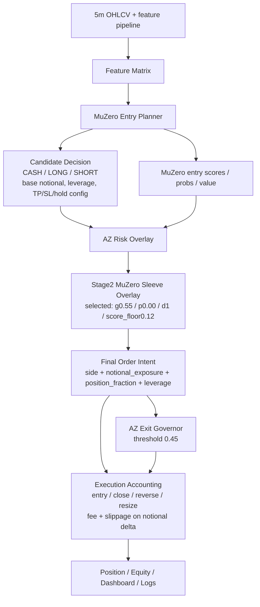

# Current Top Model: MuZero/AZ Stage2 + AZ Exit

Status: `current_rank_1_main_candidate`

Last updated: 2026-05-06 KST

## Scope

- Model id: `current_top_muzero_az_stage2_azexit_2026`
- Rank: `1`
- Purpose: canonical preservation of the currently verified highest-return main candidate.
- Source of truth: user-verified model summary on 2026-05-06 KST.
- Explicit exclusions: `Stage3 exit arbiter`, `Stage4 regime transition/regime overlay`, DSAC as entry owner.

This contract supersedes older references that treated the `467.64%` MuZero/AZ comparison run or DSAC pipeline as the top baseline. Those reports remain useful history, but new architecture loops must compare against this model unless the user explicitly changes the baseline.

## Architecture



## Layer Roles

| Layer | Role | Preserved implementation/artifact anchors |
|---|---|---|
| MuZero Entry Planner | Main entry owner. Decides entry/no-entry and direction. DSAC is not the entry owner for this baseline. | `scripts/train_eval_muzero_style_governor_2026.py`, `data/ensemble/supervised/muzero_style/mz_latent_governor.pt` |
| AZ Risk Overlay | First exposure correction over MuZero candidate positions. Scale buckets are `0.00`, `0.50`, `0.75`, `1.00`, `1.25`, `1.50`. | `scripts/train_eval_zero_style_risk_overlay_2026.py`, `data/ensemble/supervised/zero_style/az_risk_overlay.pt` |
| Stage2 MuZero Sleeve | Surviving second exposure correction after AZ risk. It adjusts notional exposure; it does not create fresh entry logic. Selected config: `gamma=0.55`, `prior=0.00`, `depth=1`, `score_floor=0.12`. | `scripts/train_eval_zero_style_remaining_layers_2026.py`, `data/ensemble/supervised/zero_style/mz_risk_overlay.pt` |
| AZ Exit Governor | Position-holding exit probability owner. Current verified threshold is `0.45`. | `scripts/train_eval_alphazero_style_governor_2026.py`, `data/ensemble/supervised/alphazero_style/az_policy_value_governor.pt` |
| Execution Accounting | Applies entry, close, reverse, and resize accounting with fee/slippage on notional delta. | `backtest_no_limit_exit` path used by comparison scripts |

## Verified Performance

| Metric | Value |
|---|---:|
| 2026 OOS PnL | `+752.65%` |
| MDD | `-18.76%` |
| Trades | `353` |
| Trades/day | `6.02` |
| Cost 2x PnL | `+279.36%` |
| Cost 3x PnL | `+75.84%` |

## Promotion/Comparison Baseline

All future architecture loops must treat this as the main baseline unless explicitly overridden.

New candidates must report at minimum:

```text
PnL > 752.65%
MDD better than -18.76%
Trades/day > 6.02
Cost 2x > 279.36%
Cost 3x > 75.84%
Stage3/Stage4 excluded unless explicitly reintroduced by the user
```

## Exclusion Rationale

`Stage3 exit arbiter` and `Stage4 regime overlay` are excluded from the current rank-1 candidate. They looked better in validation, but worsened MDD and return in the single 2026 OOS evaluation. They must not be silently reintroduced into the baseline.

## Red Team Notes

- Treat any reference to `467.64%` as an older comparison baseline, not the current rank-1 model.
- Verify that candidate comparisons exclude Stage3/Stage4 unless the experiment name explicitly says otherwise.
- Preserve cost 2x/3x survival as a hard gate; this baseline is already strong under cost stress.
