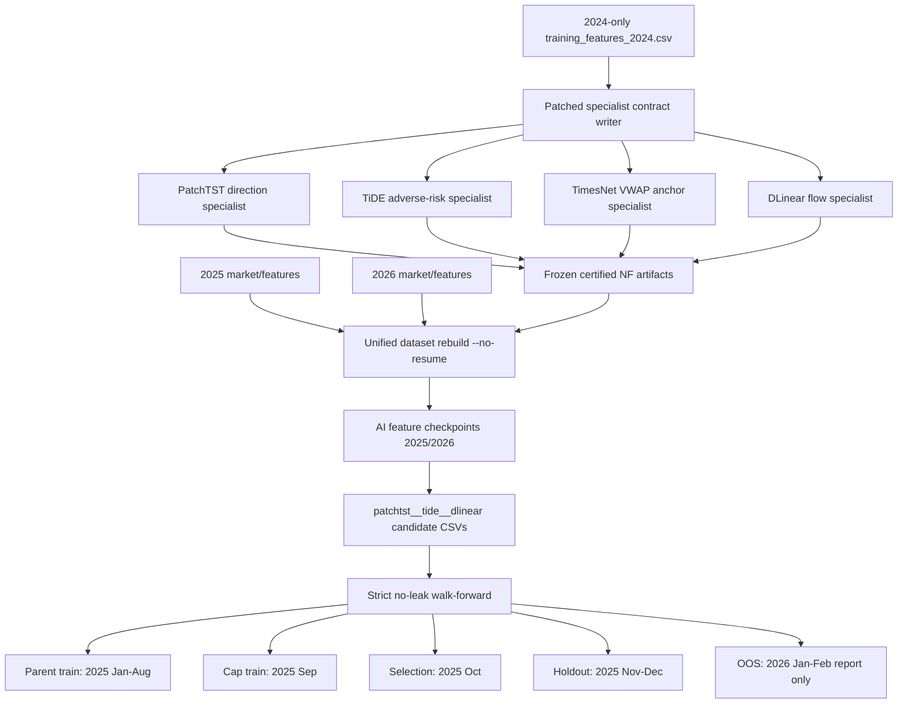

# AI Feature Memory Card - 2026-05-08

Purpose: lock the current certified AI feature state for future Model/Data Architect, Implementation Maintainer, and Red Team loops.

## Certified NeuralForecast Specialists

All four specialist artifacts were force-retrained on 2024-only data and now carry certified provenance in `specialist_contract.json`.

| Artifact | Model | Role | Target | Steps | Train years | Train range | Rows |
| --- | --- | --- | --- | ---: | --- | --- | ---: |
| `data/nf_patchtst` | PatchTST | direction | `y_dir_edge` | 400 | `[2024]` | `2024-01-01 00:00:00` -> `2024-12-31 23:55:00` | 105380 |
| `data/nf_tide` | TiDE | adverse excursion risk | `y_adverse_risk` | 200 | `[2024]` | `2024-01-01 00:00:00` -> `2024-12-31 23:55:00` | 105380 |
| `data/nf_timesnet` | TimesNet | VWAP anchor reversion | `y_vwap_dev` | 200 | `[2024]` | `2024-01-01 00:00:00` -> `2024-12-31 23:55:00` | 105380 |
| `data/nf_dlinear` | DLinear | flow persistence | `y_flow_pressure` | 200 | `[2024]` | `2024-01-01 00:00:00` -> `2024-12-31 23:55:00` | 105380 |

Certified flags:

- `artifact_training_provenance_certified=true`
- `expected_year=2024`
- `actual_years=[2024]`
- `allow_multi_year=false`
- 2025 and 2026 rows must only use these frozen 2024-trained artifacts for AI feature inference.

## Specialist Inputs

PatchTST, TiDE, and TimesNet share the same market-context input set:

```text
session_us, hour_cos, cvp_poc_dist, cvp_volume_imbalance, fvg_dist,
breakout_strength, oi_change_rate, ofti, kel, mta_funding, svps
```

DLinear uses flow/microstructure inputs:

```text
smart_money_flow, ofi_acceleration, cvp_volume_imbalance, whale_retail_ratio,
net_taker_ratio, taker_acceleration, volume, quote_volume,
taker_buy_base, taker_buy_quote
```

## Generated AI Feature Groups

Current strict experiment uses `patchtst__tide__dlinear`; TimesNet checkpoint is regenerated and available, but excluded from the selected combo CSV in this run.

PatchTST direction group:

- `ai_dir_edge`
- `ai_dir_p_up`
- `ai_dir_p_down`
- `ai_dir_p_flat`
- `ai_dir_entropy`
- `patchtst_median`
- `patchtst_regime_sim`

TiDE risk/reward group:

- `ai_adverse_risk`
- `ai_reward_risk`
- `ai_vol_regime_pct`
- `tide_vol_raw`
- `tide_vol_zscore`

DLinear flow group:

- `ai_flow_pressure`
- `ai_flow_exhaustion`
- `ai_flow_flip_prob`
- `ai_flow_slope`
- `dlinear_smf_ema`
- `dlinear_smf_slope`

TimesNet anchor/cycle group, available in regenerated unified datasets:

- `ai_anchor_revert_prob`
- `ai_anchor_overheat`
- `ai_anchor_trend_escape_prob`
- `timesnet_cycle_sin`
- `timesnet_cycle_cos`
- `timesnet_cycle_delta`

Legacy supervised patchtst columns appear in the combo rebuild input list but are dropped from base AI features in the strict combo:

- `pred_patchtst`
- `conf_patchtst`

## Regenerated Checkpoints And Candidate CSVs

AI checkpoints regenerated with `--no-resume` after the 2024-only specialist retrain:

- `data/tmp/unified_build_ckpt/03_after_ai.csv`
  - timestamp: `2026-05-08 01:16:01 +0900`
  - rows: 105064
- `data/tmp/unified_build_ckpt_2026/03_after_ai.csv`
  - timestamp: `2026-05-08 01:20:42 +0900`
  - rows: 16897

Strict combo candidate CSVs regenerated:

- Train: `tmp/ai_feature_combo_grid/trade_candidates_2025_patchtst__tide__dlinear.csv`
  - rows: 105064
  - cols: 162
- Eval: `tmp/ai_feature_combo_grid/trade_candidates_2026_patchtst__tide__dlinear.csv`
  - rows: 16897
  - cols: 162

## Strict No-Leak Walk-Forward Contract

Report:

- `data/ensemble/reports/safe_cap_strict_noleak_walkforward_2026.json`
- `data/ensemble/reports/safe_cap_strict_noleak_walkforward_audit.json`

Data split:

| Split | Range | Role |
| --- | --- | --- |
| Parent train | `2025-01-01 00:00:00` -> `2025-08-31 23:55:00` | train parent policy |
| Cap train | `2025-09-01 00:00:00` -> `2025-09-30 23:55:00` | learn cap buckets |
| Selection | `2025-10-01 00:00:00` -> `2025-10-31 23:55:00` | select candidate |
| Holdout | `2025-11-01 00:00:00` -> `2025-12-31 23:55:00` | validation only, never selection |
| OOS | `2026-01-01 00:00:00` -> `2026-02-28 16:00:00` | report only |

Audit status: `pass`

Blocking risks: none.

Selected candidate:

- `learned_action_side_edge3_min10_buf0p0035_gatebase`

Key OOS results:

| Model | Cost | PnL | MDD | Trades/day | Trades | Avg notional |
| --- | ---: | ---: | ---: | ---: | ---: | ---: |
| Static baseline | 1x | 395.19% | -19.87% | 3.81 | 141 | 3.41 |
| Selected | 1x | 701.60% | -24.53% | 3.81 | 141 | 4.63 |
| Selected | 2x | 367.68% | -24.57% | 2.46 | 91 | 4.46 |
| Selected | 3x | 114.79% | -26.93% | 1.35 | 50 | 4.26 |

Interpretation:

- Certified AI retraining reduced the earlier non-certified strict PnL level, but closed the AI provenance gap.
- Current certified AI features still improve OOS PnL over the static baseline.
- The tradeoff is higher MDD due to higher learned notional exposure.

## Architecture Diagram



## Rules For Future Experiments

1. Do not train PatchTST/TiDE/TimesNet/DLinear on 2025 or 2026 rows when evaluating 2025/2026 OOS.
2. Any AI feature checkpoint used in strict experiments must be rebuilt with `--no-resume` after specialist retraining.
3. Any selected combo CSV must be regenerated after checkpoint rebuild; stale `tmp/ai_feature_combo_grid` files are not valid.
4. Holdout and OOS must never be used for candidate selection or hyperparameter tuning.
5. If a future experiment includes TimesNet in the selected combo, rebuild the relevant combo CSV rather than reusing older grid artifacts.
6. Promotion requires audit pass plus cost 2x/3x survival; higher PnL alone is not enough.
