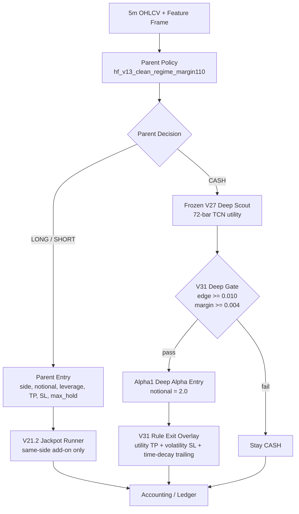

# Alpha1 Live Model Contract

Last updated: 2026-05-13 KST

## Scope

- Alias: `alpha1`
- Full name: `alpha1_v31_deep_notional2_live_20260513`
- Status: `current_live_main`
- Purpose: 현재 테스트 모델 난립을 정리하기 위한 메인 모델 alias. 이후 업그레이드는 `alpha1.1`, `alpha1.2`처럼 이 계약을 기준으로 비교한다.
- Live entrypoint: `trading_bot.py::FinalGovernorRuntime`
- Decision logic id: `hf_v13_frozen_v27_rule_exit_overlay_v31_20260511`

## Architecture



## Layer Contracts

| Layer | Input | Output | Notes |
|---|---|---|---|
| Parent Policy | current feature frame | `CASH/LONG/SHORT`, parent notional, leverage, TP, SL, max hold, cooldown | Parent LONG/SHORT behavior is unchanged from `hf_v13_clean_regime_margin110_20260511`. |
| V21.2 Jackpot | active parent position state + feature frame | same-side add-on or reject | Applies only to parent-owned positions. Does not apply to deep scout positions. |
| Frozen V27 Deep Scout | 72 bars x 80 sequence features | `q_long`, `q_short` | Evaluated only when parent is CASH. |
| Alpha1 Deep Gate | V27 utilities | enter/reject, side | `edge_th=0.010`, `margin_th=0.004`. |
| Alpha1 Deep Sizing | gate pass | `notional=2.0`, leverage ~= 2.0 exposure capped by router | Live override via `FINAL_GOVERNOR_V31_DEEP_NOTIONAL=2.0`. |
| V31 Rule Exit | active deep position state | hold/close | Applies only to `deep_alpha` sleeve. |

## Dataset Split

Alpha1 uses the existing V31 frozen artifacts and sensitivity test:

- V27 train/selection split: 2025 Jan-Sep train, 2025 Oct-Dec selection.
- OOS test: fixed 2026 eval CSV.
- Deep notional sensitivity report: `data/ensemble/reports/v31_deep_scout_notional_sensitivity_20260513.json`
- V31 base report: `data/ensemble/reports/hf_v13_frozen_v27_rule_exit_overlay_v31_20260511_summary.json`
- V31 audit: `data/ensemble/reports/hf_v13_frozen_v27_rule_exit_overlay_v31_20260511_audit.json`

## Artifacts

- Parent: `data/ensemble/supervised/hf_v13_clean_regime_margin110_20260511/v13_clean_regime_margin110.pkl`
- Jackpot: `data/ensemble/supervised/hf_v13_jackpot_runner_v21_2_20260511/v21_2_jackpot_runner.pkl`
- Frozen V27: `data/ensemble/supervised/hf_v13_deep_alpha_candidate_expansion_v27_20260511/v27_deep_alpha_candidate_expansion.pt`
- Live audit note: `data/ensemble/reports/trading_bot_v31_live_notional2_audit_20260513.md`

## Alpha1 Selected Config

```json
{
  "base_config": "v31_notional1_time_decay",
  "live_alias": "alpha1",
  "live_deep_notional": 2.0,
  "edge_th": 0.01,
  "margin_th": 0.004,
  "cooldown": 12,
  "base_tp": 0.04,
  "base_sl": 0.018,
  "base_hold": 48,
  "tp_util_mult": 1.5,
  "sl_vol_mult": 2.5,
  "trail_gap_mult": 1.0,
  "hold_decay_start": 18,
  "hold_decay_rate": 0.025,
  "tp_cap": 0.075,
  "sl_cap": 0.036
}
```

## OOS Metrics

Deep scout notional sensitivity, 2026 OOS:

| Variant | Cost1 PnL | MDD | Cost2 PnL | Cost3 PnL |
|---|---:|---:|---:|---:|
| V31 original deep notional 1.0 | +277.07% | -31.74% | +112.79% | +20.93% |
| `alpha1` deep notional 2.0 | +361.19% | -31.74% | +88.74% | +0.58% |

## Red Team Gates

- V31 audit status: `pass`
- V31 verdict: `promote`
- `selection_uses_2026`: `false`
- `deep_sleeve_only_when_parent_cash`: `true`
- Live runtime artifact load: passed under `conda quant_ai`
- Risk note: `alpha1` is more aggressive than V31 original. Cost3 survives only marginally, so future upgrades must improve cost durability before increasing notional further.

## Upgrade Rule

Any future candidate must report metrics against `alpha1`, not only against older V31/V27 reports:

- Alpha1 baseline: cost1 `+361.19%`, MDD `-31.74%`, cost2 `+88.74%`, cost3 `+0.58%`.
- Promote only if it improves PnL without materially worsening MDD, or if it significantly improves cost2/cost3 survival with acceptable PnL tradeoff.
