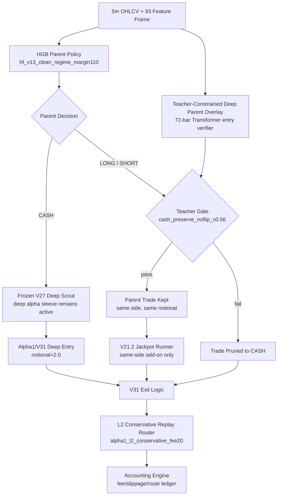

# Alpha2 Shadow Model Contract

Last updated: 2026-05-14 KST

## Scope

- Alias: `alpha2`
- Full name: `alpha2_teacher_l2_replay_shadow_20260514`
- Status: `shadow_collect_l2`
- Purpose: Alpha1.4/Alpha1의 공격력 위에 `Teacher-Constrained Deep Parent Overlay`와 `L2 execution replay`를 결합한 다음 세대 후보. 현재는 실거래 주입 모델이 아니라 L2 체결 가정을 forward shadow 데이터로 검증하기 위한 승격 후보다.
- Live entrypoint: not enabled
- Research entrypoint: `scripts/eval_alpha1_l2_teacher_deep_parent_20260514.py`

## Architecture



## Layer Contracts

| Layer | Input | Output | Contract |
|---|---|---|---|
| HGB Parent | current 93-feature frame | `CASH/LONG/SHORT`, notional, leverage, TP, SL, hold, cooldown | Original Alpha1 parent is preserved. |
| Teacher Deep Parent Overlay | 72-bar sequence over parent feature set | action probabilities, quality, notional logits | Used only as a veto/verification layer, not as a direction flipper. |
| Teacher Gate | HGB parent decision + deep probabilities | keep/prune | Selected runtime: `cash_preserve_noflip_c0.56`; parent CASH remains CASH so V27 scout can still act. |
| V21.2 Jackpot Runner | active parent position state + features | same-side add-on/reject | Preserved from Alpha1. |
| Frozen V27 Deep Scout | 72-bar sequence features | deep long/short utilities | Preserved from Alpha1; active only when parent is CASH. |
| V31 Exit | position state | hold/close | Preserved from Alpha1/V31. |
| L2 Replay Router | next-bar OHLC + synthetic spread proxy | maker replay or taker fallback | Selected: `alpha1_l2_conservative_fee20`; requires live L2 shadow validation before live promotion. |

## Selected Config

```json
{
  "teacher_runtime": {
    "name": "cash_preserve_noflip_c0.56",
    "confidence": 0.56,
    "skip_on_cash": true,
    "allow_flip": false,
    "use_learned_size": false,
    "notional_scale": 1.0,
    "max_notional": 2.75
  },
  "l2_replay_variant": {
    "name": "alpha1_l2_conservative_fee20",
    "layer": "conservative_l2_replay",
    "sniper_fee_mult": 0.20,
    "sniper_slip_mult": 0.0
  },
  "deep_scout_notional": 2.0,
  "selection_window": "2025-10-01..2025-12-31",
  "oos_window": "2026 fixed OOS only after selection"
}
```

## Artifacts

- Evaluation script: `scripts/eval_alpha1_l2_teacher_deep_parent_20260514.py`
- Teacher model: `data/ensemble/supervised/alpha1_l2_teacher_deep_parent_20260514/teacher_deep_parent_l2_replay.pt`
- Summary report: `data/ensemble/reports/alpha1_l2_teacher_deep_parent_20260514_summary.json`
- Red Team audit: `data/ensemble/reports/alpha1_l2_teacher_deep_parent_20260514_audit.json`
- Selection grid: `data/ensemble/reports/alpha1_l2_teacher_deep_parent_20260514_grid.csv`

## OOS Metrics

2026 fixed OOS after 2025Q4 selection:

| Variant | Cost1 PnL | Cost1 MDD | Cost2 PnL | Cost3 PnL | Trades/day |
|---|---:|---:|---:|---:|---:|
| Alpha1 taker baseline | +361.19% | -31.74% | +88.74% | +0.58% | 3.39 |
| Alpha1 L2 replay only | +642.43% | -30.54% | +434.61% | +402.96% | 3.41 |
| `alpha2` Teacher + L2 replay | +699.14% | -29.72% | +463.54% | +420.80% | 3.31 |

## Red Team Status

- Audit status: `pass`
- Verdict: `shadow_collect_l2`
- Blocking issues: none
- Selection uses 2026: `false`
- Train/eval timestamp overlap: `0`
- Forbidden regime columns: none in parent audit

Warnings that block live promotion:

- `historical_l2_snapshots_insufficient_conservative_ohlc_replay_only`
- `real_live_l2_fill_model_requires_forward_shadow_collection`
- Some missing training/eval features are zero-filled by the current parent feature contract.

## Promotion Rule

`alpha2` may replace `alpha1` in live trading only after enough real `orderbook_decision_snapshots` are collected and the L2 replay assumptions are re-audited against observed maker/taker fill behavior. Until then:

- `alpha1` remains `current_live_main`.
- `alpha2` is the active shadow candidate.
- Any `alpha2.x` upgrade must compare against both Alpha1 and Alpha2 shadow metrics.

## Follow-up: Alpha2.1 Runtime Sweep

Follow-up report: `data/ensemble/reports/alpha2_teacher_l2_runtime_sweep_20260514_summary.json`

Selected runtime-only candidate:

```json
{
  "name": "alpha2_1::noflip_c0.56_parent_scale1.10::alpha1_l2_conservative_fee20",
  "teacher_confidence": 0.56,
  "parent_notional_scale": 1.10,
  "l2_variant": "alpha1_l2_conservative_fee20"
}
```

OOS result:

| Variant | Cost1 PnL | Cost1 MDD | Cost2 PnL | Cost3 PnL |
|---|---:|---:|---:|---:|
| Alpha2 reference | +699.14% | -29.72% | +463.54% | +420.80% |
| Alpha2.1 runtime sweep | +718.70% | -26.66% | +443.82% | +360.15% |

Red Team interpretation: Alpha2.1 improves cost1 PnL and cost1 MDD, but lowers cost2/cost3 durability and did not beat Alpha2 on the combined score. Keep Alpha2 as the main shadow candidate; keep Alpha2.1 as an aggressive runtime variant for further study.

## Follow-up: Alpha2.1 Signal Limit + Market Fallback Execution

Follow-up report: `data/ensemble/reports/alpha2_1_signal_immediate_limit_20260514_summary.json`

Alias update: this follow-up family led to `alpha3`, but the old `+747.76%` replay is now deprecated because maker-miss fallback used same-next-bar open after high/low touch inspection. Use [alpha3_teacher_l2_limit_fallback_20260514_contract.md](alpha3_teacher_l2_limit_fallback_20260514_contract.md) as the primary contract for the corrected `Alpha3 corrected selected next_open_limit_touch0_fee20` model.

Design: keep the Alpha2.1 model decisions fixed and change only the execution layer.

Default execution contract for future tests:

```text
signal confirmed
→ post-only limit first
→ passive offset: 2 bps
→ entry miss: market fallback
→ exit miss: market fallback
→ maker fee multiplier in backtest: 0.20
→ maker slippage in backtest: 0
```

OOS result:

| Execution | Cost1 PnL | Cost1 MDD | Cost2 PnL | Cost3 PnL |
|---|---:|---:|---:|---:|
| Alpha2.1 next-open taker | +354.53% | -32.45% | +23.13% | +10.80% |
| Alpha2.1 old L2 replay fee20 | +718.70% | -26.66% | +443.82% | +360.15% |
| Alpha2.1 post-only limit + market fallback, deprecated open fallback | +747.76% | -27.37% | +510.83% | +436.68% |
| Alpha3 corrected selected `next_open_limit_touch0_fee20` | +654.92% | -29.62% | +602.26% | +456.48% |

Red Team interpretation: this is the preferred execution contract to test going forward because it is closer to live order routing than the old broad synthetic L2 replay and preserves trades better than pure limit-skip execution. It still requires real L2/tick validation for queue position, partial fill, and post-only rejection.

## Follow-up: Alpha2 Outcome Teacher

Follow-up report: `data/ensemble/reports/alpha2_outcome_teacher_l2_20260514_summary.json`

Design: train a sequence outcome teacher on parent-owned train trades under cost3 conservative L2 replay. Unlike the first teacher, this model does not imitate the HGB parent action. It predicts whether an already-selected parent trade survives net costs, then gates/scales parent trades while leaving parent CASH available for V27 Deep Scout.

Training controls followed the deep learning protocol in `docs/subagents/deep_learning_training_protocol_20260514.md`: chronological split, validation-monitored early stopping, LR reduction, gradient clipping, best checkpoint restore, and Red Team audit output.

Training result:

```text
train labels: 251 parent-owned trades
train rows: 200
validation rows: 51
positive rate: 40.24%
best epoch: 10
best validation loss: 0.84580
```

OOS result:

| Variant | Cost1 PnL | Cost1 MDD | Cost2 PnL | Cost3 PnL |
|---|---:|---:|---:|---:|
| Alpha1 L2 replay reference | +642.43% | -30.54% | +434.61% | +405.04% |
| Alpha2 outcome teacher | +277.50% | -26.95% | +171.19% | +102.84% |

Red Team interpretation: audit passed with no blocking issue, but the selected best remains `alpha1_l2_replay`. The outcome teacher improves cost1 MDD but cuts too much PnL and weakens cost2/cost3 durability. Do not promote. The label set is also thin, so the next deep candidate should use richer counterfactual signal labels or real L2 shadow outcomes instead of only executed parent trade records.

## Follow-up: Alpha2.1 Chronos/Kairos/Mamba Layer Swap

Follow-up report: `data/ensemble/reports/alpha2_1_foundation_mamba_layer_swap_20260514_summary.json`

Design: read the full Alpha2.1 flow and test the prior foundation/sequence candidates at their natural insertion points:

- Parent replacement: V40.6 Chronos/Kairos target-aware PLS parent.
- Scout replacement: V41 Mamba-style SSM in place of Frozen V27 TCN.
- Related-layer retrain: V44 Chronos/Kairos parent with retrained V21.2 runner and retrained V27-style scout, then evaluated under Alpha2.1 L2 replay accounting.
- Teacher compatibility: original Alpha2 teacher gate over the Chronos/Kairos parent/retrained stack.

2026 OOS result:

| Variant | Cost1 PnL | Cost1 MDD | Cost2 PnL | Cost3 PnL |
|---|---:|---:|---:|---:|
| Alpha2.1 reference | +718.70% | -26.66% | +443.82% | +360.15% |
| V41 Mamba scout replacement | +254.67% | -30.73% | +217.33% | +197.92% |
| Chronos/Kairos parent + original teacher gate | +159.32% | -32.30% | +98.60% | +67.77% |
| Chronos/Kairos V44 fresh related-layer retrain + L2 | +155.17% | -28.87% | +138.27% | +119.10% |
| V44 fresh retrain + original Alpha2 teacher gate | +142.98% | -29.32% | +122.29% | +68.86% |

Red Team interpretation: audit passed with no blocking issue, but `alpha2_1_reference` remained best. Mamba reduced deep entries and lost the Alpha2.1 edge. Chronos/Kairos parent replacement, even after a fresh V44 runner/scout retrain on the encoded parent frame, did not recover enough PnL. The original Alpha2 teacher gate is not portable to the Chronos/Kairos parent family without a dedicated teacher retrain.
