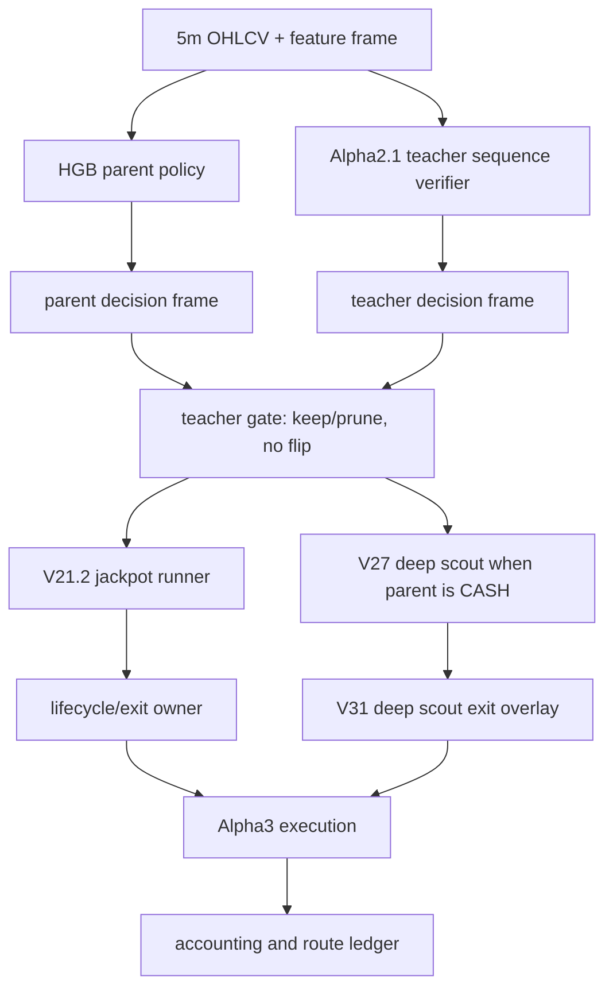

# Alpha3 Full Layer I/O and Runtime Contract

Last updated: 2026-05-16 KST

## Scope

This document records the main Alpha3 shadow model as an executable layer contract, not just as a performance report.

- Alias: `alpha3`
- Canonical stack: HGB parent + Alpha2.1 teacher/L2 gate + V21.2 jackpot runner + frozen V27/V31 deep scout/exit + Alpha3 limit-first execution
- Canonical baseline protocol: `docs/model_contracts/alpha3_frozen_backtest_protocol_20260515.md`
- Current corrected baseline:
  - cost1 PnL `+654.9174%`, MDD `-29.6173%`, trades `195`
  - cost2 PnL `+602.2625%`, MDD `-30.0934%`, trades `195`
  - cost3 PnL `+456.4820%`, MDD `-31.3979%`, trades `198`
- Deprecated baseline: `+747.76%` from `next_open_limit_offset2_entry_fallback_fee20`, because that variant used an invalid open fallback after already inspecting the same next bar high/low range.

## Architect Note

The prior model contract correctly said the Alpha2.1 teacher is a `72` bar sequence model. It did not explicitly enforce that live inference must pass the full historical frame and then take the latest decision row. The live path could therefore call the teacher with only the latest row, causing `_seq_tensor` to build a mostly zero-padded sequence instead of the real `[t-71, ..., t]` lookback.

This was a live integration contract gap, not a teacher architecture change. From this contract onward, any Alpha3 live or native-live backtest path must satisfy:

```text
teacher_input(t) = normalized sequence over rows max(0, t-71) ... t
teacher_decision(t) = predict_frame(frame_until_t).iloc[-1]
forbidden: predict_latest(frame.tail(1)) for sequence models
```

`trading_bot.py` now follows this rule through `_alpha2_1_predict_frame()` and `_alpha2_1_predict_latest()`.

## Layer Map



## Data and Feature Frame

Role:

- Provides the common 5m time-indexed frame used by the parent, teacher, runner, scout, exit, and replay engines.
- The canonical backtest data files are:
  - `tmp/ai_feature_combo_grid/trade_candidates_2025_patchtst__tide__dlinear.csv`
  - `tmp/ai_feature_combo_grid/trade_candidates_2026_patchtst__tide__dlinear.csv`

Inputs:

- Timestamped 5m OHLCV.
- AI feature columns, M7 columns, clean-regime columns, volatility/microstructure-derived columns.
- Backtest may use precomputed AI features; live recomputes parts of the frame through `trading_bot.py`.

Outputs:

- A pandas `DataFrame` indexed by bar order.
- Required base columns include at least `timestamp`, `open`, `high`, `low`, `close`, and the feature columns expected by each artifact payload.

Contract:

- Do not feed target, label, or future-only columns into production inference.
- Any missing feature that is silently zero-filled must be listed in the experiment audit.
- Sequence models must receive the full available frame up to the current bar, not a single latest row.
- Backtests using precomputed feature files must report live parity risk if live recomputation can differ.

## Layer 1: HGB Parent Policy

Artifact:

- `data/ensemble/supervised/hf_v13_clean_regime_margin110_20260511/v13_clean_regime_margin110.pkl`

Implementation references:

- `ensemble/fully_learned_governor_policy.py::prepare_features`
- `ensemble/fully_learned_governor_policy.py::predict_policy_frame`
- `trading_bot.py::FinalGovernorRuntime._fully_learned_decision_frame`

Role:

- Main Alpha3 parent entry policy.
- Owns parent trade direction, notional, leverage, TP, SL, max-hold, and cooldown.
- It is row-independent at model level, but the runtime should still call frame-level inference so the feature preparation contract is identical to backtest.

Input:

- Current 5m feature frame, with `side_hint=0` for action prediction.
- Feature columns come from the model bundle `feature_cols` or the local `FEATURE_COLS` fallback.

Output per row:

| Field | Meaning |
|---|---|
| `action` | integer action, `0=CASH`, `1=LONG`, `2=SHORT` |
| `side` | `0`, `1`, or `-1` |
| `notional_exposure` | effective notional after leverage/fraction clipping |
| `leverage` | selected leverage bucket |
| `position_fraction` | margin fraction |
| `take_profit` | parent TP fraction |
| `stop_loss` | parent SL fraction |
| `max_hold_bars` | parent max hold in 5m bars |
| `cooldown_bars` | cooldown after close |
| `quality_score` | learned quality estimate |
| `confidence` | averaged action/sizing/risk bucket confidence |

Frozen baseline buckets:

- `take_profit_buckets=(0.010, 0.018, 0.030, 0.050, 0.090, 0.180, 0.450, 1.000)`
- `stop_loss_buckets=(0.006, 0.010, 0.016, 0.024, 0.035, 0.055)`
- `max_hold_buckets=(3, 6, 12, 24, 48, 96, 288, 864)`
- `cooldown_buckets=(0, 1, 3, 6, 12, 24, 48)`

Runtime contract:

- `trading_bot.py::_fully_learned_decision_frame(frame)` builds the full parent decision frame and returns `decisions.iloc[-1]` for the live action.
- For a parent-only experiment, downstream teacher gate, runner, V27/V31, execution, accounting, and data must remain frozen.

## Layer 2: Alpha2.1 Teacher Sequence Verifier

Artifact:

- `data/ensemble/supervised/alpha1_l2_teacher_deep_parent_20260514/teacher_deep_parent_l2_replay.pt`

Implementation references:

- `scripts/train_eval_hf_v13_deep_entry_parent_lite_v38.py::DeepEntryParentLite`
- `scripts/train_eval_hf_v13_deep_entry_parent_lite_v38.py::_seq_tensor`
- `scripts/train_eval_hf_v13_deep_entry_parent_lite_v38.py::_apply_norm`
- `trading_bot.py::FinalGovernorRuntime._alpha2_1_predict_frame`

Role:

- Verifies the HGB parent decision.
- It may prune weak parent trades.
- It must not flip a parent `LONG` to `SHORT` or `SHORT` to `LONG`.
- It must preserve parent `CASH` so V27 deep scout can still act.

Input:

- A normalized 72-bar sequence tensor.
- Shape: `(batch, 72, n_teacher_features)`.
- Feature list comes from `alpha2_1_teacher_feature_cols` in the loaded payload.
- Normalization comes from `alpha2_1_teacher_norm`.

Output per row:

| Field | Meaning |
|---|---|
| `pred_action` | teacher action argmax |
| `confidence` | max action probability |
| `quality` | teacher quality head output |
| `action_proba` | probability vector over action classes |
| `notional_proba` | probability vector over notional buckets |

Model structure:

- `DeepEntryParentLite`
- Sequence length: `72`
- Hidden size in current trainer: `96`
- Learned positional parameter over 72 steps
- Learned recency bias over 72 steps
- Heads: action logits, quality scalar, notional logits

Critical parity rule:

- Correct live call: build features over `frame_until_t`, build all valid 72-bar windows, predict the decision frame, then use the last row.
- Incorrect live call: pass only `frame.tail(1)`, because the sequence becomes `[0, 0, ..., latest_row]`.
- This is the live teacher sequence bug that the previous architecture notes did not make explicit.

## Layer 3: Teacher Gate

Runtime name:

- `cash_preserve_noflip_c0.56_parent_scale1.10`

Role:

- Combines HGB parent and Alpha2.1 teacher outputs.
- Keeps a parent trade only when the teacher agrees strongly enough.
- Scales parent notional when accepted.
- Prunes to `CASH` when the teacher disagrees or confidence is too low.

Input:

- Parent decision row from Layer 1.
- Teacher decision row from Layer 2.

Output:

- Accepted parent decision, or pruned `CASH/HOLD`.
- Trace fields should record parent action, teacher action, teacher confidence, gate result, and scaling.

Contract:

- No direction flip.
- Parent `CASH` is not blocked by the teacher; it remains available to V27 deep scout.
- Gate threshold and notional scaling are frozen unless the experiment declares `teacher_gate` mutable.

## Layer 4: V21.2 Jackpot Runner

Artifact:

- `data/ensemble/supervised/hf_v13_jackpot_runner_v21_2_20260511/v21_2_jackpot_runner.pkl`

Implementation references:

- `scripts/train_eval_hf_v13_jackpot_runner_v21_2.py::_predict_cost_runner`
- `scripts/eval_alpha2_1_signal_immediate_limit_20260514.py`
- `trading_bot.py::_lifecycle_v1_latest`

Role:

- Parent-side add-on and sizing overlay.
- It acts on active parent-owned positions only.
- It may add to same-side positions, but should not open an opposite-side position.

Input:

- Parent/lifecycle feature vector.
- Active position state.
- Current feature frame from the same frame contract as the parent.

Output:

- Same-side add-on/reject decision.
- Adjusted effective notional or lifecycle trace.

Contract:

- It is frozen for parent-only, exit-only, and execution-only experiments.
- Any retraining or reselection of V21.2 turns the experiment into `parent_plus_downstream_retune` or `full_stack_retune`.

## Layer 5: Frozen V27 Deep Scout

Artifact:

- `data/ensemble/supervised/hf_v13_deep_alpha_candidate_expansion_v27_20260511/v27_deep_alpha_candidate_expansion.pt`

Implementation references:

- `scripts/train_eval_hf_v13_deep_alpha_candidate_expansion_v27.py`
- `scripts/eval_hf_v13_frozen_v27_rule_exit_overlay_v31.py`
- `trading_bot.py::_v31_predict_latest`
- `trading_bot.py::_v31_deep_alpha_entry_decision`

Role:

- Deep scout sleeve that can act when the parent stack is `CASH`.
- It expands Alpha3 opportunities without replacing the parent.

Input:

- 72-bar sequence over `seq_cols` stored in the V27 payload.
- Normalization dictionary stored in the V27 payload.
- Parent decision context, cooldown state, clean regime context.

Output:

- `q_long`, `q_short` utility estimates.
- Deep sleeve entry decision when edge/margin/cooldown/config gates pass.

Contract:

- Parent active positions take priority.
- Deep scout is available only when parent is effectively `CASH`.
- Alpha3 keeps deep scout notional override at `2.0` unless the experiment declares this mutable.

## Layer 6: V31 Deep Scout Exit Overlay

Selected overlay family:

- `hf_v13_frozen_v27_rule_exit_overlay_v31_20260511`

Implementation references:

- `scripts/eval_hf_v13_frozen_v27_rule_exit_overlay_v31.py::OverlayConfig`
- `trading_bot.py::_manage_lifecycle_v1_position`

Role:

- Dynamic rule exit for the V27 deep scout sleeve.
- Parent lifecycle remains parent-owned by HGB/V21.2 TP/SL/max-hold unless an experiment explicitly replaces exit ownership.

Input:

- Active position side, entry price, notional, leverage/fraction.
- Current price and 5m feature frame.
- Deep scout entry edge/margin and volatility anchor.
- MFE/MAE state, peak unrealized PnL, hold bars.
- V31 config fields such as `base_tp`, `base_sl`, `base_hold`, `tp_util_mult`, `sl_vol_mult`, `trail_gap_mult`, `hold_decay_start`, `hold_decay_rate`, `tp_cap`, and `sl_cap`.

Output:

- Hold or close decision.
- Close reason examples:
  - `v31_deep_alpha_take_profit`
  - `v31_deep_alpha_stop_loss`
  - `v31_deep_alpha_max_hold`

Contract:

- V31 is not a global parent exit oracle in the current Alpha3 baseline.
- If a new RL/DSAC exit layer controls all positions, the experiment must declare `exit_only` or `full_stack_retune` and explicitly state whether TP/SL/max-hold become guard rails or are removed from primary decision ownership.

## Layer 7: Alpha3 Execution

Canonical corrected backtest entrypoint:

- `scripts/eval_alpha2_1_signal_immediate_limit_20260514.py`

Selected execution:

```json
{
  "name": "next_open_limit_touch0_fee20",
  "anchor": "next_open",
  "entry_offset_bps": 0.0,
  "exit_offset_bps": 0.0,
  "penetration_bps": 0.0,
  "maker_fee_mult": 0.20,
  "entry_miss": "skip",
  "exit_miss": "market_fallback"
}
```

Backtest fill contract:

- Signal at bar `i`.
- Limit touch is checked on bar `i+1` using high/low.
- Entry miss is skipped.
- Exit miss falls back to bar `i+1 close +/- slippage`.
- It is forbidden to check `i+1 high/low` and then fill fallback at the same bar's `open`.

Live execution contract:

- Entry: post-only maker first.
- Entry fallback: disabled for canonical Alpha3 parity.
- Exit: reduce-only post-only maker first.
- Exit fallback: enabled to reconcile account state when maker exit misses/rejects/times out.

Known gap:

- OHLCV touch replay is not queue-position replay.
- Live order book queue, partial fills, post-only rejects, latency, and cancellation timing require L2/order-event validation before treating the replay PnL as live-equivalent.

## Layer 8: Accounting and Ledger

Backtest references:

- `scripts/eval_alpha2_1_signal_immediate_limit_20260514.py::_metrics_signal_limit`
- `scripts/eval_alpha2_1_signal_immediate_limit_20260514.py::_try_immediate_limit`

Live/native references:

- `trading_bot.py::GovernorPositionRouter._trade_math`
- `scripts/backtest_alpha3_runtime_native_20260515.py`

Role:

- Applies compounding, fee, slippage, route, notional, leverage, resize, and close reason accounting.
- Emits summary metrics and ledger rows.

Required report fields for experiments:

- `base_model_alias`
- `frozen_protocol`
- `primary_mutable_surface`
- `changed_layers`
- `frozen_layers`
- `baseline_reproduced`
- `baseline_metrics`
- `candidate_metrics`
- `delta_vs_baseline`
- `selection_uses_2026`
- `route_counts`
- `warnings`
- `red_team_blockers`

## Frozen and Mutable Surfaces

Use these labels when designing experiments:

| Experiment type | Mutable | Frozen |
|---|---|---|
| `parent_only` | parent decision model | teacher, runner, V27, V31, execution, accounting, data |
| `teacher_gate_only` | teacher threshold/gate logic | parent, runner, V27, V31, execution, accounting, data |
| `exit_only` | close timing/ownership | entries, execution, accounting, data |
| `execution_only` | route/fill simulation or adapter | decisions, exit timing, accounting formulas, data |
| `full_stack_retune` | multiple layers | must declare every changed layer |

Promotion rule:

- A candidate must reproduce the canonical Alpha3 baseline in the same report before its candidate metrics are interpreted.

## Live/Backtest Parity Hazards

These hazards must be checked in every Alpha3 report:

1. Teacher sequence lookback: `72` real bars, not one latest row plus zero padding.
2. Parent/teacher decision mode: full decision frame then latest row.
3. Precomputed AI features in backtest versus live recomputed AI features.
4. Any suspicious future/target columns, including target-like columns such as `m7_target_hold`.
5. OHLCV high/low touch proxy versus real L2 queue fill.
6. Entry miss handling: canonical replay skips entry miss.
7. Exit miss handling: canonical replay uses same next bar close fallback, not open fallback.
8. Partial fills, cancel/replace latency, and order rejection are not represented by simple OHLCV replay.
9. Missing feature zero-fill must be audited.
10. External redteam/live guard parity blocker has been removed from `trading_bot.py` as of 2026-05-16; intrinsic V31 cooldown/gates and lifecycle TP/SL/max-hold remain.

## Verification Commands

Compile live runtime after integration changes:

```bash
/home/llewyn/miniconda3/envs/quant_ai/bin/python -m py_compile trading_bot.py
```

Validate an Alpha3 candidate report:

```bash
/home/llewyn/miniconda3/envs/quant_ai/bin/python scripts/validate_alpha3_frozen_backtest_report.py <report.json>
```

Run one-month native live-runtime replay with the accelerated decision cache:

```bash
CONSOLE_LOG_COMPACT=1 CUDA_VISIBLE_DEVICES=0 /home/llewyn/miniconda3/envs/quant_ai/bin/python -u scripts/backtest_alpha3_runtime_native_20260515.py \
  --report-out data/ensemble/reports/alpha3_runtime_native_backtest_live_frame_20260516_1m.json \
  --ledger-out data/ensemble/reports/alpha3_runtime_native_backtest_live_frame_20260516_1m_ledger.csv \
  --max-bars 8640 \
  --progress 1000 \
  --accelerated-cache
```

## Current Native Live-Runtime Replay Snapshot

One-month accelerated replay, generated 2026-05-16:

- Report: `data/ensemble/reports/alpha3_runtime_native_backtest_live_frame_20260516_1m.json`
- Ledger: `data/ensemble/reports/alpha3_runtime_native_backtest_live_frame_20260516_1m_ledger.csv`
- Window: `2026-01-25 07:15:00` to `2026-02-24 07:10:00`
- Final equity: `2.0159069669`
- Return: `+101.5907%`
- MDD: `33.3971%`
- Closed trades: `122`
- Top exit reasons:
  - `v31_deep_alpha_stop_loss`: `67`
  - `learned_stop_loss`: `18`
  - `v31_deep_alpha_max_hold`: `18`
  - `v31_deep_alpha_take_profit`: `12`
  - `learned_max_hold`: `5`
  - `learned_take_profit`: `2`

Interpretation:

- This native replay is useful for live-runtime behavior inspection.
- It is not the canonical Alpha3 frozen backtest baseline.
- The canonical baseline remains the corrected `next_open_limit_touch0_fee20` simulator until a full live-runtime baseline protocol is frozen.
