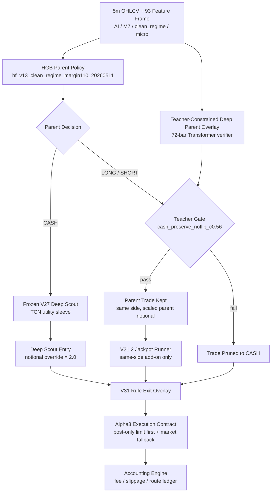

# Alpha3 Model Contract

Last updated: 2026-05-14 KST

## Scope

- Alias: `alpha3`
- Canonical resolved name: `Alpha3 corrected selected next_open_limit_touch0_fee20`
- Full name: `alpha3_teacher_l2_limit_fallback_20260514`
- Definition: `Alpha2.1` decision stack plus post-only limit-first execution with market fallback.
- Status: `current_shadow_candidate_live_l2_not_promoted`
- Live entrypoint: `trading_bot.py::FinalGovernorRuntime` with `trading_bot_modules.binance_execution.BinanceFuturesExecutionAdapter`
- Backtest entrypoint: `scripts/eval_alpha2_1_signal_immediate_limit_20260514.py`

`alpha3` is the canonical name for the corrected 2026 OOS limit/fallback model. The earlier `+747.76%` result is deprecated because maker-miss fallback used the same next bar `open` after already checking that bar's full `high/low` range. From this contract onward, maker-miss fallback uses the same next bar `close +/- slippage`.

## Architecture



## Layer Contracts

| Layer | Input | Output | Contract |
|---|---|---|---|
| HGB Parent | current 93-feature frame | `CASH/LONG/SHORT`, notional, leverage, TP, SL, hold, cooldown | Main entry and lifecycle owner for parent trades. |
| Teacher Deep Parent Overlay | 72-bar sequence over parent features | action probabilities, quality, notional logits | Verification layer only. It may prune parent trades but does not flip direction. |
| Teacher Gate | parent decision + deep probabilities | keep/prune | Runtime: `cash_preserve_noflip_c0.56`; parent CASH remains available to V27 scout. |
| V21.2 Jackpot Runner | active parent position state + features | same-side add-on/reject | Adds only to profitable parent-owned positions. |
| Frozen V27 Deep Scout | 72-bar sequence features | deep long/short utilities | Acts only when parent is CASH; Alpha3 keeps deep scout notional override at `2.0`. |
| V31 Exit Overlay | position state, edge, volatility, MFE/MAE, hold bars | hold/close | Dynamic rule exit for deep scout sleeve; parent lifecycle remains parent-owned. |
| Alpha3 Execution | signal route, side, reduce-only state, orderbook/passive price | post-only maker fill or taker fallback | Default contract for future tests unless explicitly overridden. |

## Selected Execution Contract

```json
{
  "name": "next_open_limit_touch0_fee20",
  "anchor": "next_open",
  "entry_offset_bps": 0.0,
  "exit_offset_bps": 0.0,
  "penetration_bps": 0.0,
  "maker_fee_mult": 0.20,
  "entry_miss": "skip",
  "exit_miss": "market_fallback"
}
```

Corrected OHLCV replay contract:

- Signal at bar `i`.
- Limit touch is checked over bar `i+1` using `high/low`.
- If maker is missed and fallback is enabled, market fallback fills at bar `i+1 close +/- slippage`.
- It is forbidden to check `i+1 high/low` and then fill fallback at `i+1 open`.

Live routing defaults should be compared against this contract:

- Entry: post-only maker order first.
- Entry miss/reject/timeout: selected corrected replay skips the trade; live default now keeps entry market fallback disabled.
- Exit: reduce-only post-only maker order first.
- Exit miss/reject/timeout: reduce-only market fallback to reconcile account state.
- Live Binance adapter defaults matching Alpha3 corrected execution: `BINANCE_EXECUTION_MAKER_ENTRY_OFFSET_BPS=0.0`, `BINANCE_EXECUTION_MAKER_EXIT_OFFSET_BPS=0.0`, `BINANCE_EXECUTION_MAKER_ENTRY_FALLBACK_MARKET=false`, `BINANCE_EXECUTION_MAKER_EXIT_FALLBACK_MARKET=true`.

## OOS Metrics

2026 fixed OOS after prior 2025 selection, with corrected close fallback:

| Cost | PnL | MDD | Trades | Trades/day | Avg Notional | Avg Leverage |
|---|---:|---:|---:|---:|---:|---:|
| cost1 | +654.92% | -29.62% | 195 | 3.32 | n/a | n/a |
| cost2 | +602.26% | -30.09% | 195 | 3.32 | n/a | n/a |
| cost3 | +456.48% | -31.40% | 198 | 3.38 | n/a | n/a |

Cost1 route counts:

```json
{
  "signal_immediate_maker_limit": 402
}
```

For the old `next_open_limit_offset2_entry_fallback_fee20` settings retested with close fallback:

| Cost | PnL | MDD | Route Note |
|---|---:|---:|---|
| cost1 | +358.84% | -27.59% | 338 maker, 50 entry close-fallback, 26 exit close-fallback |
| cost2 | +283.14% | -28.62% | 343 maker, 50 entry close-fallback, 23 exit close-fallback |
| cost3 | +215.42% | -29.30% | 349 maker, 47 entry close-fallback, 22 exit close-fallback |

## Artifacts

- Backtest script: `scripts/eval_alpha2_1_signal_immediate_limit_20260514.py`
- Summary report: `data/ensemble/reports/alpha2_1_signal_immediate_limit_20260514_summary.json`
- Red Team audit: `data/ensemble/reports/alpha2_1_signal_immediate_limit_20260514_audit.json`
- Grid report: `data/ensemble/reports/alpha2_1_signal_immediate_limit_20260514_grid.csv`
- Teacher model: `data/ensemble/supervised/alpha1_l2_teacher_deep_parent_20260514/teacher_deep_parent_l2_replay.pt`
- Parent model: `data/ensemble/supervised/hf_v13_clean_regime_margin110_20260511/v13_clean_regime_margin110.pkl`
- Jackpot runner: `data/ensemble/supervised/hf_v13_jackpot_runner_v21_2_20260511/v21_2_jackpot_runner.pkl`
- Deep scout: `data/ensemble/supervised/hf_v13_deep_alpha_candidate_expansion_v27_20260511/v27_deep_alpha_candidate_expansion.pt`

## Red Team Status

- Verdict: `candidate_retest_required_with_real_l2_ticks`
- Selection uses 2026: `false`
- Blocking data leak issue: none identified in this Alpha3 audit.

Known promotion risks:

- `signal_immediate_limit_uses_5m_high_low_touch_proxy_not_queue_fill`
- `market_fallback_after_limit_miss_uses_same_next_bar_close_not_next_bar_open`
- `live_post_only_reject_partial_fill_and_queue_position_not_modeled`
- Real Binance queue position, partial fill, and post-only rejection must be compared against live DuckDB orderbook snapshots before treating corrected Alpha3 PnL as clean live-equivalent PnL.

## Standing Rule

From 2026-05-14 onward:

- `alpha3` means this exact decision stack plus this exact post-only limit/fallback execution contract.
- New experiments should compare against Alpha3 cost1/cost2/cost3 metrics, not only Alpha1/Alpha2.
- Any execution-layer change must report at least three variants: taker-only, synthetic L2 replay, and Alpha3 post-only limit + market fallback.
- Any OHLCV maker-touch replay that checks a bar's full `high/low` range must not use that same bar's `open` as a fallback fill after a miss.
