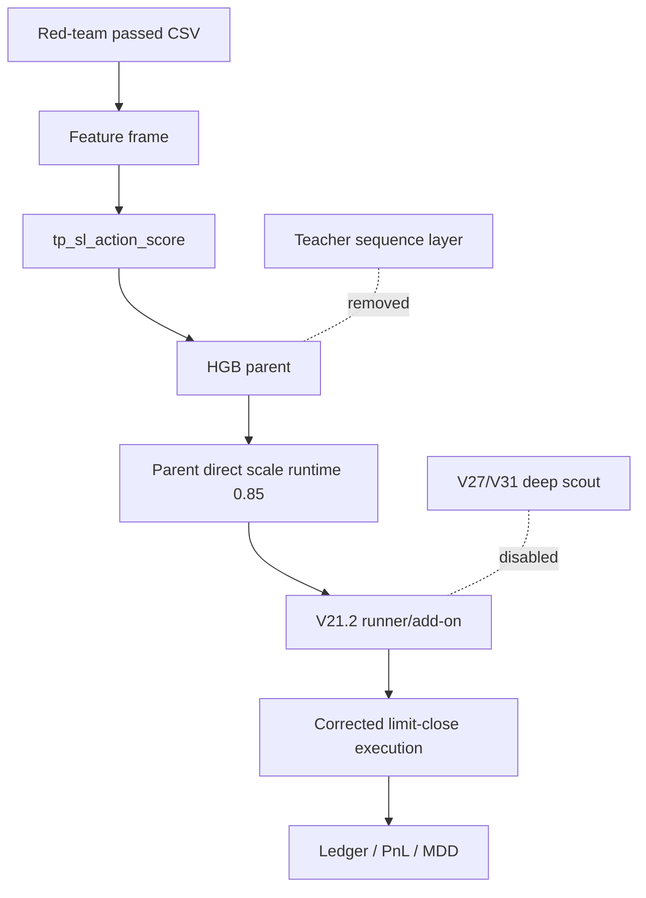

# Alpha4.3 No-Teacher No-Deep Contract - 2026-05-17

## Purpose

Alpha4.3 is the simplified Alpha4 candidate that removes both fragile sequence
sidecars:

- Teacher sequence layer: removed.
- V27/V31 deep scout: disabled.

The parent receives `tp_sl_action_score` directly and makes the primary
`hold/long/short` decision. A simple notional scale runtime is applied after the
parent decision, then the V21.2 runner handles add-ons and execution uses the
corrected Alpha3 limit-close contract.

## Architecture



## Layer Specification

| Layer | Status | Role |
| --- | --- | --- |
| Feature audit/preflight | Required | Training must stop if contaminated/blocked features are selected. |
| `tp_sl_action_score` | Enabled | Single signed parent input feature. Positive=long, negative=short, zero=hold/no path edge. |
| Parent | Enabled | HGB governor trained in Alpha4.2 with 84 features including `tp_sl_action_score`. |
| Teacher | Removed | No teacher sequence inference, no teacher constrained decisions. |
| Deep scout | Disabled | No CASH-state V27/V31 `deep_alpha` entries. |
| Runtime scale | Enabled | Direct parent notional scaled by 0.85, max notional 2.75. |
| V21.2 runner | Enabled | Uses the no-teacher runner selected in Alpha4.2 teacher ablation. |
| Execution | Enabled | Corrected Alpha3 immediate limit close/fallback contract. |

## Artifacts

- Script: `scripts/eval_alpha4_3_no_teacher_no_deep_20260517.py`
- Report: `tmp/causal_regen_20260516/alpha4_3_no_teacher_no_deep_20260517/alpha4_3_no_teacher_no_deep_summary.json`
- Audit: `tmp/causal_regen_20260516/alpha4_3_no_teacher_no_deep_20260517/alpha4_3_no_teacher_no_deep_audit.json`
- Manifest: `tmp/causal_regen_20260516/alpha4_3_no_teacher_no_deep_20260517/alpha4_3_no_teacher_no_deep_manifest.json`
- Parent: `tmp/causal_regen_20260516/alpha4_2_tp_sl_action_score_20260517/artifacts/hgb/parent.pkl`
- Runner: `tmp/causal_regen_20260516/alpha4_2_tp_sl_action_score_20260517/teacher_ablation_artifacts/parent_direct_scaled_no_teacher_runner.pkl`

## Runtime

```json
{
  "name": "parent_direct_scale0.85",
  "teacher": false,
  "deep_scout": false,
  "parent_notional_scale": 0.85,
  "max_notional": 2.75,
  "runner_config": "v21_2_jackpot_runner_0"
}
```

## Results

Selection/validation window is inherited from the Alpha4.2 teacher ablation:
2025-10-01 through 2025-12-31. OOS is fixed 2026.

| Split | Cost1 PnL | MDD | Cost2 PnL | Cost3 PnL | Trades | Deep Entries |
| --- | ---: | ---: | ---: | ---: | ---: | ---: |
| 2025Q4 validation | +15.75% | -31.48% | +13.05% | +1.47% | 98 | 0 |
| 2026 OOS | +183.42% | -21.99% | +169.76% | +79.27% | 66 | 0 |

2026 OOS exit distribution:

- Cost1: 48 stop-loss, 15 max-hold, 3 take-profit
- Cost2: 51 stop-loss, 14 max-hold, 3 take-profit
- Cost3: 62 stop-loss, 13 max-hold, 2 take-profit

## Promotion Note

Alpha4.3 is a strong candidate, not an automatic live promotion.

Reason:

- 2026 OOS strongly favored teacher removal.
- But the strict 2025Q4 ablation selection still chose the teacher-constrained
  variant.

Before live promotion, Alpha4.3 should pass multi-window walk-forward validation.
If it remains stable, the production path can delete teacher sequence inference
and remove the live/backtest parity risk associated with teacher lookback frames.
