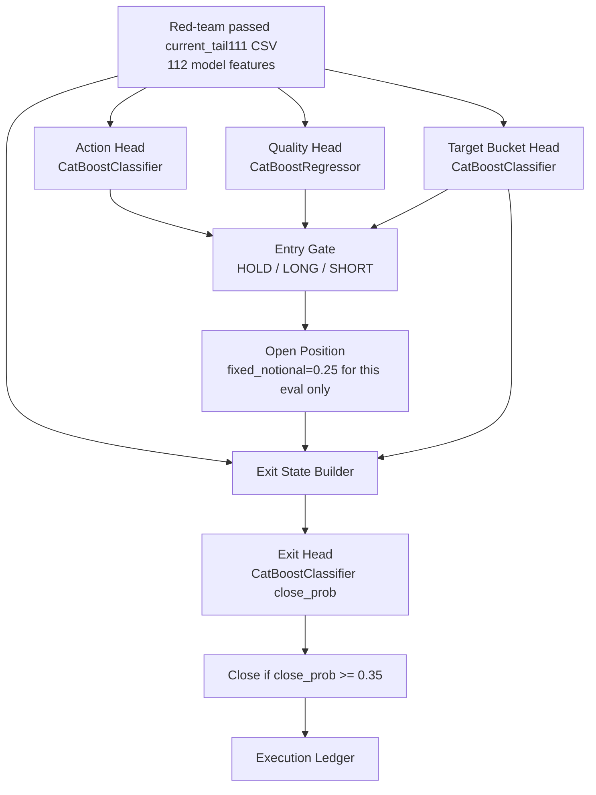

# Alpha6 Entry-Quality-Exit 5-Bucket Main Candidate Contract - 2026-05-22

## Status

- Alias: `alpha6_main_candidate`
- Name: `alpha6_entry_quality_exit_5bucket_main_20260522`
- Status: active Alpha6 main research candidate, not live-promoted.
- Training/eval variant: `current_tail111`
- Source script: `scripts/alpha6_catboost_entry_quality_exit_policy_20260522.py`
- Active artifact directory: `data/ensemble/supervised/alpha6_entry_quality_exit_5bucket_main_20260522/`
- Original experiment directory: `tmp/causal_regen_20260516/alpha6_entry_quality_exit_target_bucket5_n025_current_tail111_20260522/`

This candidate replaces the earlier Alpha6 entry-risk-exit variants as the active Alpha6 research main. It keeps only the entry/action, quality, target-horizon-bucket, and exit alpha responsibilities. Future DSAC layers are expected to own notional sizing, SL, and TP.

## Architecture

## Entry Heads

Input:
- 112 `current_tail111` model features.
- PCA disabled.
- Missing feature list is recorded in the summary; the model pipeline imputes available feature columns only.

Outputs:
- `action`: `0=HOLD`, `1=LONG`, `2=SHORT`
- `quality_score`: scalar entry edge score
- `target_bucket`: categorical thesis horizon bucket
- `target_horizon`: runtime horizon mapped from `target_bucket`
- `notional`: fixed `0.25` only for this isolated Alpha6 eval

Active entry threshold:
- `quality_score >= 0.0034163351358086967`

Target bucket mapping:
- `0 -> 6 bars`
- `1 -> 12 bars`
- `2 -> 24 bars`
- `3 -> 48 bars`
- `4 -> 96 bars`

Training label distribution:
- action: `HOLD=7424`, `LONG=9354`, `SHORT=9281`
- target bucket: `0=3362`, `1=3375`, `2=3679`, `3=3867`, `4=4352`
- quality mean: `0.0023929044543098406`
- quality p95: `0.008753208148944787`

## Exit Head

Input:
- Same 112 feature frame at the current bar.
- 27-position-state vector:
  - `side`
  - `ret`
  - `hold_frac`
  - `remaining_frac`
  - `target_horizon_frac`
  - `mae`
  - `mfe`
  - `giveback`
  - `giveback_ratio`
  - `current_atr_pct`
  - `entry_atr_pct`
  - `ret_atr`
  - `mae_atr`
  - `mfe_atr`
  - `side_obi`
  - `side_obi_delta`
  - `side_taker_delta`
  - `side_nif_whale`
  - `side_nif_whale_delta`
  - `side_eai`
  - `side_eai_delta`
  - `side_oi_delta_pct`
  - `side_funding_rate`
  - `risk_off_prob`
  - `whipsaw_prob`
  - `regime_confidence`
  - `target_bucket`

Output:
- `close_prob`

Active exit threshold:
- `close_prob >= 0.35`

Runtime guards in this experiment:
- Minimum exit hold: `2 bars`
- No TP head.
- No SL head.
- No max-hold head.
- No notional head.
- Any still-open final position is closed by the evaluation end marker.

Exit training metadata:
- exit samples: `5101`
- close label rate: `0.2803371887865124`
- sampled trade entries: `1000`
- exit state dimension: `27`
- exit label step: `8`
- exit cost multiplier: `3.0`
- exit weight scale: `80.0`
- target horizon distribution in exit training sample: `6=189`, `12=179`, `24=210`, `48=190`, `96=232`

## Selected Backtest

Selected threshold row:
- entry threshold: `0.0034163351358086967`
- exit threshold: `0.35`
- score: `2.964686439717159`

Cost1:
- PnL: `+15.296962572690598%`
- MDD: `-4.807712060281455%`
- trades: `61`
- win rate: `0.7049180327868853`
- long/short entries: `21 / 40`
- avg notional: `0.25`
- exits: `exit_model=60`, `end=1`

Cost2:
- PnL: `+14.23872598420457%`
- MDD: `-4.807174110015189%`
- trades: `63`
- win rate: `0.6825396825396826`
- long/short entries: `22 / 41`
- avg notional: `0.25`
- exits: `exit_model=62`, `end=1`

Cost3:
- PnL: `+12.044721436642503%`
- MDD: `-4.8066362801213565%`
- trades: `63`
- win rate: `0.6507936507936508`
- long/short entries: `22 / 41`
- avg notional: `0.25`
- exits: `exit_model=62`, `end=1`

## Compared Candidates

Previous EQE no target horizon:
- Cost1 `+10.368437836618627%`
- Cost2 `+4.660593828109438%`
- Cost3 `+3.1359389524173054%`
- MDD around `-7.2%`

Exact 5-horizon target without bucket state, best resweep:
- Cost1 `+11.679683%`
- Cost2 `+10.815960%`
- Cost3 `+9.586759%`
- MDD around `-4.81%`

3-bucket target:
- Cost1 `+2.049263716473404%`
- Cost2 `+1.711683731105662%`
- Cost3 `-0.6224164881104222%`
- MDD around `-8.1%`

5-bucket target is the current Alpha6 main candidate because it improves PnL and Cost3 durability while preserving the MDD improvement of the exact target-horizon variant.

## Artifacts

Active artifact directory:
- `data/ensemble/supervised/alpha6_entry_quality_exit_5bucket_main_20260522/`

Files:
- `current_tail111_bundle.joblib`
- `current_tail111_summary.json`
- `current_tail111_threshold_grid.csv`
- `current_tail111_val_predictions.csv`

SHA256:
- `current_tail111_bundle.joblib`: `49f88ba2d8133d89ee5ce6758fc9befaf23f5ea093cc9d3bc88aebae794105f4`
- `current_tail111_summary.json`: `a41350baa822fad49010893eac0256bc63ea8f762ed8c4c97454012630840be0`
- `current_tail111_threshold_grid.csv`: `0fd09ed94c09240664bdc42bc7524ff7f901a27a32f020408d0e7f8a0c83b73f`
- `current_tail111_val_predictions.csv`: `975c13912c0366c0f6ee217758aeb9511d27c971731545329a207de867a40bfc`

## Responsibility Boundary

This Alpha6 candidate owns:
- entry action alpha
- entry quality alpha
- target-horizon bucket alpha
- position-aware exit alpha

This Alpha6 candidate does not own:
- dynamic notional sizing
- SL selection
- TP selection
- L2 placement
- live exchange execution

Those responsibilities remain reserved for later DSAC / execution-layer work. Do not reintroduce TP/SL/notional heads into this Alpha6 main candidate unless explicitly running a separate ablation.

## Promotion Notes

This is not a live-promotion contract. Before live routing, run:
- canonical frozen backtest parity against the current live-style runner
- reconstructed trade-ledger audit for same-bar churn and end-position tail risk
- DSAC integration test where DSAC replaces fixed notional and later owns SL/TP
- live-bot feature-frame parity check using the same 112 model feature columns and `target_bucket` output
