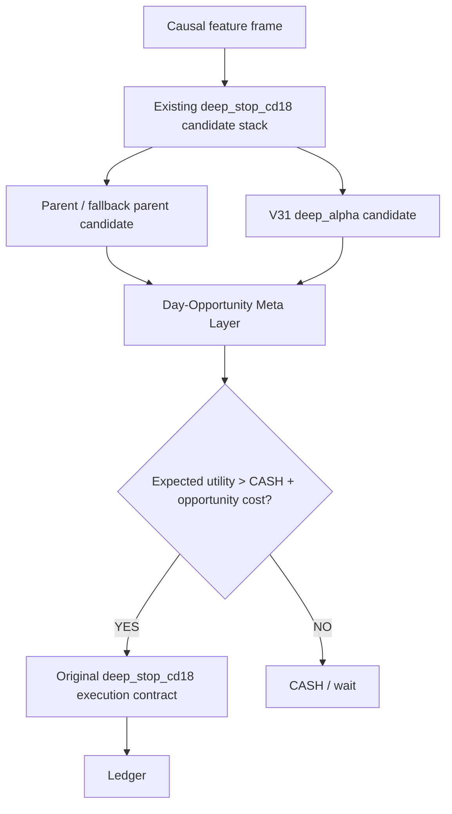

# Alpha7 Day-Opportunity Deep Stop CD18 Contract

Model ID: `alpha7_day_opportunity_deep_stop_cd18_20260529`

Status: research architecture. Not active/live.

Base stack:
- Active candidate: `alpha7_submodel_01965_decontam_deep_stop_cd18_20260528`
- Parent/fallback/deep feature contracts remain unchanged.
- Runtime execution, limit/fallback execution, ledger schema, and fail-fast feature checks remain unchanged.

## Goal

Improve `deep_stop_cd18` toward a low-turnover discretionary profile, roughly `2-3` high-quality trades per day, without adding a direct runtime trade cap, session filter, or forced quota.

The model must learn to prefer sparse high-utility opportunities. It must still be allowed to trade more or less than `2-3/day` when the expected edge justifies it.

## Non-Goals

Forbidden for this architecture:
- Hard daily max-entry counters in live/runtime path.
- Direct BEAR=ban LONG or BULL=ban SHORT rules as the main mechanism.
- Silent feature aliases or fallback feature prefixes.
- Any active/live compatibility shim for legacy regime features.

## Architecture



## Day-Opportunity Meta Layer

Role:
- It does not create a new side by itself.
- It receives candidates from the existing `deep_stop_cd18` stack.
- It accepts or rejects a candidate by predicted net utility.

Inputs:
- Current causal market features from the active Alpha7 contract.
- Candidate source: parent, fallback parent, or `deep_alpha`.
- Candidate side, quality, confidence, TP, SL, max-hold, cooldown, notional, leverage.
- Regime features: `clean_regime4_state24_sticky090_v2_*` and `regime4_pred_*`.
- Deep candidate values: `q_long`, `q_short`, side margin, selected-side utility.
- Turnover context features: bars since last entry, bars since last same-side entry, prior exit reason, recent stop-loss/giveback counts, realized daily volatility.

Outputs:
- `entry_utility`: expected cost-adjusted trade return.
- `pass_prob`: calibrated probability that candidate utility beats CASH.
- `utility_margin`: `entry_utility - cash_opportunity_cost`.
- `thesis_horizon`: learned expected hold family, not a direct session filter.

Runtime decision:
- Preserve the candidate side and execution parameters from `deep_stop_cd18`.
- Accept only when `utility_margin > 0` and `pass_prob` clears the validation-selected threshold.
- Reject as CASH when candidate utility is not high enough.

## Training Labels

Training must be candidate/event level, not every-bar forced action classification.

For each candidate emitted by parent/fallback/deep paths:

```text
net_utility =
    realized_cost3_return
    - mdd_penalty * adverse_excursion
    - stop_penalty * stopped_out
    - churn_penalty * short_hold_low_edge
    - opportunity_cost * better_future_candidate_nearby
```

Important:
- The target is not "keep top 3 trades per day".
- The target is "trade only when this candidate's expected utility beats waiting".
- Trades/day is a soft validation objective, not a runtime counter.

Validation score:

```text
score =
    pnl
    - lambda_mdd * abs(mdd)
    - lambda_sl * stop_loss_ratio
    - lambda_turnover * turnover
    - lambda_tpd * abs(trades_per_day - 2.5)
```

This score selects thresholds and model variants only. It must not become a live hard cap.

## Why This Replaces The Failed Top-K Attempt

The previous `alpha7_daytrade_parent_topk_retrain_20260528` experiment converted labels into daily top-k actions. That is a direct quota-like label transformation and it damaged OOS performance.

This contract keeps all candidates visible and asks a separate ranker to learn whether the current candidate is worth spending risk on. The expected `2-3/day` behavior should emerge from higher utility thresholds, opportunity-cost labels, and cost-aware validation.

## Promotion Criteria

Research candidate can be promoted only if all are true:
- OOS Cost3 PnL beats active `deep_stop_cd18`.
- OOS MDD does not materially worsen.
- OOS SL ratio improves or remains flat.
- Monthly Cost3 does not rely on one isolated jackpot month.
- Live/backtest parity path remains unchanged.
- Feature contract fails fast on missing or renamed features.

## Active Path Impact

None yet.

This is a research contract. Active/live `trading_bot.py` remains on `alpha7_submodel_01965_decontam_deep_stop_cd18_20260528` until a trained day-opportunity candidate passes precision retest.

## First Experiment Result

Script:
- `/home/llewyn/crypto-scalping/scripts/train_eval_alpha7_day_opportunity_meta_20260529.py`

Artifacts:
- Summary: `/home/llewyn/crypto-scalping/tmp/causal_regen_20260516/alpha7_day_opportunity_meta_deep_stop_cd18_20260529/summary.json`
- Grid: `/home/llewyn/crypto-scalping/tmp/causal_regen_20260516/alpha7_day_opportunity_meta_deep_stop_cd18_20260529/grid.csv`
- Model: `/home/llewyn/crypto-scalping/tmp/causal_regen_20260516/alpha7_day_opportunity_meta_deep_stop_cd18_20260529/day_opportunity_meta.pkl`

Result:
- Baseline `deep_stop_cd18` OOS Cost3: PnL `198.78%`, MDD `-18.22%`, trades `109`, trades/day `1.86`, SL ratio `0.110`.
- Best validation-selected day-opportunity variant: `parent_deep_prob0.66_util-0.0020`.
- That variant OOS Cost3: PnL `53.82%`, MDD `-16.93%`, trades `110`, trades/day `1.88`, SL ratio `0.100`.
- Best OOS PnL among swept variants: `91.50%`, still materially below baseline.

Decision:
- Do not promote.
- Keep the script and artifacts as a negative control.

Diagnosis:
- The first label design is not stationary enough. Candidate pass rate was `82.3%` in train, but only `31.1%` in validation and `26.5%` in OOS.
- Deep-alpha filtering removed too much jackpot convexity.
- Parent-only filtering also failed to beat baseline, which means the current candidate utility proxy is not yet strong enough to arbitrate opportunities.

Next architecture direction:
- Do not train a global binary pass gate from simple forward TP/SL labels.
- Move to walk-forward candidate utility labels and source-specific heads.
- Keep deep-alpha jackpot path mostly intact until a deep-specific opportunity model proves it can preserve top-tail winners.
