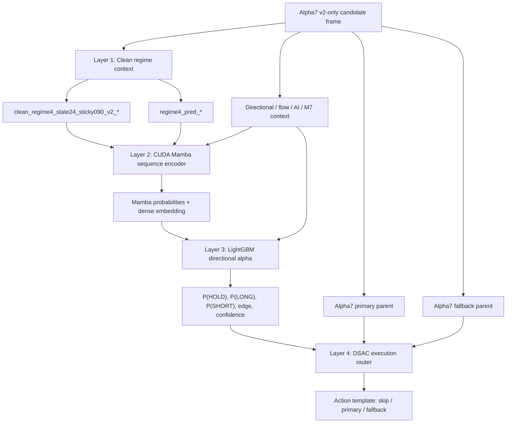

# Alpha8 Mamba + LightGBM + DSAC Hybrid Contract - 2026-05-29 KST

## Status

Research candidate only. Not wired into `trading_bot.py` and not promoted to live.

## Objective

Implement the decoupled Alpha8 architecture:

1. Use existing clean regime context as Layer 1. Alpha8 does not train a new HMM; `clean_regime4_state24_sticky090_v2_*` is the current HMM/state24 sticky v2 output surface.
2. Extract sequence representation with Mamba as Layer 2.
3. Generate directional probabilities with LightGBM as Layer 3.
4. Let DSAC handle execution routing as Layer 4.

## Implementation

- Script: `scripts/train_eval_alpha8_mamba_lgbm_dsac_20260529.py`
- Output directory: `tmp/causal_regen_20260516/alpha8_mamba_lgbm_dsac_hybrid_20260529/`
- Torch artifact: `alpha8_mamba_dsac.pt`
- LightGBM artifact: `alpha8_directional_lgbm.pkl`
- Metrics: `grid.csv`, `summary.json`

## Data Contract

- Train CSV: `tmp/causal_regen_20260516/alpha7_1_01965_v2only_tp_sl_action_score_20260528/trade_candidates_2025_alpha6_current_tail111_exact.csv`
- Eval CSV: `tmp/causal_regen_20260516/alpha7_1_01965_v2only_tp_sl_action_score_20260528/trade_candidates_2026_alpha6_current_tail111_exact.csv`
- Train/validation split: `SPLIT_TS` from `scripts/analyze_alpha7_tp_sl_action_score_20260526.py`
- OOS: 2026 candidate CSV.

Allowed regime surfaces:

- `clean_regime4_state24_sticky090_v2_*`: current HMM/state24 sticky v2 regime output.
- `regime4_pred_*`: future regime predictor output.

Forbidden active/candidate inputs:

- `clean_regime_2024_unsup_v4_*`
- `clean_regime4_2024_unsup_v1_*`

The Alpha8 script fails fast if forbidden regime prefixes appear in input frames.

## Architecture

## Training Details

Mamba:

- `seq_len`: 32
- `d_model`: 96
- `embedding_dim`: 32
- epochs: 3
- label: 12-bar future direction with 0.25% barrier.

LightGBM:

- multiclass objective: hold / long / short
- features: current context + Mamba probabilities + Mamba embedding
- train-only fitting; validation and OOS use inference only.

DSAC:

- discrete action space:
  - `0`: skip
  - `1`: use Alpha7 primary parent decision
  - `2`: use Alpha7 fallback parent decision
- state dimension: 102
- training steps: 2500
- reward: inherited from directional DSAC experiment, net-PnL and win-outcome driven with no trade-count penalty.

## Cost3 Result

| Split | Baseline PnL | Alpha8 PnL | Baseline MDD | Alpha8 MDD | Baseline Trades | Alpha8 Trades | Baseline WR | Alpha8 WR |
|---|---:|---:|---:|---:|---:|---:|---:|---:|
| Validation | 39.43 | 32.07 | -22.75 | -22.75 | 93 | 91 | 15.05% | 14.29% |
| OOS 2026 | 123.63 | 124.65 | -23.88 | -22.01 | 81 | 82 | 20.99% | 20.73% |

## Verdict

Alpha8 proves the Layer 2/3/4 wiring works and slightly improves 2026 OOS PnL/MDD, but it underperforms baseline on validation PnL and win rate. Do not promote to live.

Next Alpha8 iteration should let DSAC choose constrained size/risk templates directly instead of only selecting among `skip/primary/fallback`.
