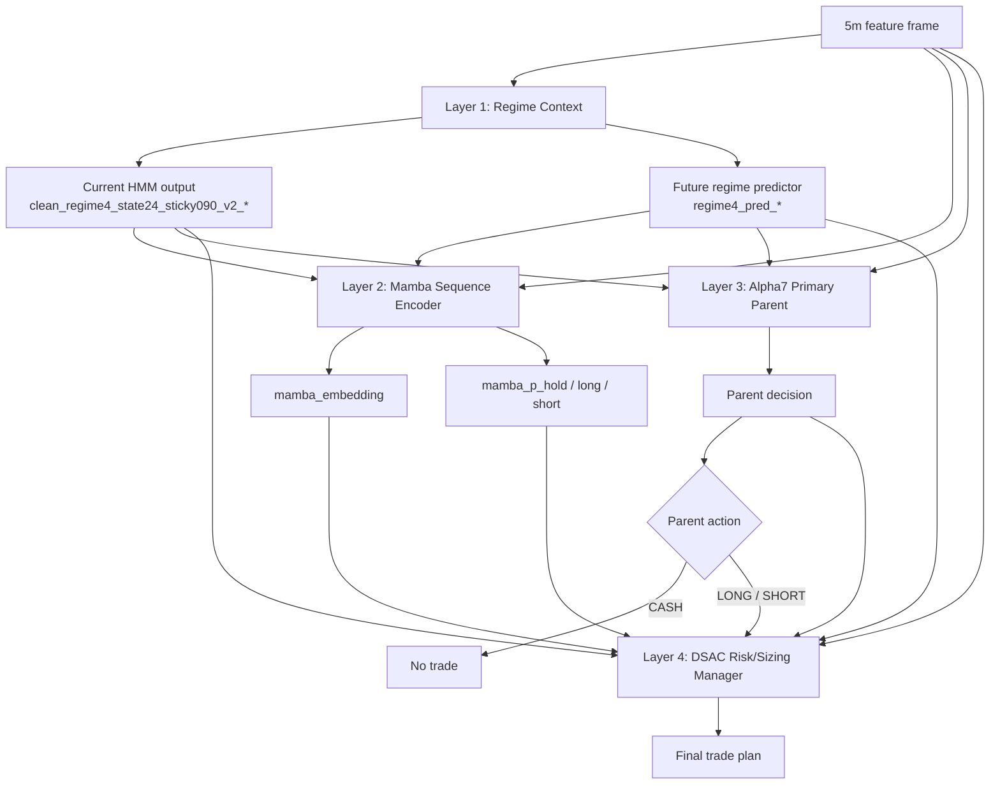

# Alpha8 Parent + DSAC Risk/Sizing Plan - 2026-05-29 KST

## Status

Trained and backtested as `alpha8_parent_dsac_risk_sizing_20260529`. Not wired into live.

## Core Change

Layer 3 LightGBM Directional Alpha is removed from the next Alpha8 plan.

Alpha7 Primary Parent owns direction and entry. DSAC owns only risk, sizing, and execution modifiers.

## Layer Diagram

## Layer Inputs And Outputs

| Layer | Inputs | Outputs | Ownership |
|---|---|---|---|
| Layer 1 Regime Context | Existing regime feature columns | Current and future regime context | Market-state context only |
| Layer 2 Mamba Encoder | Rolling sequence of market, flow, AI/M7, teacher, and regime features | `mamba_embedding`, `mamba_p_hold`, `mamba_p_long`, `mamba_p_short` | Sequence compression only |
| Layer 3 Alpha7 Primary Parent | Current feature frame, clean regime context, AI/M7, `tp_sl_action_score`, teacher/context features if certified | `action`, `side`, `quality_score`, `confidence`, base notional/leverage/TP/SL/max-hold | Direction and entry owner |
| Layer 4 DSAC Risk/Sizing | Parent output, Layer 1 regime, Layer 2 Mamba outputs, teacher agreement/risk features, market context | `veto`, `notional_bucket`, `leverage_bucket`, `tp_mult`, `sl_mult`, `hold_mult` | Risk and sizing only |
| Final Trade Plan | Parent side plus DSAC modifiers | Final side, notional, leverage, TP, SL, max-hold, execute/skip | Backtest/live execution unit |

## Layer 1 Feature Contract

Current HMM/state24 sticky v2 output:

- `clean_regime4_state24_sticky090_v2_bull_prob`
- `clean_regime4_state24_sticky090_v2_bear_prob`
- `clean_regime4_state24_sticky090_v2_chop_prob`
- `clean_regime4_state24_sticky090_v2_whipsaw_prob`
- `clean_regime4_state24_sticky090_v2_confidence`
- `clean_regime4_state24_sticky090_v2_entropy`
- `clean_regime4_state24_sticky090_v2_directional_bias`
- `clean_regime4_state24_sticky090_v2_instability_prob`
- `clean_regime4_state24_sticky090_v2_factor_trend`
- `clean_regime4_state24_sticky090_v2_factor_flow`
- `clean_regime4_state24_sticky090_v2_factor_vol`
- `clean_regime4_state24_sticky090_v2_factor_crowding`
- `clean_regime4_state24_sticky090_v2_factor_liquidity`

Future regime predictor output:

- `regime4_pred_bull_prob`
- `regime4_pred_bear_prob`
- `regime4_pred_chop_prob`
- `regime4_pred_whipsaw_prob`
- `regime4_pred_confidence`
- `regime4_pred_entropy`
- `regime4_pred_directional_bias`
- `regime4_pred_instability_prob`
- `regime4_pred_micro_prob`
- `regime4_pred_margin`

Forbidden:

- `clean_regime_2024_unsup_v4_*`
- `clean_regime4_2024_unsup_v1_*`

## DSAC Constraints

- If Parent action is `CASH`, DSAC cannot open a trade.
- If Parent action is `LONG`, DSAC cannot flip to short.
- If Parent action is `SHORT`, DSAC cannot flip to long.
- DSAC may only veto or modify risk/sizing.

## Planned DSAC Action Space

- `veto`: execute / skip
- `notional_bucket`: `0.25`, `0.5`, `1.0`, `1.5`, `2.0`, `3.0`
- `leverage_bucket`: `1`, `2`, `3`, `5`
- `tp_mult`: `0.5`, `0.75`, `1.0`, `1.25`, `1.5`
- `sl_mult`: `0.5`, `0.75`, `1.0`, `1.25`
- `hold_mult`: `0.5`, `0.75`, `1.0`

Implemented as 11 constrained templates:

- `veto`
- `tiny_defensive`
- `small_defensive`
- `base_light`
- `base_fast`
- `conviction_balanced`
- `conviction_runner`
- `aggressive_balanced`
- `aggressive_fast`
- `max_conviction`
- `max_tight`

## Teacher Feature Use

Teacher features may be used only as DSAC risk/sizing context after certification.

Allowed role:

- parent agreement/disagreement
- expected edge context
- drawdown/tail-risk context
- veto/sizing calibration

Forbidden role:

- direct action owner
- direction flip authority
- any feature derived from forbidden legacy regime prefixes

## Training Run

- Script: `scripts/train_eval_alpha8_parent_dsac_risk_sizing_20260529.py`
- Output directory: `tmp/causal_regen_20260516/alpha8_parent_dsac_risk_sizing_20260529/`
- Checkpoint: `alpha8_parent_dsac_risk.pt`
- Grid: `grid.csv`
- Summary: `summary.json`
- State dimension: 90
- DSAC action dimension: 11
- Mamba: `seq_len=32`, `d_model=96`, `embedding_dim=32`, `epochs=3`
- DSAC steps: 2500
- Forbidden legacy regime prefix count in artifact state: 0

## Cost3 Result

| Split | Variant | PnL | MDD | Trades | Trades/Day | WR | Avg Notional |
|---|---|---:|---:|---:|---:|---:|---:|
| Validation | Primary parent | 7.64 | -25.32 | 80 | 0.87 | 13.75% | 2.35 |
| Validation | Baseline combo | 39.43 | -22.75 | 93 | 1.01 | 15.05% | 2.30 |
| Validation | Alpha8 risk/sizing | 34.40 | -27.04 | 72 | 0.78 | 16.67% | 2.24 |
| OOS 2026 | Primary parent | 83.28 | -23.88 | 62 | 1.06 | 20.97% | 2.39 |
| OOS 2026 | Baseline combo | 123.63 | -23.88 | 81 | 1.38 | 20.99% | 2.41 |
| OOS 2026 | Alpha8 risk/sizing | 70.49 | -25.66 | 63 | 1.07 | 17.46% | 2.25 |

## Verdict

Do not promote.

The DSAC risk/sizing layer improved validation win rate versus primary-only but failed against the active baseline combo and materially underperformed OOS. The main issue is structural: this plan removes fallback coverage, so DSAC can only reshape the lower-coverage primary parent trades. Risk/sizing alone did not recover the missing OOS PnL.

Next iteration should keep the same direction-owner boundary but add separate DSAC risk/sizing heads for:

- primary-active trades,
- fallback-active trades,
- and primary-cash/fallback-active trades.
