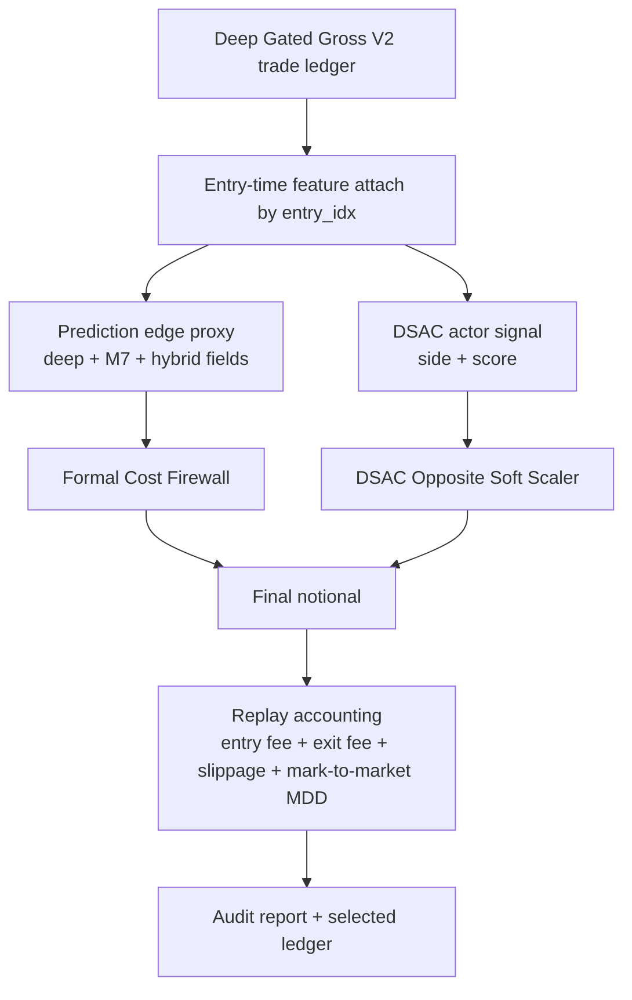

# Cost Firewall DSAC Half-Opposite 2026 Contract

## Status

Audited challenger. Backtest and audit passed, but not injected into live trading bot by this script.

## Parent

- Parent alpha: Clean Base Deep Gated Gross V2.
- Source ledger: `data/ensemble/reports/clean_base_deep_gated_gross_v2_ledger.csv`
- Feature matrix: `tmp/ai_feature_combo_grid/trade_candidates_2026_patchtst__tide__dlinear.csv`
- DSAC checkpoint: `data/ensemble/ckpt/dsac_priority1_full_retrain_20260507/best_dsac_agents.pth`
- Split date: `2026-02-01`

## Architecture

## Decision Logic

Selected candidate:

- `cost_firewall_buf_0p0035`
- `cost_buffer`: `0.0035`
- `same_threshold`: disabled
- `same_boost`: `1.0`
- `opposite_threshold`: disabled
- `opposite_action`: `none`
- `max_notional`: `3.6`

Cost firewall:

- Compute `edge_proxy` from entry-time prediction fields only.
- Compute expected equity edge as `edge_proxy * notional`.
- Compute hurdle as `2 * (fee + slip) * notional + cost_buffer`.
- If expected edge is below or equal to hurdle, set notional to `0.0`.
- Otherwise keep the original DGG V2 notional.

DSAC variants were tested, including half/veto opposite-side disagreement, but the top results tied with the pure cost firewall. The selected candidate is therefore the simpler pure cost firewall.

## Audit Invariants

- No new entries are created.
- Entry side is never flipped.
- Existing DGG V2 entry and exit timing are preserved.
- Blocked rows are retained in the selected ledger for audit.
- Final notional must stay within `[0.0, 3.6]`.
- Selection uses validation metrics only.
- Holdout metrics are report-only.
- Cost gate does not use realized PnL or future drawdown columns.
- 2x and 3x full-period cost stress must survive.

## Result

Baseline `noop_dgg_v2_replay`:

- Full PnL: `796.06%`
- Full MDD: `-24.95%`
- Trades: `363`
- 2x cost PnL: `48.75%`
- 3x cost PnL: `-75.38%`

Selected `cost_firewall_buf_0p0035`:

- Full PnL: `877.37%`
- Full MDD: `-24.95%`
- Trades: `323`
- Blocked trades: `40`
- Average notional: `3.54`
- 2x cost PnL: `253.26%`
- 3x cost PnL: `159.95%`
- Holdout PnL: `99.09%`
- Holdout MDD: `-24.95%`

## Artifacts

- Script: `scripts/experiment_cost_firewall_dsac_half_opposite_2026.py`
- Report: `data/ensemble/reports/cost_firewall_dsac_half_opposite_2026.json`
- Grid: `data/ensemble/reports/cost_firewall_dsac_half_opposite_2026_grid.csv`
- Audit: `data/ensemble/reports/cost_firewall_dsac_half_opposite_2026_audit.json`
- Selected ledger: `data/ensemble/reports/cost_firewall_dsac_half_opposite_2026_selected_ledger.csv`
