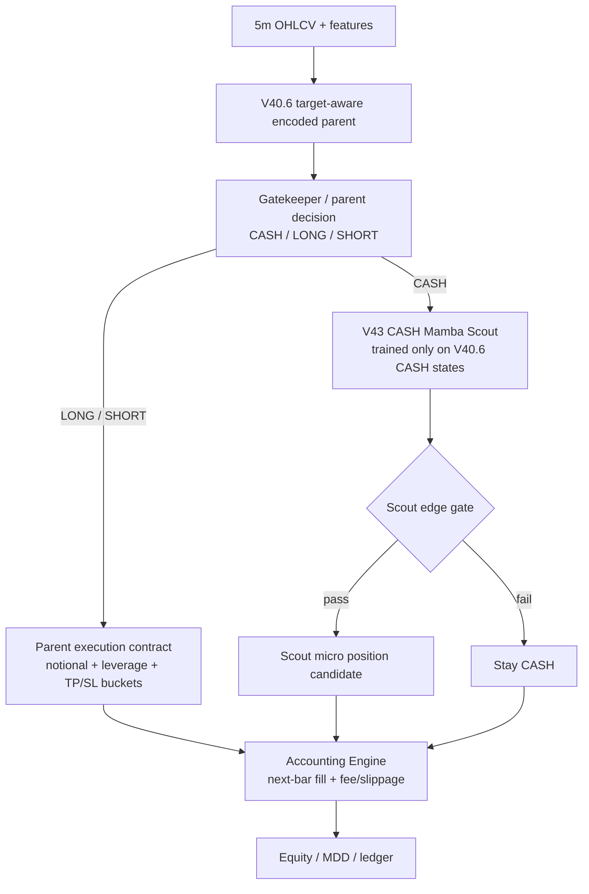

# hf_v13_v40_6_cash_mamba_scout_v43_20260512

## Verdict

- Status: `audit_pass_but_reject`
- Promoted variant: `baseline_no_deep`
- Reason: CASH-only Mamba Scout passed data/accounting audit and beat validation baseline, but failed the fixed 2026 OOS baseline gate.

## Architecture



## Inputs

- Parent model: `data/ensemble/supervised/hf_v13_tree_vs_foundation_target_aware_full_v40_6_20260512/target_aware_full_bundle.pkl`
- Parent contract: `v40_6_no_maxhold_no_cooldown`
- Scout train scope: only rows where V40.6 parent predicts `CASH`
- Sequence model: `MambaStyleSSM`
- Feature audit count: `81`
- Clean regime feature count: `23`
- Forbidden sequence columns: none

## Split

- Train: `2025-01-01 00:00:00` to `2025-09-30`, with 2025 data frame available through selection construction
- Selection: `2025-10-01` to `2025-12-31`
- OOS: fixed 2026 evaluation after selection
- Selection uses 2026: `false`
- Train/eval timestamp overlap: `0`

## Training Run

- Command: `CUDA_VISIBLE_DEVICES=0 HF_HUB_OFFLINE=1 TRANSFORMERS_OFFLINE=1 /home/llewyn/miniconda3/envs/quant_ai/bin/python -u scripts/eval_hf_v13_v40_6_cash_mamba_scout_v43.py --epochs 8 --batch-size 512 --scout-stride 6`
- Note: this is a fast validation retrain. The first 40-epoch attempt was stopped because epoch time was too high for this iteration.
- Final training loss at epoch 8: `0.0002245576`

## Selected Scout Config

```json
{
  "name": "v42_ultra_precision_e0.022_n0.60_nohold_cd",
  "edge_th": 0.022,
  "margin_th": 0.0099,
  "notional": 0.6,
  "cooldown": 0,
  "base_tp": 0.03,
  "base_sl": 0.014,
  "base_hold": 0,
  "tp_util_mult": 0.8,
  "sl_vol_mult": 2.2,
  "trail_gap_mult": 0.7,
  "trail_decay": 0.7,
  "hold_decay_start": 12,
  "hold_decay_rate": 0.035,
  "tp_cap": 0.055,
  "sl_cap": 0.028
}
```

## Validation Result

The scout candidate beat the validation baseline score:

- Baseline selection score: `217.4289`
- Scout selection score: `390.0288`
- Validation scout metrics:
  - cost1 PnL `+349.78%`, MDD `-26.48%`, trades `112`, deep entries `72`
  - cost2 PnL `+89.21%`
  - cost3 PnL `+63.97%`

## Fixed 2026 OOS Result

| Variant | Cost | PnL | MDD | Trades | Trades/day | Deep entries |
|---|---:|---:|---:|---:|---:|---:|
| Baseline no deep | cost1 | `+133.37%` | `-34.00%` | 47 | 0.80 | 0 |
| Baseline no deep | cost2 | `+60.98%` | `-39.46%` | 49 | 0.84 | 0 |
| Baseline no deep | cost3 | `+58.65%` | `-44.57%` | 51 | 0.87 | 0 |
| V43 scout candidate | cost1 | `+46.70%` | `-33.75%` | 148 | 2.52 | 107 |
| V43 scout candidate | cost2 | `-18.96%` | `-43.36%` | 162 | 2.76 | 117 |
| V43 scout candidate | cost3 | `-27.33%` | `-46.93%` | 161 | 2.74 | 117 |

## Audit

- Audit status: `pass`
- Blocking issues: none
- Final verdict: `reject`
- Warnings:
  - missing train features zero-filled: `garch_vol_z`, `jump_z`, `jump_flag`, `evt_tail_flag`, `evt_excess_z`, `funding_abs`, `funding_pressure`, `crowding_pressure`, `whale_conviction`, `patchtst_pred`, `patchtst_confidence`
  - missing eval features zero-filled: `patchtst_pred`, `patchtst_confidence`
  - CASH Mamba Scout rejected by OOS baseline gate
  - CASH Mamba Scout did not beat no-hold baseline cost1
- DSAC Sniper: deferred, not wired in this backtest.

## Conclusion

V43 confirms that adding a separately trained CASH scout increases trade count, but the added trades are not profitable enough under fixed 2026 OOS and become cost-fragile at 2x/3x costs. Do not inject this scout into `trading_bot.py`.

The current main candidate remains `v40_6_no_maxhold_no_cooldown` without Deep Scout.

Next architecture direction:

- Build Stage1/Stage2 cascade with OOF predictions instead of keeping full V40.6 parent as a black box.
- Train Stage2 tactician only on Stage1 entry rows.
- Add a scout only after it passes a stricter OOS cost gate.
- Treat DSAC as a separate v43.1/v44 execution layer after schema and attribution audit.
