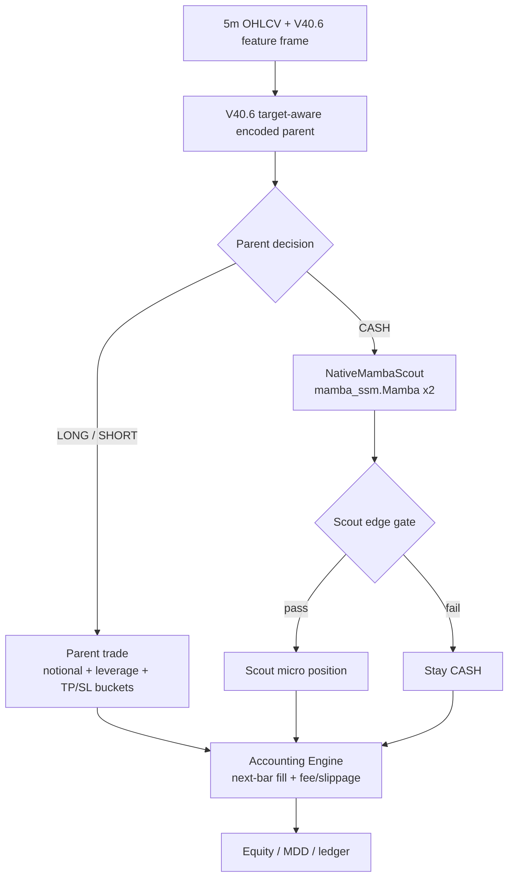

# hf_v13_v40_6_cash_native_mamba_scout_v43_1_20260512

## Verdict

- Status: `audit_pass_but_reject`
- Promoted variant: `baseline_no_deep`
- Reason: native `mamba-ssm` scout improved over the custom Mamba-style scout, but still failed the fixed 2026 OOS baseline PnL gate.

## Environment Change

Installed native Mamba dependencies in `quant_ai`:

- `cuda-nvcc=13.0.88` via conda, to match Torch `2.11.0+cu130`
- `causal-conv1d==1.6.2.post1`
- `mamba-ssm==2.3.2.post1`

Native forward smoke test passed:

```text
mamba_ssm 2.3.2.post1
out (2, 72, 32) torch.float32 True
```

## Architecture



## Native Scout

Input:

- Sequence length: `72`
- Feature count: `81`
- Train scope: only rows where V40.6 parent predicts `CASH`

Model:

```text
Linear(input_dim -> 96)
Mamba(d_model=96, d_state=16, d_conv=4, expand=2)
LayerNorm residual
Mamba(d_model=96, d_state=16, d_conv=4, expand=2)
LayerNorm residual
Concat(mean_pool, last_step)
Linear(192 -> 96) + GELU + Dropout(0.10)
Linear(96 -> 2)
Output: q_long, q_short
```

## Split

- Train: `2025-01-01` to `2025-09-30`
- Selection: `2025-10-01` to `2025-12-31`
- OOS: fixed 2026 after selection
- Selection uses 2026: `false`
- Train/eval timestamp overlap: `0`

## Training Run

```bash
PATH=/home/llewyn/miniconda3/envs/quant_ai/bin:$PATH \
CUDA_HOME=/home/llewyn/miniconda3/envs/quant_ai \
CUDA_VISIBLE_DEVICES=0 \
HF_HUB_OFFLINE=1 \
TRANSFORMERS_OFFLINE=1 \
/home/llewyn/miniconda3/envs/quant_ai/bin/python -u \
scripts/eval_hf_v13_v40_6_cash_mamba_scout_v43.py \
  --mamba-backend native \
  --epochs 8 \
  --batch-size 512 \
  --scout-stride 6 \
  --out-dir data/ensemble/supervised/hf_v13_v40_6_cash_native_mamba_scout_v43_1_20260512 \
  --report-out data/ensemble/reports/hf_v13_v40_6_cash_native_mamba_scout_v43_1_20260512_summary.json \
  --audit-out data/ensemble/reports/hf_v13_v40_6_cash_native_mamba_scout_v43_1_20260512_audit.json \
  --grid-out data/ensemble/reports/hf_v13_v40_6_cash_native_mamba_scout_v43_1_20260512_grid.csv
```

Training loss:

- epoch 1: `0.0028629673`
- epoch 5: `0.0002164151`
- epoch 8: `0.0001270675`

## Selected Config

```json
{
  "name": "v42_ultra_precision_e0.030_n0.60_nohold_cd",
  "edge_th": 0.03,
  "margin_th": 0.0135,
  "notional": 0.6,
  "cooldown": 0,
  "base_tp": 0.03,
  "base_sl": 0.014,
  "base_hold": 0,
  "tp_util_mult": 0.8,
  "sl_vol_mult": 2.2,
  "trail_gap_mult": 0.7,
  "trail_decay": 0.7,
  "hold_decay_start": 12,
  "hold_decay_rate": 0.035,
  "tp_cap": 0.055,
  "sl_cap": 0.028
}
```

## Validation

- Baseline selection score: `217.4289`
- Native scout selection score: `360.6520`
- Validation selected config:
  - cost1 PnL `+327.54%`
  - MDD `-39.73%`
  - trades `95`
  - deep entries `13`
  - cost2 PnL `+95.07%`
  - cost3 PnL `+74.76%`

## Fixed 2026 OOS

| Variant | Cost | PnL | MDD | Trades | Trades/day | Deep entries |
|---|---:|---:|---:|---:|---:|---:|
| Baseline no deep | cost1 | `+133.37%` | `-34.00%` | 47 | 0.80 | 0 |
| Baseline no deep | cost2 | `+60.98%` | `-39.46%` | 49 | 0.84 | 0 |
| Baseline no deep | cost3 | `+58.65%` | `-44.57%` | 51 | 0.87 | 0 |
| Native Mamba scout | cost1 | `+100.32%` | `-24.76%` | 73 | 1.24 | 35 |
| Native Mamba scout | cost2 | `+10.79%` | `-43.29%` | 74 | 1.26 | 30 |
| Native Mamba scout | cost3 | `+27.85%` | `-47.90%` | 70 | 1.19 | 27 |

## Audit

- Audit status: `pass`
- Blocking issues: none
- Final verdict: `reject`
- Forbidden sequence columns: none
- Feature count: `81`
- Clean regime feature count: `23`
- Warnings:
  - missing train features zero-filled: `garch_vol_z`, `jump_z`, `jump_flag`, `evt_tail_flag`, `evt_excess_z`, `funding_abs`, `funding_pressure`, `crowding_pressure`, `whale_conviction`, `patchtst_pred`, `patchtst_confidence`
  - missing eval features zero-filled: `patchtst_pred`, `patchtst_confidence`
  - Native Mamba scout rejected by OOS baseline gate
  - Native Mamba scout did not beat no-hold baseline cost1

## Conclusion

Native `mamba-ssm` is materially better than the custom Mamba-style scout from v43:

- custom v43 cost1: `+46.70%`, MDD `-33.75%`, deep entries `107`
- native v43.1 cost1: `+100.32%`, MDD `-24.76%`, deep entries `35`

However, it still does not beat the current no-deep V40.6 baseline PnL and loses cost2/cost3 durability. Do not inject into `trading_bot.py`.

Useful next step:

- Retain native Mamba as an MDD-reducing scout candidate.
- Add a stricter cost-aware calibration head before enabling live scout trades.
- Compare against an OOF Stage1/Stage2 cascade parent instead of attaching scout to the full V40.6 black-box parent.
