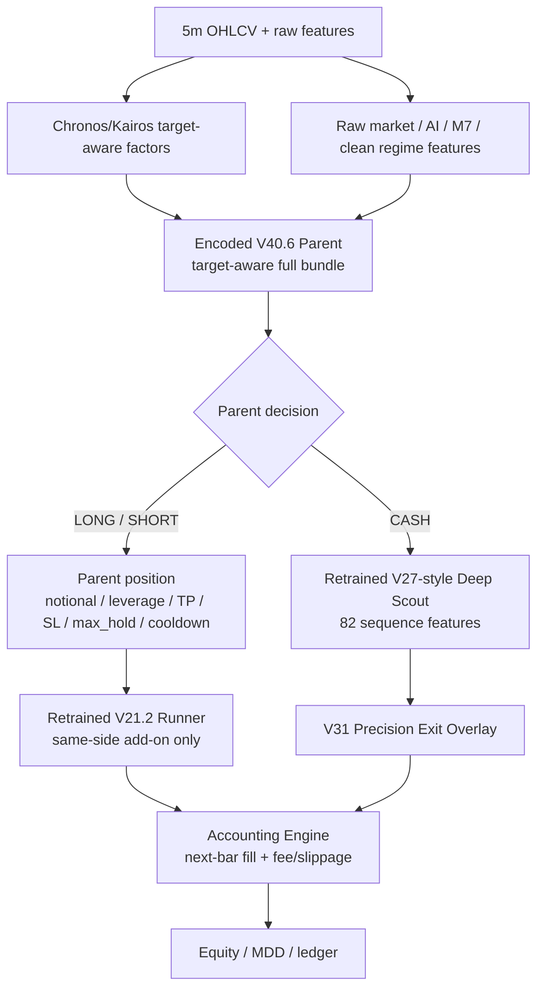

# hf_v13_v40_6_encoded_parent_v31_all_retrain_v44_20260512

## Verdict

- Status: `audit_pass_but_reject`
- Promoted variant: none
- Reason: replacing the V31 parent with the encoded V40.6 main parent and retraining the surrounding V21.2 runner + Deep Scout improved the previous frozen-V27 encoded-parent stack, but failed the current V40.6 no-deep PnL and cost3 survival gates.

## Scope

This experiment uses the previous V31 stack idea, but swaps the parent to:

```text
data/ensemble/supervised/hf_v13_tree_vs_foundation_target_aware_full_v40_6_20260512/target_aware_full_bundle.pkl
```

Then it retrains/reselects the stack around that parent:

- V21.2 cost-stressed runner: retrained on encoded parent frame
- V27-style Deep Scout: retrained on encoded frame, with macro/micro encoded factors included in sequence input
- V31 rule exit overlay: reselected on 2025 Q4 validation

The parent artifact itself is reused because it is already the trained encoded-feature main parent.

## Architecture



## Data Split

- Train: `2025-01-01` to `2025-09-30`
- Selection: `2025-10-01` to `2025-12-31`
- OOS: fixed 2026 after selection
- Selection uses 2026: `false`
- Train/eval timestamp overlap: `0`

## Retraining Details

Command:

```bash
PATH=/home/llewyn/miniconda3/envs/quant_ai/bin:$PATH \
CUDA_HOME=/home/llewyn/miniconda3/envs/quant_ai \
CUDA_VISIBLE_DEVICES=0 \
HF_HUB_OFFLINE=1 \
TRANSFORMERS_OFFLINE=1 \
/home/llewyn/miniconda3/envs/quant_ai/bin/python -u \
scripts/eval_hf_v13_v40_6_encoded_parent_v31_all_retrain_v44.py \
  --deep-epochs 40 \
  --deep-batch-size 256 \
  --deep-stride 3
```

Deep Scout training:

- Architecture: V27-style TCN
- Input sequence length: `72`
- Sequence feature count: `82`
- Added encoded features: `macro_factor_000`, `micro_factor_000`
- Train snapshots: `26149`
- Target mean: `[0.003998, 0.003748]`
- Final epoch loss: `1.4978e-05`

## Selected Stack

V21.2 runner:

```json
{
  "name": "v21_2_jackpot_runner_4",
  "p_th": 0.6,
  "q10_floor": -0.006,
  "jackpot_p": 0.35,
  "jackpot_q90": 0.015,
  "bad_cap": 0.35,
  "min_unrealized": 0.004,
  "min_bars_since_entry": 3,
  "full_add_frac": 0.2,
  "max_total_mult": 1.35,
  "max_entry_notional": 2.75,
  "dd_block": 0.3
}
```

V31 overlay:

```json
{
  "name": "v31_precision",
  "edge_th": 0.012,
  "margin_th": 0.005,
  "notional": 1.0,
  "cooldown": 12,
  "base_tp": 0.038,
  "base_sl": 0.017,
  "base_hold": 48,
  "tp_util_mult": 1.2,
  "sl_vol_mult": 2.3,
  "trail_gap_mult": 0.8,
  "trail_decay": 0.7,
  "hold_decay_start": 18,
  "hold_decay_rate": 0.03,
  "tp_cap": 0.07,
  "sl_cap": 0.032
}
```

## Fixed 2026 OOS

| Model | Cost | PnL | MDD | Trades | Trades/day | Deep entries |
|---|---:|---:|---:|---:|---:|---:|
| Frozen-V27 encoded-parent stack | cost1 | `+67.39%` | `-38.22%` | 148 | 2.52 | 97 |
| V44 all-retrain stack | cost1 | `+83.74%` | `-30.43%` | 212 | 3.61 | 167 |
| V44 all-retrain stack | cost2 | `+14.49%` | `-38.66%` | 212 | 3.61 | 166 |
| V44 all-retrain stack | cost3 | `-18.24%` | `-40.42%` | 224 | 3.82 | 174 |
| V40.6 no-deep baseline | cost1 | `+133.37%` | `-34.00%` | 47 | 0.80 | 0 |

## Audit

- Audit status: `pass`
- Final verdict: `reject`
- Blocking issues: none
- Forbidden sequence columns: none
- Feature count: `81`
- Clean regime feature count: `23`
- Sequence feature count: `82`
- Warnings:
  - missing train features zero-filled: `garch_vol_z`, `jump_z`, `jump_flag`, `evt_tail_flag`, `evt_excess_z`, `funding_abs`, `funding_pressure`, `crowding_pressure`, `whale_conviction`, `patchtst_pred`, `patchtst_confidence`
  - missing eval features zero-filled: `patchtst_pred`, `patchtst_confidence`
  - `cost3_not_survived`

## Interpretation

V44 is directionally better than the earlier encoded-parent V31 stack:

- PnL improved from `+67.39%` to `+83.74%`
- MDD improved from `-38.22%` to `-30.43%`
- Trades/day rose from `2.52` to `3.61`

But it still should not be promoted:

- It does not beat the current V40.6 no-deep PnL `+133.37%`
- cost3 is negative
- Deep Scout is still producing too many stop-loss exits:
  - `deep_alpha_stop_loss`: `108`
  - `deep_alpha_take_profit`: `2`

## Artifacts

- Script: `scripts/eval_hf_v13_v40_6_encoded_parent_v31_all_retrain_v44.py`
- Report: `data/ensemble/reports/hf_v13_v40_6_encoded_parent_v31_all_retrain_v44_20260512_summary.json`
- Audit: `data/ensemble/reports/hf_v13_v40_6_encoded_parent_v31_all_retrain_v44_20260512_audit.json`
- Grid: `data/ensemble/reports/hf_v13_v40_6_encoded_parent_v31_all_retrain_v44_20260512_grid.csv`
- Runner: `data/ensemble/supervised/hf_v13_v40_6_encoded_parent_v31_all_retrain_v44_20260512/v44_retrained_v21_2_runner.pkl`
- Deep Scout: `data/ensemble/supervised/hf_v13_v40_6_encoded_parent_v31_all_retrain_v44_20260512/v44_retrained_deep_scout.pt`

## Next Step

The parent swap itself is not the problem. The weak point is the Deep Scout sleeve: it increases turnover and reduces MDD, but it leaks too much PnL through stop-loss churn and cost3 failure.

Next experiment should keep the encoded V40.6 parent and retrained runner, but replace the scout admission rule with a cost-aware scout calibration head or run scout in MDD-reduction mode only.
