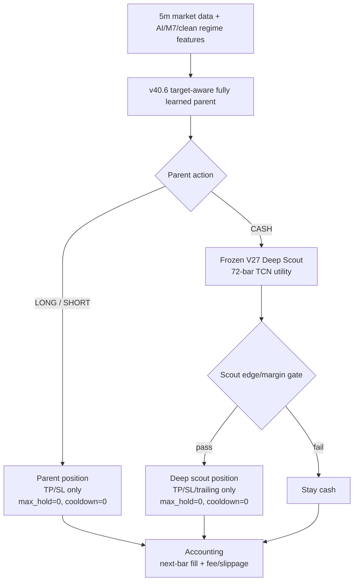

# hf_v13 v40.6 No-Hold Deep Scout V42 Contract

## Scope

- Model ID: `hf_v13_v40_6_nohold_deep_scout_v42_20260512`
- Status: `rejected_after_oos`
- Parent: `hf_v13_tree_vs_foundation_target_aware_full_v40_6_20260512`
- Parent execution contract: `v40_6_no_maxhold_no_cooldown`
- Scout: frozen V27 Deep Scout TCN
- Script: `/home/llewyn/crypto-scalping/scripts/eval_hf_v13_v40_6_nohold_deep_scout_v42.py`
- Report: `/home/llewyn/crypto-scalping/data/ensemble/reports/hf_v13_v40_6_nohold_deep_scout_v42_20260512_summary.json`
- Audit: `/home/llewyn/crypto-scalping/data/ensemble/reports/hf_v13_v40_6_nohold_deep_scout_v42_20260512_audit.json`

## Architecture



## Selected Scout Candidate

Validation selected the ultra-precision scout:

```json
{
  "name": "v42_ultra_precision_e0.026_n0.40_nohold_cd",
  "edge_th": 0.026,
  "margin_th": 0.0117,
  "notional": 0.4,
  "cooldown": 0,
  "base_tp": 0.03,
  "base_sl": 0.014,
  "base_hold": 0,
  "tp_util_mult": 0.8,
  "sl_vol_mult": 2.2,
  "trail_gap_mult": 0.7,
  "hold_decay_start": 12,
  "hold_decay_rate": 0.035,
  "tp_cap": 0.055,
  "sl_cap": 0.028
}
```

## Split

```text
Train / projection fit: 2025-01-01 ~ 2025-09-30
Selection:              2025-10-01 ~ 2025-12-31
OOS:                    fixed 2026 window
```

No 2026 labels are used for selection.

## OOS Result

| Model | Cost | PnL | MDD | Trades | Deep entries |
|---|---:|---:|---:|---:|---:|
| v40.6 no-hold baseline | 1x | `+133.37%` | `-34.00%` | 47 | 0 |
| v42 Deep Scout candidate | 1x | `+52.83%` | `-47.11%` | 53 | 15 |
| v40.6 no-hold baseline | 2x | `+60.98%` | `-39.46%` | 49 | 0 |
| v42 Deep Scout candidate | 2x | `+9.04%` | `-50.45%` | 66 | 16 |
| v40.6 no-hold baseline | 3x | `+58.65%` | `-44.57%` | 51 | 0 |
| v42 Deep Scout candidate | 3x | `+4.98%` | `-56.52%` | 58 | 15 |

## Verdict

Reject for promotion.

Validation allowed a Deep Scout candidate, but fixed 2026 OOS showed the scout degraded the no-hold v40.6 baseline across PnL and MDD. The main promoted variant remains:

```text
v40_6_no_maxhold_no_cooldown
```

## Red Team Notes

- Data/accounting audit status: `pass`
- Blocking issues: none
- No effective `max_hold` exit detected.
- No effective cooldown action detected.
- Deep Scout is allowed only when parent is `CASH`.
- Performance gate failed: candidate did not beat the no-hold baseline on 2026 OOS.

## Follow-Up

Do not attach frozen V27 Deep Scout directly to v40.6 no-hold as a live sleeve. If a scout layer is revisited, retrain the scout against v40.6 CASH states specifically, rather than reusing the old V27 model trained around the previous parent regime.
