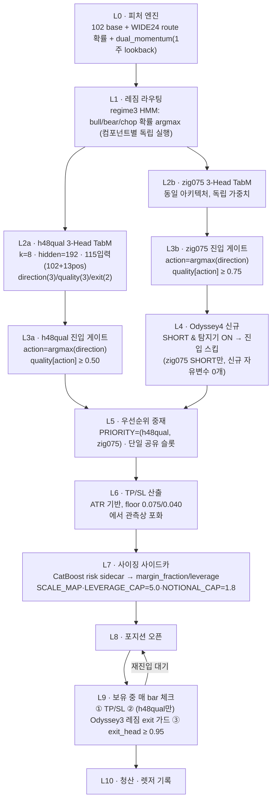
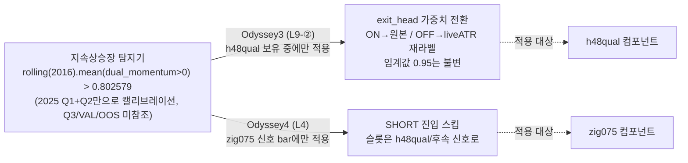
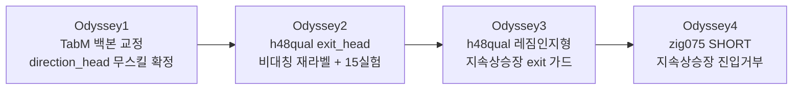

# Odyssey4 — ETH Omega4.6.1 라이브 의사결정 전체 레이어 (2026-08-14)

이 문서는 계약 문서가 아니라 **참고용 아키텍처 요약**이다. `docs/model_contracts/odyssey4_eth_entry_veto_baseline_contract_20260814.md`가 결과·판정을 다루고, 이 문서는 그 판정이 어느 계층에서 일어나는지, 피처부터 렛저 기록까지 전체 파이프라인을 계층별로 펼쳐서 보여준다. Odyssey1~4가 각 계층에 무엇을 추가했는지도 함께 표시한다.

시각 자료 버전(다이어그램 렌더링 포함)은 아티팩트로도 발행돼 있다 — 이 문서 하단 "관련 문서" 참고.

## 한눈에 보기

| 세대 | 추가한 계층 | 대상 | 지위 |
|---|---|---|---|
| Odyssey1 | 3-Head TabM 백본 교정 + h48_conservative 라벨 재설계, direction_head 무스킬 확정(N≥5, 7개 이상 독립 조합) | h48qual | 라이브 배포됨(원본 가중치) |
| Odyssey2 | h48qual exit_head 비대칭 재라벨(liveATR 스케일) + 15개 실험(전부 부정 결과) | h48qual exit-side | 섀도우 배포됨 |
| Odyssey3 | h48qual 레짐인지형 지속상승장 exit 가드(탐지기 도입) | h48qual exit-side | 섀도우 배포됨(서버 상시) |
| **Odyssey4** | **zig075 SHORT 지속상승장 진입거부**(Odyssey3 탐지기 재사용, 자유변수 0개) | zig075 entry-side | **연구 확정, 섀도우 미배포** |

## 전체 파이프라인 (L0~L8)



## 계층별 상세

### L0 — 피처 엔진

- 입력: 원시 OHLCV + 파생 피처(`features/engineering.py`) — 라이브 컴포넌트가 실제 소비하는 것은 **102 base 피처 + 13 pos 피처(진입 시 0으로 채움) = 115차원**.
- 이 문서의 핵심 인물: `dual_momentum` — 이미 1주(2016-bar) lookback을 가진 신호.
  ```text
  abs_momentum = close / close.shift(2016) - 1
  btc_momentum = close_btc / close_btc.shift(2016) - 1
  rel_momentum = abs_momentum - btc_momentum
  dual_momentum = +1  (abs>0 and rel>0)
                = -1  (abs<0 and rel<0)
                =  0  (그 외)
  ```
- WIDE24 route 확률(regime3 컬럼)도 이 계층에서 함께 로드된다.

### L1 — 레짐 라우팅

- `regime3_current_sensitive_wide24_{bull,bear,chop}_prob` 3열의 argmax로 전문가(expert)를 선택. h48qual·zig075 각각 독립적으로 라우팅.

### L2 — 3-Head TabM (컴포넌트별)

- 아키텍처: `k=8` 파라메트릭 앙상블, `hidden=192`, `layers=3`, `dropout=0.08`.
- 헤드 3개: `direction`(3클래스: CASH/LONG/SHORT), `quality`(3클래스, direction과 동일 축), `exit`(2클래스, 보유 중에만 조회).
- h48qual과 zig075는 **같은 아키텍처, 독립적으로 학습된 가중치** — 라벨 계열이 다르다(h48qual=`zigzagfix_06`+48bar ATR barrier quality; zig075=`zigzag_action`+동일 라벨의 quality, `quality_mode=same_as_direction`).

### L3 — 진입 게이트 (컴포넌트별)

```text
action           = argmax(direction)
quality_for_action = quality[action]
final_action     = action  if (action != CASH and quality_for_action >= quality_threshold)
                  = CASH   otherwise
side             = +1 (LONG) / -1 (SHORT) / 0 (CASH)
```

- `quality_threshold`: h48qual **0.50**, zig075 **0.75**.
- **이 게이트는 스킬 창출 장치가 아니다** — Odyssey1이 N≥5 시드로 확정: ungated `direction_head`는 always-short에 VAL/OOS 0/5 패배. 게이트는 방향 예측의 부분집합을 고를 뿐, 그 소스에 없는 스킬을 만들지 못한다. 이것이 Odyssey1~2의 entry-side 실험 29건이 전부 실패한 근본 이유다(`docs/model_contracts/odyssey_eth_h48qual_corrected_tabm_20260811_contract.md`).

### L4 — Odyssey4 신규: zig075 SHORT 지속상승장 진입거부

- 조건: `component == zig075 AND side == SHORT AND 탐지기(신호 bar) == ON` → 그 진입 스킵.
- 탐지기(Odyssey3에서 이미 잠금, 여기서는 순수 재사용):
  ```text
  score  = rolling(2016, min_periods=2016).mean(dual_momentum > 0)
  active = score > threshold          # threshold = 0.8025793650793651
  threshold = p90( score, 2025-01-01 ~ 2025-06-30 만 )   # Q3/VAL/OOS 미참조
  ```
- **신규 자유변수 0개** — 공식·집계창·백분위·표본기간 전부 Odyssey3 상속. zig075 LONG, h48qual, 모든 threshold/TP/SL/사이징/priority/exit-side는 무변경.
- 왜 이 계층이 성공했는가: 모델 헤드를 건드리지 않고, 모델 내부 신호(quality/방향확신도)로 부분집합을 고르지도 않는다(그 축은 Q3 승자·패자를 분리하지 못함이 이미 확인됨). 대신 외부 causal 레짐 신호로 숏 베타 노출 자체를 관리한다.
- 결과: 2025-Q3(참고 티어) `with_gate` −15.86% → **+20.17%**(부호 반전), MDD −44.37% → −19.72%. 판정 3창(VAL/OOS-Q1/OOS-Q2)은 무손상(OOS 두 창은 발동 0건). 전체 근거: `docs/experiments/eth_omega461_zig075_short_entry_veto_sustained_uptrend_20260814.md`.

### L5 — 우선순위 중재 / 단일 공유 슬롯

- `PRIORITY = ("h48qual", "zig075")` — flat 상태에서 h48qual이 먼저 신호를 내면 그 bar엔 zig075를 아예 조회하지 않는다(zig075는 h48qual이 `side==0`을 반환한 bar에서만 기회를 얻음).
- 포트폴리오 전체에 **열린 포지션은 항상 최대 1개** — 두 컴포넌트가 슬롯을 공유한다. 이 때문에 L4의 진입거부는 단순히 "거래를 지운다"가 아니라 **슬롯을 다른 신호(주로 h48qual)에 넘긴다** — 렛저 diff 확인 결과 Q3에서 제거된 zig075 손절 8건의 슬롯 중 4건을 h48qual이 이어받았다.

### L6 — TP/SL 산출

```text
tp = clip(max(0.075, atr_pct * 12), 0, 0.22)
sl = clip(max(0.040, atr_pct * 6),  0, 0.12)
```

- 관측된 2025 세 분기 전부에서 **floor(0.0750/0.0400)에 정확히 포화** — ATR-적응형이라는 이름과 달리 사실상 고정폭으로 작동 중(Odyssey1 미해결 이슈 15, 버그인지 의도인지 미확정).

### L7 — 사이징 사이드카

- CatBoost 기반 risk sidecar가 `margin_fraction`, `leverage`를 산출 → `long_scale`/`short_scale`, `long_leverage_scale`/`short_leverage_scale`로 방향별 보정.
- 포트폴리오 캡: `SCALE_MAP["zig075_S"]=2.478`(레버리지 배율) → `LEVERAGE_CAP=5.0`, `NOTIONAL_CAP=1.8`로 클립.
- 사이징은 방향(side)을 절대 뒤집거나 거부하지 않는다 — `notional<=0`으로 무효화만 가능.

### L8~L9 — 포지션 오픈 · 보유 중 체크

보유 중 매 bar마다 순서대로 확인(먼저 걸리면 이후는 조회하지 않음):

1. `take_profit`/`stop_loss` 도달 여부(가격 기준, 항상 우선).
2. **h48qual 포지션에 한해서만** — Odyssey3 레짐인지형 exit 가드: 같은 탐지기가 그 bar에 ON이면 exit_head를 **원본(재라벨 전) 가중치**로 조회, OFF면 현재 라이브의 liveATR 재라벨 가중치로 조회. 임계값은 어느 쪽이든 0.95로 동일 — **가중치만 전환**.
3. exit_head 확률 ≥ **0.95**(`EXIT_THRESHOLD`, 정적) → 청산.
   - zig075는 이 확률이 세 분기 통틀어 단 한 번도 0.95를 넘지 않았다(0/53건 관측) — zig075 포지션은 사실상 TP/SL로만 청산된다(Odyssey3 실행 로그 #1).

### L10 — 청산 · 렛저 기록

- 청산가·수수료·슬리피지 반영 후 `trade_return` 확정, 렛저(csv) append. 다음 bar부터 다시 flat 상태(L5)로 진입 루프 재개.

## 같은 탐지기, 두 개의 결정 지점

Odyssey3과 Odyssey4는 **완전히 같은 탐지기 인스턴스**를 파이프라인의 서로 다른 두 지점에 연결한다 — 하나는 이미 열린 포지션의 청산(exit) 판단, 다른 하나는 새 포지션의 진입(entry) 판단.



두 계층 모두 **같은 이유로 성립한다**: 이미 검증되고 잠긴(Q3를 본 적 없는) 신호를 재사용할 뿐, 새 숫자를 하나도 발명하지 않는다. 차이는 파이프라인상의 위치뿐이다 — h48qual은 exit_head가 실제로 자주 관여하는 컴포넌트라 가중치 "전환"이 손잡이가 되지만, zig075는 exit_head가 구조적으로 거의 관여하지 않는 컴포넌트(0/53건)라 exit-side엔 손잡이가 없고 entry-side veto만 유효했다(Odyssey3 실행 로그 #1의 핵심 결론).

## 세대별 계보



## 검증 결과 (Odyssey4 신규 계층만, 나머지는 Odyssey1~3에서 이미 판정)

| 창 | 티어 | 베이스라인(Odyssey3) with_gate | Odyssey4 with_gate | 판정 |
|---|---|---|---|---|
| 2025-Q1 | 참고 | 44.98% | 44.98%(동일) | — |
| 2025-Q2 | 참고 | 31.49% | 5.62% | — (비용, Q2 승리 숏 1건 제거) |
| **2025-Q3** | 참고 | −15.86% | **+20.17%** | — (목표 효과) |
| VAL | 판정 | 77.31% | 77.31%(동일) | 통과 |
| OOS-Q1 | 판정 | 67.25% | 67.25%(동일, 발동 0건) | 통과 |
| OOS-Q2 | 판정 | −12.69% | −12.69%(동일, 발동 0건) | 통과 |

전체 판정: `CONFIRMED`(strict, relaxed 동일). 상세 표·렛저 diff·강건성(p75/p95)은
`docs/experiments/eth_omega461_zig075_short_entry_veto_sustained_uptrend_20260814.md` 참고.

## 정직한 한계

- L4(Odyssey4)와 L9-②(Odyssey3) 둘 다 **forward에서 진짜 지속 상승장을 겪은 적이 없다** — Q3
  증거는 훈련 연도 참고 티어(in-sample OOF)다. OOS 판정 3창의 통과는 "무해성 증명"이지 "이득
  증명"이 아니다(발동 자체가 0건인 창이 2/3).
- L4는 아직 어떤 프로세스에도 배포되지 않았다 — L9-②(h48qual 가드)와 달리 서버 섀도우 관찰조차
  없는 순수 연구 확정 상태.
- L6의 ATR floor 포화, L1의 VAL 구간 신뢰성 문제 등 Odyssey1부터 이어진 미해결 이슈는 이 문서가
  다루는 범위 밖이며 그대로 남아있다.

## 관련 문서

- 계약: `docs/model_contracts/odyssey4_eth_entry_veto_baseline_contract_20260814.md`
- 리소스: `docs/model_contracts/odyssey4_eth_entry_veto_baseline_data_resources_20260814.md`
- 실험 전체 과정: `docs/experiments/eth_omega461_zig075_short_entry_veto_sustained_uptrend_20260814.md`
- 선행 계약: Odyssey3(`odyssey3_eth_regime_guard_baseline_contract_20260814.md`), Odyssey2
  (`odyssey2_eth_live_injection_contract_20260813.md`), Odyssey1
  (`odyssey_eth_h48qual_corrected_tabm_20260811_contract.md`)
