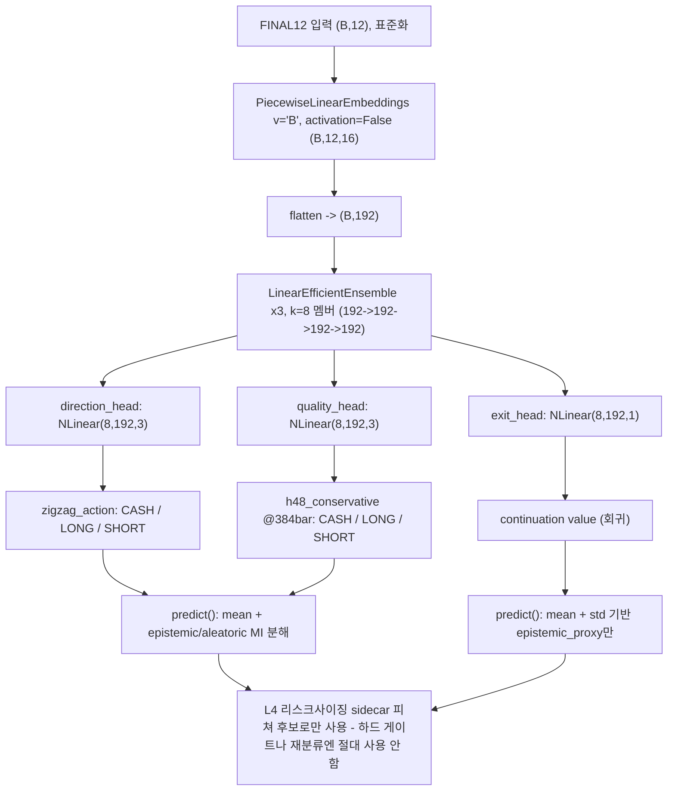

# Odyssey — ETH h48qual 교정된 TabM 백본 + 헤드별 라벨 + Exit 파이프라인 계약 문서 - 2026-08-11

## 상태

| 컴포넌트 | 상태 |
|---|---|
| `ThreeHeadTabMCorrected` 백본 | `design_verified_not_implemented` — TabM 논문 대조 검증은 완료; 코드에 클래스 자체가 없음(레포 전체 grep 0건, 2026-08-11 확인); 어떤 학습 런에도 연결된 적 없음 |
| FINAL12 피쳐 + `h48_conservative`@384bar 라벨 | `isolated_verification_complete_no_edge` — 구버전 `ThreeHeadTabM`으로 end-to-end 학습, v2 15시드 완료. **결론: 진짜 엣지 없음** — OOS가 통계적으로 유의미해 보였으나 always-short 대조로 `quality_head` 게이트 편향+학습/검증구간 추세 우연 일치로 판명 |
| `exit_head` 연속가치함수 파이프라인 | `design_only_not_implemented` — 학습 데이터 자체가 아직 없음; 아래 파이프라인은 스펙일 뿐 실제 코드 설명이 아님 |

위 어떤 것도 라이브 승격되지 않았습니다. 이 계약 문서는 `trading_bot.py`나 현재 라이브 아티팩트를 전혀 변경하지 않습니다.

**✅ 재설계 시도 완료 — 부정 결과 (2026-08-11, 이전 "다른 세션에서 진행 중" 콜아웃을 대체)**:
이전 버전이 "다른 세션에서 진행 중"이라고 보고받았다고 적었던 `quality_head` 분류→회귀 재설계와
입력 피쳐 재스크리닝은 실제로는 이 계약 문서를 작성한 것과는 다른 세션이 scratchpad에서 수행
중이었고, 이제 완료되어 레포에 스크립트와 문서로 남았습니다.

- **추세 편향 문제는 직접 측정으로 확정**: direction_head 원본(게이트 전) 픽은 균형 잡혀
  있음(숏 53~59%)에 반해, `quality_head` 게이트 통과 후(`final_action`)는 75~91%까지 쏠림 —
  384bar 재설계·FINAL12·라이브 원본(48bar+102피쳐 실제 가중치) 전부에서 재현. always-short
  기준선 대조로 정량화(재현판 OOS 15/15 시드 always_short 승, p=0.00015; 라이브 가중치도 VAL/OOS
  둘 다 승, 단 거래수 9~29건). 상세:
  `docs/experiments/eth_h48qual_quality_trend_bias_h48orig_control_20260811.md`.
- **always-short 대조 자체를 재검증(2026-08-11, 사용자 지적)**: 하락장에서는 always-short이
  방향 스킬 없이도 이길 수 있는 기준선이라, "모델이 always-short에 진다"가 곧 "모델에 스킬이
  없다"를 뜻하진 않는다는 지적 — 기존 always_short는 모델이 롱으로 골랐던 bar까지 전부 숏으로
  바꿔치기한 값이라 롱이 나쁘면(승률 21.5~31.8%, breakeven 40%) 기계적으로 유리해지기 때문.
  그래서 모델의 실제 숏 선택만 남긴 `short_only`(롱으로 판단한 bar는 현금 대기)를 같은 active
  set 전체를 강제숏한 `always_short`와 **승률**로 직접 대조 — h384 재설계는 동전던지기 수준으로
  구분 안 됨(43.9%/43.8% VAL, 56.9%/57.0% OOS), **라이브 레시피(h48orig)는 오히려 명백히 더
  나쁨**(VAL/OOS 둘 다 5시드 전부 패배, OOS 승률 46.6% vs 56.2%). **결론: quality gate 통과
  자체가 이미 하락장 방향성 베타를 담고 있을 뿐, 그 이후 direction_head/quality_head의 세부
  선별(어느 bar가 "더 좋은 숏"인지)은 추가 가치가 없다** — 지적은 타당했고, 더 정밀하게 검증한
  결과 원 결론이 뒤집히기는커녕 더 좁게(숏 내부에서도 선별 능력 없음) 확정됐다. 상세: 같은 문서.
- **분류→회귀 전환 시도 완료, 부정 결과**: 오라클(미래 실제값) 게이트는 always_short을 VAL/OOS
  15/15 시드로 압도(메커니즘 유효) — 하지만 FINAL12든, 회귀 기준으로 201개 풀을 재스크리닝한
  REL11이든, GBM 홀드아웃 R²가 0 근처(대부분 마이너스)라 실전 신호가 없습니다. 상세:
  `docs/experiments/eth_h48qual_quality_head_regression_conversion_attempt_20260811.md`.
- **순위상관 진단(이슈 8) 완료, 부정 결과**: 게이트 전(`dir_action`) 기준 `quality_for_action` vs
  실현 순수익률을 h48orig(5시드)·h384(15시드) 양쪽에서 확인 — 어느 쪽도 신뢰할 만한 양의
  순위상관 없음(h48orig는 오히려 음의 경향, 사이징 스코어의 역상관 -0.406과 같은 방향이나 다중
  비교 보정 후 비유의). Temperature scaling(candidate A)도 이걸로 닫힘 — 지킬 순위가 없음. 상세:
  `docs/experiments/eth_h48qual_quality_for_action_rank_correlation_20260811.md`.
- **TabM 앙상블 불일치 진단(3-1번 항목/candidate C) 완료, 부정 결과**: 서버 GPU로 v2와 동일
  5시드 재학습(이번엔 번들 저장), `.mean(dim=1)` 풀링 전 k=8 멤버 출력에서 Depeweg et al. 2018
  MI 분해로 `epistemic`을 뽑아 게이트 전 `dir_action` 기준 실현 순수익률과 순위상관 확인 —
  정합성 체크(seed=260620 dir_action이 기존 v2 저장 예측과 100% 일치)로 파이프라인 검증됨.
  VAL/OOS 어느 쪽도 신뢰할 만한 상관 없음(풀링 p=0.51/0.67, 개별 시드 10개 전부 비유의).
  "다른 신호원이라 앞선 실패를 상속하지 않는다"는 candidate C의 핵심 가설이 기각됨. 상세:
  `docs/experiments/eth_h48qual_ensemble_disagreement_rank_correlation_20260811.md`.

**결론: `quality_head`는 분류로 유지합니다.** 회귀 전환·temperature scaling·앙상블 불일치 셋 다
지금 확보한 피쳐로는 근거가 없습니다. 아래 "헤드별 라벨"과 "피쳐 계약 — FINAL12" 절은 이제
**확정판**입니다(더 이상 pre-change 아님). 미해결 이슈 8·9·10은 해소됨으로 갱신됨.
`quality_for_action`/`quality_head` 계열에서 사이징·게이팅 신호를 뽑으려는 시도(호라이즌
재설계·회귀 전환·순위상관·앙상블 불일치, 4갈래 전부)가 모두 부정 결과로 수렴 — 남은 후보는
B(evidential/Dirichlet, 문헌상 회의적이라 신중 취급)뿐이거나, `h48_conservative` 라벨/피쳐
조합 자체를 새 데이터소스로 교체하는 것입니다.

**🧭 사용자 결정 (2026-08-11): 라벨/피쳐 조합을 새 데이터소스로 교체.** B(evidential)는 보류하고
`h48_conservative`/FINAL12(및 201개 풀) 조합 자체를 버리는 쪽으로 방향을 확정, 신규 데이터소스
후보 리서치를 아키텍처 팀에 지시함 — 결과 완료: `docs/experiments/
eth_h48qual_quality_new_data_source_research_20260811.md`. 레포 실사(전부 직접 재검증 완료)
결과 **청산 이벤트 스트림**(`tail_risk_interceptor.py`, Binance `@forceOrder`),
**마이크로구조 toxicity/queue/absorption/spoofing 파생값**(`microstructure_scanner.py`,
`@depth20@100ms`+`@aggTrade`), **거래소간 펀딩 스프레드+Fear&Greed**(F4-C
`scripts/run_f4c_altdata_collector.py`, 2026-08-10부터 실측 수집 중 확인, 레포 전체에서 소비처
0건 확인), **Polymarket 예측시장**(`polymarket_engine.py`)이 **이미 라이브로 연결·수집되고
있으나 `quality_head` 학습 피쳐 계약에는 전혀 쓰이지 않는다**는 게 확인됨 — 이 4개가 재학습 없이
가장 싸게 검증 가능한 최우선 후보. Deribit 옵션 스큐/GEX(`btc_dvol_feature_overlay` 레지스트리
항목이 스스로 "옵션 스큐·기간구조는 아직 안 죽은 차별점"이라고 명시)와 ETH 온체인 순유입/
스테이블코인(CoinMetrics, 현재 BTC 전용을 확장)은 부분 인프라만 존재. 총 8개 후보, **전부
미검증·미구현**(재학습 없음). 다음 단계는 최우선 후보 1~3에 `quality_for_action` 0단계와 동일한
순위상관 진단(재학습 없이 기존 시드 예측에 조인)부터 돌리는 것.

**착수 후 갱신 (2026-08-11)**: 최우선 후보 1~3(마이크로구조·청산·Polymarket)은 실제로는
라이브 duckdb 커버리지가 **2026-05-03 이후뿐**(Polymarket은 4/21~30 9일치)이라 기존
VAL(2025-10~12)/OOS(2026-01~02)와 전혀 안 겹쳐 "재학습 없이 조인만"이 불가능함을 확인 — 더 큰
작업(새 구간 causal inference)으로 재분류, 아직 미착수. 후보 5(Deribit)도 과거 특정 시점 옵션
체인을 조회하는 API가 Deribit에 없음을 라이브로 확인해 보류. **후보 6(ETH 온체인)은 원래
계획대로(CoinMetrics 무료 다운로드) 진행 가능해 검증까지 완료 — 부정 결과.** `CapMVRVCur`가
4개 조합(h48orig/h384 × VAL/OOS) 전부 방향 일관 + h384 양쪽에서 24개 검정 Bonferroni 보정
생존(p=0.0002/p<0.0001)으로 이 세션 최초의 강한 양성 신호처럼 보였으나, 사용자 확인 요청으로
오염도를 직접 측정하니 `corr(price)=0.95~0.97`의 심각한 가격추세 오염(FINAL12 dedup의 배제
기준 0.561보다 훨씬 심함)이었고, detrend(전일대비/7일변화율)하자 신호가 완전히 붕괴 —
이 세션을 관통한 "하락장 드리프트를 스킬로 착각" 패턴이 새 데이터소스 축에서도 재발했다.
나머지 5개 지표는 무상관이거나 스플릿간 부호 불안정. 상세:
`docs/experiments/eth_h48qual_onchain_candidate6_rank_correlation_20260811.md`. **신규 raw-level
피쳐 후보는 학습 전에 `corr(price)`/`corr(시간순번)` 오염도부터 확인**하는 걸 이 리서치 라인의
표준 절차로 추가 — 남은 후보(4·7·8)에도 적용 필요.

**후보 4도 검증 완료, 부정 결과 (2026-08-11)**: 펀딩 스프레드는 OKX `funding-rate-history`
공개 엔드포인트의 보존 기간이 짧아(약 1개월, `since` 파라미터 사실상 무시) VAL/OOS 백필이
안 돼 애초에 검증 불가능함을 라이브로 확인. 가격 basis(OKX 1시간봉 신규 다운로드, 2025-01~
현재)는 오염도는 낮았으나(`corr(price)` 최대 0.30, candidate 6 절차로 확인) 순위상관이 라벨
변형 간 일관되지 않아(`|basis|`가 h384 OOS에서만 강한 음의 상관 p&lt;0.0001인데 h48orig OOS는
반대 방향) 기각 — **오염도 체크 통과와 별개로 "여러 라벨변형에 걸친 방향 일관성"도 독립적인
신뢰성 기준**이라는 게 재확인됨. 상세: `docs/experiments/
eth_h48qual_basis_candidate4_rank_correlation_20260811.md`. 지금까지 착수한 6개 후보(1·2·3·5·
6·4)가 전부 인프라 문제로 막히거나 부정 결과 — 남은 미착수는 7(라벨 재구성 축, 새 데이터
아님)과 8(정식 VPIN, 가장 비싼 인프라이자 보류된 후보 1에 조건부)뿐.

**근본 메커니즘이 한 단계 더 좁혀짐 (2026-08-11, 병행 세션+직접 검증)**: `quality_head` 게이트가
사실상 `direction_head` 자체의 confidence 필터라는 게 확인됨(`quality_head` 없이 confidence
상위 K개만 뽑아도 실제 게이트 결과와 6건 전부 4.3~6.5pp 이내로 재현) — 그리고 그 confidence
자체가 숏 콜에서 3~5pp 높은데, **이 비대칭은 레짐(하락장)이 아니라 학습구간부터 이미 동일하게
존재**함(다양한 레짐이 섞인 21개월 학습구간에서 오히려 더 큼). 상세:
`docs/experiments/eth_h48qual_zig075_direction_confidence_echo_check_20260811.md`. 이어서
"레짐 조건화"가 이 새 진단과 안 맞는다는 점을 확인하고(레짐이 원인이 아니므로), 사용자 선택에
따라 원인의 원인을 직접 검증 — zigzag 라벨의 숏 스윙이 롱 스윙보다 실제로 더 "깔끔"한지
(Calmar 비율 등 자기완결적 경로 지표로) 확인한 결과 **학습구간·VAL 둘 다 통계적으로 유의미하게
숏 스윙이 더 깔끔함**(calmar p=0.0011/0.0052, OOS는 같은 방향이나 표본 작아 비유의) — 지속시간/
크기/각도가 아니라 경로의 매끄러움(반대방향 되돌림이 적음)에서 차이. 상세:
`docs/experiments/eth_zigzag_swing_asymmetry_confidence_root_cause_20260811.md`. 이건 상관
수준 증거이며 정량적 인과관계·수정 방안은 아직 미착수 — 다음 결정 지점. (참고: 스윙 개수 집계
버그를 후속 세션이 발견·수정 — 연도 경계에서 `zigzag_segment_id`가 재시작하는데 2024+2025를
합쳐서 groupby하면 서로 다른 해의 스윙이 섞임. 수정 후 학습구간 표본이 918/925 → 1718/1725로
늘고 유의성도 개선(p=0.0011→2.87e-05) — 결론은 안 바뀌고 더 강해짐.)

**Direction_head confidence 재보정 시도 완료, 부정/보류 결과 (2026-08-11)**: 스윙 형태 하나로는
confidence 격차를 다 설명 못 한다는 점에 따라, LONG/SHORT를 무조건 같게 맞추는 대신 클래스별
보정 상태(reliability/ECE)부터 확인 후 필요한 만큼만 보정하는 방식으로 진행. **결과가 원래
예상과 반대**: 학습구간에서 SHORT는 이미 잘 보정돼 있고(과신 −1.8pp) **LONG이 오히려 심하게
과소신**(−15.0pp, 실제 정확도 72%가 확신도 57%보다 훨씬 높음) — 확신도 격차의 상당 부분이
"숏 과신"이 아니라 "롱 과소신"으로 설명됨. 이 패턴도 구간마다 불안정하다 — LONG의 과소신
방향은 학습/VAL/OOS 세 구간 모두 일관되지만(크기만 다름), SHORT는 학습(과소신)→VAL(과신)으로
부호가 뒤집힌다. 학습구간에서 적합한 클래스별 temperature scaling을 VAL/OOS에 적용하니
안정적으로 일반화되지 않음(LONG은 VAL 개선/OOS 소폭 악화 혼재, SHORT는 VAL·OOS 둘 다 악화) —
calibration 영역에서도 train/eval 레짐 불일치가 재발. 참고로 이 보정은 `quality_head` 게이트가
`dir_confidence`를 코드상 직접 소비하지 않아 성공했더라도 라이브 행동에 자동 반영되지 않았을
것 — 게이트 재설계가 별도로 필요. 상세: `docs/experiments/
eth_h48qual_direction_confidence_calibration_20260811.md`.

**컨벤션**: 이 계약 문서는 결과와 간단한 근거 요약만 담습니다. 각 실증 검증의 전체 과정(방법론, 스크립트, 중간 수치)은 별도의 `docs/experiments/*.md` 문서에 있으며, 아래 본문에 인라인으로 링크되어 있습니다.

- 별칭: `odyssey_eth_h48qual_corrected_tabm`
- 모델 id: 없음 — 작성 시점 기준 승격 가능한 아티팩트가 존재하지 않음.
- 서브 프로젝트: **Odyssey** — 라이브 ETH 모델(h48qual 라인)의 지속적인 튜닝·모델링 개발을 위한 아키텍처 팀 트랙.
- **이름 충돌 (2026-08-11 해결됨)**: 기존에 `scripts/run_odyssey1_btc_shadow_20260804.py`라는 이름을 쓰던, 무관한 비실행 BTC shadow-bot 스크립트를 `scripts/run_agamemnon1_btc_shadow_20260804.py`로 변경했습니다(`MODEL_ID`/`MODE`/`STATE_PATH`도 `agamemnon1`로 함께 변경). 이제 "Odyssey"는 이 서브 프로젝트만을 가리킵니다.
- 리서치 근거: `docs/eth_omega4_6_1_accuracy_research_ideas_20260811.md`. 이 설계는 해당 문서의 3-1번 항목(앙상블 불일치 노출)과 3-3번 항목(exit head → optimal stopping)을 반영합니다. 3-2번 항목(PLE)은 이미 백본에 구현되어 있어 변경 없음. 3-4번 항목(레짐별 quality threshold 재보정)은 **아직 반영되지 않음** — 미해결.
- 리소스 레지스트리: `docs/model_contracts/odyssey_eth_h48qual_data_resources_20260812.md` — 코드(스크립트·문서 전체 목록)·데이터·모델 번들의 정확한 경로/크기를 한 곳에 모은 참조 문서, 2026-08-12 시작.

## 범위

- 목적: Odyssey 아키텍처 팀 트랙 아래에서 라이브 ETH 모델의 지속적인 튜닝·모델링 개선. 이 문서는 개발 계약이지 승격 요청이 아닙니다.
- **성공 기준(2026-08-11, 사용자 명시)**: 목표는 완벽한 모델이 아니라 **현재 라이브보다 나은
  모델**입니다. 아래 각 진단(always-short, short-only 대조, 순위상관 등)의 목적은 학술적으로
  완벽한 증명이 아니라, "라이브 대비 개선"이 진짜 개선(라이브도 못 가진 진짜 판별 스킬)인지
  아니면 같은 베타 편승을 개선으로 착각하는 것인지 구분하는 것 — 후자는 레짐이 바뀌면 바로
  무너지므로 개선으로 칠 수 없습니다.
- 현재 라이브 베이스라인(변경 없음, 대조용으로만 기재 — 출처: `docs/eth_omega4_6_1_accuracy_research_ideas_20260811.md` §1):
  - 백본: TabM, `k=8`, `hidden=192`, 3 layers, `dropout=0.08`; bull/bear/chop 3-expert 레짐 라우팅(HMM 라우터, end-to-end 학습 아님).
  - `direction_head`: 3-class(CASH/LONG/SHORT), 타겟 `zigzag_action` — h48qual과 zig075가 동일하게 공유.
  - `quality_head`: h48qual은 독립적인 48-bar ATR-relative 배리어(`h48_conservative`, `tp_mult=1.2`, `sl_mult=0.8`) 사용; zig075는 대신 `same_as_direction` 사용. 두 라인의 quality 타겟을 섞으면 안 됨. 게이팅에 쓰이는 0~1 값은 헤드의 raw 출력이 아니라 파생값 `quality_for_action`이며, h48qual의 `quality_threshold=0.50`(zig075는 0.75) — 아래 "헤드별 라벨" 절 참고.
  - `exit_head`: 이진 hold/exit, 고정 임계값 `0.95`, 13개 position-state 피쳐, 포지션 보유 중에만 활성.
  - 입력: 102 base(기술적/오더플로우/OU 96 + regime3-current 6) + position-state 13 = 115차원.
- 이 계약의 목표 설계는 백본, `quality_head` horizon, `exit_head` 출력 타입, 입력 피쳐셋을 모두 변경합니다. 부분 결과가 전체 스택이 완성된 것처럼 보고되지 않도록, 각각을 위 표에서 독립적인 상태로 추적합니다.

**zig075 `final15`(JM 레짐+15개 선별피쳐) 이식 검토, 부정 결과로 종료 (2026-08-12)**: zig075
쪽 병행 실험이 단일시드로 direction_head confidence 격차가 거의 사라지는(+0.048→+0.0008) 걸
보고해, h48qual에 이식할 가치가 있는지 검토(사용자 지시: 먼저 검증 후 focal loss 재개).
**다중시드(N=5, 이 세션 표준 시드셋)로 재현 안 됨** — 시드간 표준편차(0.026)가 평균(0.009~0.016)보다
크고 부호도 안 바뀌지 않으며, 한 시드(903174)는 구버전과 같은 크기(+0.044)의 격차를 보임.
**always-short 대조로도 부정** — 단일시드 10칸 전부 패, 다중시드도 10칸 중 2칸만 승(같은 시드가
양쪽 스플릿 다 이긴 적 없음). 상세: `docs/experiments/eth_zig075_final15_multiseed_pnl_validation_20260812.md`.
**h48qual에 이식할 근거 없음 — 이 방향은 닫힘.**

**`quality_head` 대체 메커니즘 리서치 완료 (2026-08-12, Model Architect 페르소나 dispatch, 검증됨)**:
메타라벨링/셀렉티브 분류/컨포멀 문헌 기준 9개 후보를 검증비용순으로 랭킹. 가장 중요한 신규
발견 둘: (1) 이 세션이 한 번도 직접 답 안 한 질문 — 게이트를 완전히 없앤 `direction_head` 원본도
VAL/OOS에서 always-short를 확실히 못 이김(VAL 거의 동률, OOS -18.3pp 격패, 단일 실행) — 즉
문제가 "quality_head가 나쁜 필터"보다 한 단계 더 근본적임(direction_head 자체의 스킬 미검증).
(2) 이 레포에 **포트폴리오 레이어에서 이미 시도된 RL/bandit 게이트 선례**가 있음
(`docs/model_contracts/portfolio_online_bandit_gate_native_20260709.md`, `promotion_pass=False`,
OOS -18.03%, skip rate 96.64% — 검증 완료). 권장 순서: 재학습 불필요한 3개 테스트(dir_confidence/
margin/entropy 직접 순위상관, trust score, 레짐별 threshold)를 먼저 병렬로 돌려 스칼라 추출의
마지막 빈틈을 닫고, 동시에 "direction_head 자체가 always-short 대비 진짜 스킬을 갖는가"를 이
서브프로젝트의 표준 잣대(N≥5 시드)로 정식 검증. 후자가 음성이면 나머지 후보(메타라벨 재설계,
evidential, bandit 재구성, 신규데이터 재프레이밍) 전부 근거 약화. 상세:
`docs/experiments/eth_h48qual_quality_head_replacement_research_20260812.md`.

**✅ 위 후자(candidate 9)를 N=5 시드로 정식 검증 완료 (2026-08-12), 확정된 부정 결과**: 사용자가
`quality_head` 제거 + `PiecewiseLinearEmbeddings`/`LinearEfficientEnsemble×3` 백본 착수를 제안해
직접 검증. h48orig 5-seed 재현판(`[260620, 481003, 26611, 903174, 155827]`, 실제 h48qual
레시피 그대로)의 저장된 예측으로 게이트를 완전히 우회한 `direction_head` 원본 대 always-short —
**5개 시드 전부, VAL·OOS 전부 always-short에 패배**(VAL -7.32%±11.28 vs +8.52%±1.03, 0/5,
paired p=0.028; OOS +3.58%±8.70 vs +22.89%±5.15, 0/5, paired p=0.002). 단일 라이브 번들
실행(위 문단, VAL 거의 동률)보다 5시드 평균은 오히려 더 나쁨 — 라이브 인스턴스가 시드 분포 중
상대적으로 나은 쪽이었을 가능성. **결론: `quality_head`를 제거해도 `direction_head` 단독으로는
문제가 풀리지 않는다 — 백본을 교체해도 `direction_head`가 풀고 있는 문제(`zigzag_action`) 자체는
바뀌지 않으므로, 모델 용량을 늘린다고 이 구간에 없는 신호가 생기지 않는다.** `quality_head`
대체(후보 1~8) 전체의 근거도 함께 약해짐 — 메타라벨링은 구조상 `direction_head`가 이미 고른
것의 부분집합만 고를 수 있고, 그 원본에 스킬이 없다는 게 이제 이 프로젝트 표준 잣대로 확정됐기
때문. 상세:
`docs/experiments/eth_h48qual_ungated_direction_h48orig_5seed_vs_always_short_20260812.md`.

**독립 재현 + 나머지 3개 무료 후보 완료 (2026-08-12, 별도 세션)**: 위 h48orig 5시드 결과를
`scripts/diagnose_eth_h48qual_multiseed_ungated_direction_vs_always_short_20260812.py`로
독립 재실행해 정확히 일치 확인(VAL -7.32±11.28 vs +8.51±1.03, OOS +3.58±8.70 vs +22.89±5.15,
같은 데이터에 대한 결정론적 시뮬레이션이라 당연한 결과지만 파이프라인 정합성 재확인), 여기에
h384 v2(15시드)를 더해 **총 40칸 중 2칸만 승**(전부 h384 VAL, Wilcoxon 단측 4그룹 전부 p≈1.0)으로
범위를 넓혔다. 같은 turn에 팀장 리서치의 나머지 무료 후보 3개(dir_confidence/margin/entropy
직접 순위상관, trust score, 레짐별 threshold)도 완료 — **전부 부정**(첫째는 h48orig만 명목유의·
h384 무상관으로 라벨변형 불일치 기각, trust score는 4변형 전부 무신호, 레짐별 threshold는
VAL/OOS 최적값이 서로 어긋나 그리드서치 노이즈로 판단). 상세: `docs/experiments/
eth_h48qual_quality_head_replacement_candidates_1_2_3_and_formal_skill_test_20260812.md`.

**곁가지 파일럿: quality_loss_weight=0(단일시드, 서버 GPU)도 가설과 반대 결과** — 공유 TabM
trunk에서 quality_head의 gradient를 끊으면 direction_head가 나아질 거라는 가설을 테스트했으나,
5개 threshold·VAL/OOS 전부 기존(quality_loss_weight=0.80)보다 악화(OOS 승률 25~33%→14~24%).
단일시드라 확정은 아니나 전 threshold·전 스플릿 일관된 방향 — quality_head를 같이 학습시키는
것 자체가 오히려 공유 표현에 정규화처럼 도움을 주고 있을 가능성. 상세: `docs/experiments/
eth_h48qual_quality_loss_weight_zero_pilot_20260812.md`.

**🧭 사용자 결정 (2026-08-12): `quality_head` 대체 리서치 전체를 닫고, `direction_head` 자체의
방향 스킬 존재 여부를 서브 프로젝트의 최상위 질문으로 승격.** 위 두 문서로 quality_head_replacement_research의
9개 후보 전부(Tier 0의 1·2·3·9 정식 종료, Tier 1 이상은 후보 9 확정으로 근거 상실)가 닫힌
시점에 AskUserQuestion으로 세 갈래(방향 승격 / focal loss 계속 / Tier-0 마저 닫기 — 이미 닫힘)를
제시, 방향 승격을 선택. **quality_head 관련 투자(게이팅 재설계·대체 스칼라·threshold 재보정)는
전부 보류.** 다음 단계는 미착수: (a) `direction_head` 자체의 분류 정확도를 직접 겨냥한 신규 피쳐
탐색(FINAL12/REL11은 quality 관련성 기준으로 스크리닝된 것이라 다름), (b) 신규 방향 라벨 설계
(다른 zigzag 파라미터 또는 다른 타겟), (c) 이 VAL/OOS 하락장 구간(2025-10~2026-02/03) 밖에서
재검증해 "엣지 없음"이 구간 특정적인지 확인. 착수 전 반드시 확인할 선행 문헌: 이미 닫힌 리서치
라인 `eth_overnight_generic_feature_entry_filter_20260809`(레지스트리 `prior_lines`)가 일반
피쳐로 방향을 재추정하는 시도를 6개 피쳐군 + 44피쳐 kitchen sink 전부로 이미 실패시켰다 —
새 계획은 이 선례를 재발견하는 대신 반영해야 한다.

**TabM 백본 대체 후보 문헌 리서치 완료 (2026-08-12, 사용자 지시, Model Architect 페르소나
dispatch + 리드 세션 검증, 문헌 리서치만 — 학습/구현 없음)**: 피쳐(FINAL12)·라벨·구간을 고정한
채 TabM을 대체할 모델 후보를 최신 문헌(2024~2026)으로 조사. 핵심: TabM은 TabArena/TALENT에서
플레인 DL 최상위권이라 같은 계열 내 교체 headroom은 작고, 여지는 (1) 184k행÷12피쳐≈15,411의
극단적 행/피쳐 비율이 문헌상 GBDT 유리 구간이라는 점, (2) 인덕티브 바이어스가 근본적으로 다른
계열(시간 드리프트를 명시 모델링하는 Drift-Resilient TabPFN[Helli+ NeurIPS 2024], ICL 파운데이션
모델 TabICL[ICML 2025], 국소 이웃 기반 ModernNCA[ICLR 2025])뿐. 권장 순위: ① GBDT(비용 거의 0,
이 정확한 계약으로는 미시도임을 레포 실사로 확인 — "TabM 탓인가 데이터 탓인가"를 가장 싸게
분리하는 진단으로서의 가치) ② Drift-Resilient TabPFN ③ TabICL ④ ModernNCA ⑤ xRFM.
정직한 평가: 40칸 중 38칸 always-short 패배 기록과 `eth_overnight_generic_feature_entry_filter_20260809`
선례를 감안하면 어떤 백본도 신호 부재 자체를 못 풀 확률이 더 높음 — 이 리서치의 실용 가치는
GBDT를 싸게 돌려 백본 축을 확정적으로 닫거나 열어, 위 최상위 질문(direction_head 방향 스킬)에
집중할 근거를 강화하는 것. 벤치마크는 전부 IID 스플릿 기준이라(TabReD 경고) walk-forward 순위
이전 불가, ICL 계열도 Fresh-Forward 규칙 동일 적용(슬라이딩 컨텍스트 필수), TabPFN-3은 라이선스
확정 전 보류. 상세: `docs/experiments/eth_h48qual_tabm_backbone_replacement_model_research_20260812.md`.

**✅ GBDT 백본 진단 완료 (2026-08-12), 확정된 부정 결과**: 위 1순위 권장안 실행. 기존 h48orig
학습 파이프라인(`_prepare_frames`)을 그대로 재사용해 FINAL12→zigzag_action 3-class를
LightGBM으로 학습 — TRAIN 내부 월별 확장윈도우 CV(embargo 48bar)로 Optuna 80 trials HP 탐색 →
상위 5개 CV 후보를 VAL 거래 시뮬레이션으로 재평가해 always-short 대비 마진 최대 후보 채택
(select-on-validation-only) → N=8 진짜 무작위 시드(Seed-Diversity Gate)로 최종 검증, VAL/OOS ×
cost1/2/3에서 always_short/always_long과 대조. TRAIN 윈도우는 h48orig 5시드 재현판과 동일한
2025-01~09(9개월, isolated-verification 관례 — 라이브 21개월 TRAIN과 다름, "함정 1" 참고).

**결과: 6개 구간(VAL/OOS × cost1/2/3) 전부, 8시드 전부 always-short 패배 — Wilcoxon
one-sided p=1.0000 전 구간.** CV logloss 0.7823(기저비율 예측치 ≈0.975보다 낮아 분포 수준
구조는 일부 포착)에도 불구, 방향 판별력은 balanced_accuracy 0.469~0.470으로 약함. 피쳐 중요도는
`vwap_dist_24`가 압도적(전체 gain의 대부분) — "아무 피쳐도 안 씀"이 아니라 "특정 조합에 강하게
의존했는데도 결과가 안 남"는 패턴. **인덕티브 바이어스가 근본적으로 다른 두 모델 계열(TabM의
연속 파라메트릭 MLP 앙상블, 이번 GBDT의 축-정렬 비미분 분할 트리)이 동일 피쳐·라벨·구간에서
동일하게 실패** — TabM h48orig 5시드(0/5) + h384 v2 15시드(2/40) + 이번 GBDT 8시드(0/48,
6구간×8시드)를 합쳐 "TabM의 표현력 한계"가 아니라 "FINAL12가 이 구간의 `zigzag_action`을
예측하는 데 필요한 정보를 담고 있지 않을 가능성"이 세 번째 독립 증거로 강화됨. 남은 백본 후보
(Drift-Resilient TabPFN 등)의 사전 확률도 한 단계 낮아짐 — 시간적 분포 이동을 정면 모델링하는
계열만 질적으로 다른 시도로 남고, 우선순위는 낮춤. 상세:
`docs/experiments/eth_h48qual_gbdt_backbone_diagnostic_20260812.md`.

**오라클 라벨 설계 문헌 리서치 완료 (2026-08-12, 사용자 지시, Model Architect 페르소나 dispatch +
리드 세션 검증)**: zigzag/triple-barrier 둘 다 실패한 맥락에서 최신(2023~2026) 라벨링 방법론
문헌 조사. 핵심: 2026년 신규 논문 2건이 이 프로젝트의 정확한 상황을 정면으로 다룸 —
Label Horizon Paradox(Song/Liu/Chen, arXiv:2602.03395)는 최적 지도신호가 최종 목표와 다른
중간 호라이즌으로 이동한다고 주장(48/384bar 스윕보다 급진적), Spurious Predictability
(Nikolopoulos, arXiv:2604.15531)는 이 프로젝트가 이미 수행한 오라클 게이트 검증과 방법론적으로
동일한 falsification-audit을 권고. 권장 순위: ① 신규 라벨 후보마다 MI/R² 사전 게이트(TabM 풀
학습 전 필수 관문) ② trend-scanning(t-value 기반 호라이즌 자동선택)으로 zigzag 대체 ③
zigzag_action 위에 "베팅 여부"만 판별하는 메타라벨 2차 분류기 ④ quality_head를 MFE 분위수 회귀로
전환 ⑤(보류) AEDL류 regime-aware 라벨(구현 복잡도 최고, 단일 논문 실증뿐). 정직한 결론: 오라클
게이트가 h48_conservative를 메커니즘상 유효(always-short 15/15 압도)하다고 확인했는데도 GBM
R²≈0라는 사실은, 문제가 라벨의 정의 방식이 아니라 **FINAL12 12개 피쳐 자체가 미래 경로 정보를
담고 있지 않을 가능성**을 시사 — 이 경우 라벨을 아무리 재설계해도 상호정보량 예산은 늘지 않음.
상세: `docs/experiments/eth_h48qual_oracle_label_design_literature_research_20260812.md`.

**신규 탐색 축 스카우팅 완료 + 1순위 후보 실행 (2026-08-12, 내가)**: 위 "방향 승격" 결정에 따라
(a) 신규 피쳐 (b) 신규 라벨 (c) 다른 구간 세 갈래를 정찰(Model Architect 페르소나 dispatch,
레지스트리·17개 아이디어 밤샘·데이터 리소스 문서 전체 대조로 이미 닫힌 라인 재발견 방지) —
상세: `docs/experiments/eth_h48qual_direction_skill_new_directions_scouting_20260812.md`. 가장
값싼 1순위 후보(TRAIN 내부 2025 Q2~Q3 상승구간 홀드아웃, 재학습 불필요)를 바로 실행: 이 구간
실제가격 +127.2%인데도 **ungated direction_head가 max(always_long,always_short)=+36.5%에
완패**(-7.53%, 44%p 격차) — 게이트 있는 라이브 방식은 이 구간에서 손실(-11.01%)까지 기록.
**하락장 VAL/OOS뿐 아니라 강한 상승구간(TRAIN 내부)에서도 진다** — "하락장 특정적 실패"
가설이 반증됨, 방향 스킬 부재가 추세 방향과 무관한 더 구조적인 문제라는 근거가 하나 더
추가됨(단, 인샘플·단일 인스턴스라 스킬 부재의 확정 증거는 아니고 스코프 판단용). 이 결과로
더 비싼 후보(post-OOS 2026-03~07 진짜 확장)의 시급성은 낮아짐 — 다운/업 두 강한 추세 구간이
이미 같은 결론에 도달했기 때문. 다음 우선순위는 스카우팅 문서의 통합 순위표(신규 탐색) +
위 백본 리서치의 GBDT 1순위(구조 축) 두 갈래가 남음 — 둘 다 아직 미착수.

**직전에 착수했던 focal loss 재학습, N=5 시드로 완료·부정 결과 (2026-08-12, 별도 세션)**: 위
"방향 승격" 결정 이전에 사용자가 지시했던 트랙 — `direction_head` 클래스별 confidence 비대칭을
학습 단계에서 겨냥하는 focal loss(gamma=2.0)를 표준 5시드로 완주(2024-2025 전체구간 소스로
정확히 맞춤). **목표였던 calibration 개선이 아니라 정반대**: 정확도는 거의 그대로인데 확신도만
전반적으로 낮아져 ECE가 학습구간에서 2~4배, OOS에서도 1.2~1.4배 악화(TRAIN LONG ECE
0.100→0.207, SHORT 0.046→0.180). PnL도 gamma=0(표준 CE) 대비 모든 threshold에서 같거나 나쁨,
둘 다 OOS에서 always-short(+20.13%)에 크게 못 미침(gamma=0 +3.51%, gamma=2.0 +1.06%) — 이미
확정된 "direction_head 자체가 always-short 대비 스킬 없음" 결론과 일관된다. 상세:
`docs/experiments/eth_h48qual_direction_focal_loss_multiseed_result_20260812.md`. 이 결과는
위 "방향 승격" 결정을 재확인만 할 뿐 바꾸지 않는다 — focal loss는 calibration만 다루는 도구라
애초에 새 스킬을 만들어낼 수 없었고(오히려 이번엔 calibration도 못 만듦), 이제 quality_head/
direction_head 게이팅·손실함수 축 전체가 닫힌 것으로 취급한다.

**레짐별 완전분리(hard filter) 학습 파일럿 완료, 부정 결과 (2026-08-12, 내가, 사용자 제안)**:
사용자가 "레짐별로 TabM을 따로 학습시키면?"을 제안 — 조사해보니 h48orig(final15/jmlam4 포함)가
**이미** bull/bear/chop을 완전 별도 파일로 학습 중이었으나 **soft weight**(레짐 확률로 가중,
전체 데이터를 다 봄)였음을 확인. **hard filter**(그 레짐 argmax bar만, 가중치 0/1)만 안 해본
조합이라 `--hard-regime-filter` 플래그를 추가(`git diff` 13줄, 기본값 False로 기존 동작 완전
보존)해 h48orig 레시피 그대로 시드 260620 단일 파일럿을 서버에서 학습. **결과: 두 스플릿 모두
soft-weight보다 악화**(VAL gated -7.98%→-17.21%, OOS +8.02%→+1.72%; always-short 대비 격차도
더 벌어짐). 레짐을 하드하게 쪼개면 전문가당 유효 표본만 줄어 더 노이즈해지는 것으로 보임 —
quality_loss_weight=0 파일럿(정보 제거 시 악화)과 같은 패턴. 단일시드지만 두 스플릿 다 같은
방향이라 N≥5 재현 투자 근거는 약함. **"레짐별 분리학습"은 soft(라이브 구조 자체, N=40칸 확정)·
hard(이 파일럿) 둘 다 시도되고 둘 다 부정 — 이 방향도 닫힘.** 상세:
`docs/experiments/eth_h48qual_hard_regime_filter_pilot_20260812.md`.

**GBDT 백본 진단 풀런 완료, 부정 결과 (2026-08-12, 내가 pull+검증)**: 스모크 테스트 이후 서버에서
계속 실행 중이던 풀런(Optuna 80trial→VAL 재평가로 HP 채택→N=8 진짜 무작위 시드)이 완료됨.
**8시드·6개 비용조합(VAL/OOS×cost1/2/3) 전부 always-short에 완패, 전부 Wilcoxon p=1.0000** —
TabM h48orig(N=40칸 중 2칸)와 사실상 같은 결론. 채택된 HP 자체가 이미 VAL always-short 대비
마진 -13.88%p(HP 선택 절차가 명시적으로 마진 최대화를 목적으로 했는데도 양의 마진 후보가 하나도
없었음). 분류 balanced_acc≈0.47(3-class chance 0.33보다 높음)이지만 확인해보니 CASH를 거의
예측 안 해서(선택된 HP가 class_weight_mode=none) 사실상 매 bar 거래 중 — TabM의 ungated 실험과
비슷한 활성 프로필로 대조되고 있음. **완전히 다른 모델 계열(축-정렬 트리 vs 연속 가중합
신경망)도 같은 실패를 반복** — "TabM 아키텍처 자체의 문제"라는 가설이 상당히 약해지고, 오늘
완료된 오라클 라벨 설계 문헌 리서치의 "FINAL12 피쳐 자체가 미래 정보를 안 담고 있을 가능성"
결론과 수렴. 백본 교체 축의 우선순위는 이걸로 낮아짐 — direction-only 피쳐 재스크리닝과 신규
라벨 후보(MI/R² 사전 게이트) 쪽이 지금 가장 근거가 강한 다음 방향. 상세:
`docs/experiments/eth_h48qual_gbdt_backbone_diagnostic_result_20260812.md`.

**✅ Trend-scanning 라벨 MI/R² 사전 게이트 완료 (2026-08-12, 사용자 지시), 결정적 부정 결과**:
오라클 라벨 리서치 권장안 1(사전 게이트)+2(trend-scanning)를 함께 실행 — De Prado 방식
(`L∈{8,16,24,32,48,64,80,96}`bar에서 `|t-value|` 최대 윈도우 선택)으로 라벨 구성, 벡터화 구현을
`scipy.stats.linregress`와 12개 지점에서 직접 대조해 정확성 확인(소수점 6자리 일치). h48orig
FINAL12 파이프라인 그대로 재사용, `quality_head` 회귀전환 시도와 **동일한 GBM 홀드아웃 설정
2개**(약한/강한 정규화)로 R² 게이트. **결과: VAL/OOS R² 둘 다, 두 정규화 설정 전부 0 이하**
(약한 정규화 VAL -0.1049/OOS -0.2272, 강한 정규화 VAL -0.0043/OOS -0.0737), 부호-AUC도 0.5
근처(0.505~0.545)로 방향 판별력 사실상 없음. 부차 발견: 이산화(임계값 1.65~2.58) 시 CASH
비중이 0~0.3%로 사실상 소멸 — 8개 윈도우 중 최대 `|t|` 선택이 다중비교 문제를 안고 있다는
구현 한계(R² 게이트는 연속 타겟 기준이라 이 이슈와 무관하게 이미 결정적으로 부정적). **결론:
라벨을 zigzag_action에서 trend-scanning으로 바꿔도 FINAL12로는 예측이 안 됨** — GBDT/TabM
백본 진단(모델을 바꿔도 zigzag_action 예측 안 됨)에 이은 네 번째 독립 증거로 "FINAL12 자체의
정보량 부족"에 수렴. 오라클 라벨 리서치 권장안 2위는 이걸로 닫힘, 3위(메타라벨)·4위(MFE
분위수)의 사전 확률도 낮아짐 — 다음은 라벨 축보다 피쳐 확장 또는 구간 밖 재검증이 더 생산적.
상세: `docs/experiments/eth_h48qual_trend_scanning_label_mi_r2_gate_20260812.md`.

**✅ 피쳐 확장 축 착수 — 신규 탐색 축 스카우팅 (a) 그룹 실행 (2026-08-12, 사용자 지시)**: 두
후보(direction-only mRMR 재스크리닝, Fear&Greed 백필)를 스카우팅 문서 우선순위대로 실행.

1. **Direction-only mRMR/knockoff 재스크리닝 — 예비적으로 긍정적, 확정 아님**: FINAL12가 실제로는
   quality 타겟과 섞여 병합됐고 공통윈도우도 6개월뿐이었다는 점을 재확인한 뒤, `zigzag_action`
   단독 MI로 처음부터 재순위화. 피쳐 풀은 위험에 노출됐던 `fa_features.parquet`(백업 완료,
   `tmp/eth_h48qual_fa_features_backup_20260812/`) 대신 **커밋된**
   `data/splits/year_oos/eth_features_2024_2026_analysis.csv`(2024-06~2026-08 커버, M7/AI
   direction 컬럼 자체가 없어 Model Architect 정책 자동 준수)를 사용, TRAIN(2024-06~2025-09,
   canonical보다 5개월 짧음)/VAL/OOS(canonical과 동일, 실제 커버). mRMR+`|r|>0.5` 중복제거 후
   신규 후보 4개(FINAL12엔 없음): `mtf_trend_1h`, `funding_roc_12`, `trades`, `sig_trend_health`
   — 오염도 체크 전부 통과. 튜닝 없는 단일 LightGBM fit으로 FINAL12(패널가용 9개) 단독 대비
   +신규4개(13개)를 대조: **VAL balanced_acc 0.469→0.476, OOS 0.464→0.471** — VAL/OOS 둘 다
   같은 방향으로 소폭 개선(+0.7~1.5pp). **단일 fit(시드평균 없음)이라 예비 신호일 뿐** — 이
   프로젝트 표준([[tabm_hp_low_signal_pattern]])상 이 정도 효과크기는 시드간 변동에 흔히
   묻힌다. 다음 단계는 `FINAL13`(FINAL12+`mtf_trend_1h`) 후보로 N≥5 진짜 무작위 시드 GBDT/TabM
   정식 검증(always-short 대조 포함) — 아직 미착수. 상세:
   `docs/experiments/eth_h48qual_direction_only_mrmr_rescreen_20260812.md`.
2. **Fear&Greed Index 백필 — 부정 결과, 사전 기대치와 일치**: alternative.me 무료 API(2018년~
   일별 히스토리) 전체 백필, 원값/diff1/7일MA편차 3종 전부 오염도 체크(corr(price)≤0.385) 통과했으나
   MI가 낮고(0.01~0.045, FINAL12 최상위의 1/10 미만) 홀드아웃에서 VAL/OOS 둘 다 오히려 소폭
   악화(-0.5~0.9pp). 일별 해상도를 5분봉에 forward-fill하는 구조적 정보량 한계가 그대로
   나타남 — 이 후보는 닫힘. 상세: `docs/experiments/eth_fear_greed_backfill_direction_relevance_20260812.md`.

**부수 조치**: 계약 문서 데이터 리소스 등록부가 경고했던 `fa_features.parquet`(127M, 세션
scratchpad 전용·git 추적 밖·소멸 위험) 백업을 이번에 완료(`tmp/eth_h48qual_fa_features_backup_20260812/`,
mRMR/knockoff 스크립트 3종 포함) — 착수 여부와 무관한 시급 권고였던 항목 해소.

**✅ 오토인코더 잠재피쳐(latent factor) MI/R² 게이트 + PnL 대조 완료 (2026-08-12, 사용자 제안),
부분 긍정 + 실거래 관점 부정**: 사용자 제안("피쳐들이 딥러닝으로 합쳐져서 새 좋은 피쳐가 될 순
없나") 실행. 사전 이론적 설명: TabM 자체가 이미 FINAL12를 비선형 조합하는 딥러닝이라 진짜
차별점은 조합 자체가 아니라 **FINAL12(12개)보다 넓은 원시풀(139개)을 직접 압축**하는 것 —
디노이징 오토인코더(139→64→32→16, 완전 비지도)를 direction-only mRMR과 동일한 zig075 풀·
TRAIN(2024-06~2025-09)에 학습. **분류 지표는 이 세션 최대 개선폭**: latent-only 16차원이
FINAL12(패널가용 9개) 대비 VAL balanced_acc 0.469→0.499, OOS 0.464→0.496(둘 다 macro_f1도
+5~6pp) — 오염도(corr(close)≤0.087) 문제 없음. 그러나 **검증된 거래 시뮬레이션(omega._metrics)
으로 always-short 대조하니 3조합×2구간×3비용=18개 셀 전부 always-short 패배** — latent 단독은
FINAL12보다 절대PnL·승률이 개선됐지만(VAL cost3 -12.21%→+4.28%) always-short 기준선 자체가
이 하락장 구간에서 더 강해(+7.82%→+11.55%) 격차를 못 넘음. **분류 지표 개선이 PnL 개선을
보장하지 않는다는 이 프로젝트 핵심 교훈(`quality_head` 게이트 편향과 동일 패턴)이 오토인코더
latent에서도 재현** — GBDT/TabM/trend-scanning에 이은 5번째 독립 증거로 "이 자산/구간에서
방향 예측의 실전 가치가 구조적으로 낮다"에 수렴. 단, latent가 FINAL12보다 방향은 나은 쪽으로
움직였다는 점은 "완전 무신호"보다 "신호는 있으나 강한 레짐베타 기준선을 못 넘음"이라는 미묘한
위치를 시사 — N≥5 시드 재현 여부는 미확인(단일 fit). 상세:
`docs/experiments/eth_h48qual_autoencoder_latent_mi_r2_gate_20260812.md`.

**✅ TCN 시퀀스 모델(다중 bar 윈도우) N=5 시드 정식 검증 완료 (2026-08-12, 사용자 지시), 애매하나
실용적으로 부정 — 이 세션 유일하게 "완전 셧아웃"이 아닌 결과**: 오토인코더 다음 순서로 실행.
이 세션의 모든 이전 시도(TabM/GBDT/trend-scanning/오토인코더)는 전부 단일 bar 스냅샷만 봤다 —
TCN(인과적 dilated conv, 96bar=8시간 윈도우, raw/경량 8피쳐: log_return/volatility_z/rsi/
macd_hist/bb_width_z/wick_ratio/net_taker_ratio/cvd_12, FINAL12 재사용 회피)으로 시간축 정보를
직접 테스트. N=5 진짜 무작위 시드(서버 GPU RTX 3070 Ti, 시드당 15~20초 — 로컬 CPU 대비
15~20배 빠름). **분류 지표는 이 세션 최대·최고 재현성 개선**: VAL balanced_acc=0.521±0.003,
OOS=0.537±0.007(시드간 편차가 TabM HP 노이즈 수준을 훨씬 밑돎 — 진짜 재현성 있는 개선).
**거래 시뮬레이션은 엇갈림**: VAL은 2~3/5 시드가 always-short를 이김(Wilcoxon p 0.59~0.78,
유의하지 않으나 이 세션 최초로 "완전 무경쟁"이 아닌 접전) — 반면 **OOS는 3개 비용조합 전부
5/5 결정적 패배**(p=1.0000, 다른 모델들과 동일 패턴). 분류 정확도는 VAL보다 OOS가 더 높은데
(0.521→0.537) 거래 성과는 OOS가 더 나쁨(2~3/5→0/5) — 방향 정확도 개선이 실제 수익 나는
클래스를 못 맞히는 쪽으로 향했을 가능성. **결론: 승격 요건(N≥5 시드 VAL·OOS 둘 다 유의미한
승리) 명백히 미충족**(OOS 5/5 패배 하나로 탈락) — 이 자산/구간의 "방향 예측이 always-short를
안정적으로 이길 실전 가치를 갖는다"는 상위 명제를 뒤집지 않는다. 다만 VAL의 접전은 다른
모델들의 완전 무경쟁과 질적으로 다르므로, "여러 bar 시간구조"라는 정보원 자체를 완전히
무가치로 단정하기엔 이르다는 여지는 남김. 상세:
`docs/experiments/eth_h48qual_tcn_sequence_model_20260812.md`.

**✅ TCN 전체 파라미터 튜닝 + 5개 피쳐셋 종합 탐색 완료 (2026-08-12, 사용자 지시), 이 서브
프로젝트에서 가장 큰 표본의 결정적 부정 결과 — VAL의 여지도 사실상 해소**: 위 baseline TCN
결과(VAL 접전)가 진짜 신호인지 확인하기 위해 Optuna 30 trials × 5개 피쳐 테마(raw_lite/
final12_seq/raw_wide/orderflow_funding/ohlcv_minimal) × N=5 시드 최종검증(서버 GPU RTX
3070 Ti)으로 철저히 재탐색. **150개 관측 셀(5변형×5시드×2구간×3비용) 중 13승(8.7%), 그
13승 전부 VAL — OOS는 75개 전부(5변형×5시드×3비용) 예외 없이 always-short 패배.** 최고
성적조차(raw_lite 5/15, ohlcv_minimal 4/15) VAL 33% 승률 수준으로 유의성 없음(최저
p≈0.68) — baseline(튜닝 전 VAL 2~3/5)과 비교해도 크게 개선 안 됨, 즉 이전 결과가 HP 미달로
저평가된 게 아니었음이 확인됨. **부수 발견**: 가장 넓은 피쳐셋(raw_wide, 24컬럼)이 VAL
완전 셧아웃(0/15)으로 최악, 가장 좁은 피쳐셋들이 상대적으로 나음 — 오토인코더 실험의 "넓은
원시풀 압축이 도움될 수 있다" 가설과 반대 방향, 저SNR 환경에서 피쳐를 늘릴수록 신호보다
노이즈/과적합이 더 빨리 는다는 이 세션 반복 패턴과 일치. `final12_seq`(이미 집계된 피쳐
재시퀀스)도 약함(2/15) — "이미 집계된 값 재집계는 새 정보 없음" 가설 확인. **결론:
TabM(0/40+)·GBDT(0/48)·오토인코더(0/18)·이번 TCN(OOS 0/75)까지 합쳐 이 서브 프로젝트
전체에서 OOS에 always-short를 이긴 모델이 단 한 번도 없음** — "특정 모델/라벨/피쳐 문제"가
아니라 "이 자산·타임프레임·구간·피쳐우주 조합에서 방향 예측 자체가 실전 가치를 갖지 않는다"는
훨씬 강한 명제로 굳어짐. 남은 방향: (a) 완전히 새 원시 데이터소스(대부분 인프라 벽), (b)
VAL/OOS 밖 재검증(TRAIN 내부 상승구간은 이미 패배 확인, 진짜 post-OOS 2026-03~07은 미착수),
(c) 방향 예측 자체를 서브 프로젝트 목표에서 내려놓고 exit_head/사이징/리스크 오버레이로
전환. 상세: `docs/experiments/eth_h48qual_tcn_hpsearch_multivariant_20260812.md`.

**대체데이터 5종(CoinGlass/Dune/DefiLlama/LunarCrush/Santiment) 접근성 확인 + DefiLlama
검증 완료 (2026-08-12, 사용자 지시)**: 퀀트펀드 데이터소스 리서치가 짚은 후보 재검토.
**완전 무료+API키 불필요+전체 구간 백필 가능한 건 DefiLlama뿐** — 나머지는 Dune(계정 가입
필요), CoinGlass(무료 티어 폐지, $29/월~), LunarCrush(과거 시계열 유료), Santiment(익명
무료지만 최근 약 12개월 롤링만, TRAIN 대부분 못 채움) — 전부 사용자 결정(가입/결제) 필요해
보류. DefiLlama(ETH 체인 TVL/DEX거래량/수수료·매출)는 즉시 검증: 오염도 체크는 대체로 통과
(원값 TVL만 corr(price)=0.842로 오염, detrend 파생 6개는 통과)했으나 **LightGBM 홀드아웃에서
VAL/OOS 둘 다 소폭 악화** — Fear&Greed와 동일 패턴, 부정 결과. **부수 발견(방법론 함정)**:
일별 forward-fill 데이터에 `mutual_info_classif`를 직접 적용하면 288-bar 중복블록 구조
때문에 완전 무관한 랜덤 데이터도 실제 데이터와 거의 동일한 MI를 반환하는 degenerate 현상을
합성 데이터로 재현·확정 — Fear&Greed 실험 문서에도 소급 caveat 추가(결론 자체는 홀드아웃
비교로 이미 뒷받침돼 안 바뀜). 앞으로 저해상도 외부 데이터 MI 검증 시 표준 절차에 추가:
무관한 랜덤 daily 대조군 MI를 함께 계산하거나 GBM 홀드아웃만 신뢰할 것. 상세:
`docs/experiments/eth_alt_data_source_feasibility_check_20260812.md`,
`docs/experiments/eth_defillama_onchain_direction_relevance_20260812.md`.

**⚠️ (아래 후속 검증에서 번복됨 — 계약 문서 하단 콜아웃 참고) TCN post-OOS(2026-03~08) 확장
검증 완료 (2026-08-12, 사용자 지시), 최초 보고 시점엔 이 서브 프로젝트 최초의 유의미한 양성
결과로 보였음**: `zigzag_action` 라벨은 2026-02-28에서 끊기지만 zig075
소스 패널의 raw 피쳐+OHLC는 2026-08-04까지 gap 없이 존재함을 확인, 라벨 없이 PnL만 계산하는
진짜 블라인드 5개월 구간(44,970행) 테스트 실행. 가격 성격 직접 확인: 상승(+7.0%/+7.3%)→
하락(-11.3%/-21.9%)→재반등(+18.3%), 순변화 -5.4% — VAL/OOS의 일방적 하락과 다른 휩소 레짐.
오늘 TCN HP서치에서 확정된 `raw_lite`/`ohlcv_minimal` 최적 HP를 그대로 재사용(POST_OOS는
HP 선택에 전혀 관여 안 함 — data-snooping 없음), N=5 신규 무작위 시드. **결과: 두 피쳐셋
모두 cost3(3배 비용)에서 5/5 시드 전부 always-short **와** always-long 둘 다** 이김,
Wilcoxon p=0.0312(유의)** — cost1도 4~5/5(p=0.03~0.06), cost2는 약함(p=0.16/0.09). 거래수
46~60건/시드·승률 35~49%로 표본/이상치 문제 아님을 확인. 핵심: 이 구간은 always-short도
always-long도 둘 다 마이너스(-2.83~-5.15%)인 순수 휩소 레짐이라, 동일 active-bar-set에서
방향만 강제전환한 두 기준선을 모델이 실제로 이겼다는 뜻. **한계**: 단일 구간(n=1 window)이라
"방향 스킬"과 "휩소 레짐에서는 약한 신호도 두 나쁜 기준선을 동시에 이기기 쉽다"는 대안 가설을
못 가름 — 확정된 엣지로 취급 금지, 승격 주장 아님. 다음 단계: 비슷한 휩소 성격의 과거 구간
(2025 Q1→Q2 급반전 등)에서 재현되는지 확인, POST_OOS 내부 순수 추세 구간만 잘라 재평가.
상세: `docs/experiments/eth_h48qual_tcn_post_oos_extension_20260812.md`.

**❌ 위 결과 후속 검증 완료 (2026-08-12, 사용자 지시 "후속 검증 철저히"), 재현 실패 — 양성
결과 철회**: 완전히 새로운 독립 N=5 시드로 같은 HP·같은 POST_OOS 구간을 재검증. (1) 월별 PnL
분해: 6개월 중 1개월(2026-05)만 부분 승, 나머지 전부 "둘 다 승 0%". 월별 복리 누적:
raw_lite **-8.76%**, ohlcv_minimal **-6.82%** — always_short(-4.20%/-4.66%)보다도 나쁨
(원래 결과 +12.93%/+14.98%와 정반대). (2) 방법론 검증: VAL/OOS를 동일 월별복리 방식으로
재계산해 오늘 기록된 전체구간 수치와 대조 → 큰 괴리 없음(시드 표준편차 범위 안) — **월별
슬라이싱 자체의 회계 왜곡이 아니라 시드가 바뀌면서 결과가 실제로 뒤집혔다는 뜻.** (3) 메커니즘
직접 테스트(VAL/OOS 내부 반등주 vs 하락주, out-of-sample): OOS 반등주에서는 모델이 5/5 압도
(model+34%/+29% vs short+10~11%)했지만 **VAL 반등주에서는 정반대로 0/5 완패**(model-17% vs
short+7%) — "휩소/반등 구간에서 유리하다"는 메커니즘이 진짜라면 VAL·OOS 둘 다 같은 방향이어야
하는데 정반대로 나와 메커니즘 가설 자체가 기각됨. **결론: POST_OOS 양성 결과는 특정 시드셋에서만
나타난 재현 안 되는 결과였다 — 🟢 판정 철회, 부정 결과로 재분류.** 이 서브 프로젝트가 오늘
시도한 모든 축(TabM/GBDT/오토인코더/TCN, 라벨 3종, 피쳐 축 다수, 대체데이터 5종)의 최종 상태는
예외 없이 전부 부정 결과로 수렴한다. 상세:
`docs/experiments/eth_h48qual_tcn_post_oos_regime_followup_20260812.md`.

**❌ CNN 캔들차트(4패널: 캔들+거래량+RSI+MACD) 시각 표현 검증 완료 (2026-08-12, 사용자 제안
"차트만 보고 하는 거 만들 순 없나" + "내가 만든 피쳐들 같이 그려서"), 부정 결과**: 오늘까지
전부 숫자(스칼라/시퀀스) 표현이었던 것과 질적으로 다른 시각 표현 축. 사전 웹서치로 "진짜
계량퀀트펀드는 차트가 아니라 숫자를 본다", 관련 학술연구(암호화폐 특화 포함, arXiv
2605.00875)는 AUC-ROC만 보고하고 실제 거래성과는 없음(오토인코더/TCN에서 겪은 함정과 동일
위험)을 확인 후 착수. 캔들+거래량+RSI+MACD 4패널 64×128 이미지(numpy 커스텀 래스터라이저,
228,667장 99초), window=48(TCN과 동일), 단순 4층 CNN, N=5 시드. **오늘의 교훈을 설계에 직접
반영**: 처음부터 거래 시뮬레이션 필수 포함 + POST_OOS 월별 분해를 같은 실행 안에 포함(TCN
사례처럼 나중에 재검증하다 뒤집히는 과정 반복 안 함). **결과: OOS 결정적 패배(0/5, 다른
모든 모델과 동일 패턴), POST_OOS는 통계적으로 유의하지 않음(p=0.16~0.41, TCN의 최초 결과
p=0.03보다 훨씬 약함)이고 월별 분해도 6개월 중 1개월만 뚜렷** — 처음부터 신뢰 근거 부족으로
판정, 별도 후속 검증 불필요. 완전히 다른 인덕티브 바이어스(2D 픽셀 CNN)도 같은 결론에 도달—
TabM·GBDT·오토인코더·TCN·CNN 5가지 서로 다른 표현이 전부 같은 곳(OOS 패배)에 수렴. 상세:
`docs/experiments/eth_h48qual_cnn_candlestick_multipanel_20260812.md`.

**⚠️ Long/Short/Cash 독립 3모델(one-vs-rest) 검증 완료 (2026-08-12, 사용자 제안 "롱과 숏과
캐시를 따로 데이터를 취합해서 모델을 따로 만드는게 어때"), 미묘한 부분 재현 + 메커니즘 진단으로
신호 아님 쪽에 무게**: 공유 3-class softmax 대신 독립 이진분류기 3개(LightGBM)를 argmax로
결합. 1차 실행(N=5시드)은 POST_OOS(2026-03~08) 5/5 전승·p=0.03의 이 서브 프로젝트 최강
신호를 냈으나 OOS(2026-01~02)는 0/5 완패. **완전히 새로운 독립 N=5 시드로 재현성 검증**한
결과 OOS 완패는 그대로, POST_OOS는 cost2/cost3 재현(5/5, p=0.03)했지만 cost1은 약화(4/5,
p=0.09)하고 월별복리 폭이 6배 축소(+4.64%→+0.73%). **메커니즘 진단(4가지) 결과**: (1)
피쳐 PSI drift는 OOS보다 POST_OOS가 더 큼(0.032 vs 0.062) — "OOS가 낯선 분포라 실패"
가설 기각. (2) 모델의 CASH/LONG/SHORT 선택 비율은 두 구간이 거의 동일 — 행동 차이 가설
기각. (3) "휩소/반등주가 유리하다"는 메커니즘(TCN 후속검증에서 이미 한 번 기각됐던 가설)을
직접 재테스트했으나 **반등주는 OOS·POST_OOS 둘 다 모델이 손해**(0/5) — 다시 기각. (4) 실제
격차는 하락주 내부에서 발생하며 `always_short` 기준선 자체의 레짐별 취약성이 핵심 —
OOS 하락주는 이례적으로 매끄러운 단조추세라 `always_short`가 이론적 최댓값에 가까운
+29.21을 내는 반면(모델이 이기기 사실상 불가능), POST_OOS 하락주는 순하락이지만 내부에
되돌림이 섞여 `always_short`가 -0.80까지 무너진다(모델의 절대 PnL도 개선되지만 상대 우위의
대부분은 기준선 붕괴에서 나옴). **결론: POST_OOS 양성 신호를 일반화되는 독립적 방향 엣지로
단정하기엔 근거가 약함** — LONG/SHORT precision~60%(무작위 33% 대비 우위는 있음)이 매끄러운
추세를 이기지 못하고 거친 하락에서만 근소한 우위를 내는 수준. 공유 3-class 모델 대비 확실한
개선이라고 볼 근거 부족. 상세:
`docs/experiments/eth_h48qual_onevsrest_specialist_and_regime_mechanism_20260812.md`.

## 데이터 구간 정의 및 소스 파일 — 표준 참조 (새 진단 전 필독)

**2026-08-12 추가**: `train_predictions_qXXX.csv`를 "학습구간 전체"로 오인해서 confidence-echo/
SHORT 보정 진단 두 건의 "학습" 수치가 실제로는 2025년 1~9월 서브셋(43%)만 반영한 사고가
있었음(2024년분 누락, 원인은 아래 함정 1). 재발 방지를 위해 정확한 구간·소스 파일을 여기
고정한다. **이 프로젝트에서 VAL/OOS/학습 구간 데이터를 다루는 새 진단을 시작하기 전에 반드시
이 절을 먼저 확인할 것.**

**2026-08-12 추가**: 이 절은 h48qual/zig075 예측·라벨 파일의 TRAIN/VAL/OOS 구간만 다룬다.
라이브 duckdb, 외부 다운로더/API, GPU 서버 등 이 서브 프로젝트가 실제로 만진 나머지 리소스
전체 목록은 `docs/model_contracts/odyssey_eth_h48qual_data_resources_20260812.md`에 별도로
관리한다 — 새 데이터소스 후보를 다룰 때는 이 문서도 먼저 확인할 것.

### 표준 구간 정의 (h48qual/zig075 공통)

| 구간 | 날짜 범위 | h48qual 행수 | zig075 행수 | 확인 소스 |
|---|---|---:|---:|---|
| 학습(TRAIN) | 2024-01-01 ~ 2025-09-30 (21개월) | 183,936 | 183,936 (동일 zigzag 소스 공유) | 각 번들 `report.json.label_quality_summary.train.rows` |
| VAL | 2025-10-01 ~ 2025-12-31 | 26,496 | 26,490 | 각 번들 `validation_predictions_qXXX.csv` 실측 타임스탬프 |
| OOS | 2026-01-01 ~ 2026-02-28 | 16,897 | 16,832 | 각 번들 `oos_predictions_qXXX.csv` 실측 타임스탬프 |

**레포 기본값과의 차이**: `.claude/CLAUDE.md`의 Fresh-Forward 기본 윈도우(VAL 2025-09-01~12-31,
OOS 2026-01-01~03-31)보다 이 두 번들의 실제 export 커버리지가 좁다(VAL은 10월부터 시작, OOS는
2월 말에서 끊김) — 위 표가 이 서브 프로젝트의 모든 진단에서 실제로 검증 가능한 구간이며, 날짜
경계를 다르게 쓸 경우 그 진단 문서에 반드시 명시할 것.

### ⚠ 알려진 데이터 소스 함정 2건 (직접 겪고 확인함 — 재발 방지용)

1. **`train_predictions_qXXX.csv`는 학습구간 전체가 아니라 2025년 1~9월 서브셋(9개월, 78,509행
   = 전체 183,936행의 43%)만 담고 있다 — 2024년 데이터가 전혀 없음**(2026-08-12 직접 확인,
   해당 연도 타임스탬프 0건). **학습구간 전체(2024+2025 1~9월)가 필요하면 이 파일 대신 원본
   zigzag 라벨 CSV를 직접 로드할 것**: `tmp/causal_regen_20260516/zigzag_action_labels_20260531/
   zigzag_action_labels_{2024,2025,2026}.csv`(연도별 파일, `direction_counts`가 각 번들
   `report.json`과 정확 일치함을 확인함). 이 함정으로 `eth_h48qual_zig075_direction_confidence_echo_check_20260811.md`
   (Test 1~4)와 `eth_h48qual_short_calibration_instability_cause_20260811.md`의 "학습" 수치가
   2025 1~9월만 반영한다(두 문서 상단에 정정 노트 있음). **2026-08-12 재확인 완료**: 라이브
   번들로 순수 추론 재실행(재학습 아님, `scripts/regenerate_eth_h48qual_fullwindow_train_predictions_20260812.py`)
   해서 진짜 전체구간(183,936행, report.json과 diff=0) 예측을 재생성하고 재진단함 —
   2024년 단독 구간이 2025 1~9월 단독 구간과 거의 동일한 클래스별 과신/과소신 패턴을 독립
   재현, 결론 방향 불변(오히려 근거 강화). 상세: `docs/experiments/
   eth_h48qual_direction_confidence_calibration_fullwindow_recheck_20260812.md`. 이 진단이
   재구성한 진짜 `TRAIN_CSV`(2026-06-30 학습 시점 기준, 현재 레포 기본값과 다름)는
   `tmp/causal_regen_20260516/omega_clean_regime_only_24_25_inputs_20260629/`.
2. **`zigzag_segment_id`는 연도별 원본 CSV(`zigzag_action_labels_{year}.csv`)마다 -1/0부터
   다시 시작한다.** 여러 해를 concat한 뒤 `groupby("zigzag_segment_id")`만 쓰면 서로 다른 해의
   스윙이 같은 id로 섞인다 — 반드시 `groupby(["year", "zigzag_segment_id"])`처럼 연도를 함께
   키로 잡을 것. 2026-08-11에 이 버그로 스윙 표본이 절반(918/925)으로 잘못 집계됐다가 발견·
   수정됨(1718/1725로 정정, 결론은 불변, 오히려 유의성 개선) — 상세:
   `docs/experiments/eth_zigzag_swing_asymmetry_confidence_root_cause_20260811.md` 상단
   "정정" 절.

## 아키텍처 — 목표 설계



### 백본: `ThreeHeadTabMCorrected`

**미구현.** 2026-08-11 기준 레포 전체에서 이 클래스명을 grep해도 0건 — 이 절은 목표 스펙이지 존재하는 코드에 대한 설명이 아닙니다.

- 임베딩 — `PiecewiseLinearEmbeddings`, `version='B'`, `activation=False`: flatten 후 `(B,12,16) -> (B,192)`, `n_bins=48`, `d_embedding=16`. TabM 논문이 이 아키텍처를 위해 별도로 도입한 버전 — 논문 검증됨.
- 앙상블 — `LinearEfficientEnsemble` x3, `192->192->192->192`, `k=8` 멤버. 레이어마다: 공유 `W` + 멤버별 `r`(입력 스케일) / `s`(출력 스케일) / `bias`; `x -> x*r -> x*W^T -> x*s -> x+bias`. 1층 `r` 초기화 `normal(0,1)`, 2-3층 `r`/`s` 초기화 `ones`, `dropout=0.08`. 논문 검증됨. 잔차연결 + LayerNorm + SiLU는 기존 코드베이스 그대로 유지 — 논문이 틀렸다고 한 게 아니라 애초에 격리 테스트된 적이 없어서 제거할 근거가 없기 때문.
- Loss 가중치 — 불확실성 가중치(Kendall/Gal/Cipolla 2018)로, h48qual/zig075/BTC/SOL 전 라인에서 `ThreeHeadConfig`가 한 번도 안 바꾼 채 써온 고정 가중치(`quality=0.80`, `exit=1.15`)를 대체합니다. `lv_direction`, `lv_quality`, `lv_exit`는 헤드별 학습되는 `log(sigma^2)`(초기값 0, 즉 오늘의 균등가중치에서 출발); 유효 가중치는 `exp(-lv)`. `exit_head`의 loss 스케일이 완전히 바뀌면서(CE → 회귀) 공유 고정 상수의 근거가 더 약해진 지금 특히 적합.
- 불일치 노출(리서치 문서 3-1번 항목) — `forward()`는 변경 없음(여전히 raw per-member `(B,k,out)` 반환); 새 `predict()`가 이미 계산되고 버려지던 불일치 신호를 `mean`과 함께 노출합니다. `direction`/`quality`(범주형)는 Depeweg et al. 2018 상호정보량 분해: `total = H[평균분포] = aleatoric(멤버별 엔트로피의 평균) + epistemic(total - aleatoric)`. 사이징 후보는 `epistemic`만 — `aleatoric`은 라벨 내재 노이즈라 사이징으로 줄일 수 없음. `exit`(연속 회귀, 멤버당 점추정 1개)은 예측분포가 없어 이 분해가 성립하지 않고, 멤버간 std 기반 `epistemic_proxy`만 제공 — aleatoric 분리는 `exit_head`가 `(mean, variance)` 쌍을 출력하도록 확장해야 가능하며 미구현.
  **가드레일**: 어느 신호든 어떤 경우에도 하드 게이트나 재분류 입력으로 쓰지 않습니다 — 그러면 이미 실패한 conformal-abstention 리서치 라인을 반복하는 것입니다. L4 리스크사이징 sidecar용 연속값 피쳐 후보로만 취급합니다.
  **⚠ 구버전 백본으로 이 신호 자체를 실증 검증함(2026-08-11), 부정 결과**: `ThreeHeadTabMCorrected`는
  미구현이지만, 여기 설명한 `epistemic`(Depeweg MI 분해)과 동일한 신호를 현재 라이브 백본
  `ThreeHeadTabM`에서 직접 뽑아(재학습 5시드, `.mean(dim=1)` 풀링 전 출력 사용) 실현 순수익률과의
  순위상관을 확인했더니 신뢰할 만한 상관이 없었습니다(VAL/OOS 풀링 p=0.51/0.67). 상세:
  `docs/experiments/eth_h48qual_ensemble_disagreement_rank_correlation_20260811.md`. 백본 교체가
  이 결과를 바꿀 가능성은 별도의 열린 질문으로 남지만(미해결 이슈 2), 지금 이 신호를 사이징
  피쳐로 쓸 근거는 없습니다.

### 헤드별 라벨

**확정판** — `quality_head`의 분류→회귀 전환 시도는 완료됐고 부정 결과로 결론났습니다(상단
"재설계 시도 완료" 콜아웃 참고). 아래 표는 그대로 유지됩니다.

| 헤드 | 타겟 | 헤드 shape | 출력 | Loss | 비고 |
|---|---|---|---|---|---|
| `direction_head` | `zigzag_action` | `NLinear(8,192,3)` | CASH/LONG/SHORT | CE, 불확실성 가중치 | ATR14 적응형 피벗 임계값(`max(1.0%, ATR*1.0)`), 8bar 이상 파동만, 전환 지점 ±2bar 버퍼. 현재 라이브 레시피와 동일. |
| `quality_head` | `h48_conservative` | `NLinear(8,192,3)` | CASH/LONG/SHORT | CE, 불확실성 가중치 | 배리어 공식 불변 — `TP=max(0.6%, 1.2*ATR96)`, `SL=max(0.4%, 0.8*ATR96)`, SL-priority. **Horizon이 48 → 384bar(32h)로 변경.** 근거는 아래. |
| `exit_head` | continuation value | `NLinear(8,192,1)` | 연속 스칼라 | 회귀(MSE/Huber), 불확실성 가중치 | 이진 hold/exit(고정 임계값 0.95)에서 연속 가치함수 회귀(Deep Optimal Stopping, Becker/Cheridito/Jentzen 2019)로 재구성. 입력은 `base_cols(12) + pos_*(13) = 25`차원 — 라이브의 115차원이 아님. |

**`quality_head` horizon 결과**: 48 → 384bar. 전체 과정: `docs/experiments/eth_h48qual_quality_horizon_sweep_20260811.md`. 요약: 3단계 floor/horizon 스윕에서 384bar가 방향일치 첫 정점(89.5%→92.1%)이면서 specificity가 거의 2배(34.2%→65.1%)가 되는 지점으로 확인됨; 캐노니컬 배리어 빌더(`scripts/build_omega1_2_triple_barrier_labels_20260619.py`)로 92.52% 교차검증 완료.

**⚠ `quality_head` 게이트 편향 확정 (2026-08-11)**: direction_head 원본(게이트 전) 픽은 항상
균형 잡혀 있는데(숏 53~59%), `quality_for_action` 게이트를 통과하면 75~91%까지 숏으로
쏠린다 — 384bar 재설계, FINAL12 축소판, **라이브가 실제로 서빙 중인 원본(48bar+102피쳐,
실제 가중치)** 전부에서 재현됨. always-short 기준선이 재현판 OOS 15/15 시드(p=0.00015)와
라이브 실제 가중치(VAL/OOS 둘 다, 단 게이트 통과율 0.7~2.5%로 거래수 9~29건뿐이라 확인
수준)에서 모델을 이김. `quality_threshold`를 0.40~0.80으로 스윕해도 롱 승률은 10~20%대에서
개선되지 않고 전체 성능은 0.55 이후 악화 — **threshold 캘리브레이션으로는 안 풀리는
구조적 문제**. 원인은 아래 "`quality_head`가 실제로 0~1 게이팅 값이 되는 방식" 절의 게이팅
공식 자체(두 번째 3-way 분류기의 "동의 확률"을 품질로 재활용). 전체 과정:
`docs/experiments/eth_h48qual_quality_trend_bias_h48orig_control_20260811.md`. 이 문제 때문에
**백본 교체·승격 검토는 게이트 재설계 전까지 보류**(승격 게이트 절 참고).

**`exit_head` 재구성 근거**: `docs/model_contracts/research_line_registry.json`의 21개 죽은 리서치 라인 중 exit/stopping을 직접 겨냥한 건 없었음 — 전부 entry/direction 재분류 시도였음. 이 프로젝트의 반복된 "재분류는 실패, 필터링은 성공" 교훈은 direction 재분류에 대한 것이지, 포지션이 이미 열려있고 MFE/MAE를 모두 아는 등 훨씬 풍부한 정보로 조건화되는 exit에는 자동으로 적용되지 않음.

**`quality_head`가 실제로 0~1 게이팅 값이 되는 방식 — `quality_for_action`**: 헤드 자체는 direction_head와 마찬가지로 3-class softmax(`quality_proba` = `[p_cash, p_long, p_short]`)를 출력하며, 이 자체는 스칼라가 아닙니다. 실제로 `quality_threshold`와 비교되는 0~1 값은 추론 시점에 파생됩니다: `quality_for_action = quality_proba[direction_head의 argmax 클래스]` — direction이 고른 클래스 하나에 대해 quality 자신의 분포가 부여한 확률만 뽑아내는 것으로, "quality가 direction의 선택을 얼마나 지지하는가"를 뜻합니다. **라이브 코드로 확인**(`trading_bot_modules/omega4_6_1_live.py:174-178,289`): `qual_for_action = float(quality[action])` → `final_action = action if (action != 0 and qual_for_action >= quality_threshold) else 0`; h48qual `quality_threshold=0.50`(zig075는 0.75), `docs/eth_omega4_6_1_accuracy_research_ideas_20260811.md` §1과 일치. 이 계약의 목표 설계는 `quality_head`의 라벨(`h48_conservative`)·horizon만 바꾸고 이 게이팅 공식 자체는 변경하지 않습니다 — 리서치 문서 3-4번 항목(레짐별 threshold 재보정, 미해결 이슈 4)이 반영되면 `quality_threshold`가 레짐별로 나뉠 수 있습니다. **주의**: 설계 아티팩트 원문은 exit 파이프라인 1단계를 "direction_head와 quality_head가 같은 방향에 동의"라고 느슨하게 표현했는데, 이는 위 공식의 비공식적 요약으로 해석해 아래 표에 정확한 공식을 반영했습니다 — 새 exit_head 설계가 실제로 다른 결합 규칙을 의도했다면 확인이 필요합니다.

**`quality_for_action` 추출 방식 자체의 대안 연구 — 0단계 진단 완료**: `docs/experiments/eth_h48qual_quality_scalar_alternatives_research_20260811.md`.
0단계 진단(`docs/experiments/eth_h48qual_quality_for_action_rank_correlation_20260811.md`) 결과:
`dir_action`(게이트 전) 기준으로 진입을 시뮬레이션해서 `quality_for_action` vs 실현 순수익률
순위상관을 h48orig(5시드)·h384(15시드) 양쪽에서 확인 — **어느 쪽도 신뢰할 만한 양의 순위상관
없음**. h48orig는 오히려 음의 경향(OOS 풀링 rho=-0.151, p=0.037이나 다중비교 보정 후 생존
못함 — 사이징 스코어의 역상관 -0.406과 같은 방향), h384는 약한 양의 경향(유의하지 않음, p=0.09).
**Candidate A(temperature scaling)도 이걸로 닫힘** — 지킬 순위 자체가 없어서 스케일 보정이
무의미함. Evidential/Dirichlet(candidate B)은 여전히 신중 취급(백지 영역이지만 후속 문헌이
원 논문 주장을 반박). 클래스별 독립 isotonic과 conformal hard gate는 이미 배제.
**Candidate E(직접 회귀)**도 검증 완료 —
`docs/experiments/eth_h48qual_quality_head_regression_conversion_attempt_20260811.md`: 오라클로는
always_short을 압도하지만(메커니즘 유효) FINAL12/REL11(201개 풀 재스크리닝 후) 어느 쪽도 GBM
홀드아웃에서 실전 신호를 못 냄.
**Candidate C(TabM 앙상블 불일치)**도 검증 완료, 부정 결과 —
`docs/experiments/eth_h48qual_ensemble_disagreement_rank_correlation_20260811.md`: 서버 GPU로
재학습한 5시드 번들에서 `.mean(dim=1)` 풀링 전 k=8 멤버 출력을 직접 뽑아 Depeweg MI 분해의
`epistemic`과 실현 순수익률의 순위상관을 확인 — VAL/OOS 둘 다 신뢰할 만한 상관 없음(풀링
p=0.51/0.67). "다른 신호원이라 앞선 실패를 상속하지 않는다"는 가설이 기각됨.

**네 갈래 증거의 수렴**: always-short 대조(게이트가 편향을 만듦) + 회귀 전환(현재 피쳐로 학습
가능한 연속 신호 없음) + 순위상관 진단(게이트 전 순위 자체도 신뢰 불가) + 앙상블 불일치 진단
(다른 신호원도 마찬가지로 실현 결과와 무관)이 전부 같은 결론으로 수렴합니다 — 문제는
`quality_for_action`을 스칼라로 뽑는 **방법**이 아니라 `h48_conservative` 배리어 라벨이 현재
확보한 피쳐로는 실현 결과와 유의미한 관계를 갖지 않는다는 것. **남은 후보는 B(evidential/
Dirichlet)뿐이며, 이미 후속 문헌의 반박 때문에 신중 취급 대상이었던 데다 이번 결과(불일치
기반 신호도 실패)가 그 회의적 전망을 한 번 더 뒷받침합니다.** B를 실제로 시도하거나,
`h48_conservative` 라벨/피쳐 조합 자체를 새 데이터소스로 교체하는 것이 남은 선택지입니다.

### 피쳐 계약 — FINAL12

**재스크리닝 완료, 변경 없음** — `quality_head`를 회귀로 바꾸는 안을 검증하며 회귀 기준(Spearman/
`mutual_info_regression`)으로 201개 풀 전체를 재스크리닝했으나(`docs/experiments/
eth_h48qual_quality_head_regression_conversion_attempt_20260811.md`), `quality_head`는 분류로
유지하기로 결론났으므로 아래 FINAL12 리스트는 그대로 유효합니다. 참고로 그 재스크리닝이 뽑은
회귀용 11개(REL11)는 FINAL12와 4개만 겹쳤습니다 — 분류/회귀 기준이 실제로 다른 피쳐를 고른다는
방법론적 확인.

```text
cvp_regime
funding_pressure_diff1
ou_halflife
m7_vae_error_dt288
realized_skewness
mta_funding
sig_whale_dt288
sum_toptrader_long_short_ratio_dt288
vwap_dist_24
funding_roc_48
breakout_strength
regime3_current_sensitive_wide24_chop_prob
```

- 전체 과정: `docs/experiments/eth_h48qual_final12_feature_selection_20260811.md` — 미해결 갭 2개도 플래그: FINAL12 대 FINAL13 개수 불일치(교차비교 문서 대비), 그리고 핵심 mRMR/knockoff dedup 스크립트가 세션 scratchpad에만 있어(커밋 안 됨) 독립 재현이 안 된다는 점.
- 선택 방법: 각 헤드 자체 타겟(direction은 `zigzag_action`, quality는 `h48_conservative`/384bar) 기준 독립 mRMR+knockoff 실행; 공통 윈도우(2025 상반기)에서 충돌쌍(`|r|>0.5`)은 풀링된 단일 점수가 아니라 각자 타겟 기준 relevance로 재판정.
- Dedup 결과 요약: `funding_pressure_diff1`이 `funding_roc_288` 대신 채택(거의 동일 피쳐, r=0.996, diff1의 MI가 더 높음); `chop_prob`이 `parkinson_vol` 대신 채택(MI 8배); `sig_whale_dt288`이 `whale_retail_ratio_dt288` 대신 채택(detrend로 가격추세 오염 제거, `corr(close)` +0.561 → -0.010, relevance 11배).
- **프로덕션 패널 주의**: 이 relevance 분석은 h48qual 자체 리서치 패널(145컬럼) 기준이지, 프로덕션 패널(`alpha6_current` 계열, 201/220컬럼)이 아닙니다. `vwap_dist_24`와 `funding_roc_48`은 프로덕션 패널에 아예 없어서 — 현재는 별도의 연구용 브릿지 CSV에서 조인합니다. **라이브 경로 통합 전에 반드시 해소해야 하며, FINAL12는 현재 상태로 프로덕션에 바로 쓸 수 없습니다.**

## Exit 데이터 파이프라인 (설계만 존재 — 미구현)

아직 학습 데이터가 생성되지 않았습니다. `direction`/`quality`는 정적인 bar별 라벨이지만, `exit_head`는 실제 포지션 시뮬레이션(구조적으로 프로덕션과 동일)이 있어야 학습 행이 나옵니다.

| 단계 | 설명 |
|---|---|
| 1. 진입 | `direction_head`가 CASH가 아닌 클래스를 고르고 `quality_for_action >= quality_threshold`인(위 "헤드별 라벨" 절의 게이팅 공식 참고) 다음 bar의 시가에 진입. 진입 전까지는 모든 `pos_*`가 중립(0). |
| 2. 보유 | 진입 후 매 bar: `hold_bars`, `unrealized`, `mfe`, `mae` 누적, 나머지 9개 `pos_*`는 이 값들로 계산. |
| 3. 매 bar 비교 | `exit_now_net`(이 bar 즉시 청산 시 순손익) vs `continue_to_barrier_net`(TP/SL/타임아웃까지 들고갔을 때 hindsight 순손익). `edge = exit_now_net - continue_to_barrier_net`. |
| 4. 회귀 타겟 확정 | 이진 라벨이 아니라 `continue_to_barrier_net` 값 자체가 타겟. `(입력, continue_to_barrier_net)` 쌍 하나가 학습 행 하나. `edge`는 학습에 안 쓰이고 3단계 진단용으로만 유지. |
| 5. 추론 시점 결정 규칙 | 임계값 없음. `exit_now_net`은 추론 시점에 인과적으로 계산 가능 — 모델이 예측한 continuation value와 직접 비교: `exit_now_net >= 예측값 -> EXIT`, 아니면 `HOLD`. |

`pos_*`(13개, 2단계에서 계산): `pos_side`, `pos_hold_bars`, `pos_unrealized`, `pos_mfe`, `pos_mae`, `pos_giveback = clip((mfe-unrealized)/|mfe|, 0, 10)`, `pos_dist_to_tp = tp-unrealized`, `pos_dist_to_sl = unrealized+|sl|`, `pos_notional`, `pos_leverage`, `pos_exposure`, `pos_tp`, `pos_sl`.

`exit_head` 입력 = `base_cols(12, FINAL12, 현재 bar) + pos_*(13) = 25`차원. `direction`/`quality` 학습 시엔 13개 `pos_*`가 전부 0.

## 격리 검증 (FINAL12 + h384 라벨, 구버전 `ThreeHeadTabM`)

전체 과정: `docs/experiments/eth_h48qual_final12_h384_isolated_tuning_sweep_20260811.md`.

**구버전, 현재 라이브인 `ThreeHeadTabM`으로 돌린 것이지 위의 `ThreeHeadTabMCorrected`가 아닙니다** — 백본 교체 효과는 완전히 별도의 열린 질문으로 남습니다.

**결과 (완료 — 진짜 엣지 없음)**: 단일 시드 베이스라인은 VAL/OOS 부호가 뒤집히는 패턴을 보였고; epoch×rows×seed v1 스윕은 epoch 상한 버그(`patience`가 발동할 공간이 없었음)를 발견했고 차용한 VAL MDD floor를 통과하지 못했으며; 버그를 고친 epoch 상한 확인런(시드 2개)은 결과를 개선하지 못하고 오히려 시드 변동이 진짜 문제임을 드러냈습니다. v2(`epochs=40` 고정, 시드 15개, 완료)에서 `train_rows=30000`이 OOS 통계적으로 유의미해 보이는 결과(threshold 4/5 Bonferroni 생존)를 냈지만, always-short 기준선과 대조하니 **OOS 15/15 시드 전부 always_short이 모델을 이겼습니다**(p=0.00015) — direction_head 원본은 균형 잡혀 있는데(숏 53~55%) `quality_head` 게이트가 75~78%로 편향시킨 것이 원인이었고, 이는 학습구간(-51%)과 검증구간(VAL -28%/OOS -36%)이 우연히 같은 하락추세였던 것과 맞물린 결과였습니다. **결론: FINAL12+h384(구버전 백본)는 진짜 방향판별 엣지가 없습니다.** 상세: `docs/experiments/eth_h48qual_quality_trend_bias_h48orig_control_20260811.md`.

전 구간 사용된 HP(튜닝된 적 없음 — BTC 라이브 앵커에서 차용, epoch 처리 방식만 예외): `k=8, hidden=192, layers=3, dropout=0.08, lr=2e-3, weight_decay=2e-4, batch=2048`.

## 미해결 이슈

1. ~~v2 15시드 집계가 아직 진행 중~~ **해소(2026-08-11)** — 완료. `train_rows=30000`의 OOS
   유의성은 always-short 대조로 게이트 편향+추세 우연 일치로 판명, 진짜 엣지 없음으로 결론.
2. `ThreeHeadTabM`(구버전) vs `ThreeHeadTabMCorrected` A/B는 **보류로 재분류** — 원래 "신호가
   확인되면" 진행하기로 했는데 이슈 1에서 신호가 없는 것으로 결론났습니다. 지금 상태로 백본만
   바꾸면 같은 게이트 편향 문제를 새 백본에서 재현하는 것 이상의 의미가 없을 가능성이 큽니다.
   `quality_head` 게이트 재설계(이슈 9의 후속) 없이는 착수 안 함.
3. `exit_head` 데이터 파이프라인은 설계만 있고 구현 없음.
4. 리서치 문서 3-4번 항목(레짐별 quality threshold 재보정)이 아직 이 설계에 반영되지 않음. **참고**: 이슈 9에서 확인된 threshold 스윕(0.40~0.80)은 전역 threshold 기준이라 레짐별 재보정과는 다른 축 — 전역 스윕만으로는 0.55 이후 악화만 확인됨, 레짐별로 나누면 다를 가능성은 남아있음.
5. FINAL12 프로덕션 패널 브릿지(`vwap_dist_24`, `funding_roc_48`가 `alpha6_current`에 없음)가 미해결.
6. FINAL12 대 FINAL13 피쳐 개수 불일치(`docs/experiments/eth_knockoff_feature_comparison_h48qual_vs_zig075_20260811.md` 대비)가 미해결 — `docs/experiments/eth_h48qual_final12_feature_selection_20260811.md` 참고. (이슈 9와는 별개 — 분류 기준 FINAL12 자체의 재현성 문제이지 회귀 전환과 무관)
7. FINAL12(분류 기준)를 뒷받침하는 핵심 mRMR/knockoff dedup 스크립트가 세션 scratchpad에만 있고 레포에 커밋되지 않음 — 현재 상태로 독립 재현 불가능. **참고**: 이슈 9의 회귀 재스크리닝 스크립트는 이제 `scripts/rescreen_eth_h48qual_quality_regression_*_20260811.py`로 커밋됐지만(fa_features.parquet 데이터 의존은 남아있음), 원래 분류 기준 FINAL12의 dedup 스크립트는 여전히 미커밋 상태.
8. ~~`quality_for_action`의 realized-outcome 순위상관 진단이 아직 안 돌아감~~ **해소(2026-08-11)** — 완료. h48orig(5시드)·h384(15시드) 어느 쪽도 신뢰할 만한 양의 순위상관 없음(h48orig는 오히려 음의 경향, 보정 후 비유의). Candidate A(temperature scaling)도 이걸로 닫힘 — `docs/experiments/eth_h48qual_quality_for_action_rank_correlation_20260811.md`.
9. ~~`quality_head` 분류→회귀 재설계가 다른 세션에서 진행 중~~ **해소(2026-08-11)** — 완료, 부정
   결과. 추세 편향은 always-short 대조+게이트 전/후 분해로 직접 정량화됨(`docs/experiments/
   eth_h48qual_quality_trend_bias_h48orig_control_20260811.md`). 분류→회귀 전환은 오라클로는
   유효하나 FINAL12/REL11(201개 풀 재스크리닝) 어느 쪽도 GBM에서 실전 신호를 못 냄(`docs/
   experiments/eth_h48qual_quality_head_regression_conversion_attempt_20260811.md`). `quality_head`는 분류로 유지.
10. ~~"라이브 원래 피쳐셋 + h48orig 라벨" 대조가 없음~~ **해소(2026-08-11)** — 실제 라이브 번들
    (102피쳐, `true_3head_tabm_bundle.pt`, 재학습 없이 저장된 예측 사용)로 always-short 대조 및
    게이트 편향 분해 완료. 재현판과 같은 방향(always_short 승, 게이트 후 숏 87~91%로 재현판보다
    더 심함) — 384bar 재설계·FINAL12 축소 특유의 문제가 아니라 게이트 구조 자체의 문제임을
    확정. 단, 게이트 통과율이 0.7~2.5%로 낮아 거래수 9~29건뿐이라 확인 수준으로 취급.
11. **신규(2026-08-11): `h48_conservative`/FINAL12 조합을 대체할 새 데이터소스 8개 후보가 전부
    미검증 상태** — `docs/experiments/eth_h48qual_quality_new_data_source_research_20260811.md`.
    최우선 3개(마이크로구조 toxicity/queue/absorption/spoofing, 청산 캐스케이드, Polymarket)는
    이미 라이브 연결되어 있어 재학습 없는 순위상관 진단만으로 싸게 죽이거나 살릴 수 있음 — 아직
    그 진단조차 안 돌아감. `quality_head` 게이트 편향(이슈 9의 근본 원인)은 이 후보들 중 하나가
    실제 신호를 보이기 전까지 계속 미해결 상태.

## 승격 게이트

- `ThreeHeadTabMCorrected`를 공유 라이브 `ThreeHeadTabM` 파일에 연결하지 않습니다 — 백본 격리 A/B(미해결 이슈 2, 현재 보류)가 `quality_head` 게이트 재설계 이후 동일 피쳐/라벨에서 개선을 보여주기 전까지는.
- 5개 미만의 진짜 다양한 시드(무작위 추출, 고정 간격 증가 아님)로 신호/노이즈 판정, 승격, HP 선택을 하지 않습니다 — 레포의 기존 Seed-Diversity Ensemble Promotion Gate에 따름.
- `direction`/`quality`/`exit` 불일치 신호를 어떤 시점에도 하드 게이트, abstention 메커니즘, 재분류 입력으로 쓰지 않습니다 — L4 리스크사이징 sidecar 연속값 피쳐 후보로만 취급.
- 이 구버전 백본 격리검증을 교정된 백본에 대한 근거로(또는 그 반대로) 취급하지 않습니다 — 미해결 이슈 2가 해소되기 전까지는 별도의 열린 질문으로 남습니다.
- `exit_head` 파이프라인 구축 중 사용하는 어떤 trade-ledger나 candidate-event replay도 진단 전용입니다 — 레포의 Fresh-Forward Validation/OOS/Test Rule에 따라 승격이나 모델 선택 근거로 쓰지 않습니다.
- 미해결 이슈 5(패널 브릿지)가 해소되기 전까지 FINAL12가 프로덕션 준비 완료라고 주장하지 않습니다.
