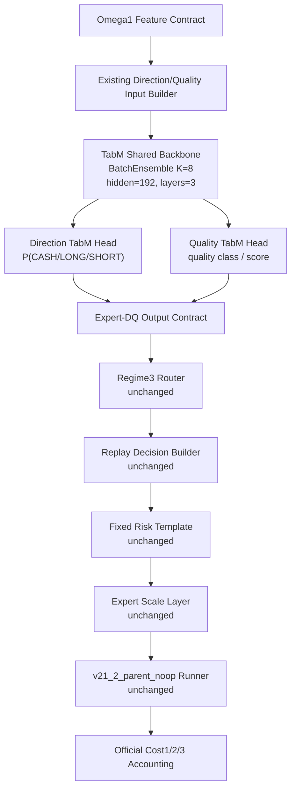

# Omega1.1 TabM Expert-DQ Contract - 2026-06-02

## Scope

- Alias: `omega1.1`
- Model name: `omega1_1_tabm_expertdq_20260602`
- Status: `named_research_candidate_not_live_promoted`
- Purpose: replace only the Omega1 expert-local Direction and Quality heads with TabM-style BatchEnsemble tabular classifiers, while preserving the existing Regime3 router, replay decision builder, fixed risk template, expert scaling, runner, and Cost accounting.
- Training script: `scripts/train_omega1_regime3_routed_expert_direction_quality_tabm_20260602.py`
- Replay evaluation script: `scripts/eval_omega1_regime3_expertdq_tabm_risk_replay_20260602.py`
- Direction/Quality artifact dir: `tmp/causal_regen_20260516/omega1_regime3_routed_expert_direction_quality_tabm_20260602`
- Replay report dir: `tmp/causal_regen_20260516/omega1_regime3_expertdq_tabm_risk_replay_20260602`

## Version Boundary

- Omega1.1 means TabM ExpertDQ only.
- Direction Head and Quality Head are TabM-style BatchEnsemble PyTorch
  classifiers in Omega1.1.
- CatBoost Direction/Quality heads belong to the Omega1 CatBoost baseline and
  must not be wired into Omega1.1 active or candidate paths.
- If an Omega1.1 path loads `.cbm` Direction/Quality artifacts, that is a
  contract error and must fail fast.
- Expected Omega1.1 Direction/Quality artifacts use the `_tabm.pt` suffix.

## Architecture

## Dataset Split

- 2025 OOF / validation source: `training_features_2025_*_omega1_regime3_expertdq_oof_20260602.csv`
- 2026 OOS source: `training_features_2026_rebuilt_*_omega1_regime3_expertdq_20260602.csv`
- Validation frame: `train_all[timestamp >= SPLIT_TS]` from the current Omega1 max-feature frame loader.
- OOS frame: 2026 rebuilt frame from `_load_frames_max`.
- Source alignment is exact timestamp intersection. Duplicate timestamps fail fast.
- No OOS threshold tuning is performed inside the replay evaluator; the report ranks variants after replay for research comparison.

## Layer Contracts

### Layer 3A: Direction TabM Head

- Input: same feature columns as the existing expert-local Direction/Quality input builder.
- Model: TabM-style BatchEnsemble PyTorch classifier.
- Artifact suffix: `_direction_head_tabm.pt`.
- Output: direction probabilities and final action fields written through the existing Expert-DQ output contract.
- Action values: `0=CASH`, `1=LONG`, `2=SHORT`.

### Layer 3B: Quality TabM Head

- Input: same builder family as Direction Head.
- Model: TabM-style BatchEnsemble PyTorch classifier.
- Artifact suffix: `_quality_head_tabm.pt`.
- Output: `quality_for_action` compatible with the existing replay decision builder.

### Layer 4: Regime3 Router

- Preserved unchanged from the CatBoost Expert-DQ baseline.
- Output column: `router_expert`.
- Allowed route values: `bull`, `bear`, `chop_expert`.

### Layer 5: Replay Decision Builder

- Function: `_to_decisions`.
- Inputs: `final_action`, `quality_for_action`, `dir_confidence`, `router_expert`.
- Output decision columns: `action`, `side`, `notional_exposure`, `leverage`, `position_fraction`, `take_profit`, `stop_loss`, `max_hold_bars`, `cooldown_bars`, `quality_score`, `confidence`, `router_expert`.

### Layer 6: Risk Template and Expert Scale

- Active template:
  - `notional = 0.45`
  - `leverage = 2.0`
  - `take_profit = 0.026`
  - `stop_loss = 0.014`
  - `max_hold = 72`
  - `cooldown = 6`
- Expert scales:
  - `bull = 0.75`
  - `bear = 0.90`
  - `chop = 0.90`

## Output Contract

Required Expert-DQ source columns:

- `timestamp`
- `omega1_regime3_expertdq_*router_expert`
- `omega1_regime3_expertdq_*final_action`
- `omega1_regime3_expertdq_*quality_for_action`
- `omega1_regime3_expertdq_*dir_confidence`

The OOF split uses prefix `omega1_regime3_expertdq_oof_`; OOS uses prefix `omega1_regime3_expertdq_`.

## Results

Selected by OOS Cost3 PnL:

- Variant: `hard_floor_0p00`
- Validation Cost3: PnL `+1.38%`, MDD `-14.98%`, trades `337`, WR `45.10%`
- OOS Cost3: PnL `+14.16%`, MDD `-10.77%`, trades `211`, WR `49.29%`
- Delta vs active common OOS Cost3: PnL `+9.65%`, MDD `-2.08%`, trades `+0`, WR `+2.37pp`

Balanced research alternative:

- Variant: `soft_floor_0p20`
- OOS Cost3: PnL `+11.08%`, MDD `-6.68%`, trades `203`, WR `51.23%`
- Interpretation: lower PnL than `hard_floor_0p00`, but better MDD and WR.

## Red Team Gates

- Forbidden active feature prefixes must remain blocked by the upstream Omega1 feature contract.
- No alias, fallback prefix, or legacy compatibility layer is introduced by this contract.
- Missing Expert-DQ source columns must fail fast.
- Duplicate timestamps must fail fast.
- This is not a live promotion. Live use requires a separate runtime-native parity audit and live artifact wiring contract.

## Open Issues

- The risk layer is still fixed-template based. `TP/SL/notional/leverage/hold/cooldown` are not learned by TabM.
- The selected variant is ranked by OOS Cost3 in this research replay, so it must not be treated as untouched-OOS promotion evidence.
- Before live promotion, the same contract must be reproduced under a validation-only selector and runtime-native execution path.
