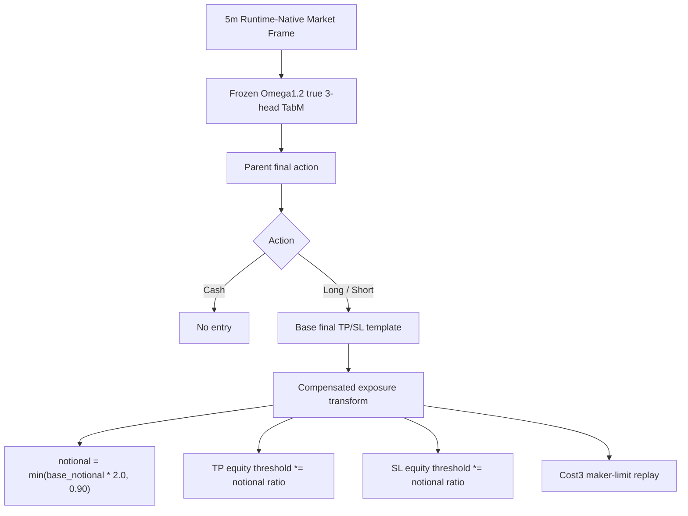
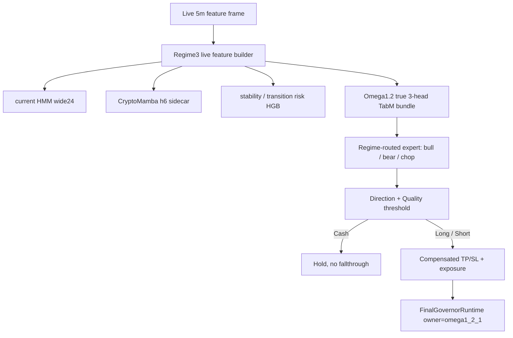

# Omega1.2.1 Aggressive Current Baseline Contract - 2026-06-06

## Status

- Alias: `omega1.2.1_aggressive_current_baseline`
- Model id: `omega1_2_1_aggressive_compensated_scale200_cap090`
- Status: `live_promoted_pending_restart`
- Manifest: `data/ensemble/supervised/omega1_2_1_aggressive_compensated_scale200_cap090/baseline_manifest.json`
- Parent baseline: `omega1_2_true_3head_tabm_20260603_final_tp_sl_on_e28_exit30k_q080`
- Growth family: `omega1_2_1_current_baseline_growth_20260606`

This is the current Omega live baseline. It promotes the Omega1.2.1 aggressive compensated exposure candidate into `trading_bot.py` through a dedicated fail-fast Omega adapter path.

## Architecture

Live path:

## Baseline Parameters

- Base TP: `0.026`
- Base SL: `0.014`
- Base notional exposure: `0.405`
- Base leverage: `2.0`
- Max hold: `0`
- Cooldown: `0`
- Compensated scale: `2.0`
- Notional cap: `0.90`
- Cost multiplier: `3.0`

The transform preserves the parent price-hit geometry by scaling TP/SL equity thresholds by the realized notional ratio. Raw notional-only scaling is not this baseline.

Live routing notes:

- `FINAL_GOVERNOR_OMEGA1_2_1_ENABLE` defaults to `true`.
- `FINAL_GOVERNOR_FULLY_LEARNED_ENABLE` defaults to `false` when Omega1.2.1 is enabled.
- Omega CASH is terminal for the decision step; it does not fall through to Alpha7, V31, macro, trend, or micro paths.
- The live adapter does not consume `teacher_*`, legacy Regime4 unsupervised prefixes, or `tp_sl_action_score`.
- Missing/non-finite Regime3 or TabM contract columns raise immediately.

## Baseline Metrics

Validation:

- PnL: `+100.542729%`
- MDD: `-10.677653%`
- WR: `63.636364%`
- Trades: `33`
- Long / Short: `9 / 24`
- Exit reasons: `take_profit=20`, `stop_loss=12`, `forced_end=1`

OOS:

- PnL: `+72.760041%`
- MDD: `-8.108171%`
- WR: `72.222222%`
- Trades: `18`
- Long / Short: `3 / 15`
- Exit reasons: `take_profit=13`, `stop_loss=5`

## Growth Rules

- Future candidates must compare against this aggressive baseline, not the previous unscaled Omega1.2 baseline.
- Validation and OOS must both be reported.
- A candidate that improves OOS but worsens validation drawdown materially should remain research-only.
- Do not add legacy aliases, fallback prefixes, or compatibility feature shims.
- Live wiring is implemented in `trading_bot_modules/omega1_2_1_live.py` and `trading_bot.py`.
- Runtime-native smoke passed on `data/live/decision_feature_frame_snapshot.pkl.gz`.
