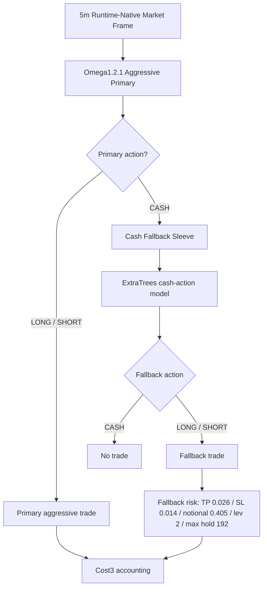

# Omega1.2.1 Cash Fallback Sleeve Contract - 2026-06-06

## Status

- Model id: `omega1_2_1_cash_fallback_extra_base_edge006_thr055_20260606`
- Model zoo update: `omega1_2_1_cash_fallback_mlp_base_edge006_thr085_20260606`
- Status: `deprecated_historical_reference_only_accounting_invalid_true_leverage`
- Parent baseline: `omega1_2_1_aggressive_compensated_scale200_cap090`
- Manifest: `data/ensemble/supervised/omega1_2_1_cash_fallback_extra_base_edge006_thr055_20260606/candidate_manifest.json`
- Model artifact: `data/ensemble/supervised/omega1_2_1_cash_fallback_extra_base_edge006_thr055_20260606/cash_fallback_model.pkl`
- Research script: `scripts/train_eval_omega1_2_1_cash_fallback_sleeve_20260606.py`
- Model zoo script: `scripts/train_eval_omega1_2_1_cash_fallback_model_zoo_20260606.py`
- Label-family script: `scripts/train_eval_omega1_2_1_cash_fallback_label_family_20260606.py`
- TB confirm script: `scripts/train_eval_omega1_2_1_cash_fallback_tb_confirm_20260607.py`

This candidate preserves the aggressive primary baseline and adds a fallback sleeve only while the primary action is `CASH`.
The model zoo update uses the same fallback contract and risk template, but replaces the fallback classifier with an `MLPClassifier` pipeline.
The label-family experiment keeps the same feature contract, fallback risk, and Cost3 accounting, then changes only the supervised fallback label source.
The TB confirm experiment uses a triple-barrier fallback signal only when a ZigZag model confirms the same side.

Accounting audit update, 2026-06-09:

- This family is deprecated for active research and live promotion.
- The fallback risk template stored both `notional` and `leverage`, but the legacy replay treated `notional_exposure` as the effective account exposure and did not apply `notional * leverage` to PnL/fee/MDD.
- Descendant candidates from this script family must be rerun under an explicit leverage-exposure contract before they can be compared to current Omega candidates.
- Use `docs/model_contracts/omega_accounting_audit_20260609.md` for the canonical verdict.

## Architecture

## Fallback Contract

Allowed:

- Call fallback model only when the primary decision is `CASH` and no position is open.
- Use fallback action classes `0=CASH`, `1=LONG`, `2=SHORT`.
- If a primary signal appears while fallback is open, close fallback by `primary_takeover`; primary retains priority.

Forbidden:

- Fallback must not alter primary active signals.
- Fallback must not use direct EXIT Head threshold exits.
- No legacy alias, compatibility prefix, or silent feature fallback is allowed.
- Forbidden features remain blocked: `clean_regime4_*`, `regime4_pred_*`, `teacher_*`, `tp_sl_action_score`.

## Selected Model

- Model family: `ExtraTreesClassifier`
- Training rows: 2025 validation primary-cash rows
- OOS: 2026 untouched evaluation
- Label edge: `0.006`
- Inference confidence threshold: `0.55`
- Risk template:
  - `take_profit = 0.026`
  - `stop_loss = 0.014`
  - `notional = 0.405`
  - `leverage = 2.0`
  - `max_hold_bars = 192`

## Model Zoo Update

- Model id: `omega1_2_1_cash_fallback_mlp_base_edge006_thr085_20260606`
- Status: `research_candidate_not_live_promoted`
- Model family: `Pipeline(StandardScaler, MLPClassifier)`
- Manifest: `data/ensemble/supervised/omega1_2_1_cash_fallback_mlp_base_edge006_thr085_20260606/candidate_manifest.json`
- Model artifact: `data/ensemble/supervised/omega1_2_1_cash_fallback_mlp_base_edge006_thr085_20260606/cash_fallback_model.pkl`
- Label edge: `0.006`
- Inference confidence threshold: `0.85`
- Risk template: same as selected ExtraTrees candidate.

## Metrics

Baseline `omega1_2_1_aggressive_compensated_scale200_cap090`:

- Validation: PnL `+100.542729%`, MDD `-10.677653%`, WR `63.636364%`, trades `33`
- OOS: PnL `+72.760041%`, MDD `-8.108171%`, WR `72.222222%`, trades `18`

Cash fallback candidate:

- Validation: PnL `+101.925385%`, MDD `-10.677653%`, WR `65.714286%`, trades `35`, fallback entries `2`
- OOS: PnL `+77.750202%`, MDD `-8.108171%`, WR `66.666667%`, trades `24`, fallback entries `6`

MLP model zoo candidate:

- Validation: PnL `+102.349040%`, MDD `-10.677653%`, WR `63.888889%`, trades `36`, fallback entries `3`
- OOS: PnL `+85.877246%`, MDD `-8.108171%`, WR `70.833333%`, trades `24`, fallback entries `6`

Label-family experiment:

- Tested label families: `sltp_edge006`, `zigzag_action`, `tb_atr08_h48`, `tb_atr12_h96`, `topk2_8h`, `topk3_8h`, `reversal_z12_h24`.
- Best OOS-only lead: `tb_atr08_h48 + HGB threshold=0.45`.
- OOS-only lead metrics: PnL `+90.945756%`, MDD `-8.015291%`, WR `64.705882%`, trades `51`, fallback entries `33`.
- Rejection reason: validation PnL `+85.964136%`, validation MDD `-13.516289%`, validation WR `44.827586%`; this fails the stability requirement versus the MLP fallback candidate.
- Best ZigZag label result: `zigzag_action + MLP threshold=0.75`, validation PnL `+110.900407%`, OOS PnL `+85.662921%`; it did not beat the current MLP fallback OOS result.

TB + ZigZag confirmation experiment:

- Research lead id: `omega1_2_1_cash_fallback_tb08_mlp_zigsame_c075_e065_20260607`
- Status: `research_candidate_not_live_promoted`
- Manifest: `data/ensemble/supervised/omega1_2_1_cash_fallback_tb08_mlp_zigsame_c075_e065_20260607/candidate_manifest.json`
- Model artifact: `data/ensemble/supervised/omega1_2_1_cash_fallback_tb08_mlp_zigsame_c075_e065_20260607/cash_fallback_tb_confirm_model.pkl`
- Base fallback signal: `tb_atr08_h48 + MLP`
- Confirm signal: `zigzag_action + MLP`
- Rule: allow fallback only when base signal and ZigZag signal choose the same side.
- Confirm threshold: `0.75`
- Entry threshold: `0.65`
- Validation: PnL `+102.245021%`, MDD `-9.762964%`, WR `59.523810%`, trades `42`, fallback entries `9`
- OOS: PnL `+91.752791%`, MDD `-8.171701%`, WR `68.965517%`, trades `29`, fallback entries `11`
- Strict-pass comparison candidate: `tb12_mlp + zig_same confirm=0.85 entry=0.55`, validation PnL `+104.075320%`, OOS PnL `+87.335940%`.

Interpretation:

- OOS PnL improves by `+4.990160%`.
- OOS MDD is unchanged.
- OOS WR falls because fallback adds balanced wins/losses, but total PnL improves.
- The MLP model zoo candidate improves OOS PnL by `+13.117205%` versus the aggressive primary baseline and by `+8.127044%` versus the ExtraTrees fallback candidate, with unchanged OOS MDD.
- No non-SLTP label family is promoted yet. Triple-barrier generated the highest OOS number, but validation instability indicates overfit or regime luck.
- TB + ZigZag same-side confirmation is the strongest research lead so far. It improves OOS PnL by `+5.875545%` versus the current MLP fallback while slightly improving validation MDD, but validation PnL is `0.104019%` below the current MLP fallback. Treat it as a research lead, not a live promotion.
- This is a research candidate, not live-promoted.

## Live Promotion Requirements

- Reproduce runtime-native feature contract in `trading_bot.py`.
- Verify primary active signal parity against the aggressive baseline.
- Verify fallback only fires on primary `CASH`.
- Confirm `primary_takeover` behavior in live order manager before enabling real orders.
