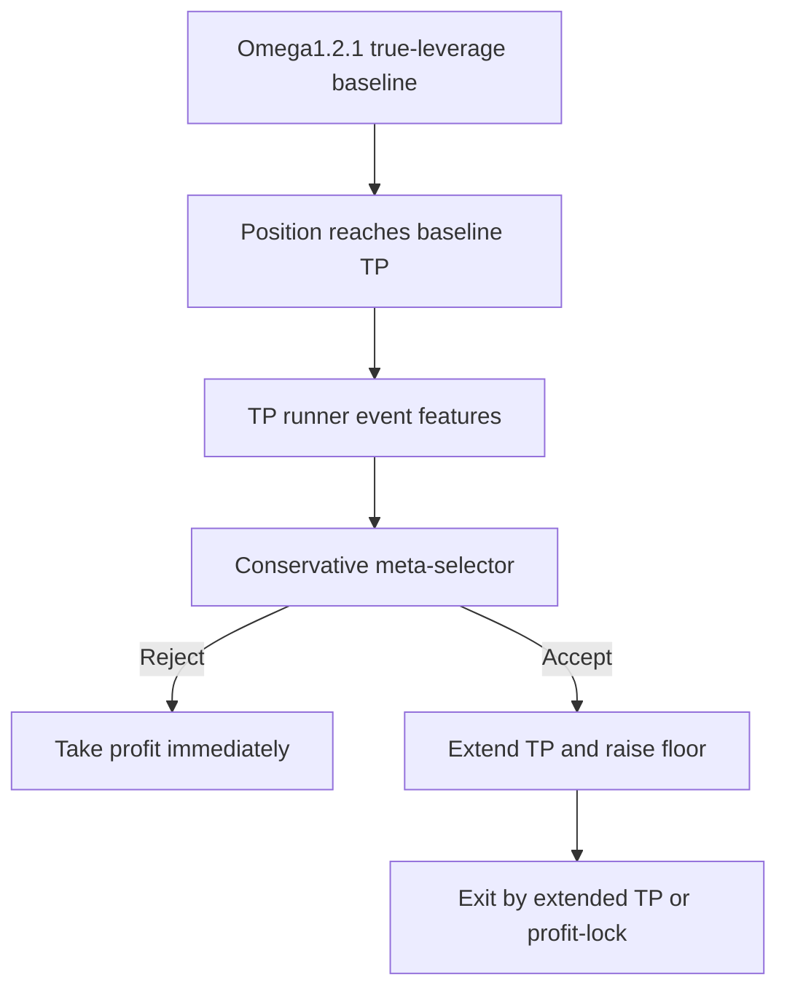

# Omega1.2.1 TP Runner Meta Selector Contract - 2026-06-10

## Status

- Model id: `omega1_2_1_tp_runner_meta_selector_20260610`
- Parent baseline: `omega1_2_1_true_leverage_price_barrier_scale200_cap090`
- Status: `research_candidate_shadow_required`
- Script: `scripts/train_eval_omega1_2_1_tp_runner_meta_selector_20260610.py`
- Artifacts: `tmp/causal_regen_20260516/omega1_2_1_tp_runner_meta_selector_20260610/`
- Shadow selector bundle: `data/ensemble/supervised/omega1_2_1_tp_runner_meta_selector_20260610/tp_runner_meta_selector.joblib`
- Shadow live log: `data/live/tp_runner_shadow_parity.jsonl`
- Shadow parity checker: `scripts/check_tp_runner_shadow_parity_20260610.py`
- Red-team/accounting audit: `tmp/causal_regen_20260516/omega1_2_1_tp_runner_meta_selector_20260610/redteam_accounting_audit.md`

This candidate does not change entry, side, base notional, leverage, TP, or SL. It only decides whether a winning trade that already hit TP should be extended once under a profit-lock runner template.

## Architecture

## Selected Candidate

- Template: `val_strong_175_floor90_ext1`
- Selector: `ExtraTreesClassifier`
- Probability threshold: `0.55`
- Seeds tested: `8`
- Runner template:
  - `extend_mult = 1.75`
  - `floor_frac = 0.90`
  - `max_extensions = 1`
  - `quality_min = 0.70`
  - `momentum_min = 0.0`

## Metrics

Baseline:

| Split | PnL | MDD | WR | Trades |
|---|---:|---:|---:|---:|
| Validation | `+277.46%` | `-20.34%` | `63.64%` | `33` |
| OOS | `+186.43%` | `-15.60%` | `72.22%` | `18` |

Selected candidate, seed-median:

| Split | PnL | MDD | WR | Trades |
|---|---:|---:|---:|---:|
| Validation | `+383.11%` | `-20.34%` | `65.63%` | `32` |
| OOS | `+205.92%` | `-15.60%` | `72.22%` | `18` |

Seed worst-case:

| Split | PnL |
|---|---:|
| Validation min | `+353.30%` |
| OOS min | `+205.92%` |

## Red-Team Verdict

- Accounting audit: `pass`
- Feature contract audit: `pass`
- Promotion: `blocked`
- Blockers:
  - The selector bundle was selected from ranking sorted by OOS PnL first, so its OOS uplift is not an untouched holdout result.
  - Validation TP-hit samples are only `20`, too small for active live promotion.
  - Live shadow parity has no TP-hit rows yet.

Keep this model shadow-only until a validation-only or walk-forward selection protocol is implemented and live TP-hit shadow rows pass parity checks.

## Data Caution

The TP runner selector is trained from only `20` validation TP-hit events. This is intentionally kept as a small, conservative selector, not a high-capacity model. Promotion requires shadow/live parity checks before live execution.

## Live Shadow Rules

- The live bot may load the selector bundle only for shadow logging.
- Shadow mode must not alter entry, exit, TP, SL, notional, leverage, position owner, or runtime state.
- At a baseline TP hit, the bot records the selector probability, extend/take-profit decision, feature snapshot, and proposed extended TP/floor to `tp_runner_shadow_parity.jsonl`.
- Promotion to active execution requires enough live TP-hit rows and a passing parity check from `check_tp_runner_shadow_parity_20260610.py`.

## Forbidden Features

The candidate inherits the Omega1.2.1 fail-fast feature policy. Do not add aliases, fallback prefixes, or compatibility layers for:

- `teacher_*`
- `clean_regime4_*`
- `clean_regime_2024_unsup_v4_*`
- `regime4_pred_*`
- `tp_sl_action_score`
