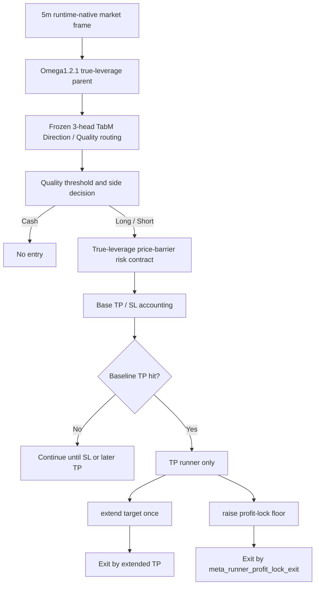

# Omega1.2.1 TP Runner Only Baseline Contract - 2026-06-12

> Deprecated 2026-06-13: this contract is retained for historical audit only. Do not use this model as active runtime, candidate baseline, clean OOS comparison, or promotion evidence.

## Status

- Model id: `omega1_2_1_tp_runner_only_baseline_20260612`
- Alias: `omega1.2.1_tp_runner_only_baseline`
- Status: `deprecated_do_not_use_active_or_candidate`
- Manifest: `data/ensemble/supervised/omega1_2_1_tp_runner_only_baseline_20260612/baseline_manifest.json`
- Parent baseline: `omega1_2_1_true_leverage_price_barrier_scale200_cap090`
- Red-team audit: `docs/audits/omega1_2_1_tp_runner_baseline_redteam_20260613.md`
- Audit report: `tmp/causal_regen_20260516/omega1_2_1_tp_runner_baseline_redteam_audit_20260613/report.json`

This model was previously documented as wired into the Omega live runtime. That status is now invalidated by the 2026-06-13 red-team audit.

## Architecture

## Runner Contract

The runner is a fixed TP-hit overlay. It does not use `oracle`, `breakeven_lock`, or learned protective action layers. It does use the promoted TP runner bundle selector as part of the TP-extension condition.

- Runner source bundle: `data/ensemble/supervised/omega1_2_1_tp_runner_meta_selector_20260610/tp_runner_meta_selector.joblib`
- `extend_mult`: `1.75`
- `floor_frac`: `0.90`
- `max_extensions`: `1`
- `quality_min`: `0.70`
- `momentum_min`: `0.0`
- `selector_proba_min`: `0.55`
- Selector active: `true`, only for TP-extension approval

The bundle is used as the source of the runner template and selector. No separate age/exit/hazard layer is promoted as active execution.

## Metrics

The metrics below are historical contaminated research metrics and must not be used as clean OOS evidence.

| Split | PnL | MDD | WR | Trades | Long / Short |
|---|---:|---:|---:|---:|---:|
| Validation | `+407.56%` | `-20.34%` | `67.74%` | `31` | `9 / 22` |
| OOS | `+205.92%` | `-15.60%` | `72.22%` | `18` | `3 / 15` |

Baseline without runner:

| Split | PnL | MDD | WR | Trades |
|---|---:|---:|---:|---:|
| Validation | `+277.46%` | `-20.34%` | `63.64%` | `33` |
| OOS | `+186.43%` | `-15.60%` | `72.22%` | `18` |

## Audit Notes

- Accounting: `failed_runtime_equivalence_audit`
- Feature contract: `pass_no_direct_forbidden_columns_found`
- Exit-context ablation: `historical_only`
- OOS oracle protective actions: excluded
- TP runner selector: blocked for promotion because the selected runner bundle/config used OOS metrics
- Live runtime wiring: blocked

The actual `tp_runner_only` path has no `exit` or `hazard` input columns. However, this does not repair OOS-mined TP-runner selection or runtime-equivalence issues. Historical ablation report:

- `tmp/causal_regen_20260516/omega1_2_1_tp_runner_only_actual_no_exit_context_ablation_20260612/report.json`

Blocking findings:

- 2026 OOS was used for TP-runner/config selection.
- TP/SL checks used close-threshold replay, not true intrabar barrier replay.
- Execution assumed next-bar-open maker limit fills without queue/post-only-reject modeling.
- Ledger prices recorded close instead of actual accounting fill price.

## Forbidden Features

The active path remains fail-fast and must not add aliases or compatibility fallbacks for:

- `teacher_*`
- `clean_regime4_*`
- `clean_regime_2024_unsup_v4_*`
- `regime4_pred_*`
- `tp_sl_action_score`

## Live Runtime Wiring

Deprecated. `trading_bot.py` and `trading_bot_modules/omega1_2_1_live.py` must not use `omega1_2_1_tp_runner_only_baseline_20260612` as an active model id.

Historical runner-only lifecycle:

1. Base Omega1.2.1 entry/risk decision is unchanged.
2. On baseline TP hit, evaluate runner-only conditions: `quality >= 0.70`, `ret3_side > 0.0`, and selector probability `>= 0.55`.
3. If allowed, extend TP once by `extend_mult=1.75` and set profit-lock floor to `old_tp * 0.90`.
4. If not allowed, close as take-profit.
5. After extension, close on extended TP, profit-lock floor, stop-loss, or forced end.

No oracle protective action, exit/hazard context, or compatibility fallback is promoted. The whole TP-runner-only baseline is now blocked pending retraining/reselection without 2026 OOS and fresh untouched holdout validation.
