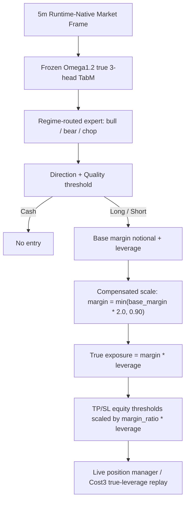

# Omega1.2.1 True Leverage Price Barrier Contract - 2026-06-10

## Status

- Model id: `omega1_2_1_true_leverage_price_barrier_scale200_cap090`
- Previous baseline: `omega1_2_1_aggressive_compensated_scale200_cap090`
- Status: `audited_research_candidate_not_clean_untouched_oos`
- Manifest: `data/ensemble/supervised/omega1_2_1_true_leverage_price_barrier_scale200_cap090/baseline_manifest.json`

This version keeps the Omega1.2.1 parent signal unchanged and changes only the risk accounting contract.

## Architecture

## Risk Contract

- Base TP: `0.026`
- Base SL: `0.014`
- Base margin notional: `0.405`
- Base leverage: `2.0`
- Compensated scale: `2.0`
- Margin notional cap: `0.90`
- Effective exposure: `margin_notional * leverage`
- Max hold: `0`
- Cooldown: `0`

For the common baseline case:

- Margin notional: `0.81`
- Execution leverage: `2.0`
- Effective exposure: `1.62`
- TP equity threshold: `0.104`
- SL equity threshold: `0.056`

The TP/SL thresholds are intentionally scaled by leverage to preserve the same price barrier as the previous effective-notional baseline. Without this scaling, true leverage halves the price distance to TP/SL and creates high-churn stop-loss behavior.

## Metrics

Original reported true leverage with price barrier preserved:

| Split | PnL | MDD | WR | Trades |
|---|---:|---:|---:|---:|
| Validation | `+276.67%` | `-20.34%` | `63.64%` | `33` |
| OOS | `+186.43%` | `-15.60%` | `72.22%` | `18` |

2026-06-13 red-team clean intrabar/taker replay:

| Split | PnL | MDD | WR | Trades |
|---|---:|---:|---:|---:|
| Validation | `+49.16%` | `-33.16%` | `46.67%` | `45` |
| OOS | `+120.07%` | `-15.64%` | `65.00%` | `20` |

The original `+186.43%` OOS should not be cited as clean untouched OOS. Use the clean intrabar/taker replay numbers for conservative comparisons.

Failed diagnostic, true leverage with unchanged equity TP/SL:

| Split | PnL | MDD | WR | Trades |
|---|---:|---:|---:|---:|
| Validation | `-5.31%` | `-31.25%` | `36.19%` | `105` |
| OOS | `+52.66%` | `-17.91%` | `45.90%` | `61` |

## Live Notes

- `notional_exposure` is total effective account exposure.
- `position_fraction` is margin fraction.
- `execution_leverage` is the exchange leverage multiplier.
- Existing open `omega1_2_1` positions from the previous baseline are recovered from journal with their persisted TP/SL and should not be reinterpreted as this new contract mid-trade.
- Real exchange execution should remain disabled until this candidate completes a shadow period under the new contract.

## Forbidden Features

The live path remains fail-fast and must not add aliases or compatibility fallbacks for:

- `teacher_*`
- `clean_regime4_*`
- `clean_regime_2024_unsup_v4_*`
- `regime4_pred_*`
- `tp_sl_action_score`

## Red-Team Audit - 2026-06-13

- Audit report: `docs/audits/omega1_2_1_true_leverage_baseline_redteam_20260613.md`.
- Direct forbidden-feature leak into `decision` or runner `state`: not found.
- Source frames still contain legacy forbidden columns; this must not be confused with active decision/state consumption.
- Original ledger intrabar timing sensitivity: validation `23/33` trades touched TP/SL earlier by high/low, OOS `11/18`.
- Recommendation: fresh forward shadow or later untouched test period is required before live promotion.
