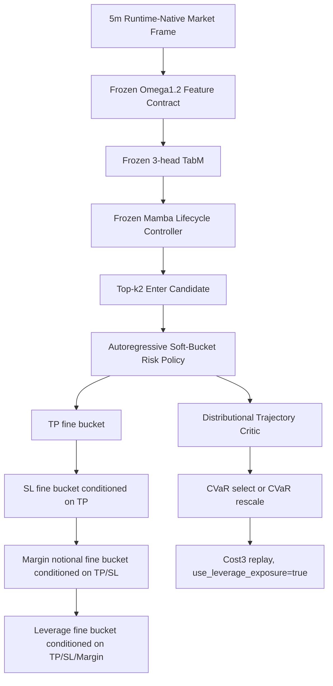

# Omega1.2 Autoregressive Soft-Bucket Risk Policy Contract - 2026-06-06

## Status

- Model id: `omega1_2_autoreg_softbucket_risk_20260606`
- Status: `research_failed_not_live_promoted`
- Training/evaluation script: `scripts/train_eval_omega1_2_autoreg_softbucket_risk_20260606.py`
- Baseline reference: `base_nogate_topk2` from `omega1_2_post_lifecycle_bucket_adapter_20260605`
- Live wiring: none

This experiment keeps the Omega1.2 frozen upper stack and replaces only the post-lifecycle HGB bucket adapter with a learned neural risk policy.

## Architecture

## Feature Contract

Input feature source:

- same post-lifecycle adapter state used by `base_nogate_topk2`
- lifecycle state row at candidate bar
- lifecycle position-state columns
- `post_lifecycle_enter_base`
- `post_lifecycle_enter_aggressive`
- `post_lifecycle_action_id`

Observed feature dimension: `218`

Forbidden active/candidate inputs:

- `clean_regime4_*`
- `regime4_pred_*`
- `tp_sl_action_score`
- `teacher_*`

Audit on full-run artifact:

- artifact: `tmp/causal_regen_20260516/omega1_2_autoreg_softbucket_risk_20260606_full_cvar_select_cap055_c128_s260807/autoreg_softbucket_risk.pt`
- forbidden count: `0`

## Risk Space

- TP fine buckets: 32 values from `0.018` to `0.080`
- SL fine buckets: 32 values from `0.010` to `0.060`
- margin-notional buckets: `[0.20, 0.25, 0.30, 0.3375, 0.375, 0.405, 0.45, 0.50, 0.55, 0.60, 0.65, 0.70]`
- leverage buckets: `[1.0, 2.0, 3.0, 4.0, 5.0]`

The policy is autoregressive:

- TP head first
- SL head conditioned on TP
- margin-notional head conditioned on TP and SL
- leverage head conditioned on TP, SL, and margin-notional

The critic predicts trade-level quantiles from state plus chosen risk embeddings. Inference tested:

- `policy_only`
- `cvar_select`
- `cvar_rescale`
- conservative policy improvement overlay against explicit `base_nogate_topk2` HGB adapter reference

## Results

Baseline reference `base_nogate_topk2`:

- OOS PnL: `+29.41%`
- OOS MDD: `-2.34%`
- OOS WR: `78.12%`
- OOS trades: `32`
- Validation PnL: `+8.87%`
- Validation MDD: `-7.89%`

Best OOS smoke candidate:

- candidate: `smoke_cvar_rescale_s260801`
- Validation: `-23.45%` PnL, `-36.88%` MDD, `51.69%` WR, `89` trades
- OOS: `+68.67%` PnL, `-8.96%` MDD, `79.31%` WR, `29` trades
- status: rejected because validation collapsed

Best conservative fail-fast candidate:

- candidate: `failfast_cvar_select_cap055_s260806`
- Validation: `-4.54%` PnL, `-12.44%` MDD, `51.14%` WR, `88` trades
- OOS: `+38.26%` PnL, `-3.89%` MDD, `83.87%` WR, `31` trades
- status: rejected because validation remains worse than baseline

Full run:

- candidate: `full_cvar_select_cap055_c128_s260807`
- Validation: `-9.36%` PnL, `-18.13%` MDD, `51.16%` WR, `86` trades
- OOS: `+37.60%` PnL, `-3.89%` MDD, `83.87%` WR, `31` trades
- status: rejected because full training worsened validation stability

Conservative policy improvement overlay:

- candidates:
  - `failfast_cpi_cvar_select_cap055_margin003_s260810`
  - `failfast_cpi_cvar_select_cap055_margin003_s260812`
  - `failfast_cpi_cvar_select_cap055_margin003_s260813`
- conservative baseline: `tmp/causal_regen_20260516/omega1_2_post_lifecycle_bucket_adapter_20260605_hgb_base_nogate_traink3_replayk2_s260693/post_bucket_adapter.pkl`
- rule: use neural risk only when neural CVaR is at least `0.003` above the baseline adapter risk CVaR; otherwise use baseline risk
- three-seed validation mean: `+8.57%` PnL, `-8.59%` MDD, `51.14%` WR, `88` trades
- three-seed OOS mean: `+29.53%` PnL, `-2.34%` MDD, `78.12%` WR, `32` trades
- OOS baseline fallback mean: `30.3` of `32` entries
- status: `safe_overlay_research_candidate_not_replacement`

Interpretation: CPI restores stability, but it does so by falling back to the baseline on almost every OOS entry. The overlay gives only a `+0.12%` OOS PnL improvement over `base_nogate_topk2`, so it is not enough evidence to replace the HGB adapter.

## Failure Analysis

The neural policy can increase OOS PnL, but it does not satisfy validation stability:

- The policy learns high-leverage/high-exposure risk settings from ex-post counterfactual winners.
- CVaR selection helps OOS MDD but does not prevent validation drawdown.
- CVaR rescaling lowers OOS drawdown when the cap is small, but validation still loses money.
- Full counterfactual training does not fix the instability; it amplifies the validation gap.

Conclusion: this architecture is useful as a research diagnostic but should not replace `base_nogate_topk2`. The next viable direction is not more freedom in the risk head. It is a stricter validation-aware training objective, such as purged fold reward surfaces, validation-calibrated downside penalties, or a conservative policy improvement constraint against the stable HGB adapter.

Update after CPI test: conservative policy improvement is effective as a safety constraint but not as an alpha source. It confirms that the neural risk policy has not learned a reliably better risk surface than the stable HGB adapter.
