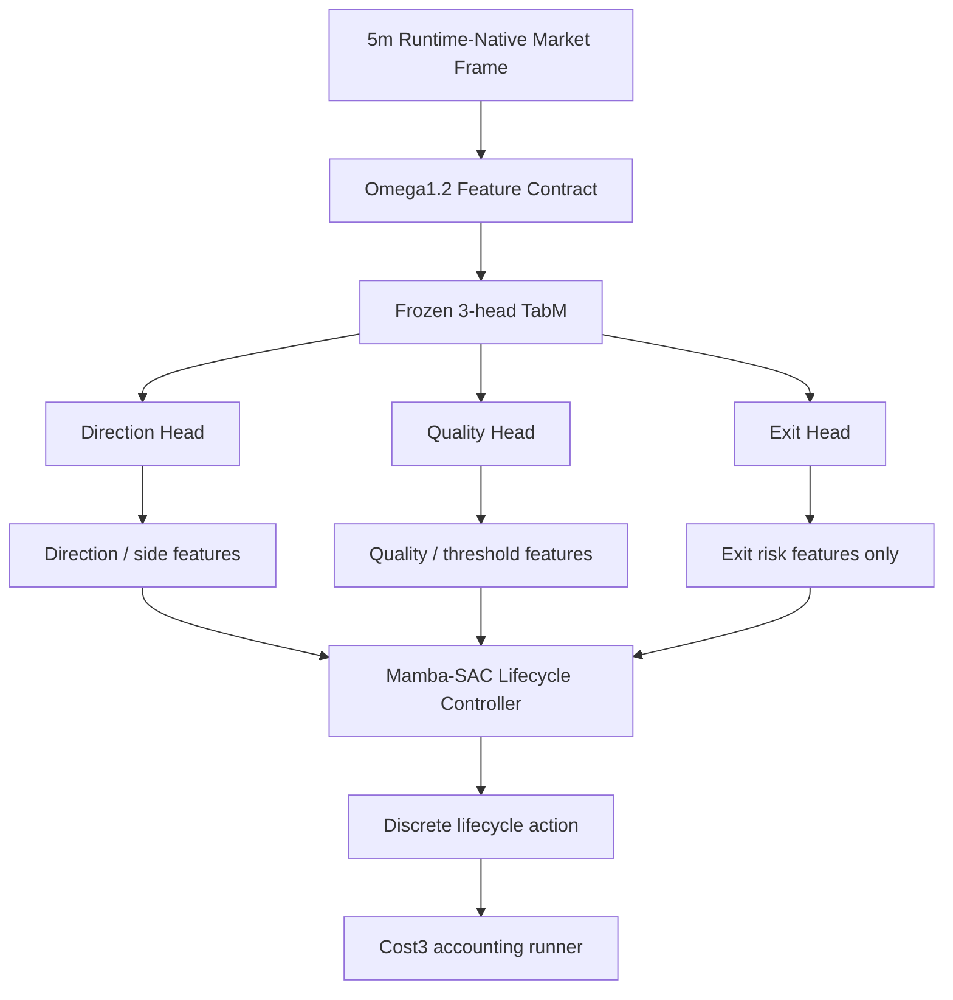

# Omega1.2 Exit-Feature Lifecycle Baseline Contract - 2026-06-05

## Status

- Alias: `omega1.2_exit_feature_lifecycle_baseline`
- Model id: `omega1_2_exit_feature_lifecycle_baseline_20260604`
- Status: `research_baseline_not_live_promoted`
- Baseline artifact dir: `data/ensemble/supervised/omega1_2_exit_feature_lifecycle_baseline_20260604`
- Source artifact dir: `tmp/causal_regen_20260516/omega1_2_mamba_sac_lifecycle_controller_20260604_mid600_e800_noresize_noreverse_edge002_q075_seed260604`
- Training/evaluation script: `scripts/train_eval_omega1_2_mamba_sac_lifecycle_controller_20260604.py`

This is the new Omega1.2 research baseline for experiments where the 3-head TabM Exit Head is used only as an entry/lifecycle risk feature.

It is not a live promotion. Live wiring requires runtime-native parity, current live feature-contract validation, and a direct comparison against the prior Omega1.2 final TP/SL baseline.

## Architecture

## Exit Head Contract

The Exit Head must not own immediate exits by threshold.

Allowed outputs:

- `threehead_exit_p_hold_feature_only`
- `threehead_exit_p_exit_feature_only`
- `threehead_exit_edge_feature_only`

Allowed use:

- entry veto context,
- lifecycle risk context,
- full-exit/reduce decision context inside the lifecycle controller.

Forbidden use:

- direct rule `exit_prob >= threshold -> immediate exit`,
- replacing TP/SL accounting by itself,
- silent fallback to a separate exit model if the feature columns are missing.

Missing Exit Head feature columns are a feature-contract failure.

## Lifecycle Controller

Model family: discrete Mamba offline SAC-style lifecycle controller.

State includes:

- market/Omega1.2 contract features,
- frozen TabM Direction/Quality outputs,
- fixed-template context features,
- `threehead_exit_*_feature_only`,
- open-position state such as side, notional, unrealized return, MFE, MAE, giveback, hold bars, distance to TP, and distance to SL.

Action names:

- `hold_or_skip`
- `enter_base`
- `enter_aggressive`
- `reduce50`
- `full_exit`
- `resize_up`
- `reverse`

Selected baseline constraints:

- `quality_threshold = 0.75`
- `seq_len = 64`
- `max_train_entries = 600`
- `steps = 800`
- `min_action_edge = 0.002`
- `disable_resize = true`
- `disable_reverse = true`

The selected baseline therefore allows `hold_or_skip`, `enter_base`, `enter_aggressive`, `reduce50`, and `full_exit`; resize/reverse are disabled in this artifact.

## Cost Accounting

- Cost mode: Cost3
- `fee = 0.0005`
- `slip = 0.0002`
- `cost_mult = 3.0`
- delta-notional resize fee accounting: enabled
- partial-exit fee accounting: enabled

## Results

Validation Cost3:

- PnL: `+8.3532%`
- MDD: `-6.8760%`
- WR: `53.93%`
- Trades: `89`
- Long/Short entries: `20 / 69`

OOS Cost3:

- PnL: `+16.0740%`
- MDD: `-5.3960%`
- WR: `65.625%`
- Trades: `32`
- Long/Short entries: `6 / 26`

OOS reason counts:

- `entry`: `32`
- `take_profit`: `4`
- `stop_loss`: `6`
- `full_exit`: `22`
- `skip`: `42`
- `hold`: `8525`

## Interpretation

This baseline supersedes immediate-threshold Exit Head experiments for Omega1.2 lifecycle research.

The previous immediate-trigger approach was unstable because it converted an exit-risk classifier into a hard execution owner. This baseline keeps the Exit Head as a risk signal and lets the lifecycle controller arbitrate action timing.

This baseline does not supersede the stronger Omega1.2 final TP/SL result as a live model. It is the baseline for the next research branch where Exit Head information is preserved but not granted direct exit authority.

## Red-Team Gates

- No legacy alias, compatibility prefix, or silent feature fallback is allowed.
- `clean_regime_2024_unsup_v4_*`, `clean_regime4_2024_unsup_v1_*`, `regime4_pred_*`, `tp_sl_action_score`, and `teacher_*` must not be introduced into this active research baseline unless a new explicit contract and audit are created.
- If any required state column is missing, the runtime/evaluation must fail fast.
- Do not compare this baseline against other Omega candidates unless the same feature contract, accounting, and split definitions are reproduced in the same script.
