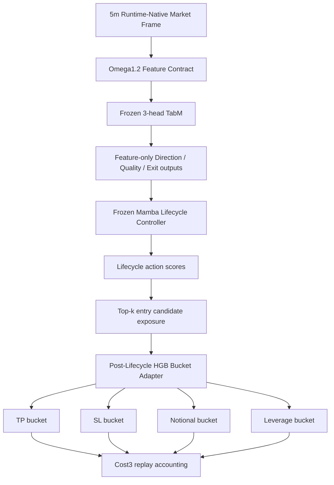

# Omega1.2 Post-Lifecycle Bucket Adapter Contract - 2026-06-05

## Status

- Alias: `omega1.2_post_lifecycle_bucket_adapter`
- Model id: `omega1_2_post_lifecycle_bucket_adapter_20260605`
- Status: `research_candidate_not_live_promoted`
- Stable candidate: `base_nogate_topk2`
- Aggressive candidate: `fixed_wide_lev5_cap120_nogate_topk2`
- High-return research candidate: `base_lev5_cap150_comp_tpup_voltarget_topk2`
- Blocked high-PnL research-only candidate: `fixed_ultra_wide_lev5_cap120_nogate_topk2`
- Training/evaluation script: `scripts/train_eval_omega1_2_post_lifecycle_bucket_adapter_20260605.py`
- Candidate manifest: `data/ensemble/supervised/omega1_2_post_lifecycle_bucket_adapter_20260605/candidate_manifest.json`

This contract extends the Omega1.2 Exit-Feature Lifecycle Baseline. The frozen Mamba lifecycle controller still owns lifecycle timing. The post-lifecycle adapter only sees entry or near-entry contexts and chooses TP/SL/notional/leverage buckets.

This is not live promoted. Live wiring requires runtime-native parity, current live feature-contract validation, and a promotion decision that explicitly chooses either the stable or aggressive candidate.

## Architecture

## Mutable Surface

Primary mutable surface: `post_lifecycle_risk_adapter_only`

Frozen components:

- Frozen 3-head TabM Direction/Quality/Exit feature source.
- Frozen Mamba lifecycle controller artifact from `omega1_2_exit_feature_lifecycle_baseline_20260604`.
- Cost3 accounting.
- Feature contract and forbidden-feature audit.

Mutable component:

- Post-lifecycle HGB bucket adapter.
- Optional top-k near-entry exposure from lifecycle action scores.
- TP/SL/notional/leverage bucket preset.
- Optional confidence-gated expanded notional buckets.
- Optional effective-exposure SL/TP compensation.
- Optional volatility-targeted leverage cap.
- Optional one-step TP upshift while the lifecycle controller keeps holding.

No legacy alias, compatibility prefix, or silent feature fallback is allowed.

## Feature Contract

Adapter input:

- lifecycle state row at candidate bar,
- open-position state columns from the lifecycle controller,
- `post_lifecycle_enter_base`,
- `post_lifecycle_enter_aggressive`,
- `post_lifecycle_action_id`.

Observed adapter feature dimension: `218`.

Forbidden active/candidate inputs:

- `clean_regime4_*`
- `regime4_pred_*`
- `tp_sl_action_score`
- `teacher_*`

The selected candidate audits report `forbidden_count = 0`.

## Candidate Definitions

### Stable Candidate: `base_nogate_topk2`

Purpose: stable OOS/MDD reference.

Configuration:

- bucket preset: `base`
- lifecycle entry exposure: `enter_topk=3`, `replay_enter_topk=2`
- entry gate: disabled
- max leverage bucket: `3x`
- leverage exposure accounting: disabled
- TP buckets: `[0.018, 0.022, 0.026, 0.030, 0.034]`
- SL buckets: `[0.008, 0.010, 0.012, 0.014, 0.018]`
- notional buckets: `[0.25, 0.3375, 0.405, 0.45, 0.55]`
- leverage buckets: `[1.0, 2.0, 3.0]`

Four-seed OOS mean:

- PnL: `+29.41%`
- MDD: `-2.34%`
- WR: `78.12%`
- Trades: `32`

Four-seed validation mean:

- PnL: `+8.87%`
- MDD: `-7.89%`
- WR: `51.52%`
- Trades: `90.25`

Status: `stable_research_candidate_not_live_promoted`

### Aggressive Candidate: `fixed_wide_lev5_cap120_nogate_topk2`

Purpose: higher OOS PnL candidate with wider fixed SL/TP and 5x leverage choice, but capped effective exposure.

Configuration:

- bucket preset: `fixed_wide`
- lifecycle entry exposure: `enter_topk=3`, `replay_enter_topk=2`
- entry gate: disabled
- max leverage bucket: `5x`
- leverage exposure accounting: enabled
- effective exposure cap: `1.20`
- TP buckets: `[0.026, 0.034, 0.045, 0.060, 0.080]`
- SL buckets: `[0.018, 0.024, 0.032, 0.045, 0.060]`
- notional buckets: `[0.25, 0.3375, 0.405, 0.45, 0.55]`
- leverage buckets: `[1.0, 2.0, 3.0, 4.0, 5.0]`

Three-seed OOS mean:

- PnL: `+39.36%`
- MDD: `-8.82%`
- WR: `66.77%`
- Trades: `36`

Three-seed validation mean:

- PnL: `+0.97%`
- MDD: `-15.02%`
- WR: `48.52%`
- Trades: `90`

Status: `aggressive_research_candidate_not_live_promoted`

Promotion warning: validation MDD is materially worse than the stable candidate. Treat this as an aggressive branch only.

### High-Return Research Candidate: `base_lev5_cap150_comp_tpup_voltarget_topk2`

Purpose: test the report proposal to increase exposure only after correcting the accounting mismatch between effective notional and fixed TP/SL distances.

Configuration:

- bucket preset: `base`
- lifecycle entry exposure: `enter_topk=3`, `replay_enter_topk=2`
- entry gate: disabled
- max leverage bucket: `5x`
- leverage exposure accounting: enabled
- effective exposure cap: `1.50`
- SL/TP compensation: enabled, reference notional `0.45`
- volatility-targeted leverage cap: enabled, high ATR `0.008`, medium ATR `0.005`
- TP upshift: enabled, one upshift, multiplier `1.35`
- TP buckets before compensation: `[0.018, 0.022, 0.026, 0.030, 0.034]`
- SL buckets before compensation: `[0.008, 0.010, 0.012, 0.014, 0.018]`
- notional buckets: `[0.25, 0.3375, 0.405, 0.45, 0.55]`
- leverage buckets: `[1.0, 2.0, 3.0, 4.0, 5.0]`

Three-seed OOS mean:

- PnL: `+78.09%`
- MDD: `-11.17%`
- WR: `68.57%`
- Trades: `35`

Three-seed validation mean:

- PnL: `+7.94%`
- MDD: `-17.49%`
- WR: `49.22%`
- Trades: `89.33`

Status: `high_return_research_candidate_not_live_promoted`

Promotion warning: OOS PnL is materially higher than the stable candidate, but validation MDD is more than twice the stable branch. Treat this as a research branch until a drawdown controller or a validation-stable risk layer is added.

### Blocked Research-Only Candidate: `fixed_ultra_wide_lev5_cap120_nogate_topk2`

Purpose: high OOS PnL diagnostic only.

Configuration:

- bucket preset: `fixed_ultra_wide`
- lifecycle entry exposure: `enter_topk=3`, `replay_enter_topk=2`
- entry gate: disabled
- max leverage bucket: `5x`
- leverage exposure accounting: enabled
- effective exposure cap: `1.20`
- TP buckets: `[0.040, 0.060, 0.080, 0.120, 0.160]`
- SL buckets: `[0.025, 0.040, 0.060, 0.080, 0.100]`

Three-seed OOS mean:

- PnL: `+72.06%`
- MDD: `-9.01%`
- WR: `77.58%`
- Trades: `31`

Three-seed validation mean:

- PnL: `-32.13%`
- MDD: `-34.93%`
- WR: `48.11%`
- Trades: `88`

Status: `blocked_research_only`

Blocker: validation collapse is too large to treat this as promotion evidence despite high OOS PnL.

## Accounting Contract

- Cost mode: Cost3
- `fee = 0.0005`
- `slip = 0.0002`
- `cost_mult = 3.0`
- Entry and exit fees use effective notional.
- If `use_leverage_exposure=false`, leverage is metadata and effective exposure is the selected notional bucket.
- If `use_leverage_exposure=true`, effective exposure is `clip(notional_bucket * leverage_bucket, 0, notional_cap)`.
- TP/SL checks use account-return distance after effective exposure, not raw price distance.
- If `compensate_sltp_by_notional=true`, TP/SL account-return distances are scaled by `effective_notional / compensate_ref_notional` to avoid immediate SL compression when leverage exposure is enabled.

## Promotion Rules

- Default stable research reference: `base_nogate_topk2`.
- Aggressive research candidate: `fixed_wide_lev5_cap120_nogate_topk2`.
- High-return research candidate: `base_lev5_cap150_comp_tpup_voltarget_topk2`.
- Do not promote `fixed_ultra_wide_lev5_cap120_nogate_topk2`.
- Do not promote high-return variants solely on OOS PnL if validation MDD remains materially worse than the stable branch.
- Do not wire any candidate into `trading_bot.py` without runtime-native parity and current live data feature-contract validation.
- If a live path uses the aggressive candidate, it must surface the higher MDD and validation weakness explicitly in the manifest.

## Artifact Reports

Stable reports:

- `tmp/causal_regen_20260516/omega1_2_post_lifecycle_bucket_adapter_20260605_hgb_base_nogate_traink3_replayk2_s260692/report.json`
- `tmp/causal_regen_20260516/omega1_2_post_lifecycle_bucket_adapter_20260605_hgb_base_nogate_traink3_replayk2_s260693/report.json`
- `tmp/causal_regen_20260516/omega1_2_post_lifecycle_bucket_adapter_20260605_hgb_base_nogate_traink3_replayk2_s260694/report.json`
- `tmp/causal_regen_20260516/omega1_2_post_lifecycle_bucket_adapter_20260605_hgb_base_nogate_traink3_replayk2_s260695/report.json`

Aggressive reports:

- `tmp/causal_regen_20260516/omega1_2_post_lifecycle_bucket_adapter_20260605_hgb_fixed_wide_lev5_eff_cap120_nogate_traink3_replayk2_s260707/report.json`
- `tmp/causal_regen_20260516/omega1_2_post_lifecycle_bucket_adapter_20260605_hgb_fixed_wide_lev5_eff_cap120_nogate_traink3_replayk2_s260711/report.json`
- `tmp/causal_regen_20260516/omega1_2_post_lifecycle_bucket_adapter_20260605_hgb_fixed_wide_lev5_eff_cap120_nogate_traink3_replayk2_s260712/report.json`

Blocked research-only reports:

- `tmp/causal_regen_20260516/omega1_2_post_lifecycle_bucket_adapter_20260605_hgb_fixed_ultra_wide_lev5_eff_cap120_nogate_traink3_replayk2_s260708/report.json`
- `tmp/causal_regen_20260516/omega1_2_post_lifecycle_bucket_adapter_20260605_hgb_fixed_ultra_wide_lev5_eff_cap120_nogate_traink3_replayk2_s260709/report.json`
- `tmp/causal_regen_20260516/omega1_2_post_lifecycle_bucket_adapter_20260605_hgb_fixed_ultra_wide_lev5_eff_cap120_nogate_traink3_replayk2_s260710/report.json`

High-return research reports:

- `tmp/causal_regen_20260516/omega1_2_post_lifecycle_bucket_adapter_20260605_hgb_base_lev5_eff_cap150_comp_tpup_voltarget_trainall_c128_replayk2_s260725/report.json`
- `tmp/causal_regen_20260516/omega1_2_post_lifecycle_bucket_adapter_20260605_hgb_base_lev5_eff_cap150_comp_tpup_voltarget_trainall_c96_replayk2_s260726/report.json`
- `tmp/causal_regen_20260516/omega1_2_post_lifecycle_bucket_adapter_20260605_hgb_base_lev5_eff_cap150_comp_tpup_voltarget_trainall_c96_replayk2_s260727/report.json`
