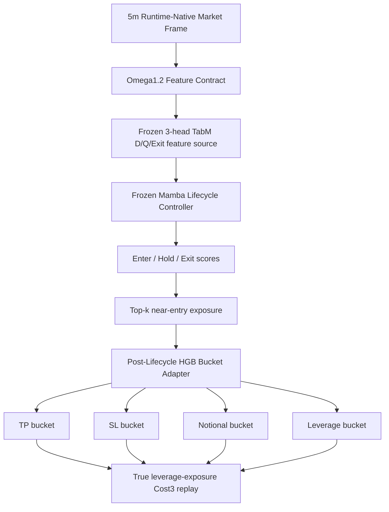

# Omega1.2 s260726 Growth Analysis - 2026-06-09

## Target

- Candidate: `omega1_2_post_lifecycle_bucket_adapter_20260605_hgb_base_lev5_eff_cap150_comp_tpup_voltarget_trainall_c96_replayk2_s260726`
- Family: `omega1_2_post_lifecycle_bucket_adapter`
- Status: `accounting_normal_stable_research_candidate`
- Source report: `tmp/causal_regen_20260516/omega1_2_post_lifecycle_bucket_adapter_20260605_hgb_base_lev5_eff_cap150_comp_tpup_voltarget_trainall_c96_replayk2_s260726/report.json`

## Architecture



## Active Risk Contract

- Bucket preset: `base`
- `use_leverage_exposure = true`
- `notional_cap = 1.50`
- `compensate_sltp_by_notional = true`
- `compensate_ref_notional = 0.45`
- Volatility leverage cap: enabled
- TP upshift: enabled, multiplier `1.35`, max `1`

Primary bucket used most often:

- `(tp_id=2, sl_id=2, notional_id=4, leverage_id=2)`
- Margin notional: `0.55`
- Leverage: `3x`
- Effective notional: `min(0.55 * 3, 1.50) = 1.50`
- Compensated TP: `0.026 / 0.45 * 1.50 = 8.6667% account return`
- Compensated SL: `0.012 / 0.45 * 1.50 = 4.0000% account return`

## Metrics

Validation:

- PnL: `+11.692292%`
- MDD: `-15.899477%`
- WR: `49.438202%`
- Trades: `89`
- Long / Short: `21 / 68`
- Stop-loss exits: `19`
- Full exits: `68`
- TP exits: `1`

OOS:

- PnL: `+79.762537%`
- MDD: `-10.787332%`
- WR: `68.571429%`
- Trades: `35`
- Long / Short: `7 / 28`
- Stop-loss exits: `6`
- Full exits: `28`
- TP exits: `1`

## Diagnosis

This model is not a high-frequency balanced classifier. It is a post-lifecycle risk adapter that profits by applying large effective exposure to a small number of lifecycle-approved entries.

Strengths:

- Accounting is explicit true leverage-exposure.
- Validation is positive while many higher-OOS candidates collapse.
- OOS MDD stays near `-10.8%` despite effective exposure cap `1.50`.
- Top bucket concentration is high, so the behavior is interpretable and testable.

Weak points:

- Validation WR is only `49.44%`; the model is not intrinsically high precision on validation.
- Validation MDD is already `-15.90%`; raising exposure directly is likely to damage the drawdown profile first.
- Short bias is strong in both validation and OOS.
- TP hit count is low. Most exits are lifecycle `full_exit`, so TP/SL buckets are risk boundaries, not the main exit owner.
- Training labels are concentrated in a few buckets, especially `tp_id=2`, `sl_id=2/3`, `notional_id=3/4`, `leverage_id=1/2`. Expanding bucket freedom without more data is likely to overfit.

## Test Cases Added

Test file:

- `scripts/test_omega1_2_post_lifecycle_bucket_adapter_contract_20260609.py`

Covered cases:

- `s260726` true leverage-exposure risk calculation.
- SL/TP compensation under effective notional.
- Volatility leverage cap behavior.
- Forbidden feature fail-fast for `clean_regime4_*`, `regime4_pred_*`, `tp_sl_action_score`, `teacher_*`.
- Normalizer column-order contract fail-fast.
- Saved adapter artifact bucket-space consistency.

Run command:

```bash
source ~/miniconda3/etc/profile.d/conda.sh
conda activate quant_ai
python scripts/test_omega1_2_post_lifecycle_bucket_adapter_contract_20260609.py
```

Latest result:

- `Ran 5 tests`
- `OK`

## Recommended Growth Direction

Do not start by increasing `notional_cap` or leverage. The model already uses `1.50` effective exposure on its dominant bucket. The next useful experiments are:

1. Add a validation-defensive entry veto using only adapter-native features and lifecycle scores. Target: reduce validation stop-loss count without materially reducing OOS entries.
2. Add side-balance penalty or short-only confidence threshold. Target: reduce short overconcentration while keeping OOS PnL above `+60%`.
3. Add loss-conditional risk shrinker after adapter prediction. Target: keep the same bucket model, but shrink effective notional when volatility cap or low lifecycle margin triggers.
4. Retest TP upshift variants before changing base TP buckets. Current TP hit count is too low to justify wider TP buckets as the first lever.

Promotion rule:

- Any successor must beat `s260726` on OOS PnL or MDD while keeping validation PnL positive and validation MDD above `-20%`.
- Any successor with negative validation PnL is research-only, even if OOS PnL is higher.
