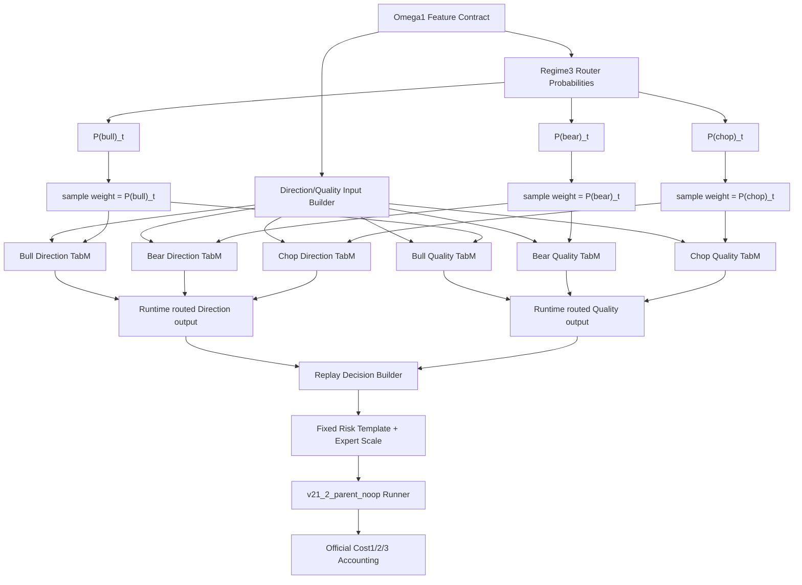

# Omega1.2 Soft-Floor-0.00 TabM Expert-DQ Contract - 2026-06-03

## Scope

- Alias: `omega1.2`
- Model name: `omega1_2_softfloor00_tabm_expertdq_20260603`
- Status: `named_research_candidate_not_live_promoted`
- Purpose: fix the Omega1.1 TabM Expert-DQ architecture to the `soft_floor_0p00` head-routing variant.
- Training/evaluation family: Omega1.1 TabM Expert-DQ comparison.
- Training artifact dir: `tmp/causal_regen_20260516/omega1_1_tabm_head_routing_compare_20260602/soft_floor_0p00`
- Replay artifact dir: `tmp/causal_regen_20260516/omega1_1_tabm_head_routing_compare_risk_replay_20260602`
- Training script: `scripts/train_omega1_1_tabm_head_routing_compare_20260602.py`
- Replay evaluation script: `scripts/eval_omega1_1_tabm_head_routing_compare_risk_replay_20260602.py`

## Architecture

Omega1.2 keeps the same downstream execution path as Omega1.1:

## Soft Expert Contract

Omega1.2 uses `soft_floor_0p00`.

Each expert sees all rows, but its sample weight is the current Regime3 probability for that expert:

- Bull expert: `sample_weight = P(bull)_t`
- Bear expert: `sample_weight = P(bear)_t`
- Chop expert: `sample_weight = P(chop)_t`

There is no fixed floor term. The only weighting signal is the per-row dynamic Regime3 probability.

This is different from:

- `hard_floor_0p00`: each expert sees only hard-routed rows.
- `soft_floor_0p20`: each expert sees all rows with `0.20 + P(regime)_t`.
- `global_floor_0p00`: one global model is shared across all routed experts.

## Layer Contracts

### Direction Head

- Model: TabM-style BatchEnsemble PyTorch classifier.
- Output classes: `0=CASH`, `1=LONG`, `2=SHORT`.
- Label source: active Omega1 `zigzag_action` contract.

### Quality Head

- Model: TabM-style BatchEnsemble PyTorch classifier.
- Input includes OOF Direction probabilities generated by the Direction Head.
- Output feeds `quality_for_action` and final quality filtering.

### Regime Router and Downstream Layers

Unchanged from Omega1.1:

- Regime3 router: unchanged.
- Replay decision builder: unchanged.
- Risk template: unchanged.
- Expert scale: unchanged.
- Runner: `v21_2_parent_noop`.
- Cost accounting: unchanged.

## Fixed Risk / Scale Contract

Risk template:

- `notional = 0.45`
- `leverage = 2.0`
- `take_profit = 0.026`
- `stop_loss = 0.014`
- `max_hold = 72`
- `cooldown = 6`

Expert scales:

- `bull = 0.75`
- `bear = 0.90`
- `chop = 0.90`

## Results

Replay result for `soft_floor_0p00`:

- Validation Cost3: PnL `-11.17%`, MDD `-14.70%`, trades `334`, WR `41.32%`
- OOS Cost3: PnL `+4.34%`, MDD `-9.09%`, trades `205`, WR `49.27%`
- OOS Direction/Quality filtered BAcc: `59.43%`
- OOS Direction/Quality proxy WR: `66.33%`
- OOS filtered proxy signals: `11947`

Interpretation:

- This candidate is named for Direction/Quality head purity, not for best replay PnL.
- It is useful as the canonical pure soft-regime TabM Expert-DQ baseline.
- It should not be promoted live without validation-only risk retuning and runtime-native parity.

## Red Team Gates

- No alias/fallback/compat layer is allowed.
- Missing feature or source columns must fail fast.
- `teacher_*`, legacy Regime4/Regime2024 bug features, and retired M7 columns remain forbidden by the active Omega1 feature contract.
- OOS ranking is research evidence only and must not be treated as untouched-OOS promotion evidence.

## Open Issues

- Risk is fixed-template based and not yet specialized to `soft_floor_0p00`.
- A fair production comparison requires validation-only risk template / expert scale selection for this specific head-routing variant.
