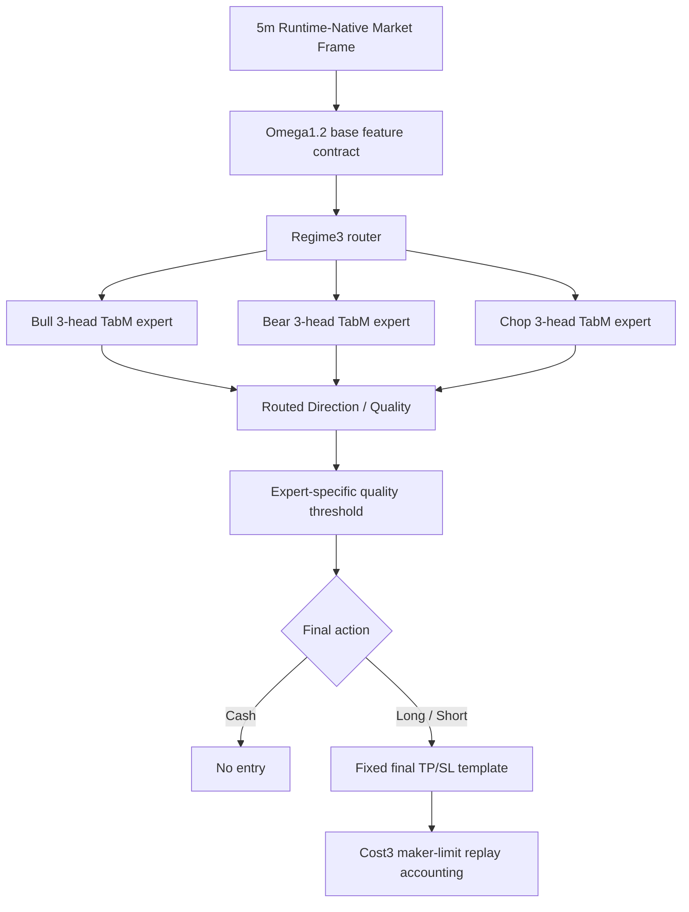

# Omega1.2 Current Final TP/SL Baseline Contract - 2026-06-06

## Status

- Alias: `omega1.2_current_final_tp_sl_baseline`
- Model id: `omega1_2_true_3head_tabm_20260603_final_tp_sl_on_e28_exit30k_q080`
- Status: `current_omega_research_baseline_not_live_promoted`
- Manifest: `data/ensemble/supervised/omega1_2_true_3head_tabm_20260603_final_tp_sl_on_e28_exit30k_q080/baseline_manifest.json`
- Source artifact: `tmp/causal_regen_20260516/omega1_2_true_3head_tabm_20260603_final_tp_sl_on_e28_exit30k_q080`
- Bundle: `tmp/causal_regen_20260516/omega1_2_true_3head_tabm_20260603_final_tp_sl_on_e28_exit30k_q080/true_3head_tabm_bundle.pt`

This is the current Omega1.2 research baseline. It supersedes `base_nogate_topk2` as the baseline for the next growth loop. It is not live-promoted and does not change `trading_bot.py`.

## Architecture

## Fixed Decision Template

The selected baseline uses the validation-selected final TP/SL template:

- `take_profit = 0.026`
- `stop_loss = 0.014`
- `notional_exposure = 0.405`
- `leverage = 2.0`
- `max_hold_bars = 0`
- `cooldown_bars = 0`
- `cost_multiplier = 3.0`

The Exit Head exists in the trained bundle, but this baseline does not use it as an immediate threshold exit owner.

## Baseline Metrics

Validation:

- PnL: `+42.822624%`
- MDD: `-5.471617%`
- WR: `63.636364%`
- Trades: `33`
- Long / Short: `9 / 24`
- Exit reasons: `take_profit=20`, `stop_loss=12`, `forced_end=1`

OOS:

- PnL: `+32.145605%`
- MDD: `-4.135192%`
- WR: `72.222222%`
- Trades: `18`
- Long / Short: `3 / 15`
- Exit reasons: `take_profit=13`, `stop_loss=5`

## Growth Rules

Future candidates must use this contract as the first reproduction target.

- Reproduce validation and OOS ledger metrics before applying a growth layer.
- Compare both validation and OOS. OOS-only improvement is not enough.
- Do not add legacy aliases, fallback prefixes, or compatibility feature shims.
- Do not silently reintroduce `clean_regime4_*`, `regime4_pred_*`, `tp_sl_action_score`, or `teacher_*` unless a new explicit contract and audit allow it.
- Keep `trading_bot.py` unchanged until runtime-native parity and current live feature-contract validation pass.

## Initial Growth Direction

The next loop should grow the baseline without replacing its core entry alpha:

- Risk-size growth: constrained notional/leverage scaling only on high-confidence trades.
- Exit growth: runner / partial-profit logic only after TP approach or strong hold evidence.
- Coverage growth: separate cash sleeve only when it does not alter baseline active trades.
- Accounting must remain Cost3 with explicit entry and exit fees/slippage.

## Initial Growth Scan

The first static scan keeps entries/exits unchanged and tests notional scaling with TP/SL equity-threshold compensation.

Best balanced static candidate:

- Mode: `compensated_tp_sl`
- Scale / cap: `1.35 / 0.55`
- Validation: PnL `+61.14%`, MDD `-7.32%`, WR `63.64%`, trades `33`
- OOS: PnL `+45.31%`, MDD `-5.54%`, WR `72.22%`, trades `18`

Highest static OOS candidate:

- Mode: `compensated_tp_sl`
- Scale / cap: `2.00 / 0.90`
- Validation: PnL `+100.54%`, MDD `-10.68%`, WR `63.64%`, trades `33`
- OOS: PnL `+72.76%`, MDD `-8.11%`, WR `72.22%`, trades `18`

Raw notional-only scaling is rejected for this baseline because it changes TP/SL hit geometry and caused validation trade explosion/collapse in the scan.
