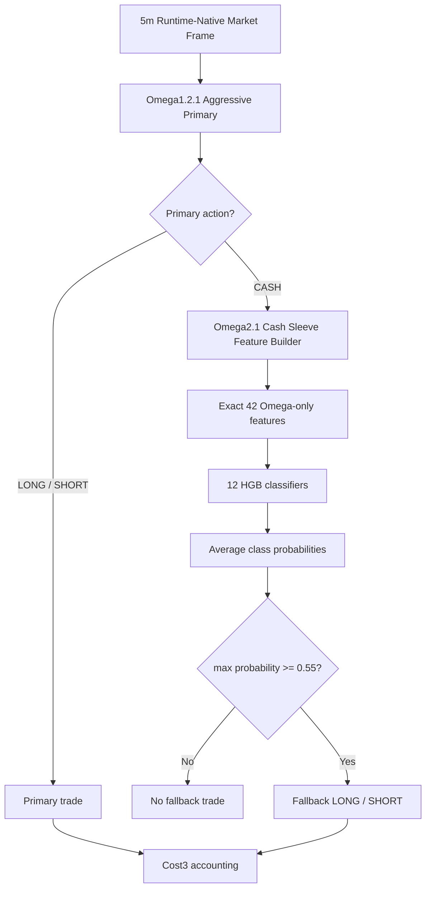

# Omega2.1 HGB 12-Seed Cash Sleeve Contract - 2026-06-09

## Scope

- Model id: `omega2_1_label_atr1_h24_hgb_12seed_ensemble_thr055`
- Status: `deprecated_historical_reference_only_accounting_invalid_true_leverage`
- Parent baseline: `omega1_2_1_aggressive_compensated_scale200_cap090`
- Frozen artifact:
  `data/ensemble/supervised/omega2_1_label_atr1_h24_hgb_12seed_ensemble_thr055/omega2_1_hgb_12seed_cash_sleeve.joblib`
- Manifest:
  `data/ensemble/supervised/omega2_1_label_atr1_h24_hgb_12seed_ensemble_thr055/candidate_manifest.json`
- Runtime scorer:
  `trading_bot_modules/omega2_1_cash_sleeve.py`
- Freeze/verify script:
  `scripts/freeze_omega2_1_hgb_12seed_cash_sleeve_20260609.py`
- Verification report:
  `tmp/causal_regen_20260516/omega2_1_cash_sleeve_freeze_verify_20260609/report.json`

Omega2.1 keeps the Omega1.2.1 aggressive primary unchanged. It adds a 12-seed HGB ensemble cash sleeve only when the primary action is `CASH`.

## Architecture

## Feature Contract

Feature count: `42`.

Allowed feature list is exactly the list stored in the manifest and frozen joblib bundle. Runtime scoring must use that exact order.

Forbidden active inputs:

- `clean_regime4_*`
- `regime4_pred_*`
- `teacher_*`
- `exit_head_*`
- `tp_sl_action_score`

The contract is fail-fast:

- Missing columns must raise.
- Non-finite columns must raise.
- Extra forbidden columns must raise.
- No alias, fallback prefix, silent rename, or compatibility shim is allowed.

## Label And Training

- Label name: `label_atr1_h24`
- Label method: triple barrier on 2025 validation primary-cash rows
- `atr_mult = 1.0`
- `max_hold = 24` bars
- `min_barrier = 0.0035`
- Classes: `0 = CASH`, `1 = LONG`, `2 = SHORT`
- Training rows: `20,085`
- Label counts: `CASH = 2,105`, `LONG = 12,068`, `SHORT = 12,291`

Model:

- `HistGradientBoostingClassifier`
- `max_iter = 120`
- `learning_rate = 0.035`
- `max_leaf_nodes = 7`
- `l2_regularization = 2.0`
- Seeds:
  `260000`, `260001`, `260002`, `260003`, `260004`, `260005`, `260006`, `260007`, `260008`, `260009`, `260608`, `260780`
- Inference: average the 12 class-probability vectors, then apply threshold `0.55`.

## Risk And Accounting

Fallback risk:

- TP: `0.026`
- SL: `0.014`
- Notional exposure: `0.30`
- Leverage metadata: `2.0`
- Max hold: `192` bars
- Cost model: Cost3 fee/slippage accounting

Accounting audit update, 2026-06-09:

- This frozen artifact is deprecated for active research and live promotion.
- The original replay treated `notional_exposure` as the effective PnL/fee/MDD exposure while also storing `leverage = 2.0`.
- Under the current fail-fast leverage-exposure contract, effective exposure must be `notional_exposure * leverage`.
- The corrected leverage-exposure rerun changed the baseline OOS from `+102.611483% / MDD -8.108171%` to `+33.877901% / MDD -23.976364%`.
- Use `docs/model_contracts/omega_accounting_audit_20260609.md` for the canonical verdict.

Primary priority:

- If a primary signal appears while fallback is open, close fallback by `primary_takeover`.
- Primary remains the owner when it is active.

## Verified Metrics

Selection evidence from `omega2_architect_priority_experiments_20260609`:

- Validation OOF PnL: `+111.959707%`
- OOS full-train PnL: `+102.611483%`
- OOS MDD: `-8.108171%`
- OOS WR: `60.975610%`
- OOS trades: `41`

Frozen artifact verification from `omega2_1_cash_sleeve_freeze_verify_20260609`:

- OOS PnL: `+102.611482864%`
- OOS MDD: `-8.108170709%`
- OOS WR: `60.975610%`
- OOS trades: `41`
- OOS fallback entries: `23`
- OOS primary takeovers: `12`

Validation full-train sanity is intentionally not used as selection evidence because it is in-sample after fitting all 12 models on the validation split.

## Promotion Rule

This model is historical-reference only. Do not use it for live promotion or active candidate stacking unless rebuilt and re-evaluated under the explicit leverage-exposure contract.
