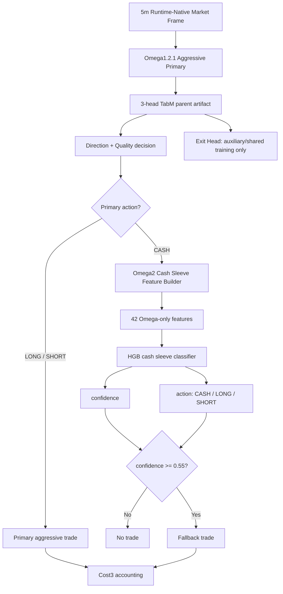

# Omega2 Exit-Head-Free Cash Sleeve Contract - 2026-06-09

## Scope

- Alias: `omega2_exit_head_free_cash_sleeve`
- Model id: `omega2_label_atr1_h24_hgb_cash_sleeve_thr055`
- Status: `research_baseline_candidate_not_live_promoted`
- Parent baseline: `omega1_2_1_aggressive_compensated_scale200_cap090`
- Parent artifact: `tmp/causal_regen_20260516/omega1_2_true_3head_tabm_20260603_full_retrain_cash_alpha43_20260608`
- Multiseed artifact: `tmp/causal_regen_20260516/omega1_2_1_cash_alpha43_multiseed_20260608`
- Exit feature ablation artifact: `tmp/causal_regen_20260516/omega1_2_1_cash_alpha43_exit_feature_ablation_20260609`
- Multiseed script: `scripts/test_omega1_2_1_cash_alpha43_multiseed_20260608.py`
- Exit-feature ablation script: `scripts/test_omega1_2_1_cash_alpha43_exit_feature_ablation_20260609.py`

Omega2 keeps the Omega1.2.1 aggressive primary path and adds an HGB cash sleeve only when the primary action is `CASH`.
The version distinction is explicit: **the cash sleeve does not consume Exit Head outputs and runtime does not use direct Exit Head triggers.**

## Architecture

## Layer Contracts

### Parent Layer

- Uses the existing Omega1.2.1 aggressive parent decision.
- If primary action is `LONG` or `SHORT`, primary owns the trade.
- If primary action is `CASH`, Omega2 may call the cash sleeve.
- Omega CASH remains terminal except for this explicitly documented Omega2 cash sleeve path.

### Exit Head Policy

Allowed:

- The parent artifact may still contain a trained Exit Head as an auxiliary/shared TabM training head.
- Historical reports may reference Exit Head experiments for audit.

Forbidden in Omega2 active/research decision path:

- Do not feed Exit Head probability into the cash sleeve feature vector.
- Do not use Exit Head as entry veto, direct exit trigger, breakeven trigger, half-TP trigger, or risk selector input.
- Do not silently add `exit_head_*` columns through aliases or compatibility shims.

Reason:

- Direct ablation on `label_atr1_h24 @ threshold 0.55`, 12 seeds, showed Exit Head entry-risk features degraded OOS stability.

## Cash Sleeve Feature Contract

Feature count: `42`.

Allowed features:

- `bar_range_pct`
- `body_pct`
- `atr14_pct`
- `ret_1`, `ret_3`, `ret_6`, `ret_12`, `ret_24`
- `ret_vol_6`, `ret_vol_12`, `ret_vol_24`, `ret_vol_48`
- `range_mean_6`, `range_mean_12`, `range_mean_24`, `range_mean_48`
- `ema9_21_gap`
- `tod_sin`, `tod_cos`
- `router_confidence`, `router_margin`
- `dir_p_cash`, `dir_p_long`, `dir_p_short`
- `dir_confidence`, `dir_side_edge`, `dir_trade_prob`
- `quality_p_cash`, `quality_p_long`, `quality_p_short`, `quality_for_action`
- `router_is_bull`, `router_is_bear`, `router_is_chop`
- `side`, `base_notional`, `base_tp`, `base_sl`
- `primary_is_cash`, `primary_active_roll_12`, `primary_active_roll_48`, `primary_cash_streak`

Forbidden features:

- `clean_regime4_*`
- `regime4_pred_*`
- `teacher_*`
- `tp_sl_action_score`
- `exit_head_*`

The feature contract is fail-fast. Missing, renamed, aliased, or auto-filled feature columns must raise an error.

## Label Contract

- Label name: `label_atr1_h24`
- Label method: triple barrier on 2025 validation primary-cash rows
- `atr_mult = 1.0`
- `max_hold = 24` bars
- `min_barrier = 0.0035`
- Classes:
  - `0 = CASH`
  - `1 = LONG`
  - `2 = SHORT`
- Training rows: `20,085`
- Label distribution:
  - `CASH = 2,105`
  - `LONG = 12,068`
  - `SHORT = 12,291`

## Model Contract

- Model family: `HistGradientBoostingClassifier`
- Training mode: 2025 validation primary-cash rows
- Evaluation: 2026 OOS replay
- Confidence threshold: `0.55`
- Seed policy: single-seed highs are not promotable; use 12-seed summary for model selection.
- Evaluated seeds:
  `260000`, `260001`, `260002`, `260003`, `260004`, `260005`, `260006`, `260007`, `260008`, `260009`, `260608`, `260780`

## Risk and Accounting

- Fallback TP: `0.026`
- Fallback SL: `0.014`
- Fallback notional exposure: `0.30`
- Fallback leverage metadata: `2.0`
- Fallback max hold: `192` bars
- Cost model: Cost3 fee/slippage accounting
- If a primary signal appears while fallback is open, close fallback by `primary_takeover`; primary retains priority.

## Metrics

Baseline `omega1_2_1_aggressive_compensated_scale200_cap090`:

- Validation PnL: `+100.542729%`
- OOS PnL: `+72.760041%`

Omega2 `label_atr1_h24 @ threshold 0.55`, 12-seed summary:

- Validation mean PnL: `+109.906433%`
- Validation median PnL: `+110.406398%`
- Validation PnL range: `+103.736590%` to `+114.279518%`
- OOS mean PnL: `+95.612573%`
- OOS median PnL: `+99.918490%`
- OOS PnL range: `+82.254062%` to `+104.498985%`
- OOS worst MDD: `-8.327666%`
- OOS mean WR: `61.838196%`
- OOS mean trades: `45.166667`
- Validation/OOS baseline beat rate: `100%`
- OOS `>= 100%` rate: `33.333333%`

Exit Head feature ablation, 12-seed summary:

| Variant | OOS mean PnL | OOS median PnL | OOS min/max | OOS mean WR |
|---|---:|---:|---:|---:|
| Without Exit Head feature | `+95.612573%` | `+99.918490%` | `+82.254062% / +104.498985%` | `61.838196%` |
| With Exit Head entry-risk feature | `+92.003446%` | `+92.673997%` | `+70.703622% / +104.394837%` | `60.939946%` |

Decision: keep Omega2 exit-head-free in the cash sleeve decision path.

## Promotion Gates

- Not live-promoted.
- Before live promotion, create a frozen manifest and runtime adapter that hard-fails on the exact 42-feature contract.
- Re-run runtime-native parity against `trading_bot.py` input snapshots.
- Red Team must verify no `exit_head_*`, `teacher_*`, `regime4_pred_*`, `clean_regime4_*`, or `tp_sl_action_score` enters the active path.
- Docs Manager must update active/live docs only after live promotion is explicitly requested.
