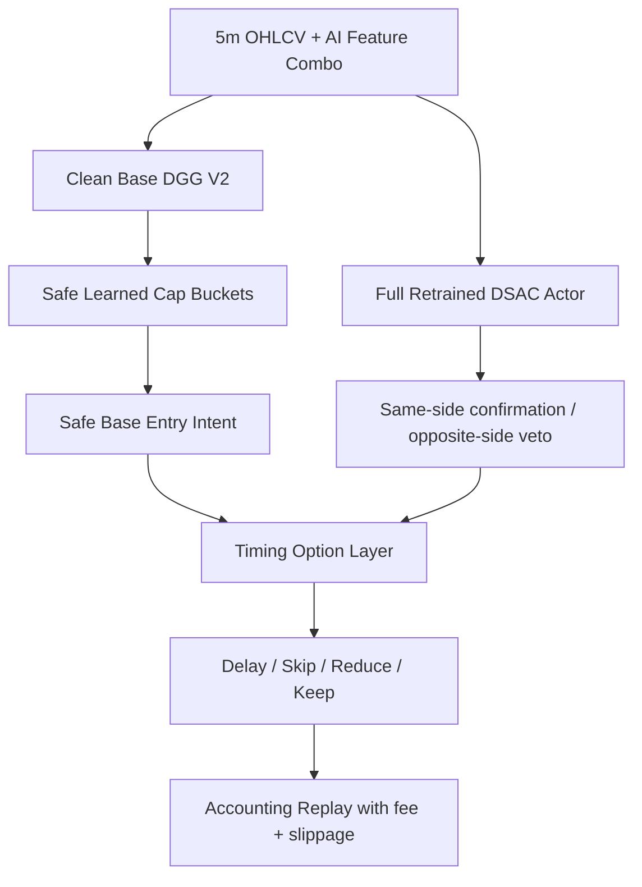

# Safe Cap DSAC Timing Option V1

Status: `reject_or_noop`

## Architecture

## Data Splits

- Parent train: `['2025-01-01 00:00:00', '2025-09-30 23:55:00']`
- Safe-cap train: `['2025-10-01 00:00:00', '2025-10-31 23:55:00']`
- Timing validation selection: `['2025-11-01 00:00:00', '2025-12-31 23:55:00']`
- OOS report-only: `['2026-01-01 00:00:00', '2026-02-28 16:00:00']`

## Selected

- Safe cap: `learned_action_edge3_min10_buf0p0035_gatefinal`
- Timing option: `noop_safe_cap_replay`

## OOS Result

- PnL: `1597.463037%`
- MDD: `-33.074780%`
- Trades: `154`
- Delayed: `0`
- Skipped: `0`
- Reduced: `0`
- 3x cost PnL: `241.211547%`

## Invariants

- No new entries are created.
- Side is never changed.
- Exit index is not extended or rewritten.
- Entry can only stay at or move after the original safe-cap entry.
- Notional can stay the same, shrink, or be blocked, never exceed safe-cap base notional.
- Selection uses 2025 validation only; 2026 OOS is report-only.
