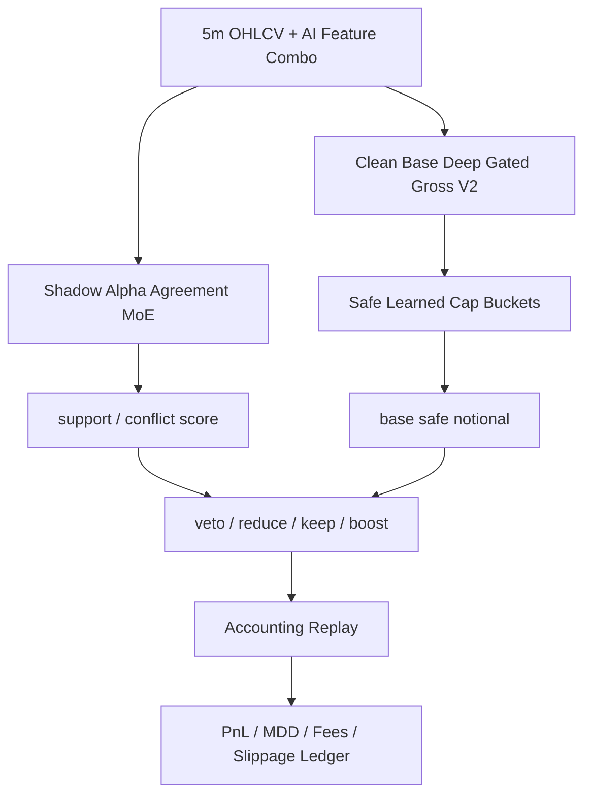

# Safe Cap Shadow Alpha Agreement MoE V1

Status: `reject_or_noop`

## Architecture

## Data Splits

- Parent train: `['2025-01-01 00:00:00', '2025-09-30 23:55:00']`
- Safe-cap bucket train: `['2025-10-01 00:00:00', '2025-10-31 23:55:00']`
- Shadow-MoE validation selection: `['2025-11-01 00:00:00', '2025-12-31 23:55:00']`
- OOS report-only: `['2026-01-01 00:00:00', '2026-02-28 16:00:00']`

## Selected Overlay

- Parent DGG config: `dgg_high3.6_mid3.0_def3.0_h-0.0100_m-0.0160_adv99.000_c30.00`
- Safe cap: `learned_action_edge3_min10_buf0p0035_gatefinal`
- Shadow config: `shadow_noop`

## OOS Result

- PnL: `1597.463037%`
- MDD: `-33.074780%`
- Trades: `154`
- Average notional: `4.905844`
- 3x cost PnL: `241.211547%`

## Invariants

- Shadow layer never changes side or exit index.
- Shadow layer never creates a trade blocked by the safe-cap parent.
- Cap map is learned before validation.
- Shadow config is selected on 2025 validation only.
- 2026 OOS is report-only.
- Fees and slippage are charged on final notional.
