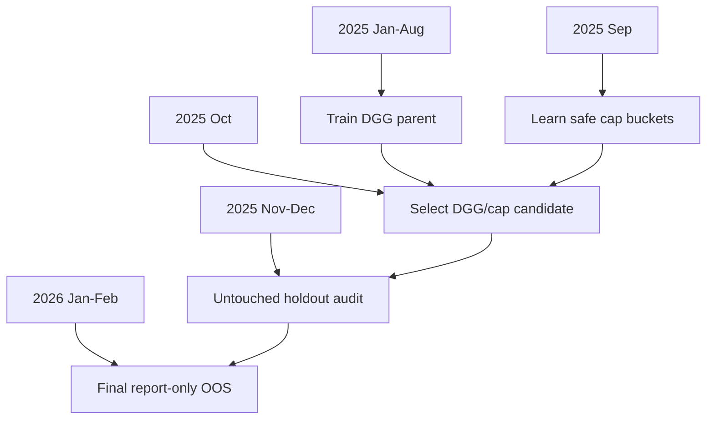

# Safe Cap Strict No-Leak Walk-Forward

Status: `promote_candidate`

## Split Protocol

- Parent train: `['2025-01-01 00:00:00', '2025-08-31 23:55:00']`
- Cap-map train: `['2025-09-01 00:00:00', '2025-09-30 23:55:00']`
- Selection: `['2025-10-01 00:00:00', '2025-10-31 23:55:00']`
- Untouched holdout: `['2025-11-01 00:00:00', '2025-12-31 23:55:00']`
- Final OOS: `['2026-01-01 00:00:00', '2026-02-28 16:00:00']`

## Architecture

## Selected

- Parent DGG config: `dgg_high3.6_mid3.0_def2.0_h-0.0060_m-0.0120_adv0.012_c30.00`
- Cap candidate: `learned_action_side_edge3_min10_buf0p0035_gatebase`
- Scheme: `action_side_edge3`
- Fallback cap: `3.6`

## Results

- Holdout PnL: `15270.222400%`
- Holdout MDD: `-23.792939%`
- OOS PnL: `701.603122%`
- OOS MDD: `-24.532561%`

## Invariants

- 2025 Nov-Dec holdout is never used for parent config, cap map, or candidate selection.
- 2026 OOS is report-only.
- Fees and slippage are applied on final notional.
- Cap choices cannot exceed exchange leverage cap.
