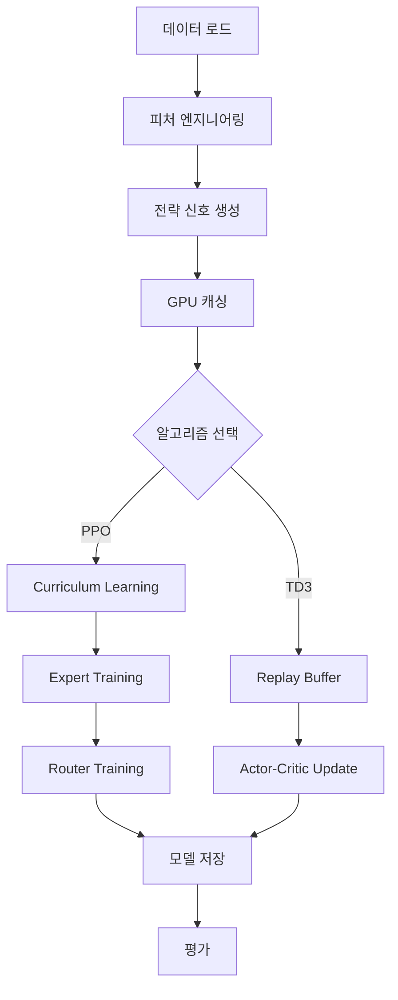

# 학습 파이프라인 명세

## 📋 개요

본 문서는 PPO와 TD3 모델의 전체 학습 프로세스를 상세히 설명합니다.

---

## 🔄 전체 학습 파이프라인



---

## 1️⃣ PPO 학습 파이프라인

### 전체 흐름

**경로**: `macroHFT/train_ppo.py`

```python
1. 초기화
   ├─ DataCollector (피처 로드)
   ├─ Elite 8 Strategies
   ├─ TradingEnvironment (GPU 캐싱)
   └─ PPOAgent (3 Experts + Router)

2. Curriculum Learning
   ├─ Phase 1: Expert 개별 학습 (100 episodes each)
   ├─ Phase 2: Router 학습 (100 episodes)
   └─ Phase 3: Fine-tuning (200 episodes)

3. 평가 및 저장
   ├─ Best Model (최고 보상)
   ├─ Last Model (최신 체크포인트)
   └─ Checkpoint (50 episodes마다)
```

### 초기화 단계

```python
class PPOTrainer:
    def __init__(self):
        # 1. 데이터 수집
        self.data_collector = DataCollector(use_saved_data=True)
        
        # 2. 전략 초기화 (Elite 8)
        self.strategies = [
            WhaleSentimentDivergence(),
            LiquidationSqueezeHunter(),
            # ... (8개)
        ]
        
        # 3. 피처 로드 (자동 생성)
        self._load_features()
        # → data/training_features.csv 로드
        # → 없으면 utils/prepare_training_data.py 실행
        
        # 4. 환경 초기화
        self.env = TradingEnvironment(
            self.data_collector, 
            self.strategies
        )
        self.env.precompute_data()  # GPU 캐싱
        
        # 5. 에이전트 초기화
        self.agent = PPOAgent(
            state_dim=44, 
            action_dim=3, 
            info_dim=11,
            device='cuda'
        )
        
        # 6. TensorBoard
        self.writer = SummaryWriter(
            log_dir=f'logs/tensorboard/{run_time}'
        )
```

### Curriculum Learning

**Phase 1: Expert 학습** (Episode 1-100)
```python
for ep in range(1, 101):
    expert_idx = (ep - 1) % 3  # 0: Trend, 1: Vol, 2: Sideways
    
    # Curriculum Index 선택 (전문가별 데이터)
    indices = self.idx_map[expert_idx]
    start_idx = random.choice(indices)
    
    # Episode Rollout
    reward, trades = self.train_episode(
        ep, 
        mode='expert', 
        expert_idx=expert_idx,
        start_idx=start_idx
    )
    
    # Expert 네트워크 학습
    loss = self.agent.train_net(
        episode=ep,
        mode='expert',
        expert_idx=expert_idx
    )
```

**Phase 2: Router 학습** (Episode 101-200)
```python
for ep in range(101, 201):
    # 전체 데이터 사용
    start_idx = random.choice(self.all_indices)
    
    # Episode Rollout (Router 모드)
    reward, trades = self.train_episode(
        ep,
        mode='router',
        start_idx=start_idx
    )
    
    # Router 네트워크 학습 (Experts 고정)
    loss = self.agent.train_net(
        episode=ep,
        mode='router'
    )
```

**Phase 3: Fine-tuning** (Episode 201+)
```python
for ep in range(201, MAX_EPISODES):
    # Expert와 Router 교대 학습
    if ep % 2 == 0:
        mode = 'expert'
        expert_idx = (ep // 2) % 3
    else:
        mode = 'router'
        expert_idx = 0
    
    # ... (동일한 학습 프로세스)
```

### Episode Rollout

```python
def train_episode(self, ep, mode='router', expert_idx=0, start_idx=None):
    # 1. 초기화
    self.agent.reset_episode_states()
    episode_reward = 0.0
    episode_trades = 0
    
    # 2. 시작 위치 선택
    if start_idx is None:
        low = config.LOOKBACK + 100
        high = self.train_end_idx - MAX_STEPS - 100
        start_idx = np.random.randint(low, high)
    
    # 3. Position 초기화 (랜덤)
    rand = np.random.rand()
    current_position = 0 if rand < 0.33 else (1 if rand < 0.66 else -1)
    
    # 4. Rollout Loop
    for step in tqdm(range(MAX_STEPS), desc=f"Ep {ep} [Train: {expert_name}]"):
        # 4.1. 관찰
        pos_info = [current_position, ...]
        state = self.env.get_observation(pos_info, current_idx)
        
        # 4.2. 행동 선택
        action_mask = self.get_action_mask(current_position, ...)
        action, prob, value = self.agent.select_action(
            state, 
            action_mask, 
            mode=mode, 
            expert_idx=expert_idx
        )
        
        # 4.3. 환경 스텝
        next_position = self._execute_action(action, current_position)
        current_idx += 1
        
        # 4.4. 보상 계산
        reward = self.env.calculate_reward(
            step_pnl, 
            realized_pnl, 
            trade_done,
            holding_time,
            action,
            current_position,
            next_position
        )
        
        # 4.5. Transition 저장
        done = (step >= MAX_STEPS - 1)
        volatility = self.data_collector.eth_data.iloc[current_idx]['volatility_z']
        
        self.agent.put_data((
            state, action, reward, next_state, 
            prob, done, value, volatility, action_mask
        ))
        
        episode_reward += reward
        current_position = next_position
    
    # 5. 학습
    loss_dict = self.agent.train_net(ep, mode, expert_idx)
    
    return episode_reward, episode_trades
```

### 보상 함수 (Sortino Ratio 기반)

```python
def calculate_reward(step_pnl, realized_pnl, trade_done, ...):
    reward = 0.0
    
    # 1. 스텝 PnL (tanh 스케일링)
    step_reward = np.tanh(step_pnl * 100.0)
    reward += step_reward
    
    # 2. 실현 손익 (손실 회피 성향)
    if trade_done and realized_pnl != 0:
        if realized_pnl > 0:
            trade_reward = realized_pnl * 100.0
        else:
            trade_reward = realized_pnl * 150.0  # 손실 1.5배 페널티
        reward += trade_reward
    
    # 3. Sortino 리스크 페널티
    if len(equity_curve) > 50:
        returns = pd.Series(equity_curve[-50:]).pct_change()
        downside_returns = returns[returns < 0]
        downside_std = downside_returns.std()
        
        if downside_std > 0.005:
            reward -= (downside_std * 10.0)
    
    # 4. 큰 손실 페널티
    if step_pnl < -0.015:  # -1.5% 이상 손실
        reward -= 0.5
    
    # 5. 거래 비용
    if trade_done:
        reward -= 0.1  # 잦은 매매 방지
    
    return np.clip(reward, -10.0, 10.0)
```

### PPO 학습 알고리즘

```python
def train_net(self, episode, mode='router', expert_idx=0):
    # 1. 데이터 배치화
    batch_data = list(zip(*self.data))
    s_seq, s_info, a, r, prob_a, done_mask, val, vol_label, masks = \
        prepare_batch(batch_data)
    
    # 2. GAE (Generalized Advantage Estimation)
    with torch.no_grad():
        next_val = torch.roll(val, -1)
        deltas = r + gamma * next_val * done_mask - val
        
        advantage = torch.zeros_like(r)
        running_adv = 0.0
        for t in reversed(range(len(r))):
            running_adv = deltas[t] + gamma * lambda * running_adv * done_mask[t]
            advantage[t] = running_adv
        
        target_val = advantage + val
        advantage = (advantage - advantage.mean()) / (advantage.std() + 1e-8)
    
    # 3. PPO Update (K Epochs)
    for _ in range(K_EPOCHS):
        with autocast(device_type='cuda'):  # AMP
            # Forward
            if mode == 'expert':
                logits, curr_val, _, _, _, _ = network(s_seq, s_info)
            else:  # Router
                weights = self.router(s_seq)
                logits = expert_ensemble(weights)
                curr_val = torch.zeros_like(val)
            
            # Masked Logits
            logits = logits + (masks - 1) * 1e10
            
            # Policy Loss
            dist = Categorical(logits=logits)
            log_prob = dist.log_prob(a)
            ratio = torch.exp(log_prob - prob_a)
            
            surr1 = ratio * advantage
            surr2 = torch.clamp(ratio, 1 - eps_clip, 1 + eps_clip) * advantage
            actor_loss = -torch.min(surr1, surr2).mean()
            
            # Value Loss
            critic_loss = 0.5 * F.mse_loss(curr_val, target_val) if mode == 'expert' else 0
            
            # Entropy Loss (Dynamic)
            avg_vol = vol_label.mean()
            dynamic_entropy = entropy_coef * (1.0 + 0.5 * avg_vol)
            entropy_loss = -dynamic_entropy * dist.entropy().mean()
            
            # Total Loss
            loss = actor_loss + critic_loss + entropy_loss
        
        # Backward (AMP)
        scaler.scale(loss).backward()
        scaler.unscale_(optimizer)
        nn.utils.clip_grad_norm_(params, 0.5)
        scaler.step(optimizer)
        scaler.update()
    
    return {'Loss': loss.item()}
```

### 모델 저장 및 재개

```python
# 저장
if episode_reward > best_reward:
    best_reward = episode_reward
    self.agent.save_model(f"{base_path}_best.pth")

if episode % 50 == 0:
    self.agent.save_model(f"{base_path}_last.pth")

# 재개 (Resume)
if resume:
    ppo_dir = 'data/ppo'
    if os.path.exists(ppo_dir):
        last_model = find_latest_model(ppo_dir)
        if last_model:
            self.agent.load_model(last_model)
            logger.info(f"Resume: {last_model}")
```

---

## 2️⃣ TD3 학습 파이프라인

### 전체 흐름

**경로**: `TD3/train_td3.py`

```python
1. 초기화
   ├─ DataCollector + FeatureEngineer
   ├─ Elite 8 Strategies
   ├─ TradingEnvironment (GPU 캐싱)
   └─ TD3Agent (Actor + 2 Critics)

2. Warmup Phase (10,000 steps)
   └─ Random Actions → Replay Buffer

3. Training Phase
   ├─ Exploration (Action + Noise)
   ├─ Environment Step
   ├─ Replay Buffer Add
   └─ TD3 Update (every step)

4. 평가 및 저장
   ├─ Best Model
   └─ Last Model
```

### 초기화

```python
class TD3Trainer:
    def __init__(self):
        # 1. 데이터 로드
        self.data_collector = DataCollector(use_saved_data=True)
        
        # 2. Elite 8 전략
        self.strategies = [...]  # 8개
        
        # 3. 피처 로드 (자동 생성)
        self._load_features()
        
        # 4. 환경 초기화
        self.env = TradingEnvironment(...)
        self.env.precompute_data()
        
        # 5. 에이전트 (INFO_DIM=12)
        self.agent = TD3Agent(
            state_dim=44,
            action_dim=1,
            info_dim=12,  # Elite 8 + Meta + Volatility
            device='cuda'
        )
        
        # 6. TensorBoard
        self.writer = SummaryWriter(...)
```

### 학습 루프

```python
def train(self, resume=True):
    total_timesteps = 0
    best_reward = -float('inf')
    
    for ep in range(1, MAX_EPISODES):
        # 1. Episode 초기화
        start_idx = random_start()
        current_pos_size = random_initial_position()  # -0.5, 0, 0.5
        
        pos_info = [current_pos_size, 0.0, 0.0]
        state = self.env.get_observation(pos_info, start_idx)
        state = (state[0], self._augment_info(state[1], start_idx))  # +volatility
        
        episode_reward = 0.0
        episode_trades = 0
        
        # 2. Episode Rollout
        for step in range(MAX_STEPS):
            total_timesteps += 1
            
            # 2.1. Action Selection
            if total_timesteps < WARMUP:
                action_val = np.random.uniform(-1, 1)  # Warmup
            else:
                action_val, _, risk = self.agent.select_action(
                    state, 
                    noise=EXPLORE_NOISE
                )
            
            # 2.2. Position Filtering (Flip-Lock)
            target_pos = action_val if abs(action_val) > 0.3 else 0.0
            
            is_opening = (current_pos_size == 0) and (target_pos != 0)
            is_flipping = (current_pos_size * target_pos < 0)
            is_strength_change = abs(target_pos - current_pos_size) > 0.4
            
            if not (is_opening or is_flipping or is_strength_change):
                target_pos = current_pos_size  # Hold
            
            # 2.3. Execute Trade
            trade_amount = target_pos - current_pos_size
            trade_cost = abs(trade_amount) * TRANSACTION_COST
            current_pos_size = target_pos
            
            # 2.4. Next State
            curr_price = data.iloc[curr_idx]['close']
            next_idx = curr_idx + 1
            next_price = data.iloc[next_idx]['close']
            
            price_return = (next_price - curr_price) / curr_price
            step_pnl = (current_pos_size * price_return) - trade_cost
            
            # 2.5. Risk-Adjusted Reward
            self.pnl_history.append(step_pnl)
            if len(self.pnl_history) > 5:
                risk_penalty = np.std(self.pnl_history) * 0.5
            else:
                risk_penalty = 0.0
            
            adjusted_pnl = (step_pnl - risk_penalty) if step_pnl > 0 else step_pnl
            reward = adjusted_pnl * REWARD_MULTIPLIER
            
            # 2.6. Next State
            next_pos_info = [current_pos_size, step_pnl * 10, ...]
            next_state = self.env.get_observation(next_pos_info, next_idx)
            next_state = (next_state[0], self._augment_info(next_state[1], next_idx))
            
            # 2.7. Store Transition
            self.agent.replay_buffer.add(
                state, [target_pos], reward, next_state, done
            )
            
            # 2.8. Train
            if total_timesteps >= WARMUP:
                metrics = self.agent.train(batch_size=256)
                
                if metrics and step % 10 == 0:
                    self.writer.add_scalar('Loss/Critic', metrics['critic_loss'], total_timesteps)
            
            episode_reward += reward
            state = next_state
        
        # 3. 로그 및 저장
        logger.info(f"Ep {ep} | Reward: {episode_reward:.2f} | Trades: {episode_trades}")
        
        self.agent.save(f"{save_dir}/last_td3_model")
        if episode_reward > best_reward:
            best_reward = episode_reward
            self.agent.save(f"{save_dir}/best_td3_model")
```

### TD3 학습 알고리즘

```python
def train(self, batch_size=256):
    # 1. Sample Batch from Replay Buffer
    s_seq, s_info, action, ns_seq, ns_info, reward, not_done = \
        self.replay_buffer.sample(batch_size)
    
    # 2. Critic Update
    with torch.no_grad():
        # Target Policy Smoothing
        noise = (torch.randn_like(action) * policy_noise).clamp(-noise_clip, noise_clip)
        next_action, _, _ = self.actor_target(ns_seq, ns_info)
        next_action = (next_action + noise).clamp(-1, 1)
        
        # Target Q-Value (Clipped Double Q-Learning)
        target_Q1, target_Q2 = self.critic_target(ns_seq, ns_info, next_action)
        target_Q = torch.min(target_Q1, target_Q2)
        target_Q = reward + (not_done * gamma * target_Q)
    
    # Current Q-Values
    current_Q1, current_Q2 = self.critic(s_seq, s_info, action)
    
    # MSE Loss
    critic_loss_mse = F.mse_loss(current_Q1, target_Q) + \
                      F.mse_loss(current_Q2, target_Q)
    
    # CQL (Conservative Q-Learning) Loss
    random_actions = torch.FloatTensor(batch_size, num_random, 1).uniform_(-1, 1)
    
    # Expand state for random actions
    s_seq_exp = s_seq.unsqueeze(1).expand(-1, num_random, -1, -1).reshape(...)
    s_info_exp = s_info.unsqueeze(1).expand(-1, num_random, -1).reshape(...)
    random_actions_flat = random_actions.reshape(-1, 1)
    
    q1_rand, q2_rand = self.critic(s_seq_exp, s_info_exp, random_actions_flat)
    q1_rand = q1_rand.view(batch_size, num_random, 1)
    q2_rand = q2_rand.view(batch_size, num_random, 1)
    
    cql1_loss = torch.logsumexp(q1_rand, dim=1).mean() - current_Q1.mean()
    cql2_loss = torch.logsumexp(q2_rand, dim=1).mean() - current_Q2.mean()
    cql_loss = (cql1_loss + cql2_loss) * 0.5 * cql_alpha
    
    # Total Critic Loss
    critic_loss = critic_loss_mse + cql_loss
    
    # Backprop
    self.critic_optimizer.zero_grad()
    critic_loss.backward()
    self.critic_optimizer.step()
    
    # 3. Actor Update (Delayed)
    if self.total_it % policy_freq == 0:
        pi, _, _ = self.actor(s_seq, s_info)
        q1, _ = self.critic(s_seq, s_info, pi)
        actor_loss = -q1.mean()
        
        self.actor_optimizer.zero_grad()
        actor_loss.backward()
        nn.utils.clip_grad_norm_(self.actor.parameters(), max_norm=1.0)
        self.actor_optimizer.step()
        
        # Soft Target Update
        for param, target_param in zip(self.critic.parameters(), self.critic_target.parameters()):
            target_param.data.copy_(tau * param.data + (1 - tau) * target_param.data)
        
        for param, target_param in zip(self.actor.parameters(), self.actor_target.parameters()):
            target_param.data.copy_(tau * param.data + (1 - tau) * target_param.data)
    
    return {
        'critic_loss': critic_loss.item(),
        'cql_loss': cql_loss.item(),
        'actor_loss': actor_loss.item(),
        'q1_mean': current_Q1.mean().item()
    }
```

---

## 3️⃣ 평가 파이프라인

### PPO 평가

**경로**: `macroHFT/evaluate_ppo.py`

```python
class PPOEvaluator:
    def evaluate(self, mode='test', model_type='best'):
        # 1. 모델 로드
        self.agent.load_model(model_path)
        
        # 2. 평가 구간 설정
        if mode == 'test':
            start_idx = int(total_len * (TRAIN_SPLIT + VAL_SPLIT))
            end_idx = total_len
        
        # 3. Backtest
        balance = 10000.0
        current_position = 0
        
        for idx in tqdm(range(start_idx, end_idx)):
            # 3.1. 관찰
            state = self.env.get_observation(..., idx)
            
            # 3.2. 행동 (Deterministic)
            action, _, _ = self.agent.select_action(
                state, 
                mode='router', 
                deterministic=True
            )
            
            # 3.3. 실행
            next_position = execute_action(action, current_position)
            
            # 3.4. PnL 계산
            pnl = calculate_pnl(current_position, next_position, price_change)
            balance *= (1 + pnl)
            
            current_position = next_position
        
        # 4. 성과 지표
        final_return = (balance - 10000) / 10000 * 100
        sharpe_ratio = calculate_sharpe(equity_curve)
        max_drawdown = calculate_mdd(equity_curve)
        
        logger.info(f"Final Return: {final_return:.2f}%")
        logger.info(f"Sharpe Ratio: {sharpe_ratio:.4f}")
        logger.info(f"Max Drawdown: {max_drawdown:.2f}%")
```

### TD3 평가

**경로**: `TD3/evaluate_td3.py`

```python
class TD3Evaluator:
    def evaluate(self, mode='test'):
        # (PPO와 유사, 연속 행동 공간)
        
        for idx in range(start_idx, end_idx):
            # Action (Deterministic, No Noise)
            action, _, _ = self.agent.select_action(state, noise=0.0)
            
            # Deadzone
            target_pos = action if abs(action) > 0.3 else 0.0
            
            # Execute
            # ... (동일)
```

---

## 4️⃣ 실행 명령어

### 학습

```bash
# PPO 학습 (처음부터)
python .\macroHFT\train_ppo.py

# PPO 학습 (이어하기)
# (자동으로 latest model 로드)

# TD3 학습
python .\TD3\train_td3.py
```

### 평가

```bash
# PPO 평가
python .\macroHFT\evaluate_ppo.py

# TD3 평가
python .\TD3\evaluate_td3.py
```

### TensorBoard

```bash
tensorboard --logdir=logs/tensorboard
# http://localhost:6006
```

---

## 5️⃣ 성능 벤치마크

### 학습 속도 (RTX 3070Ti)

| 항목 | PPO | TD3 |
|------|-----|-----|
| Episode 시간 | ~50초 | ~60초 |
| Steps/sec | ~2.4 | ~2.0 |
| GPU 사용률 | ~80% | ~70% |
| GPU 메모리 | ~3GB (FP16) | ~2GB (FP16) |
| CPU 사용률 | ~40% | ~40% |

### 최적화 효과

| 최적화 | 이전 | 이후 | 개선율 |
|--------|------|------|--------|
| AMP | ~100초/ep | ~50초/ep | **2배** |
| Torch Compile | ~50초/ep | ~40초/ep | 25% |
| GPU 캐싱 | ~80초/ep | ~40초/ep | **2배** |
| **총 개선** | **~100초/ep** | **~40초/ep** | **2.5배** |

---

## 6️⃣ 하이퍼파라미터 튜닝 가이드

### PPO 핵심 파라미터

| 파라미터 | 기본값 | 조정 범위 | 영향 |
|----------|--------|-----------|------|
| `LEARNING_RATE` | 3e-4 | 1e-4 ~ 1e-3 | 학습 속도 |
| `EPS_CLIP` | 0.2 | 0.1 ~ 0.3 | 정책 안정성 |
| `K_EPOCHS` | 10 | 5 ~ 20 | 업데이트 강도 |
| `ENTROPY_COEF` | 0.01 | 0.001 ~ 0.1 | 탐험 정도 |
| `GAMMA` | 0.99 | 0.95 ~ 0.999 | 장기 보상 가중치 |

### TD3 핵심 파라미터

| 파라미터 | 기본값 | 조정 범위 | 영향 |
|----------|--------|-----------|------|
| `LEARNING_RATE` | 1e-4 | 5e-5 ~ 5e-4 | 학습 속도 |
| `TAU` | 0.005 | 0.001 ~ 0.01 | Target 업데이트 속도 |
| `POLICY_NOISE` | 0.2 | 0.1 ~ 0.3 | Target Smoothing |
| `EXPLORE_NOISE` | 0.1 | 0.05 ~ 0.2 | 탐험 노이즈 |
| `CQL_ALPHA` | 0.5 | 0.1 ~ 1.0 | Conservative 정도 |

---

## 7️⃣ 트러블슈팅

### 학습이 진행되지 않음

**증상**: Reward가 계속 음수
**원인**: 
- 전략 신호 오류
- 보상 함수 과도한 페널티
- Learning Rate 너무 높음

**해결**:
```python
# 1. 전략 신호 검증
for idx in range(100):
    signals = [s.calculate_signal(data, idx) for s in strategies]
    assert all(-1 <= sig <= 1 for sig in signals)

# 2. 보상 분포 확인
print(f"Reward Mean: {np.mean(rewards):.4f}")
print(f"Reward Std: {np.std(rewards):.4f}")

# 3. Learning Rate 낮추기
LEARNING_RATE = 1e-4  # 기존 3e-4
```

### GPU OOM (Out of Memory)

**증상**: `CUDA out of memory`

**해결**:
```python
# 1. Batch Size 줄이기
PPO_BATCH_SIZE = 128  # 기존 256

# 2. Sequence Length 줄이기
LOOKBACK = 30  # 기존 60

# 3. Hidden Dim 줄이기
NETWORK_HIDDEN_DIM = 128  # 기존 256
```

### Gradient Explosion/Vanishing

**증상**: Loss가 NaN 또는 0으로 수렴

**해결**:
```python
# 1. Gradient Clipping 강화
nn.utils.clip_grad_norm_(params, max_norm=0.5)  # 기존 1.0

# 2. Learning Rate 낮추기
LEARNING_RATE = 5e-5

# 3. Batch Normalization 추가
self.bn = nn.BatchNorm1d(hidden_dim)
```

---

**작성일**: 2026-02-06  
**최종 업데이트**: AMP, Torch Compile, Sortino Reward 적용 후
